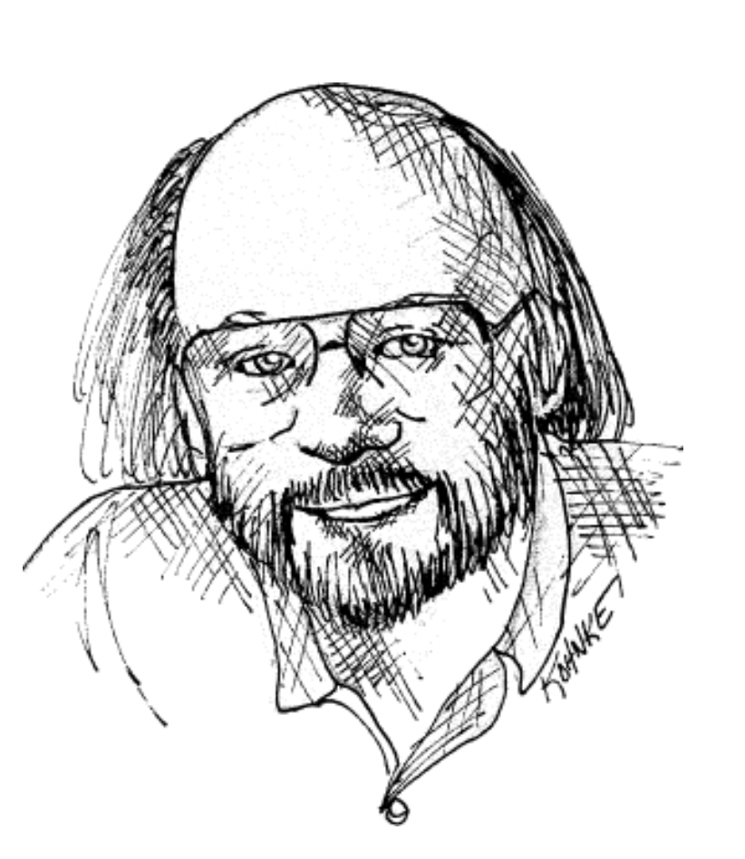
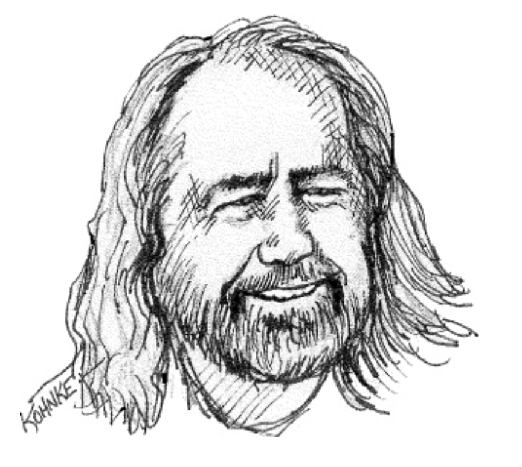
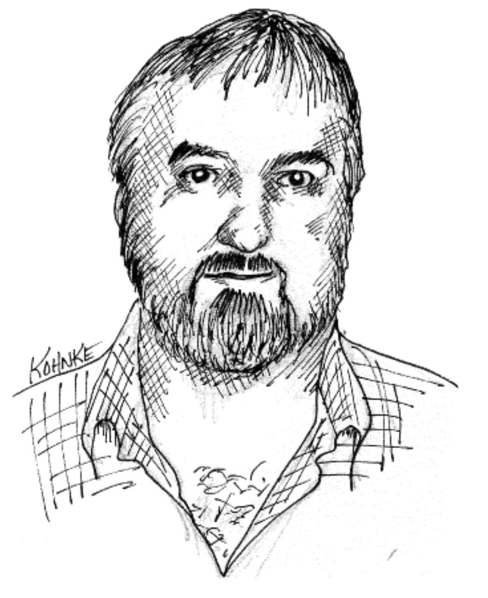
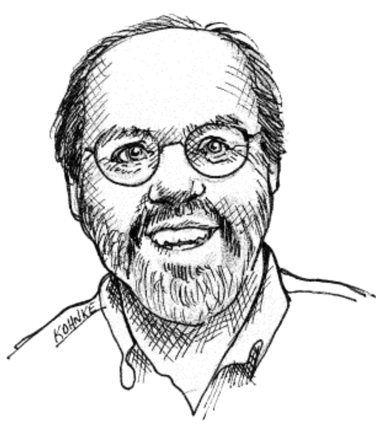
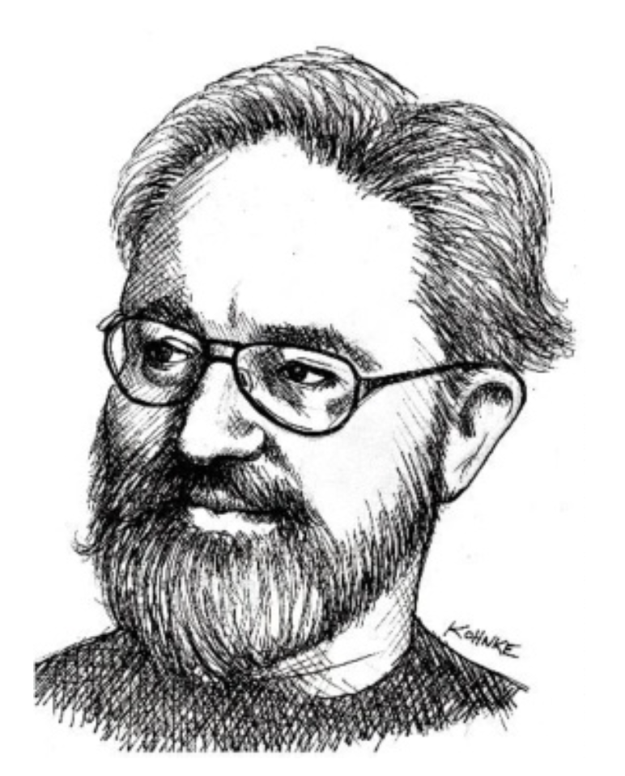

## 整洁代码的艺术？

假设你相信混乱的代码是一个重大的障碍。
假设你接受快速前进的唯一方法是保持你的代码整洁。
那么，你必须问自己：“我如何编写整洁代码？”
如果你不知道代码整洁意味着什么，那么试图编写整洁代码是徒劳的！

编写整洁代码需要严格使用无数的小技巧，并通过艰苦卓绝地获得的一种对整洁的感觉来应用，这种感觉帮助我们将糟糕的代码转化为整洁的代码。

而且这总是一种转化。
没有人会写出整洁的代码。
我们都会写出混乱的代码。
只有我们中那些采取额外步骤来清理它的人，才会产出整洁的代码。
这遵循了 Kent Beck 定律，你将在本书中反复看到：

> 首先，让它工作。然后，让它正确。

### 什么是整洁代码？

可能有多少程序员就有多少种定义。
所以我问了一些非常知名且经验丰富的程序员他们的想法。
我总结了他们的回答如下。

 

> “整洁代码只做好一件事。” 
> 
—— Bjarne Stroustrup，C++ 的发明者，《C++ 程序设计语言》的作者

这是一句古老且被反复提及的格言。
在 70 年代，我们常说一个模块应该做一件事，做好它，并且只做它。
但 “一件事” 是什么意思？

在 80 年代末，我曾是一个名为 `gi` 的 3000 行 C 函数的作者。
这个名字代表图形解释器。
如果当时有人来找我，警告我那个长长的函数做了不止一件事，我会回答说：“不，它解释图形。”

“一件事” 规则的问题在于，“一件事” 完全是主观的。
但我认为我知道一种使其客观化的方法。
我们将在本书后面讨论这一点。
一旦我向你描述了它，我想你将不得不承认，即使不完全客观，它也非常接近客观。
你可能不喜欢它；但我打赌你找不到实质性的反对理由。

 

> “整洁代码读起来像写得好的散文。” 
> 
—— Grady Booch，许多软件工程书籍的著名作者

这是一个相当有力的断言。
你上一次遇到读起来像 “写得好的散文” 的代码是什么时候？
然而，当你继续阅读本书时，我将向你展示一种达到，或至少接近这一目标的方法。

哦，不要误会我的意思。
你的代码不会读起来像海明威的小说。
但是，构建出读起来如此优美，以至于即使是非程序员也能理解一些 ⁶ 的代码是完全可能的。

⁶ 按照 “一些” 和 “理解” 这两个词的一定定义。

 

> “整洁代码看起来总是像是由关心它的人编写的。”
> 
—— Michael Feathers，《高效处理遗留代码》的作者

Michael 在那句精彩的引言中省略的词是：“关于你”。

程序员愿意花力气去清理他们的代码，是因为他们关心下一个接手的人。
他们关心自己的代码不会误导、引错方向或迷惑那些必须维护该代码的人。
最能定义 “整洁” 的词是 *关心 (care)* 。

这个定义的隐含意思是，没有被清理的代码是被粗心大意地编写和发布的。

 

> “当你读到的每个例程都与你预期的差不多时，你就知道你正在处理整洁代码。”
> 
—— Ward Cunningham，Wiki 的发明者，Fit 的发明者，极限编程 (Extreme Programming) 的联合发明者；设计模式 (Design Patterns) 背后的推动力；Smalltalk 和 OO 思想领袖；所有关心代码者的教父。

想象一下阅读代码并欣然同意它。
当你向下滚动时，你点头表示接受和肯定。
阅读代码的行为就像空气层流流过飞机机翼一样流畅。
没有湍流，没有聪明的技巧，没有令人不适的跳跃。
你只是从顶部到底部阅读，并同意。

这似乎是一个不可能的乌托邦式的梦想；但它肯定是一个值得奋斗的梦想。
在这本书中，我将向你展示接近那个梦想的方法。

 

> “整洁代码适合放在你的头脑中。
一个函数适合放在单个屏幕上，涉及不超过少数几个活动部件，并且有好的名称。
它在编写多年后仍然能被同行理解。
它最小化意外，组合良好，并且易于删除。”
> 
—— Mark Seeman，《适合放在你头脑中的代码》的作者，关于软件工匠精神和函数式编程的热门博主。

这几乎说明了一切，不是吗？
在某些方面，这句引言就是本书的总结。

