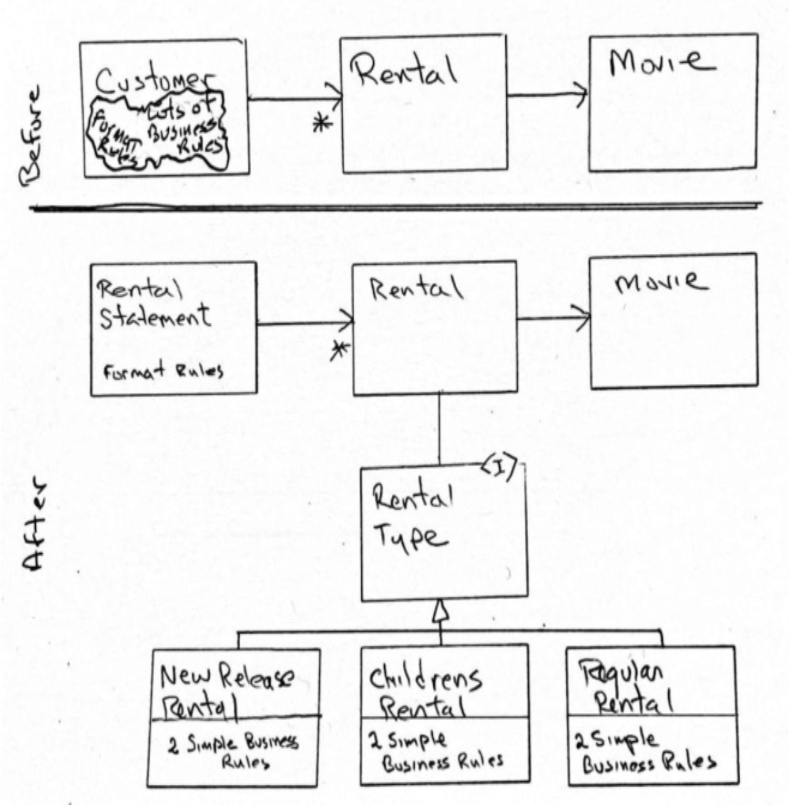

## 大型函数到底是什么？

再次想象我很久以前的 `gi` 函数。
让我们想象它是用 Java 编写的，并且它开始是这样的：

```java
public class GraphicInterpreter {
    public void gi() {
        int i;
        int j;
        ...
    }
}
```

当我们向下滚动 `gi` 函数的 3000 行时，我们注意到一个 `if` 语句：

```java
if (...) {
    ...
    i++;
    j++;
    ...
}
```

我们决定将那个 `if` 语句的主体提取到一个新方法中。
所以我们用鼠标选择该主体，并调用“Extract Method”菜单项。

但是 IDE 抱怨说它无法提取该方法，因为代码修改了两个局部变量。
如果代码只修改了一个局部变量，IDE 可以从提取的方法中返回新值。但是 IDE 没有好的方法来返回两个变量。（毕竟这是 Java，不是 Go。）

那么，我们应该怎么做？
我们如何将那个 `if` 语句的主体提取到一个新方法中？如果我们这样做呢：

```java
public class GraphicInterpreter {
    private int i;
    private int j;

    public void gi() {
        ...
        if (...) {
            ...
            i++;
            j++;
            ...
        }
    }
}
```

我知道你在想什么：“哦，不！你把局部变量提升为了实例变量！你违反了封装！”
是的。我确实这么做了。
但现在我可以将 `if` 语句的主体提取到一个新函数中，因为这两个变量在类的作用域内仍然有效：

```java
public class GraphicInterpreter {
    private int i;
    private int j;

    public void gi() {
        ...
        if (...) {
            f();
        }
    }

    private void f() {
        ...
        i++;
        j++;
        ...
    }
}
```

让我们继续这样做。
我们发现了越来越多的 `if` 和 `while` 语句，它们的主体操作 `i` 和 `j`，并且我们可以提取它们。
一个缩进又一个缩进，我们提取、提取、再提取。
结果是什么？

结果是一大堆使用实例变量 `i` 和 `j` 的方法。
当你有一堆操作一组变量的方法时，你称之为什么？你称之为一个类，不是吗？

现在，仔细想想。

> 每个大型函数实际上都在内部隐藏了一个类（或更多）。

<ins>因为每个大型函数都有一组局部变量和一组操作这些变量的缩进区域。
那些变量实际上应该是一个类的字段，而那些缩进区域应该是那个类的方法</ins>。

但借用 George Carlin 的话，也许我有点走得太远、太快了。
所以让我们来看一个例子。

请允许我介绍 Martin Fowler 的精彩著作《重构》第一版中著名的视频商店 (Video Store) 示例。
1999 年，Martin 用 Java 编写了这个小程序。
在这里，我们将看到它在 Go 中的样子。
但不用担心，如果你不懂 Go，它也相当容易理解。

首先是测试，Martin 在很久以前的书中没有包含这些测试。

———customer_test.go———

```go
package GoVideoStore

import (
    "testing"
)

var customer *Customer

func setup() {
    customer = NewCustomer("Fred")
}

func assertEquals(t *testing.T, expected string, statement string) {
    if statement != expected {
        t.Errorf("\nExpected:\n%s\n\nGot:\n%s", expected, statement)
    }
}

func TestSingleNewReleaseStatement(t *testing.T) {
    setup()
    customer.addRental(NewRental(NewMovie("The Cell", NewRelease), 3))
    assertEquals(t,
        "Rental Record for Fred\n"+
            "\tThe Cell\t9.0\n"+
            "Amount owed is 9.0\n"+
            "You earned 2 frequent renter points",
        customer.statement())
}

func TestDualNewReleaseStatement(t *testing.T) {
    setup()
    customer.addRental(NewRental(NewMovie("The Cell", NewRelease), 3))
    customer.addRental(NewRental(
        NewMovie("The Tigger Movie", NewRelease), 3))
    assertEquals(t,
        "Rental Record for Fred\n"+
            "\tThe Cell\t9.0\n"+
            "\tThe Tigger Movie\t9.0\n"+
            "Amount owed is 18.0\n"+
            "You earned 4 frequent renter points",
        customer.statement())
}

func TestSingleChildrensStatement(t *testing.T) {
    setup()
    customer.addRental(NewRental(
        NewMovie("The Tigger Movie", Childrens), 3))
    assertEquals(t,
        "Rental Record for Fred\n"+
            "\tThe Tigger Movie\t1.5\n"+
            "Amount owed is 1.5\n"+
            "You earned 1 frequent renter points",
        customer.statement())
}

func TestMultipleRegularStatement(t *testing.T) {
    setup()
    customer.addRental(NewRental(
        NewMovie("Plan 9 from Outer Space", Regular),
        1))
    customer.addRental(NewRental(NewMovie("8 1/2", Regular), 2))
    customer.addRental(NewRental(NewMovie("Eraserhead", Regular), 3))
    assertEquals(t,
        "Rental Record for Fred\n"+
            "\tPlan 9 from Outer Space\t2.0\n"+
            "\t8 1/2\t2.0\n"+
            "\tEraserhead\t3.5\n"+
            "Amount owed is 7.5\n"+
            "You earned 3 frequent renter points",
        customer.statement())
}
```

然后是使这些测试通过的代码。

———Customer.go———

```go
package GoVideoStore

import "fmt"

type Customer struct {
    name    string
    rentals []*Rental
}

func NewCustomer(name string) *Customer {
    return &Customer{name: name}
}

func (customer *Customer) addRental(rental *Rental) {
    customer.rentals = append(customer.rentals, rental)
}

func (customer *Customer) statement() string {
    totalAmount := 0.0
    frequentRenterPoints := 0
    result := "Rental Record for " + customer.name + "\n"
    for _, rental := range customer.rentals {
        thisAmount := 0.0
        switch rental.movie.movieType {
        case NewRelease:
            thisAmount += float64(rental.daysRented * 3)
        case Regular:
            thisAmount += 2
            if rental.daysRented > 2 {
                thisAmount += float64(rental.daysRented-2) * 1.5
            }
        case Childrens:
            thisAmount += 1.5
            if rental.daysRented > 3 {
                thisAmount += float64(rental.daysRented-3) * 1.5
            }
        }
        frequentRenterPoints++
        if rental.movie.movieType == NewRelease && rental.daysRented > 1 {
            frequentRenterPoints++
        }
        result += fmt.Sprintf("\t%s\t%.1f\n", rental.movie.title, thisAmount)
        totalAmount += thisAmount
    }
    return result +
        fmt.Sprintf(
            "Amount owed is %.1f\nYou earned %d frequent renter points",
            totalAmount, frequentRenterPoints)
}
```

———Rental.go———

```go
package GoVideoStore

type Rental struct {
    movie      *Movie
    daysRented int
}

func NewRental(movie *Movie, daysRented int) *Rental {
    return &Rental{movie: movie, daysRented: daysRented}
}
```

———Movie.go———

```go
package GoVideoStore

const (
    Regular int = iota
    NewRelease
    Childrens
)

type Movie struct {
    title     string
    movieType int
}

func NewMovie(title string, movieType int) *Movie {
    return &Movie{title: title, movieType: movieType}
}
```

我们要做的第一件事是攻击测试。
这些测试需要一个更好的设计，因为这些测试是一团糟！原因如下：

- 所有测试都是通过 UI 进行的。
`statement` 字符串是 UI，并且它们是易变的。
市场人员会随意更改这些字符串。
例如，如果市场人员说每份对账单的标题应该是 `Rental Statement for…` 而不是 `Rental Record for …`，那么每个测试都会失败并且必须被更改。
这使得测试很脆弱。
<ins>所以，与其多次测试对账单的格式，我们应该只测试一次。
其他测试应该关注正在计算的值</ins>。

- <ins>像 `Fred` 和 `The Cell` 这样的名字没有告诉我们正在测试什么。
这些名字应该被更改，以帮助测试的读者理解测试是关于什么的。
总的来说，测试不应该包含生产数据。
它们应该包含解释测试意图的数据</ins>。

- 这些测试很冗长。
我们应该能够通过使用一些电影变量和一个组合断言来稍微收紧它们。

———customer_test.go———

```go
package GoVideoStore

import (
    "testing"
)

var customer *Customer
var newRelease1 *Movie
var newRelease2 *Movie
var childrensMovie *Movie
var regular1 *Movie
var regular2 *Movie
var regular3 *Movie

func setup() {
    customer = NewCustomer("Customer Name")
    newRelease1 = NewMovie("New Release 1", NewRelease)
    newRelease2 = NewMovie("New Release 2", NewRelease)
    childrensMovie = NewMovie("Childrens", Childrens)
    regular1 = NewMovie("Regular 1", Regular)
    regular2 = NewMovie("Regular 2", Regular)
    regular3 = NewMovie("Regular 3", Regular)
}

func assertStringsEqual(t *testing.T, expected string, actual string) {
    if actual != expected {
        t.Errorf("\nExpected:\n%s\n\nGot:\n%s", expected, actual)
    }
}

func assertIntsEqual(t *testing.T, expected int, actual int) {
    if actual != expected {
        t.Errorf("\nExpected:%d Got:%d", expected, actual)
    }
}

func assertFloatsEqual(t *testing.T, expected float64, actual float64) {
    if actual != expected {
        t.Errorf("\nExpected:%f Got:%f", expected, actual)
    }
}

func assertOwedAndPoints(t *testing.T, owed float64, points int) {
    customer.statement()
    assertFloatsEqual(t, owed, customer.totalAmount)
    assertIntsEqual(t, points, customer.frequentRenterPoints)
}

func TestTotalsForOneNewRelease(t *testing.T) {
    setup()
    customer.addRental(NewRental(newRelease1, 3))
    assertOwedAndPoints(t, 9.0, 2)
}

func TestTotalsForTwoNewReleases(t *testing.T) {
    setup()
    customer.addRental(NewRental(newRelease1, 3))
    customer.addRental(NewRental(newRelease2, 3))
    assertOwedAndPoints(t, 18.0, 4)
}

func TestTotalsForOneChildrensMovie(t *testing.T) {
    setup()
    customer.addRental(NewRental(childrensMovie, 3))
    assertOwedAndPoints(t, 1.5, 1)
}

func TestTotalsForManyRegularMovies(t *testing.T) {
    setup()
    customer.addRental(NewRental(regular1, 1))
    customer.addRental(NewRental(regular2, 2))
    customer.addRental(NewRental(regular3, 3))
    assertOwedAndPoints(t, 7.5, 3)
}

func TestStatementFormat(t *testing.T) {
    setup()
    customer.addRental(NewRental(regular1, 1))
    customer.addRental(NewRental(regular2, 2))
    customer.addRental(NewRental(regular3, 3))
    assertStringsEqual(t,
        "Rental Record for Customer Name\n"+
            "\tRegular 1\t2.0\n"+
            "\tRegular 2\t2.0\n"+
            "\tRegular 3\t3.5\n"+
            "Amount owed is 7.5\n"+
            "You earned 3 frequent renter points",
        customer.statement())
}
```

记住，在关于 `gi` 的讨论中，我是如何通过将一些局部变量移动到包含类的字段中来打破封装的？
我对测试所做的更改促使我对生产代码做了同样的事情。
我将 `totalAmount` 和 `frequentRenterPoints` 局部变量移到了 `Customer` 类的实例变量中。

———Customer.go———

```go
…
type Customer struct {
    name string
    rentals []*Rental
    totalAmount float64
    frequentRenterPoints int
}
…
```

你可能还记得，我说过我们需要打破封装是为了支持提取。
所以让我们开始进行提取。
你将会看到我提取到底。这是第一遍。

———Customer.go———

```go
package GoVideoStore

import "fmt"

type Customer struct {
    name                 string
    rentals              []*Rental
    totalAmount          float64
    frequentRenterPoints int
}

func NewCustomer(name string) *Customer {
    return &Customer{name: name}
}

func (customer *Customer) addRental(rental *Rental) {
    customer.rentals = append(customer.rentals, rental)
}

func (customer *Customer) makeStatement() string {
    customer.clearTotals()
    return customer.makeHeader() +
        customer.makeDetails() +
        customer.makeFooter()
}

func (customer *Customer) clearTotals() {
    customer.totalAmount = 0.0
    customer.frequentRenterPoints = 0
}

func (customer *Customer) makeHeader() string {
    return "Rental Record for " + customer.name + "\n"
}

func (customer *Customer) makeDetails() string {
    rentalDetails := ""
    for _, rental := range customer.rentals {
        rentalDetails += customer.makeDetail(rental)
    }
    return rentalDetails
}

func (customer *Customer) makeDetail(rental *Rental) string {
    amount := customer.determineAmount(rental)
    customer.frequentRenterPoints += customer.determinePoints(rental)
    customer.totalAmount += amount
    return customer.formatDetail(rental, amount)
}

func (customer *Customer) determineAmount(rental *Rental) float64 {
    amount := 0.0
    switch rental.movie.movieType {
    case NewRelease:
        amount += float64(rental.daysRented * 3)
    case Regular:
        amount += 2
        if rental.daysRented > 2 {
            amount += float64(rental.daysRented-2) * 1.5
        }
    case Childrens:
        amount += 1.5
        if rental.daysRented > 3 {
            amount += float64(rental.daysRented-3) * 1.5
        }
    }
    return amount
}

func (customer *Customer) determinePoints(rental *Rental) int {
    if rental.movie.movieType == NewRelease && rental.daysRented > 1 {
        return 2
    }
    return 1
}

func (customer *Customer) formatDetail(rental *Rental, amount float64) string {
    return fmt.Sprintf("\t%s\t%.1f\n", rental.getTitle(), amount)
}

func (customer *Customer) makeFooter() string {
    return fmt.Sprintf("Amount owed is %.1f\n"+
        "You earned %d frequent renter points",
        customer.totalAmount, customer.frequentRenterPoints)
}
```

我想你们中一些精通 Golang 的人现在可能正惊恐地跑开。⁵ 
如果是这样，我道歉 —— 我不是一个熟练的 Golang 程序员。
你们中的另一些人可能正在走廊里尖叫着奔跑，因为所有这些微小的函数。
啊啊啊啊啊！

⁵ 参见本示例结尾附近的 Future Bob 注释。

但是等等。
现在回去，阅读那个 `makeStatement` 函数。
我等着。

你如何生成一份对账单？
你清空总额，然后将页眉、明细和页脚组合成一个字符串。

现在，如果你仔细想想， *那就是高层过程* 。
事实上，那是大多数报告的高层过程 —— 因为大多数报告由页眉、一组明细和页脚组成。

所以，对那些担心所有这些提取会隐藏代码意图的人，我认为恰恰相反。
提取 *暴露了* 代码的高层意图，只是将较低层的细节移到了其他函数中，在那里它们不会分散你的注意力。
如果你被告知要修复这份对账单页脚中的一个错误，你现在确切地知道该去哪里：`makeFooter` 函数。

这段代码是有礼貌的。
它之所以有礼貌，是因为当可怜的读者看到它时，几乎没有需要解码的内容。
读者不必仔细研究字符串、变量、循环和 `if` 语句。
相反，读者看到的是一个简单的策略陈述，并附带指向他们可能有任何问题的答案的方向。

因为这段代码是有礼貌的，所以可以公平地说原始代码是粗鲁的。
而我们不想粗鲁，不是吗？

让我们继续。
如何 `clearTotals` 是很容易看到的。
如何制作页眉和页脚也是很明显的。
制作明细只是对所有租赁的一个循环，简单地调用 `makeDetail`。

你如何制作一个明细？
你确定金额，然后你确定积分，然后你格式化明细。
哎呀！还能有多明显？

格式化明细也是相当明显的。
但那两个 `determine` 函数有点问题。

浏览所有这些方法。
第一个参数总是 `customer *Customer`。
这只是 Go 语言表示该函数是 `Customer` 类的一部分的方式。
现在看看所有函数的主体。
注意它们都使用了 `customer` 参数 —— 除了 `formatDetail`、`determineAmount` 和 `determinePoints`。
我们稍后会处理 `formatDetail`。
目前，那两个 `determine` 函数中有大量代码并不处理它们所属的 `Customer` 类。
所以……也许它们不属于那个类。

还有什么被传递给那些 `determine` 函数？
`Rental`！所以也许那两个 `determine` 函数属于 `Rental` 类。
让我们将它们移到那里。

———Customer.go———

```go
func (customer *Customer) makeDetail(rental *Rental) string {
    amount := rental.determineAmount()
    customer.frequentRenterPoints += rental.determinePoints()
    customer.totalAmount += amount
    return customer.formatDetail(rental, amount)
}
```

———Rental.go———

```go
package GoVideoStore

type Rental struct {
    movie      *Movie
    daysRented int
}

func (rental Rental) getTitle() string {
    return rental.movie.title
}

func (rental Rental) determineAmount() float64 {
    amount := 0.0
    switch rental.movie.movieType {
    case NewRelease:
        amount += float64(rental.daysRented * 3)
    case Regular:
        amount += 2
        if rental.daysRented > 2 {
            amount += float64(rental.daysRented-2) * 1.5
        }
    case Childrens:
        amount += 1.5
        if rental.daysRented > 3 {
            amount += float64(rental.daysRented-3) * 1.5
        }
    }
    return amount
}

func (rental Rental) determinePoints() int {
    if rental.movie.movieType == NewRelease && rental.daysRented > 1 {
        return 2
    }
    return 1
}

func NewRental(movie *Movie, daysRented int) *Rental {
    return &Rental{movie: movie, daysRented: daysRented}
}
```

测试仍然通过，没有改变。
测试完全不知道这个设计上的根本变化已经发生。
这意味着测试拥有一个容忍变化的设计！

然而，更神奇的事情发生了。
所有原本在 `Customer` 类中的业务规则都逃到了 `Rental`。
`Customer` 类现在完全是关于对账单的格式 —— 业务计算，除了一些总和之外，现在都在 `Rental` 中完成。

这让人质疑为什么 `Customer` 类被赋予了这个名字。
它不再与客户有关 —— 如果它曾经有关的话。
现在它完全与租赁对账单有关。
所以它的名字应该是：`RentalStatement`。

———RentalStatement.go———

```go
…
type RentalStatement struct {
    name                 string
    rentals              []*Rental
    totalAmount          float64
    frequentRenterPoints int
}
…
```

但现在让我们考虑 `Rental` 类。
`determine` 函数与 `Rental` 类强耦合，因为它们同时使用了 `movie` 和 `daysRented` 字段。
这表明了强内聚。
然而，`determine` 函数也与 `Movie` 类强耦合，这有点令人困扰。

与 `Movie` 的耦合完全在于 `movieType`。
这个类型字段用于选择计算金额和积分的各种业务规则。
那么为什么类型字段和类型常量在 `Movie` 类中？

原始测试包含一个提示。
如果你回头看看，你会看到 `"The Tigger Movie"` 被认为既是 `NewRelease` 又是 `Childrens` 电影。
这表明一部电影可以作为新片出租，以后又可以作为儿童片出租。
这建议类型字段实际上属于 `Rental`。
让我们试试。

———Rental.go———

```go
…
type Rental struct {
    movie      *Movie
    daysRented int
    rentalType int
}

const (
    Regular int = iota
    NewRelease
    Childrens
)
…
func NewRental(movie *Movie, rentalType int, daysRented int) *Rental {
    return &Rental{
        movie:      movie,
        rentalType: rentalType,
        daysRented: daysRented}
}
…
```

这个更改影响了测试，因为 `NewRental` 构造函数被更改以包含类型。
但总的来说，这是一个相当快的更改。
<ins>然而，它引出了另一个问题。
每当你有一个作用于那种类型代码的 `switch` 语句时，你可能要考虑使用多态分发</ins>。

为什么？因为 `switch` 语句就像沙鼠 —— 只要有足够的时间，它们就会在你的代码中繁殖并填满它。
事实上，一个 `switch` 语句的幼崽已经在 `determinePoints` 方法中生长了。

在 [第 12 章](../ch12/0.md) “对象与数据结构” 中，我们将讨论 `switch` 语句的利弊。
现在，让我们看看是否可以通过创建一个类型层次结构来摆脱它们。

———RentalType.go———

```go
package GoVideoStore

type RentalType interface {
    determineAmount(daysRented int) float64
    determinePoints(daysRented int) int
}
```

———Rental.go———

```go
package GoVideoStore

type Rental struct {
    movie      *Movie
    daysRented int
    rentalType RentalType
}

func (rental Rental) getTitle() string {
    return rental.movie.title
}

func (rental Rental) determineAmount() float64 {
    return rental.rentalType.determineAmount(rental.daysRented)
}

func (rental Rental) determinePoints() int {
    return rental.rentalType.determinePoints(rental.daysRented)
}

func NewRental(movie *Movie,
    rentalType RentalType,
    daysRented int) *Rental {
    return &Rental{
        movie:      movie,
        rentalType: rentalType,
        daysRented: daysRented}
}
```

———NewReleaseRental.go———

```go
package GoVideoStore

type NewReleaseRental struct{}

func (rentalType NewReleaseRental) determineAmount(daysRented int) float64 {
    return float64(daysRented * 3)
}

func (rentalType NewReleaseRental) determinePoints(daysRented int) int {
    if daysRented > 1 {
        return 2
    }
    return 1
}
```

———ChildrensRental.go———

```go
package GoVideoStore

type ChildrensRental struct{}

func (rentalType ChildrensRental) determineAmount(daysRented int) float64 {
    amount := 1.5
    if daysRented > 3 {
        amount += float64(daysRented-3) * 1.5
    }
    return amount
}

func (rentalType ChildrensRental) determinePoints(daysRented int) int {
    return 1
}
```

———RegularRental.go———

```go
package GoVideoStore

type RegularRental struct{}

func (rentalType RegularRental) determineAmount(daysRented int) float64 {
    amount := 2.0
    if daysRented > 2 {
        amount += float64(daysRented-2) * 1.5
    }
    return amount
}

func (rentalType RegularRental) determinePoints(daysRented int) int {
    return 1
}
```

那是一个很好的多态分发。
现在，每种类型的所有业务规则都被安全地封装在它们自己的类型中，而 `Rental` 根本不关心它正在使用哪一个。
当然，测试必须更改，但只更改了一点点。
这里只举一个例子来说明。

———RentalStatementTest.go———

```go
func TestTotalsForOneNewRelease(t *testing.T) {
    setup()
    statement.addRental(NewRental(newRelease1, NewReleaseRental{}, 3))
    assertOwedAndPoints(t, 9.0, 2)
}
```

此时 `Movie` 类几乎为空。

———Movie.go———

```go
package GoVideoStore

type Movie struct {
    title string
}

func NewMovie(title string) *Movie {
    return &Movie{title: title}
}
```

而 `RentalStatement` 类只关心对账单的格式 —— 这就是为什么 `FormatDetail` 函数属于那里，即使它没有使用 `RentalStatement` 的任何字段。

现在，让我们考虑一下我们刚刚做了什么。
下图展示了一幅前后对比图。

<br/>

我们的清理过程提取了业务规则，并将它们与格式化规则分开。
然后，它将那些业务规则首先移入 `Rental`，然后将它们分解到多态层次结构中。
很好！在所有这一切中，我们意识到一些名称和概念是错误的 —— 这相当典型。
当你清理东西时，你会看到以前隐藏的东西。

最后，注意在 `RentalType` 下方正在形成一个架构边界。
我没有画它，但你应该能够感觉到它。
所有那些小的业务规则细节都与 `RentalStatement` 和 `Rental` 中的高层策略隔离了。
现在，当需求发生变化时，我们可以添加许多新的 `RentalType`；并且这些代码中没有任何部分需要更改以适应这些变化。
这就是 *开闭原则 (OCP)* 在起作用。

所以，记住我说过大型函数总是在隐藏类吗？
这就是我们在这里发现的。
原始代码中的那个大型 `statement` 函数被分解并分配到三个新类和一个现有类中。

> **Future Bob** ：Robert Laszczak 恰好浏览了 GitHub，看到了上面我对 Golang 的拙劣尝试。
他慷慨地提供了一篇博文，对这个示例进行了更符合常见 Golang 风格的改进。
你可以在 https://threedots.tech/clean-code/ 看到它。
就我而言，作为一个 Golang 新手，我同意他的大部分改动，但我更喜欢保留我的名字稍长一些，并在我的 getter 前加上 get。

### 提取与类

考虑以下用于求解二次公式的 Java 代码。
该类只是 `solve` 函数的一个方便命名空间。

```java
import java.util.Arrays;
import java.util.List;
import static java.util.Arrays.asList;

public class QuadraticFormula {
    public static List<Double> solve(double a, double b, double c) {
        if (a == 0) {
            if (b == 0) {
                return asList();
            }
            return asList(-c / b);
        } else {
            double d = b * b - 4 * a * c;
            if (d > 0) {
                double sqrtd = Math.sqrt(d);
                double x1 = (-b + sqrtd) / (2 * a);
                double x2 = (-b - sqrtd) / (2 * a);
                return asList(x1, x2);
            } else if (d == 0) {
                return asList(-b / (2 * a));
            } else {
                return asList();
            }
        }
    }
}
```

这段代码相当直白，但我们假装它比这里展示的更复杂、更涉及更多内容。
我们还假设它会随着时间增长。
我们可以通过进行一些简单的提取和重命名来提高可读性。

```java
import java.util.List;
import static java.util.Arrays.asList;

public class QuadraticFormula {
    public static List<Double> solve(double a, double b, double c) {
        if (a == 0)
            return linearSolution(b, c);
        return quadraticSolution(a, b, c);
    }

    private static List<Double> linearSolution(double b, double c) {
        if (b == 0)
            return asList();
        return asList(-c / b);
    }

    private static List<Double> quadraticSolution(double a, double b, double c) {
        double discriminant = b * b - 4 * a * c;
        if (discriminant < 0)
            return complexSolution();
        if (discriminant == 0)
            return singleQuadraticSolution(a, b);
        return twoQuadraticSolutions(a, b, discriminant);
    }

    private static List<Double> complexSolution() {
        return asList();
    }

    private static List<Double> singleQuadraticSolution(double a, double b) {
        return asList(-b / (2 * a));
    }

    private static List<Double> twoQuadraticSolutions(double a, double b, double discriminant) {
        double sqrtd = Math.sqrt(discriminant);
        double x1 = (-b + sqrtd) / (2 * a);
        double x2 = (-b - sqrtd) / (2 * a);
        return asList(x1, x2);
    }
}
```

现在，为了论证起见，我们再次假设这是一个复杂得多的系统，并且可能会增长。
我希望你同意，提取为代码增加了一些组织性，可能会使更复杂的东西更容易阅读。
但这样做之后，我们错过了利用这个类的机会。
与其在所有这些提取的函数之间传递参数，我们可以将这些值加载到类内的变量中。

```java
import java.util.List;
import static java.util.Arrays.asList;

public class QuadraticFormula {
    private static double a, b, c, discriminant;

    public static List<Double> solve(double a, double b, double c) {
        QuadraticFormula.a = a;
        QuadraticFormula.b = b;
        QuadraticFormula.c = c;
        if (a == 0)
            return linearSolution();
        return quadraticSolution();
    }

    private static List<Double> linearSolution() {
        if (b == 0)
            return asList();
        return asList(-c / b);
    }

    private static List<Double> quadraticSolution() {
        discriminant = b * b - 4 * a * c;
        if (discriminant < 0)
            return complexSolution();
        if (discriminant == 0)
            return singleQuadraticSolution();
        return twoQuadraticSolutions();
    }

    private static List<Double> complexSolution() {
        return asList();
    }

    private static List<Double> singleQuadraticSolution() {
        return asList(-b / (2 * a));
    }

    private static List<Double> twoQuadraticSolutions() {
        double sqrtd = Math.sqrt(discriminant);
        double x1 = (-b + sqrtd) / (2 * a);
        double x2 = (-b - sqrtd) / (2 * a);
        return asList(x1, x2);
    }
}
```

这使得事情稍微干净了一点。
在一个更复杂的模块中，这可能会使事情变得非常干净。
然而，存在一个风险。
那些静态变量在多线程环境中可能会被破坏。
通过将所有函数和变量从 `static` 改为实例方法和变量，很容易纠正这一点。
但对于这个例子，我不打算担心这个问题。

<ins>底线是，有时当我们提取函数时，允许这些函数通过包含它们的作用域（类）中的变量进行通信，是方便且整洁的</ins>。

现在让我们在像 Clojure 这样的函数式语言中来看这个问题。

```clojure
(defn quad [a b c]
  (let [discriminant (- (* b b) (* 4 a c))]
    (cond
      (zero? a)
        (if (zero? b)
          []
          [(/ (- c) b)])
      (zero? discriminant)
        [(/ (- b) (* 2 a))]
      (neg? discriminant)
        []
      :else
        (let [sqrt-desc (Math/sqrt discriminant)
              x1 (/ (+ (- b) sqrt-desc) (* 2 a))
              x2 (/ (- (- b) sqrt-desc) (* 2 a))]
          [x1 x2]))))
```

这非常漂亮。
我不会想通过提取来改进它。
但再次强调，让我们假装这是一个更大、更复杂的函数。
我们如何通过提取函数来改进它呢？

```clojure
(defn quad [a b c]
  (let [discriminant (- (* b b) (* 4 a c))
        linear-solution
          (fn []
            (if (zero? b)
              []
              [(/ (- c) b)]))
        single-solution
          (fn []
            [(/ (- b) (* 2 a))])
        two-solutions
          (fn []
            (let [sqrt-desc (Math/sqrt discriminant)
                  x1 (/ (+ (- b) sqrt-desc) (* 2 a))
                  x2 (/ (- (- b) sqrt-desc) (* 2 a))]
              [x1 x2]))]
    (cond
      (zero? a) (linear-solution)
      (zero? discriminant) (single-solution)
      (neg? discriminant) []
      :else (two-solutions))))
```

好的，现在最后一次，请记住我们是在假装这个模块更大、更复杂。
最后一个 `cond` 语句相当不错。
请注意，我们没有向提取的函数传递参数。
这是因为 Clojure 中的 `let` 创建了一种对象，在其中作用域内拥有变量和函数。

还要注意，那些变量不是静态的，因此我们的并发担忧消失了。
