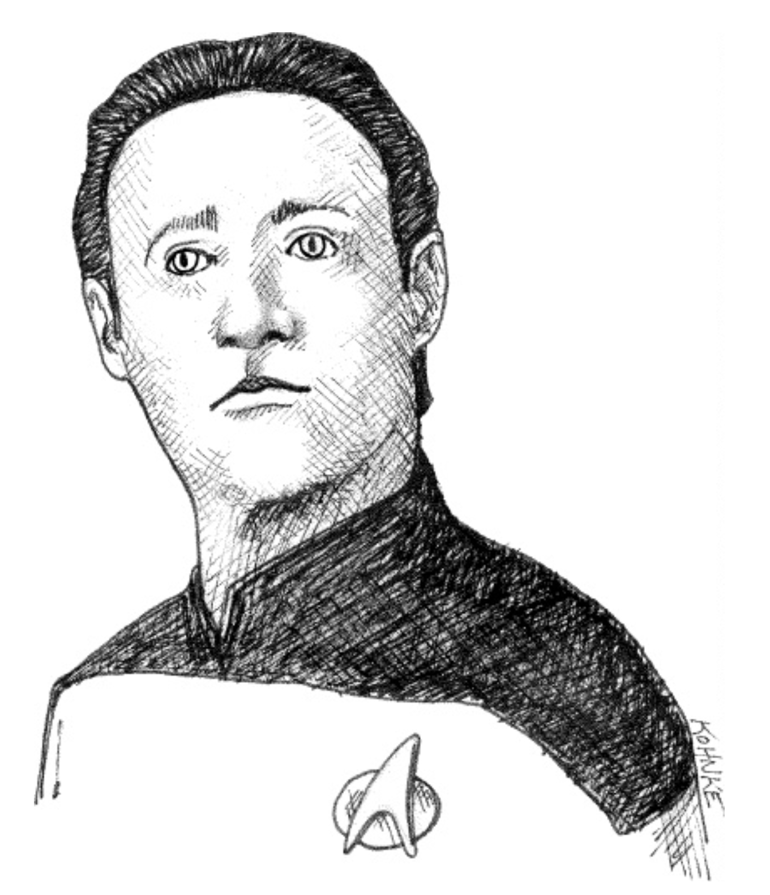

# 第 12 章 对象与数据结构

 

Niklaus Wirth 曾写过一本可爱的书，名为《算法 + 数据结构 = 程序》。¹ 虽然这不是他的本意，但这个标题非常巧妙地抓住了面向对象编程背后的基本概念：函数与其操作的数据之间存在深刻的关系。

¹ [A+DS=P](../bib.md#adsp) 。

面向对象是由 Ole-Johann Dahl 和 Kristen Nygaard 在 60 年代中后期通过其 Simula 语言的逐步演变而发明 ² /发现的，最终形成了 Simula 67。
Bjarne Stroustrup 和 Alan Kay 在 70 年代初都使用了 Simula 67，然后分别在 C++ 和 Smalltalk 中扩展了这些思想。

² 这个发明的故事引人入胜。我在 [We Programmers](../bib.md#we-programmers) 中写过它。

从那里，C++ 演变为 Java、C#，然后是 Go，而 Smalltalk 演变为 Objective-C、Ruby 和 Python。
这两条演化路线相互借鉴，产生了大量的交叉影响。
今天，几乎我们所有的语言都在某种意义上具有面向对象的特性。
