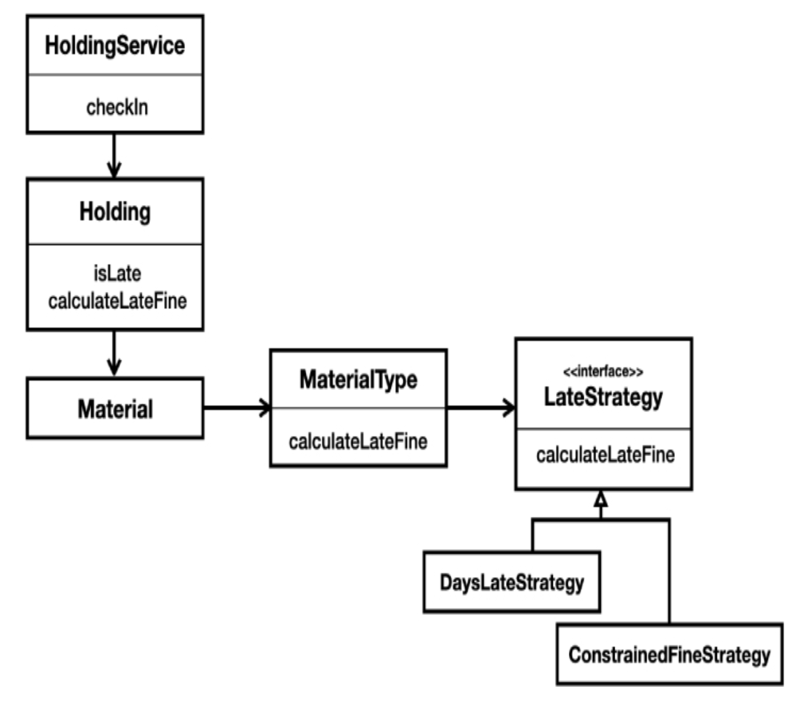

## 一个类应该包含什么？

你可以想象地将系统的整个方法集合并到一个类中 —— 一个庞然大物。
同样别扭地，你也可以为每一个方法创建一个单独的类。
这两种想法都很离谱，尽管我曾经为非常小的系统做过前者，而且也许第二种对于某些 Smalltalk 程序员来说并不那么离谱。

类提供了帮助你在系统增长时保持理智的方法。
如果没有合理的组织，你将：

- 更难找到你正在寻找的代码。
- 使你的系统膨胀，增加大量的冗余；使其大小翻倍是可能的。
- 由于冗余而创建围绕不一致行为的缺陷。
- 由于日益增长的复杂性而创建缺陷。
- 花费大量的时间为它编写自动化测试。

所有这些结果都随着增长而增加可能性，进而增加你的成本和挫折感。

我们将在本章中讨论整洁的类设计。
在你的脑海中，将其翻译为 “做所有应该使我们的开发生活更轻松的事情”。

“整洁” 并不是对任何人的指责。
我们对 “不整洁” 的定义，是用来描述那些需要普通开发人员付出更多努力才能理解或维护的代码的一种方式。

### 类设计的特征

设计的质量只有在面对变化时才能真正被评估；
这种变化发生在系统必须承担新功能的每一次。
随着系统的增长和老化，引入新功能的成本是否在增加？
缺陷的数量是否在增加？

在七年的软件开发中，我们从适应变化的经验中收集了经验数据。
我们从这些数据中获得了宝贵的见解，并不断将这些经验推断到更大和更新的上下文中。

在 20 世纪 40 年代末，一个典型的系统像我们退化的例子一样被实现，整个代码集本质上被存储为一个单一的函数，从上到下被读取和执行。
让我们称之为一个 *单体 (monolith)* 。

John von Neumann 和 Herman Goldstine 的文章《为电子计算机仪器规划和编码问题》¹ 探讨了子程序的前提：

¹ H. H. Goldstine 和 J. von Neumann，“为电子计算机仪器规划和编码问题”，高等研究院，普林斯顿，新泽西，1947 年，存档于 https://www.ias.edu/sites/default/files/library/pdfs/ecp/planningcodingof0103inst.pdf 。

> “我们将问题的编码序列称为一个例程，将一个为了可能替换到其他例程中而形成的例程称为一个子程序。”

前提是子程序（特别是对于较小的、常见的操作）将通过允许复用来减少代码量，并且还将有助于减少缺陷。

先驱 Maurice Wilkes 和 David Wheeler，受到这篇开创性文章中想法的启发，于 1951 年在 EDSAC 计算机上实现了子程序的概念。²
简而言之，他们相信由子程序带来的代码模块化将导致更低成本的软件开发。
他们没有等待研究（尽管研究确实在后来的几十年中缓慢地进行）。

² [PPEDC](../bib.md#ppedc) 。

自从子程序的出现以来，我们将相关的模块化价值推断到了更大的上下文中。
我们学会了将子程序集合 ——函数或方法—— 组织成模块或类。
这反过来又围绕着这些模块和类的组成，以及它们之间的相互关系（依赖关系）提出了新的挑战。
我们开始推导各种启发法来指导其他开发者。

### 启发法与特征

启发法帮助你识别要采取的步骤，以及要避免的步骤，以达到设计良好的类。

- 正面启发法 —— 要采取的步骤。
<ins>例如，Kent Beck 的 *简单设计 (Emergent Design)* ³ 的四条规则，告诉你做以下事情</ins>：
  - <ins>确保所有代码在开发过程中都是可测试的</ins>。
  - <ins>消除逻辑冗余</ins>。
  - <ins>确保所有程序元素都清晰简洁地命名</ins>。
  - <ins>最小化元素的数量</ins>。

³ 参见 [第 18 章](../ch18/0.md) “简单设计”。另见 https://martinfowler.com/bliki/BeckDesignRules.html 。

- 负面启发法 —— 要避免的步骤。
反模式描述了在开发代码时要避免的错误路径。
例如，复制粘贴编程 (Copy-paste programming) 告诉我们不要习惯性地通过先复制现有代码然后修改来创建新逻辑。
（这个反模式的一个更易记的名称可能是 “抓取并刺入”，或者 “夺取并修补”，或者 “复制并破坏”，或者……哦，现在就这些了。避免它。）

特征帮助你评估当前类的质量。

- 正面特征 —— 期望的特性。 Bob Martin 的五个类设计原则集合，称为 *SOLID* ，经受住了大约三十年的审查，并且也可以实际应用于函数式代码。

- 负面特征 —— 不期望的特性。 Martin Fowler 的 *代码坏味 (code smells)* ⁴ 是代码中要避免的事物集合，每一个都用易记的名称标识。
例如，霰弹式修改 (Shotgun surgery) 意味着你的代码迫使你为了进行简单的修改而更新大量的类。

⁴ [Refactoring](../bib.md#refactoring) 和 https://martinfowler.com/bliki/CodeSmell.html 。

<ins>随着时间的推移，软件开发领域的人们编纂了众多的启发法和特征集合。
我们将把其中任何一个称为 *设计视角 (design perspective)* </ins>。

设计视角可以在方法（微观）级别和类（宏观）级别（甚至更高级别）描述设计。
你可能能够将一些特征视为启发法，反之亦然；这种分类并不是特别重要。

在本章的大部分内容中，我们将专注于一个理想大小的类的特征，因为其思想是你可以通过查看代码来收集它们。

这样一个理想的类通常是小的。
它的名称简洁地总结了收集在其中的少量行为。
它被内聚地定义：它的方法是紧密相关和专注的，并且它有效地执行一个单一的、明确定义的任务（或一组相关任务）。
因此，该类表现出遵循 *单一职责原则 (SRP)* 的特征：它有一个改变的理由。

设计视角最肯定是重叠的。
值得注意的是，更总括的视角 ——例如 SOLID、Kent Beck 的简单设计和 Martin Fowler 的代码坏味—— 的结果是相当可比的。
它们都培养小的、内聚的模块和函数。

<ins>在几乎所有这些视角中，无论是明确陈述还是暗示，都承认了平衡的需要：几乎没有一个原则是绝对的</ins>。
例如，Kent Beck 的简单设计四条规则驱动我们走向小的、单一职责的类。
由此产生的类更容易测试（规则 1 ），它们可以帮助我们更容易地消除冗余（规则 2 ），并且它们促进了清晰、揭示意图的名称（规则 3 ）。
但是规则 4 ——最小化元素的数量，例如模块和函数—— 表明我们可能走得太远，创建了对系统没有任何优势的小类。

> **Future Bob**：确实，这是 John Ousterhout 对 “一件事” 规则的担忧之一。

我们大多数人不必担心：典型的系统已经朝着错误的方向走得太远了，包含了大型的、混乱的、多用途的模块和函数。
尽管如此，请记住，在软件中每一个选择都有权衡。
选择你喜欢的设计视角，并专注于创建易于维护的代码这一结果。

### 类何时太大？

让我们看一下 `HoldingService` 类，用于管理图书馆系统及其读者的馆藏（资料，如书籍或物理音频记录）。
以下是 `HoldingService` 上定义的公共行为：

```java
boolean isAvailable(String barCode)
Holding find(String barCode)
String add(String sourceId, String branchId)
void transfer(String barcode, String branchScanCode)
Date dateDue(String barCode)
void checkOut(String patronId, String barCode, Date date)
int checkIn(String barCode, Date date, String branchScanCode)
```

下图使用统一建模语言 (UML) 图指南描绘了该 `HoldingService` 接口（我们稍后将看到更多图片）：

<br/>

当我们开始查看类级别的设计时，方法参数通常并不有趣。
在它们变得有用之前，我们会省略它们。

我们的图片显示，`HoldingService` 允许将馆藏添加到系统中，由读者借出（“check out”），归还（“check in”）到图书馆地点（分馆），以及从一个分馆转移到另一个分馆。
`HoldingService` 还支持一些查询，包括检索馆藏详细信息、回答它是否可供读者借出，以及确定资料应归还的日期。

该图片表明，`HoldingService` 的核心（单一？）职责是管理馆藏的处置。
所描绘的每个行为都直接支持该关注点。

然而，SRP 告诉我们更挑剔一点：一个符合 SRP 的类应该只有一个改变的理由。
这与单体相反，在单体中，每一个改变都需要更新系统中唯一的类。

为什么一个单一职责的类是可取的？

- 它的名称可以简洁地反映其中包含的行为，使这些行为更容易定位。
- 它创造了复用的真正可能性。
- 它遵循 *开闭原则 (OCP；参见 [第 19 章](../ch19/0.md) )* 的可能性增加，因此对未来的更改关闭。
- 它更容易测试。
- 它使你的系统更加灵活。

`HoldingService` 中的每个行为都实现了一个策略 —— 由图书馆系统建立并在代码中实现的一组规则。
例如，`dateDue` 策略规定，书籍在借出后 21 天到期，DVD 在借出后 7 天到期。

`checkIn` 策略更复杂：当一本书被归还时，它被标记为可供其他读者借出。
如果资料逾期，即在到期日期之后归还，则归还书籍的读者将被处以罚款。
罚款金额根据资料类型和其他可能的因素而变化。

策略确实会变化，而且借出策略可能需要专门地与归还策略分开变化。
这种独立的变更表明，至少如果你希望符合 SRP，应该将每个策略实现到它自己的类中 —— `CheckOutService`、`CheckInService` 等等。
在这一点上，`HoldingService` 的唯一工作将是作为馆藏关注点的统一接口，将工作委托给其他对象。

> **Future Jeff**：在 IDE 中创建新类非常容易，但我们作为开发人员经常抗拒。
只需片刻，负面影响很少，但我们经常与那些竭尽全力避免点击 “新建类” 菜单项的开发人员结对。
只管去做。

我们可能不想要一个每个类只包含一个方法的 “馄饨” 系统，但是包含三个或两个方法，甚至一个方法的小类并没有什么错。

虽然 SRP 告诉我们要挑剔，但它也没有告诉我们要去猜测变化的联系。
<ins>你的系统很可能严重违反了 SRP。
与其去寻找需要更改的代码，不如等待下一个变更需求，并确保你利用那个机会将你的系统塑造成更符合 SRP 的样子</ins>。

### 代码中的策略

让我们假设核心图书馆的借出和归还策略是稳定的。
很容易想到 `HoldingService` 可能有多个改变的理由。
例如：图书馆希望允许读者租借 DVD 更长时间 ——从 7 天改为 14 天—— 因为它们是一种较老的技术，现在需求很低。

`HoldingService` 会受到那个改变的影响吗？
虽然查看 UML 模型可能非常有帮助，但我们不能仅仅通过查看 UML 就发现所有改变的理由。
一个类的接口只告诉你它直接公开的行为。
<ins>要完全理解一个类违反 SRP 的程度，你必须打开源文件并仔细阅读代码。
不用花很长时间就能发现一个类可能需要改变的更多理由</ins>。

这是 `dateDue` 方法：

```java
public Date dateDue(String barCode) {
    var holding = find(barCode);
    if (holding == null)
        throw new HoldingNotFoundException();
    return holding.dateDue();
}
```

该服务将计算到期日的责任委托给了 `Holding` 类。
因此，DVD 租赁期的变化不会影响 `HoldingService` 类，但会影响 `Holding` 类（或者它依赖的其他类）。

“管理到期日” 是一个可能消失的责任，因为一些图书馆实际上已经取消了罚款。
如果且当这种情况发生时，我们将寻求保护 `HoldingService` 免受类似的、后续的变化。

### 变化原因隐藏在哪里

<ins>大型类倾向于包含和掩盖众多的责任。
通常，变化原因被埋藏在一个长方法的主体中</ins>。
让我们看一个例子。

`HoldingService` 方法 `checkIn` 在声明归还资料的政策方面做得很好：

```java
public int checkIn(String barCode, Date date, String branchScanCode) {
    var branch = new BranchService().find(branchScanCode);
    var holding = find(barCode);
    if (holding == null)
        throw new HoldingNotFoundException();

    holding.checkIn(date, branch);
    var foundPatron = findPatronWith(holding);
    removeBookFromPatron(foundPatron, holding);

    if (holding.dateLastCheckedIn().after(holding.dateDue())) { //late?
        foundPatron.addFine(calculateLateFine(holding));
        return holding.daysLate();
    }
    return 0;
}
```

虽然策略丰富，但 `checkIn` 方法仍然需要一些清理。
一行明显的实现细节作为一个潜在问题突出 —— 确定归还是否逾期的 `if` 语句：

```java
if (holding.dateLastCheckedIn().after(holding.dateDue())) { //late?
```

<ins>该条件代表了一个策略决策：如果在到期日之后归还，则馆藏逾期。
然而，该策略有可能变得相当复杂。
图书馆员可能会想象出无休止的新政策变化：VIP（非常重要的读者）可能会免除罚款，图书馆可能会提供宽限期，等等。
因此，那看起来无害的单行代码代表了 `HoldingService` 需要改变的另一个理由</ins>。

因为暴露了实现细节，该条件也减慢了读者的理解时间。
该细节需要更仔细的检查：我们必须仔细阅读它，然后在脑海中将其组合成一个单一的概念。

注释可能会有所帮助，但它不是正确的解决方案，而且无论如何都可能是谎言。
如果我们能从扫描代码本身中收集意图，而不是必须去别处查看，那是最好的。
注释是代码中分散注意力的脚注。

### 修复问题

我们想将 “是否逾期” 的具体细节移出 `HoldingService` 类。
移到哪里？
我们可以将其移到一个新的类，如 `LateHoldingService`，但明显的短期候选似乎是 `Holding` 类。

然而，第一步是通过创建一个只包含该条件的新方法来抽象 “是否逾期” 的概念。
是的 —— 这种提取方法的概念应该从 [第 10 章](../ch10/0.md) “一件事” 中熟悉。
提取到底！

```java
public int checkIn(String barCode, Date date, String branchScanCode) {
    // ...
    if (isLate(holding)) {
        foundPatron.addFine(calculateLateFine(holding));
        return holding.daysLate();
    }
    return 0;
}

private boolean isLate(Holding holding) {
    return holding.dateLastCheckedIn().after(holding.dateDue());
}
```

那个愚蠢的行级注释 `//late?` 消失了。
新的查询方法名称 `isLate` 准确地传达了同样的信息。
实现细节被封装在其中。

<ins>展望未来，如果你觉得需要一条注释来引导读者阅读一行或五行的相关代码，考虑将其提取到它自己的方法中。
那条 “引导” 注释通常为新方法的名称提供了基础，就像这里一样。
一个清晰、简洁的方法名称消除了对注释的需求</ins>。

<ins>谓词特别适合提取。
事实上，当面对理解一个长的、令人生畏的方法的挑战时，你可以采取的最好的第一步之一是确保你理解通过它的各种路径（有时是为了让你知道你可以专注于哪个更小的部分）。
通常控制这些路径的条件是复杂的，依赖于方法调用和变量的组合 —— 例如 `if (x(a) && y || !z(c, d))`。
那些细节并没有清楚地说明我们为什么进入某一段代码。
一个提取的谓词的方法名称可以立即传达理解</ins>。

一旦被隔离在 `HoldingService` 中，`isLate` 方法就揭示了一个明显的代码坏味，称为 *特性嫉妒 (feature envy)* ⁵ ：
该方法显然嫉妒 `Holding` 类，它问了多个问题（ “什么日期被检查了？什么日期到期了？” ）来计算一个结果。
`isLate` 方法也显示出对它定义的 `HoldingService` 类不感兴趣。

⁵ [Refactoring]。

我们可以通过将方法移到 `Holding` 类来缓解方法的嫉妒，在那里它可以直接与其新同事交谈：

```java
public class HoldingService {
    // ...
    public int checkIn(
        String barCode, Date date, String branchScanCode) {
        // ...
        if (holding.isLate()) {
            foundPatron.addFine(calculateLateFine(holding));
            return holding.daysLate();
        }
        return 0;
    }
}

public class Holding {
    // ...
    public boolean isLate() {
        return dateLastCheckedIn().after(dateDue());
    }
}
```

调用代码（在 `checkIn` 方法中）现在简洁地陈述了整体策略的一部分：

```java
if (holding.isLate())
```

该条件现在可以立即消化。
它不需要我们停下来。
相反，它帮助我们快速理解方法的控制流，这反过来帮助我们了解接下来需要看哪里。

在将 `checkIn` 方法移到 `Holding` 之后，我们再次在其新上下文中查看该方法。
`Holding` 类现在是否包含太多改变的理由？
我们应该再次移动该方法，也许这次是移动到一个全新的类？
在方法本身内可以简化什么？

每一次更改，我们都会继续问这些问题，作为 *持续设计 (continuous design)* 的一部分。

看起来我们似乎只是通过将一个问题从 `HoldingService` 移到 `Holding` 来推卸责任。
但朝着我们对符合 SRP 的类的主要兴趣，我们已经从 `HoldingService` 中移除了一个改变的理由。
我们还用一个抽象替换了不必要的细节，这反过来帮助我们更容易地考虑 `HoldingService` 的其余部分。

### 过于开放的实现

在典型的代码库中，提取和移动的机会比比皆是。
从方法中提取实现细节通常会使代码属于其他地方变得明显。
这样做足够多，最终大多数代码都会到达正确的位置，并且每个这样的位置都相当小、内聚且易于使用。
`checkIn` 方法中的另一行同样暗示了特性嫉妒：

```java
foundPatron.addFine(calculateLateFine(holding));
```

我们正在调用一个局部方法 `calculateFine`，它与 `Holding` 中定义的代码交互，再次为了计算罚款而向它提问。
我们将该方法移到 `Holding` 中（在 IDEA 中只需两次按键！⁶ ）：

⁶ IntelliJ 的 IDE。

```java
foundPatron.addFine(holding.calculateLateFine());
```

这是 `calculateLateFine` 在新家中的样子：

```java
public int calculateLateFine() {
    var daysLate = daysLate();
    var fineBasis = getMaterial().materialType().dailyFine();
    var fine = 0;
    switch (getMaterial().materialType()) {
        case BOOK, NEW_RELEASE_DVD:
            fine = fineBasis * daysLate;
            break;
        case AUDIO_CASSETTE, VINYL_RECORDING, MICRO_FICHE,
             AUDIO_CD, SOFTWARE_CD, DVD, BLU_RAY, VIDEO_CASSETTE:
            fine = Math.min(1000, 100 + fineBasis * daysLate);
            break;
    }
    return fine;
}
```

呃，一个 `switch` 语句，而且是一个老式的 —— 那种如果你不小心，控制流可能会从一个 case 意外滴落到下一个的 `switch`。

即使在被移到 `Holding` 之后，该方法看起来仍然不像在家。
虽然 `calculateLateFine` 确实直接与 `Holding` 交互（向它询问 `daysLate`），但它主要与 `getMaterial` 返回的 `Material` 对象交互。

`calculateLateFine` 方法是那种很可能随着时间推移而遭受许多变化的方法。
它至少有三个改变的理由：添加新的资料类型（电子书、拼图、STEM 套件等）、鼓励读者归还高需求资料的新计划，以及覆盖资料价格上涨的新费率。

这样的方法违反了另一个 SOLID 原则 —— 我们希望最小化 “打开” 现有类进行更改，而是找到通过添加新的、单一目的的类来增强系统的方法。
这就是 **OCP** 。

开放的类引入了风险和成本。
`Holding` 是开放的。
对 `calculateLateFine` 中三个职责中任何一个的更改都带有破坏 `Holding` 中现有行为的风险。
随着一个滴答的 `switch` 语句混入其中，任何事情都可能发生。

### 我们现在应该做点什么吗？

典型的系统就是这样，我们已经错过了利用 OCP 的大部分机会。
我们的代码库对其开放性毫不掩饰。
几乎没有类是封闭的。
无处不在的变化迎接着每一个必须接触代码的人。
<ins>如果变化是给定的，最好的方法是等待它。
推测性的清理会从没有人需要的改进中创造不必要的风险。
让我们等待下一个变化</ins>。

### 现在怎么样？

好的，那并没有花太长时间。
我们被告知，就在刚才（上一段和这一段之间），我们确实必须支持几种新的资料类型。
具体来说，我们需要允许借出拼图和棋盘游戏。
它们将属于图书馆工作人员想要尝试的一种新的罚款方案。

我们将通过首先重构代码（预重构）来为新的需求做准备，以便更改工作更顺利，影响最小。

两个 `switch` 分支中的每一个都使用两种策略之一来计算适当的罚款值。
我们可以将微小的计算逻辑提取到几个策略 (Strategy) ⁷ 类中，每个类都实现一个公共接口：

⁷ [GOF95](../bib.md#gof95) 。

```java
public interface LateStrategy {
    int calculateFine(int daysLate);
}

public class ConstrainedFineStrategy implements LateStrategy {
    public static final short BASE_FEE = 100;
    public static final short MAX_FINE = 1000;
    private final int fineBasis;

    public ConstrainedFineStrategy(int fineBasis) {
        this.fineBasis = fineBasis;
    }

    @Override
    public int calculateFine(int daysLate) {
        return Math.min(MAX_FINE, BASE_FEE + fineBasis * daysLate);
    }
}

public class DaysLateStrategy implements LateStrategy {
    private final int fineBasis;

    public DaysLateStrategy(int fineBasis) {
        this.fineBasis = fineBasis;
    }

    @Override
    public int calculateFine(int daysLate) {
        return fineBasis * daysLate;
    }
}
```

多么可爱、微小的类！这是更新后的 `calculateLateFine` 方法：

```java
public int calculateLateFine() {
    var daysLate = daysLate();
    var fineBasis = getMaterial().materialType().dailyFine();
    var fine = 0;
    switch (getMaterial().materialType()) {
        case BOOK, NEW_RELEASE_DVD:
            fine =
                new DaysLateStrategy(fineBasis).calculateFine(daysLate);
            break;
        case AUDIO_CASSETTE, VINYL_RECORDING, MICRO_FICHE,
             AUDIO_CD, SOFTWARE_CD, DVD, BLU_RAY, VIDEO_CASSETTE:
            fine = new ConstrainedFineStrategy(fineBasis)
                .calculateFine(daysLate);
            break;
    }
    return fine;
}
```

注意，`calculateLateFine` 首先从资料中获取资料类型（例如 `BOOK`），以便决定应用哪种策略。

`MaterialType` 如下所示：

```java
public enum MaterialType {
    BOOK(21, 10),
    AUDIO_CASSETTE(14, 10),
    VINYL_RECORDING(14, 10),
    MICRO_FICHE(7, 200),
    AUDIO_CD(7, 100),
    SOFTWARE_CD(7, 500),
    DVD(3, 100),
    NEW_RELEASE_DVD(1, 200),
    BLU_RAY(3, 200),
    VIDEO_CASSETTE(7, 10);

    private final int checkoutPeriod;
    private final int dailyFine;

    MaterialType(int checkoutPeriod, int dailyFine) {
        this.checkoutPeriod = checkoutPeriod;
        this.dailyFine = dailyFine;
    }

    public int dailyFine() {
        return dailyFine;
    }

    public int checkoutPeriod() {
        return checkoutPeriod;
    }
}
```

如果每种资料类型都可以用借阅期限和逾期罚款金额来初始化，那么它也可以用 `Strategy` 对象来初始化：

```java
import domain.core.ConstrainedFineStrategy;
import domain.core.DaysLateStrategy;
import domain.core.LateStrategy;

public enum MaterialType {
    BOOK(21, new DaysLateStrategy(10)),
    AUDIO_CASSETTE(14, new ConstrainedFineStrategy(10)),
    VINYL_RECORDING(14, new ConstrainedFineStrategy(10)),
    MICRO_FICHE(7, new ConstrainedFineStrategy(200)),
    AUDIO_CD(7, new ConstrainedFineStrategy(100)),
    SOFTWARE_CD(7, new ConstrainedFineStrategy(500)),
    DVD(3, new ConstrainedFineStrategy(100)),
    NEW_RELEASE_DVD(1, new DaysLateStrategy(200)),
    BLU_RAY(3, new ConstrainedFineStrategy(200)),
    VIDEO_CASSETTE(7, new ConstrainedFineStrategy(10));

    private final int checkoutPeriod;
    private final LateStrategy lateStrategy;

    MaterialType(int checkoutPeriod, LateStrategy lateStrategy) {
        this.checkoutPeriod = checkoutPeriod;
        this.lateStrategy = lateStrategy;
    }

    public int checkoutPeriod() {
        return checkoutPeriod;
    }

    public int calculateFine(int daysLate) {
        return lateStrategy.calculateFine(daysLate);
    }
}
```

（是的，我们可以为每个 `LateStrategy` 派生类使用 *单例 (Singleton)* ⁸，特别是因为子类不包含数据。
我们也可以为每个枚举值指定一个类类型，然后使用反射来实例化 `Strategy` 对象。
但为什么要让事情变得更复杂呢？）

⁸ [GOF95](../bib.md#gof95) 。

然后 `MaterialType` 可以提供一个委托给 `lateStrategy` 对象的 `calculateFine` 实现：

```java
public int calculateFine(int daysLate) {
    return lateStrategy.calculateFine(daysLate);
}
```

最棒的部分是什么？
在这一点上，`Holding` 方法 `calculateLateFine` 可以简化为一行委托给 `MaterialType` 的代码：

```java
public int calculateLateFine() {
    return getMaterial().materialType().calculateFine(daysLate());
}
```

下图展示了更新后的解决方案：

<br/>

### 封闭的、内聚的、单一职责的类

我们被要求支持一个新功能。
对于拼图和棋盘游戏，图书馆董事会决定测试一个新的罚款方案。
我们测试驱动了相应的 `Strategy` 类：

```java
public class DegradingFineStrategy implements LateStrategy {
    private final int fineBasis;
    private final double degradationRate;

    public DegradingFineStrategy(
        int fineBasis, double degradationRate) {
        this.fineBasis = fineBasis;
        this.degradationRate = degradationRate;
    }

    @Override
    public int calculateFine(int daysLate) {
        double total = fineBasis *
            (1 - Math.pow(1 - degradationRate, daysLate)) /
            degradationRate;
        return (int) Math.round(total);
    }
}
```

以下是测试，以防你认为我们只是假装编写它们：

```java
import org.junit.jupiter.api.Test;
import static org.junit.jupiter.api.Assertions.assertEquals;

class DegradingFineStrategyTest {
    int initialFine = 1000;
    double degradationRate = 0.1d;
    DegradingFineStrategy strategy =
        new DegradingFineStrategy(initialFine, degradationRate);

    @Test
    void firstDayIsFineBasis() {
        assertEquals(initialFine, strategy.calculateFine(1));
    }

    @Test
    void nextDayReducedUsingDegradationRate() {
        assertEquals(1000 + 900, strategy.calculateFine(2));
    }

    @Test
    void multipleDays() {
        assertEquals(1000 + 900 + 810 + 729 + 656,
            strategy.calculateFine(5));
    }
}
```

目前，我们必须向 `MaterialType` 类添加一行以适应新的类别：

```java
public enum MaterialType {
    GAMES_AND_PUZZLES(21, new DegradingFineStrategy(500, 0.20)),
    BOOK(21, new DaysLateStrategy(10)),
    AUDIO_CASSETTE(14, new ConstrainedFineStrategy(10)),
    // ...
}
```

由于必须修改现有类，我们的系统在适应新的罚款方案方面并没有完全封闭。
但我们意识到，将 `MaterialType` 枚举替换为一个从数据库读取必要信息的类并不困难。
一旦构建完成，我们的系统将完全符合 OCP：编写一个新类，用足够的配置数据填充数据库，然后继续 —— 不需要对现有类进行任何更改！

### 当策略变化时

许多服务类必须协调众多不同的行为。
它们与关于不同领域（馆藏、读者、分馆）的业务逻辑交互，它们可能持久化或检索数据，并且它们可能与外部服务交互。
`HoldingService` 类是协调类的一个例子。

一些服务可能只有最小的协调需求。
一个例子是涉及日期计算的行为集合。

因此，一个定义良好的、符合 SRP 的服务应该要么：

- 只包含声明策略并将具体实现委托给其他类的协调逻辑。
- 只包含相关领域或实用工具行为的具体实现。

换句话说，不要将策略与实现细节混合。
这样做在理解、导航和维护方面成本更高。
而且它也不符合 SRP：策略改变是更改代码的一个理由，而策略中某个步骤的实现细节是另一个理由。

### 这是过度工程吗？

如果我们把 SRP 和 OCP 推向极端会发生什么？
我们系统中的几乎所有东西都将是 “即插即用” 的。
在一个服务中，我们不会有一个带有六个路由的控制器类；我们会为每个路由创建一个单独的类。
它会自行注册（也许类似于 Spring Boot 中 `@PostMapping` 注解所完成的事情）。
它唯一的工作是将请求委托给一个类似的单一用途的服务类（或者由于验证而拒绝它们，验证同样在别处实现）。
每个微服务方面将代表一个策略 ——所有具体细节都被委托给它—— 或者完成一个单一需求的一块代码。

以此类推，每个类都是如此。
几乎所有的条件都将以多态方式实现；也就是说，两个分支都将在单独的类中实现，很像 *状态模式 (State pattern)* ⁹ 中的状态。
策略（一个工作流）中的每一步也将在单独的类中实现。

⁹ [GOF95](../bib.md#gof95) 。

荒谬吗？
听起来可能如此，但这样的系统确实会支持 OCP，通过放置一个新的类来完成所有新行为。
所有的类都将是小的，并且容易独立测试。
你将为每个新类编写测试，并且可能更新一个端到端测试。
否则，你不会对系统做任何更改。

几乎所有的系统都不是这样的，并且它们更难处理，风险也更大。

一个高度符合 SRP/OCP 的系统对于不熟悉这个想法的开发人员来说，最初可能具有挑战性 —— 需要一段时间才能首先弄清楚东西在哪里。
（“有这么多对象，没有一个在做任何事情！”）
然而，从长远来看，它极大地简化了变更过程。

这不是一个新想法。
30 年前，我们在 Smalltalk 中处理过接近这个理想的系统。
大多数类都很小，大多数方法每段只有一到三行代码。
生活是幸福的。

与大多数原则一样，将 SRP 和 OCP 都视为理想：你应该几乎总是朝着它们的方向移动，而不是远离它们。
永远无法达到理想也是可以的。
然而，典型的系统朝着相反的方向移动，退化为更大、更单体的类。
这就是为什么它们随着增长而更难处理。

目前，原谅你的系统存在的缺陷。
展望未来，评估你所做的每一次更改 —— 你不得不打开（修改）了多少现有类？
想象一个经过重塑的、符合 SRP/OCP 的系统，它将能够通过扩展现有代码来容纳新功能。
花至少一些精力将你的系统朝那个方向推进。

努力创建更小的、单一用途的类。
它们更容易处理（测试、理解、更改），并且更容易封闭。

努力封闭类。
它们是我们认为 “眼不见，心不烦” 的东西。
我们努力减少我们必须关心的代码量。

### 更简单的测试

你可以选择保留你为 `HoldingService` 准备的任何测试。
当添加罚款的新行为时，你会添加到这些测试中。
这是一种可接受的途径。

然而，你也可以分散测试。
是的，个别的罚款策略不会公开暴露给最终客户端，并且可能被认为是 “私有行为”。
但那些策略也是隔离的、封闭的概念，可以被复用 —— 并且比在更大的 `HoldingService` 上下文中更容易测试。
从某种意义上说，它们也是公共的，因为它们可能被不同的客户端消费。

创建直接针对一个现在公共的罚款策略 `Strategy` 类的单元测试，使它被正式记录。
这样专注的单元测试描述了开发人员在类中编码的所有有意行为。
整洁（清晰、简洁且抽象良好）的单元测试提供了比方法级文档注释更有用的文档：
只要测试通过，我们就可以信任它们，并且我们可以确切地看到如何作为直接客户端与类交互。

我们避免测试实现细节。
我们改为测试（小的）行为概念的结果。
小的、封闭的单元应该是可以在任何有用的上下文中被移动和工作的概念。
一个逾期罚款策略可以在不暴露任何实现细节的情况下被隔离测试。
它是一个 “子行为单元”。

推论：如果你提取到一个小的、单一用途的类，但不认为它在任何其他上下文中是有用的，就不要让它成为公共可访问的。
你仍然需要编写在更高层次间接涉及这些类的测试。
仅在万不得已时直接测试这些私有细节。

我们的新罚款策略用了不到 20 分钟来测试驱动 —— 我们在那段时间内同时创建了单元测试和生产代码。
我们不必担心更改现有类的测试或向现有类添加测试。

### AI 登场

我们（人类）在过去 90 年里，大约每五到十年就在技术等多个方面取得了数量级的进步。
AI 很可能将继续这一惊人的趋势，在 2040 年代之前加速我们走向奇点。
正如 Ray Kurzweil 所说：“我们现在正进入指数曲线的陡峭部分。”¹⁰

¹⁰ [Singularity](../bib.md#singularity) ，第 164-165 页。

今天，我们可以要求一个 LLM 在类级别生成代码，它会做得不错，可能得到 80% 的正确代码。
（又是那个古老而良好的 80/20 法则。¹¹ ）我们可以通过以下方式帮助 LLM 做得更好：

¹¹ https://www.investopedia.com/terms/1/80-20-rule.asp

- 提供示例给它
- 提供一个简单的风格，告诉它（a）产生小的、单一用途的模块/类和小的、单一用途的函数/方法，（b）产生更多功能性的、状态管理和副作用更少的解决方案，以及（c）强调清晰性

酷的是，这种简单的风格与我们一直被告知的编码方式相匹配。
它也是拥有最广泛支持、几乎没有严肃反对者的风格。
我们有像 SOLID 这样的概念和设计模式中被广泛研究的成果；这些事物已经存在了几十年。

### 它会出错

不幸的是，我们不能相信 LLM 会得到 100% 正确的代码。
简单的解决方案是让它从提供的示例中生成测试，然后审查这些测试是否与我们的示例一致，然后运行它们。

事实上，在使用 AI 时，全面的行为意图测试是必不可少的。
AI 将很快生成比人类迄今为止在历史上生产的更多的代码。
它应该在每个人心中引起恐惧，即那 20% 的代码很可能是错误的。

当 AI 弄错代码时 ——而且它会的—— 我们需要与它对话。
这种对话在整洁设计下要有效得多：问题的根源将更容易定位，并且解决方案可以涉及专注于那一个小的类或方法。
（如果它是一个方法，有时最好的途径是让 AI 提取所谓的方法对象 —— 一个体现单个有问题的类的新类。¹² ）

¹² [WELC](../bib.md#welc) 。

虽然目前的趋势是将 AI 视为最有用的逐行编码助手，但它已经达到了在模块级别生成代码更有效的地步。
在这一点上，模块的代码内容远不那么重要。
需要更改一个类？
调出示例列表，更新它们，并重新生成测试和生产代码。
如果模块不符合 SRP，这就不那么容易了。

不要误会我们的意思。
我们喜欢逐行处理代码。
我们因简化函数使其优雅 ——即清晰简洁—— 而感到满足。
但最终，一旦我们开始生成整体模块，任何良好组合的函数的内容都变得无关紧要。

我们的关注点开始转移。
我们关注系统的整体架构/设计，并寻求创建一个基于 OCP 和 SRP 的系统。
当我们需要新的行为时，我们使用 AI 生成适当的模块，审查它生成的测试，并将其放置到位。

我们的系统设计再次占据中心舞台。
我们发现在采用那些直接面向可插拔设计的、久经考验的设计模式中有价值： *功能管道 (Functional Pipeline)* 、 *命令 (Command)* 、 *工厂 (Factory)* 、 *装饰器 (Decorator)* 、 *策略 (Strategy)* 、 *组合 (Composite)* 、 *责任链 (Chain of Responsibility)* 和 *桥接 (Bridge)* 。

我们对整洁代码的关注在不久的将来仍然很重要。
在某个时候，AI 将能够从一组示例/测试中完全实现整个系统。
到那时，我们会很乐意退休。
你仍然会有机会，作为一个知道如何将系统设计和交付为经过良好测试的、AI 实现的部件的编排的人。
