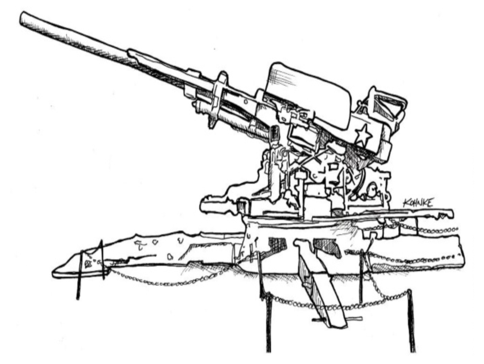

# 第 16 章 验收测试

 

在所有的整洁代码纪律中，这是程序员最无法控制的一项。
履行这项纪律需要业务方的参与。
不幸的是，到目前为止，许多企业已被证明不愿意适当地参与。

你如何知道一个系统何时可以部署？
世界各地的组织经常通过让 QA 部门或团队 “批准” 部署来做出这个决定。
通常，这意味着 QA 人员运行一大套手动测试，遍历系统的各种行为，直到他们确信系统按规范运行。
当那些测试 “通过” 时，系统就可以部署了。

这意味着系统的真正需求是那些测试。
需求文档上写什么并不重要，只有测试才重要。
如果 QA 在运行他们的测试后签字放行，系统就被部署了。
因此，那些测试就是需求。
