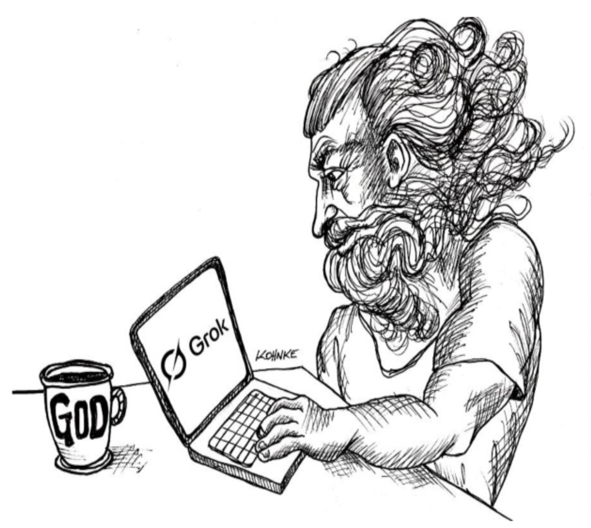
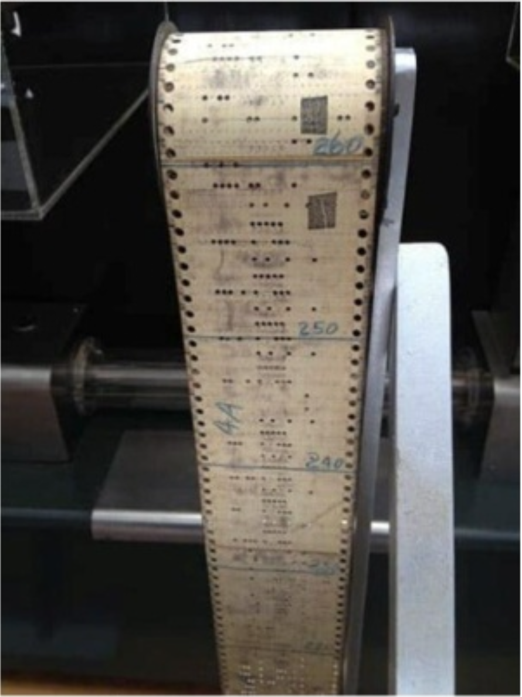

# 第 17 章 AI、LLM 与天知道还有什么

<center></center><br/>

在 20 世纪 40 年代末，Grace Hopper 写下了她的第一行代码。
每一行看起来像这样 ¹ ：

¹ [We Programmers](../bib.md#we-progammers) 。

```
| 521| 53| 2|
```

每个数字代表纸带上一个特定的孔，纸带看起来像这样：

<br/>

纸带的每一行都是 Harvard Mark I 执行的一条指令。
这些指令非常简单 —— 比如 “将寄存器 10 加到寄存器 12”。

我留给你去想象当时编程有多么困难。

几年之内，人们清楚地认识到，可以使用计算机程序从更抽象的文本表示（如 “add 10, 12” ）生成这样的代码。
Hopper 称之为 *自动编程 (automatic programming)* 。

在 Hopper 写下第一行代码的十年之内，John Backus 和他的团队生产了第一个 Fortran 编译器，它使用像 `a = b + c` 这样的语句。
Algol 在几年后出现，十年之内，Dahl 和 Nygaard 创建了 Simula-67，这是第一个面向对象语言。
C、Unix、Smalltalk 和 C++ 在几年内诞生。
在接下来的几年里，Java 和 C# 出现了。

在每一次这样的转变中，程序员的生产力都得到了提高。
第一次生产力的飞跃是最大的。
在 50 年代，使用类似 Fortran 编译器的程序员的生产力被证明是使用机器码的程序员的 45 倍。

此后的每一次生产力飞跃都比前一次小。
C 可能大约是 Fortran 的两倍。
C++ 可能比 C 提高了 20%。
Java/C# 可能又提高了大约 20%。
Ruby/Python 可能比 Java 好 20%，而 Clojure 可能又增加了 10%。

语言中的每一次转变都是由抽象层次的提高所驱动的。
该序列中的每一种新语言都离 Grace Hopper 在纸带上的那些孔又远了一步。
而每一步都伴随着编程正在被毁掉的恐惧。

是的，你没有看错。
在每个阶段，都有人预测编程的终结。
有书籍出版，预测了行业的末日。
他们声称程序员将变得像渡渡鸟一样稀有。

每次我们让编程变得更容易一些时，我们这些投资于当前复杂性的人往往担心未受教育的大众会抢走我们的工作。
因此我们预测了行业的末日。
而每一次，那些恐惧和预测都与实际结果完全相反。
随着每一次新的进步，项目的数量和对程序员的需求都在增长。

今天，我们面临着又一个这样的转变 —— AI 的转变。
当然，普遍存在着编程已死、程序员将很快灭绝的恐惧。

胡说！
这只是我们语言抽象层次的又一次提高 —— 是离纸带上的孔的又一步。
当我们掌握它时，项目的数量和对程序员的需求将继续增长。
