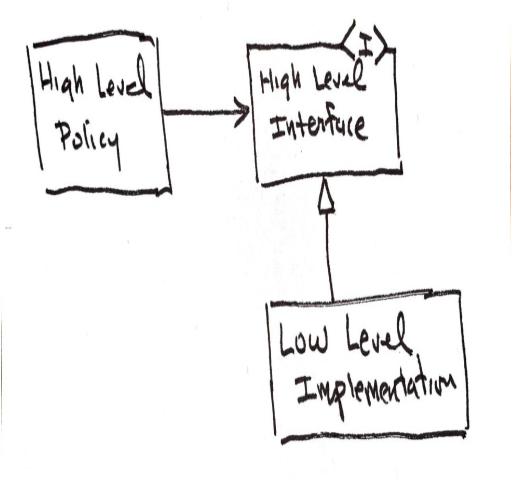

# 第 18 章 简单设计

 

Kent Beck

本章是从《Clean Craftsmanship》一书中删减和编辑的摘录。

从表面上看，一个系统的最佳设计显然是最简单的设计，它支持该系统的所有必需功能，同时为变更提供最大的灵活性。
然而，这让我们思考 *简单性 (simplicity)* 的含义。¹ 
简单并不意味着容易。
简单意味着不纠结；而解开纠结是困难的。

¹ 2012年，Rich Hickey 做了一个精彩的演讲，题为“简单性变得容易”。我鼓励你去听一听。

在软件系统中，什么会变得纠结？
最昂贵和最重要的纠缠是那些将高层策略与低层细节混杂在一起的部分。
当你将 SQL 与 HTML 混杂在一起，或将框架与核心价值混杂在一起，或将报告的格式与计算报告值的业务规则混杂在一起时，你创造了可怕的复杂性。
这些纠缠很容易编写，但它们使得添加新功能、修复错误以及改进和清理设计变得困难。

一个简单的设计是这样的设计：高层策略对低层细节一无所知。
那些高层策略被隔离起来，与低层细节分离，使得对低层细节的更改不会影响高层策略。²

² 我在 [Clean Arch](../bib.md#clean-arch) 中对此写了很多。

创建这种分离和隔离的主要手段是 *抽象 (abstraction)* 。
抽象是对本质的放大和对无关事物的消除。
高层策略是本质的，因此它们被放大。
低层细节在那个层次上是无关的，因此它们被隔离和分离。

我们为此采用的一种物理手段是 *多态 (polymorphism)* 。
我们安排高层策略使用多态接口来管理低层细节。
然后，我们将低层细节安排为那些多态接口的实现。
这保持了所有源代码依赖关系从低层细节指向高层策略，并使高层策略对低层细节的实现一无所知。
低层细节可以被更改而不影响高层策略。
这就是 *依赖反转原则 (DIP)* 的本质。

 

为了实现创建良好软件设计的目标，我们将首先讨论 YAGNI，然后讨论 Kent Beck 的简单设计四条原则：

1. 被测试覆盖
2. 揭示意图
3. 最小化重复
4. 最小化规模
