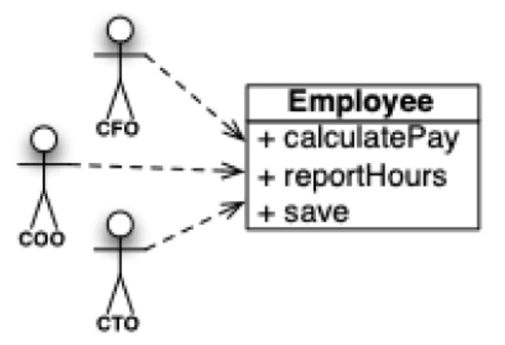
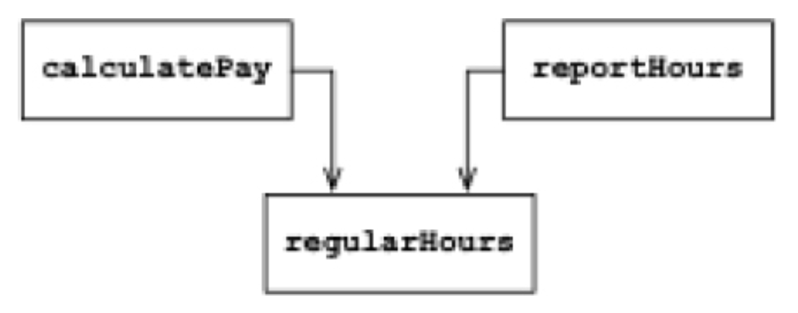
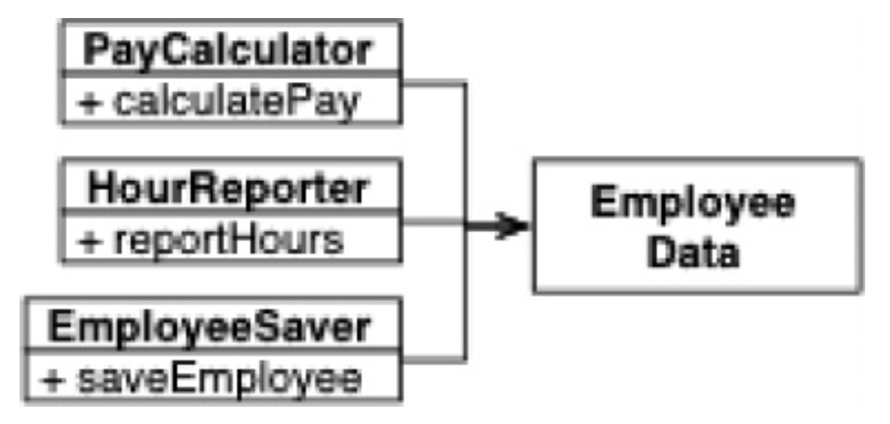
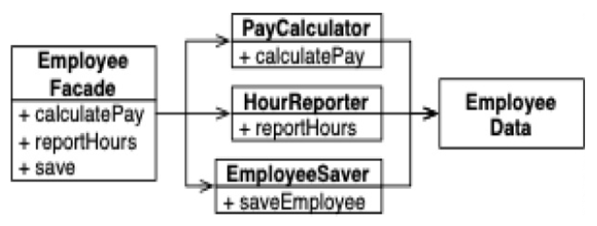
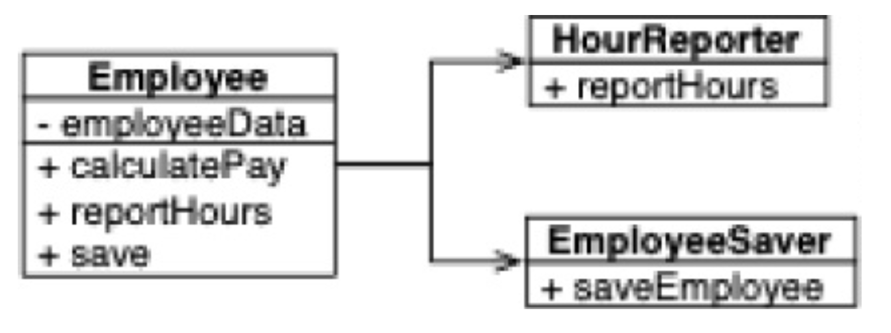

## SRP：单一职责原则

在所有的 SOLID 原则中，这可能是最不被理解的一个。
这很可能是因为它有一个特别不恰当的名字。
程序员很容易听到这个名字，然后假设它意味着每个模块都应该只做一件事。

正如我们在前面的章节中所看到的，确实存在这样的原则。
一个函数应该做且只做一件事，这是真的。
我们在将大型函数重构为更小的函数时使用该原则。
我们在最低层使用该原则。
但它不是 SOLID 原则之一。它不是 SRP。

从历史上看，SRP 被描述为：

> 一个模块应该有一个且只有一个需要被改变的理由。

软件系统被更改是为了满足用户和利益相关者。
因此，那些用户和利益相关者就是该原则所谈论的 “改变的理由”。
实际上，我们可以将原则重新表述为：

> 一个模块应该对一个且仅对一个用户或利益相关者负责。

不幸的是，“用户” 和 “利益相关者” 在这里并不是真正合适的词。
这是因为可能有多个用户或利益相关者希望以相同的方式更改系统。
所以我们实际上指的是一个或多个需要变更的人组成的群体。
我们将那个群体称为 *参与者 (actor)* 。

因此，SRP 的最终版本是：

> 一个模块应该对一个且仅对一个参与者 (actor) 负责。

现在，我们所说的 “模块” 是什么意思？
一个模块只是一组内聚的函数和数据结构。
“内聚” 这个词暗示了 SRP。
内聚是将负责单个参与者的代码绑定在一起的力量。

也许理解这个原则的最好方法是查看违反它所产生的众多症状之一。

### 偶然重复 (Accidental Duplication)

考虑一个薪资应用程序中的 `Employee` 类。
它有三个方法：`calculatePay()`、`reportHours()` 和 `save()`。

 

这个类违反了 SRP，因为这三个方法对三个非常不同的 *参与者 (actor)* 负责。

- `calculatePay()` 方法由会计部门指定，向 CFO 汇报。
- `reportHours()` 方法由人力资源部门指定和使用，向 COO 汇报。
- `save()` 方法由数据库管理员 (DBA) 指定，向 CTO 汇报。

通过将这三个方法的源代码放入一个单一的 `Employee` 类中，开发人员将每个参与者与其他人耦合在一起。
这种耦合可能导致 CFO 团队的行动影响 COO 团队所依赖的东西。

例如，假设 `calculatePay()` 函数和 `reportHours()` 函数共享一个计算非加班小时的通用算法。
再假设开发人员为了避免代码重复，将该算法放入了一个名为 `regularHours()` 的函数中。

 

现在假设 CFO 团队决定需要调整计算非加班小时的方式。
但人力资源部的 COO 团队不想要那个特定的调整，因为他们出于不同的目的使用非加班小时。

一个开发人员被要求进行更改，并看到了 `calculatePay()` 方法调用的那个方便的 `regularHours()` 函数。
不幸的是，那个开发人员没有注意到该函数也被 `reportHours()` 函数调用。

开发人员进行了所需的更改并仔细测试了它。
CFO 团队验证了新函数按预期工作，系统被部署了。

当然，COO 团队不知道这件事正在发生。
COO 团队继续使用由 `reportHours()` 函数生成的报告——但现在它们包含不正确的数字。
最终问题被发现，COO 大发雷霆，因为错误的数据使他的预算损失了数百万美元。

我们都见过类似的事情发生。
它之所以发生，是因为我们将不同参与者所依赖的代码放在了相近的位置。
SRP 说要分离不同参与者所依赖的代码。

### 解决方案

针对这个问题有许多不同的解决方案。
每种方案都将函数移入不同的类。

或许最显而易见的解决办法是将数据与函数分离。
这三个类共享对 `EmployeeData` 的访问，`EmployeeData` 是一个没有方法的简单数据结构。
每个类只保留其特定功能所需的源代码。
这三个类不允许相互了解对方。
这样，任何意外的重复都可以避免。

 

当然，这种解决方案的缺点在于，开发者现在需要实例化并追踪三个类。
针对这一困境，一个常见的解决方案是使用 *外观模式 (Facade pattern)* 。

 

`EmployeeFacade` 包含很少量的代码。
它负责实例化那些包含具体函数的类，并将调用委托给它们。

有些开发者更倾向于将最重要的业务规则放在离数据更近的地方。
这可以通过将最重要的方法保留在原始的 `Employee` 类中，然后将该类作为其他次要功能的外观来实现。

 

你可能会反对这些解决方案，理由是每个类只包含一个函数。
但情况并非如此。
计算工资、生成报告或保存数据各自所需的功能函数数量很可能是庞大的。
这些类中的每一个很可能会有许多其他公共方法，以及更多的私有方法。

### 更高层次

SRP 关注的是函数和类。
但该原则在更高两个层面上以不同形式重现。

正如我们将看到的，在组件层面，它变成了 *共同闭包原则 (Common Closure Principle)* 。
在架构层面，它变成了负责创建架构边界的 *变化轴 (axis of change)* 。
我们将在接下来的章节中研究所有这些概念。
