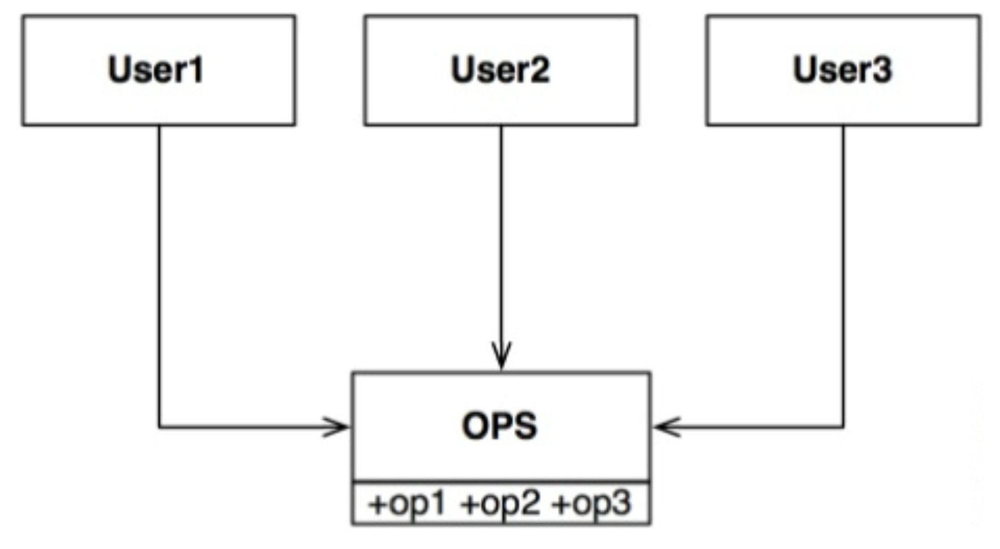
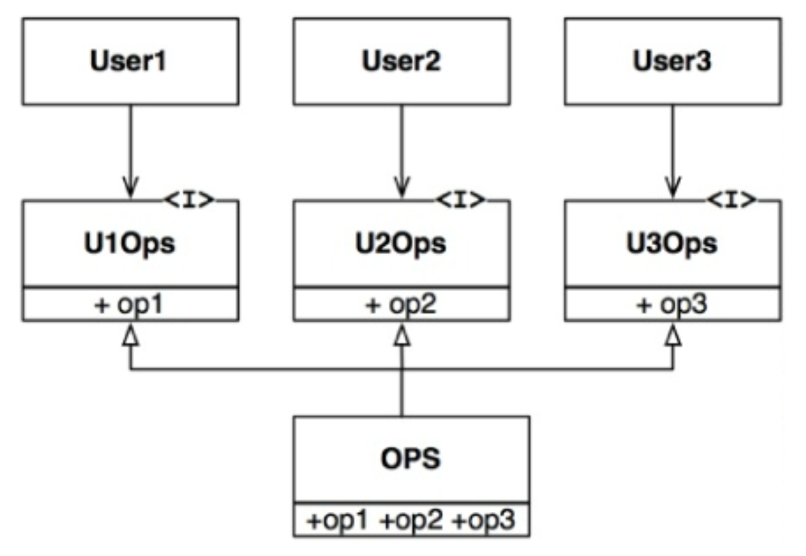
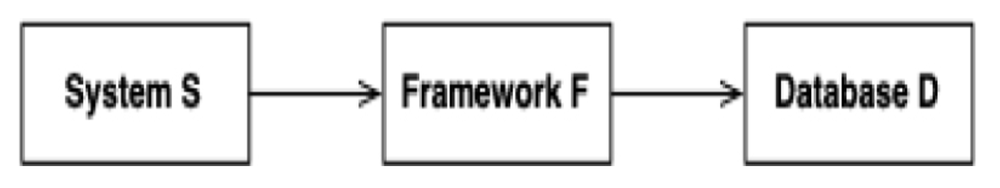

## ISP：接口隔离原则

ISP 得名于以下情况：

 

在上述情况中，有多个用户使用了 `OPS` 类的操作。
假设 `User1` 只使用 `op1`，`User2` 只使用 `op2`，`User3` 只使用 `op3`。

现在假设 `OPS` 是一个用像 C++ ⁴ 这样的语言编写的类。
显然，在这种情况下，`User1` 的源代码会无意中依赖于 `op2` 和 `op3`，即使它并不调用它们。
这种依赖意味着，对 `OPS` 中 `op2` 源代码的更改将迫使 `User1` 被重新编译和重新部署，尽管它关心的内容实际上并没有发生变化。

⁴ Java 和 C# 中的情况稍微复杂一些。
编译器不仅仅基于日期重新编译模块。
相反，它会寻找更改的声明。

这个问题可以通过将操作隔离到接口中来解决，如下所示。

 

再次假设这是在 C++ 这样的静态类型语言中实现的，那么 `User1` 的源代码将依赖于 `U1Ops` 和 `op1`，但不会依赖于 `OPS`。
因此，`OPS` 中 `User1` 不关心的更改不会导致 `User1` 被重新编译和重新部署。

### ISP 与语言

像 C++ 这样的静态类型语言迫使程序员创建用户必须 `#include` 的声明。
正是源代码中包含的这些声明，创建了可能强制重新编译和重新部署的源代码依赖关系。

在像 Java 和 C# 这样的语言中，依赖关系更软，但并非不存在。
编译器使用单个声明而不是源文件来遵循依赖树。
因此，只有声明发生变化时，才需要重新编译和重新部署。

在像 Ruby 和 Python 这样的动态类型语言中，源代码中不存在接口。
相反，它们是在运行时被推断出来的。
因此，不存在强制重新编译和重新部署的源代码依赖关系或接口声明。
这就是为什么动态类型语言创建的系统比静态类型语言更灵活、耦合度更低的主要原因之一。

这一事实可能导致你得出结论：ISP 是一个语言问题，而不是一个设计问题。

### ISP 与设计

然而，如果你退后一步，审视 ISP 的根本动机，就会发现其中潜藏着更深层次的关切。
一般来说，依赖于包含超出你所需内容的模块是有害的。
对于可能导致不必要的重新编译和重新部署的源代码依赖关系而言，这显然成立；但在更高的层面上，这一点同样成立。

例如，考虑一位正在构建系统 S 的开发者。
他希望将某个框架 F 纳入系统中。
现在假设框架 F 的作者将其与某个特定的数据库 D 绑定在一起。
于是，S 依赖于 F，而 F 又依赖于 D。

 

现在假设 D 包含了 F 不使用、因而 S 也不关心的某些特性。
D 中这些特性的更改很可能迫使 F 重新部署，从而也迫使 S 重新部署。
更糟糕的是，D 中某个特性的故障可能导致 F 和 S 也发生故障。

这里的教训是：依赖一个带有你不需要的额外内容的东西，可能会给你带来意想不到的麻烦。

底线是：

> 不要依赖你不需要的东西。

在讨论 [第 20 章](../ch20/0.md) “组件原则” 中的共同复用原则时，我们将更详细地探讨这一思想。
