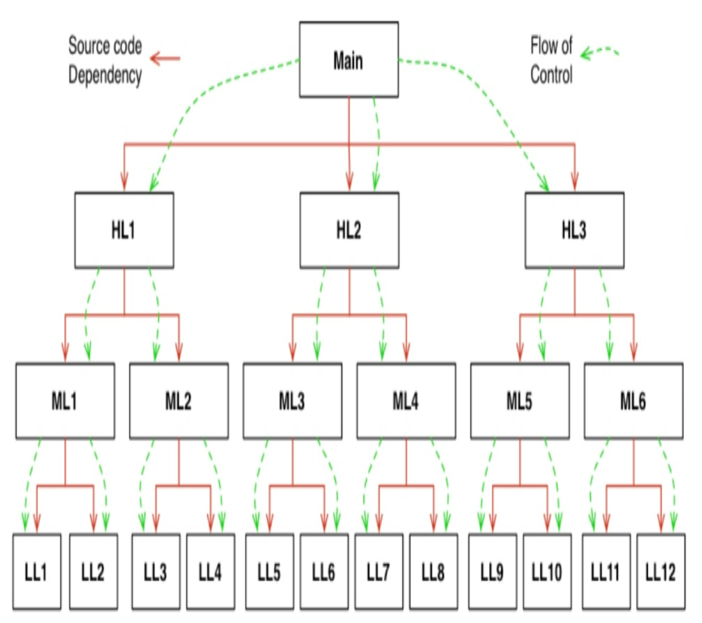
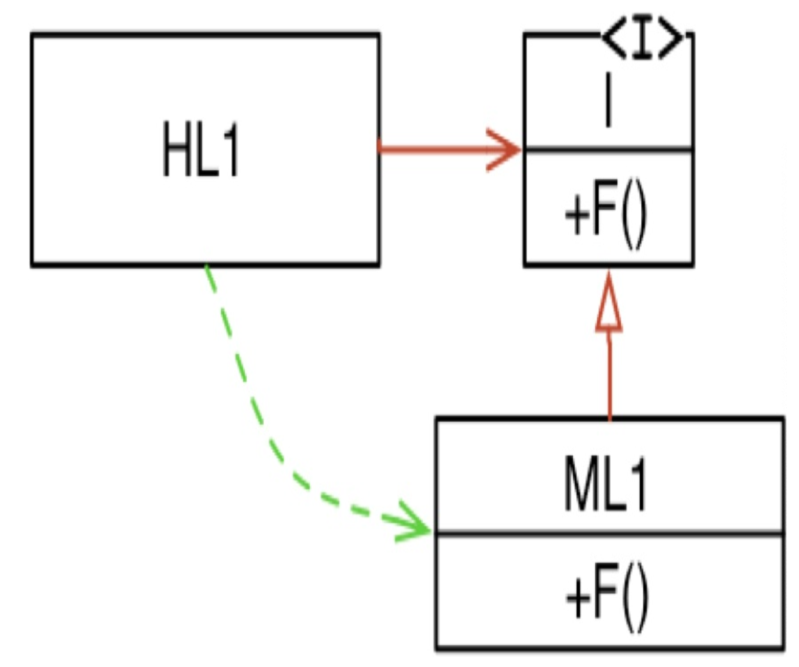
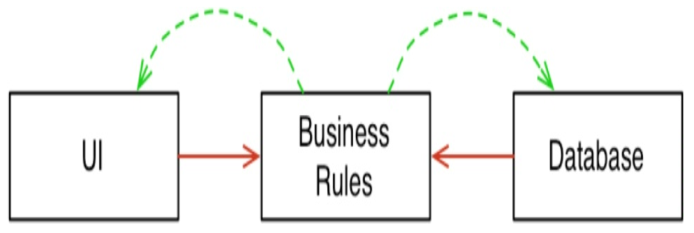
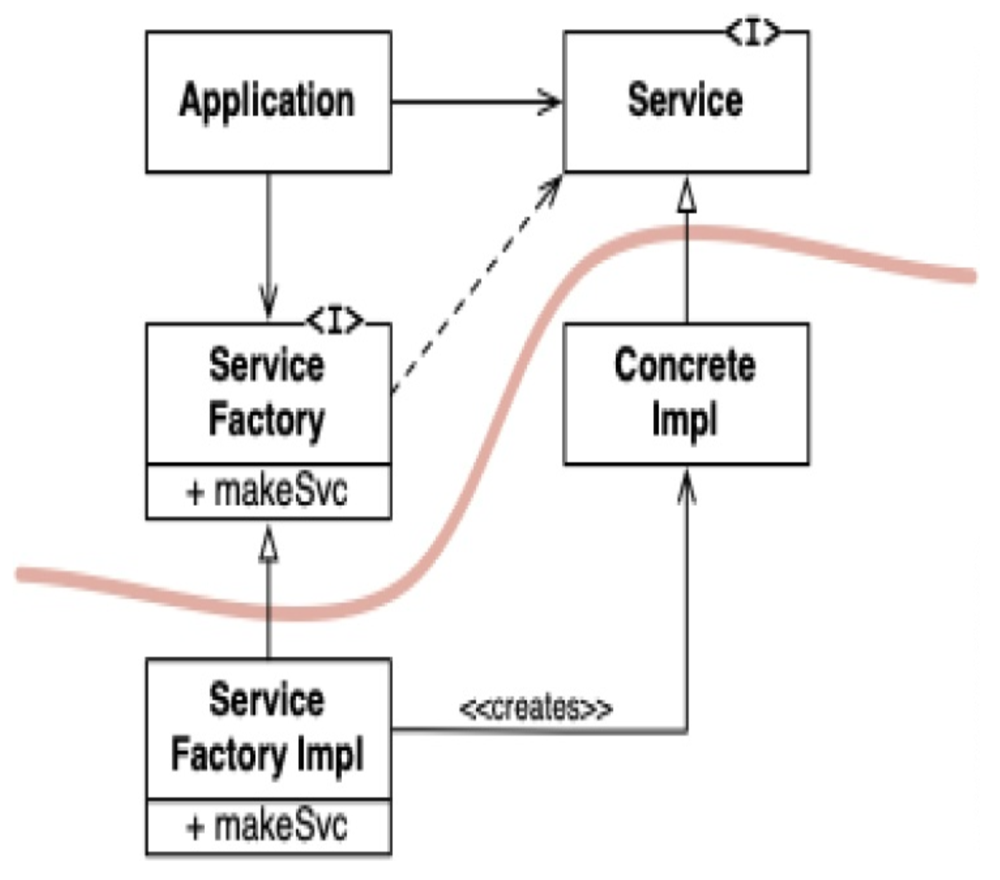

## DIP：依赖反转原则

> “最好依赖你能控制的东西，而不是依赖你无法控制的东西，以免最终它控制了你。”
> 
—— James Grenning

在60年代和70年代，几乎所有的程序都是按照以下模式构建的。

 

源代码依赖关系无一例外地遵循控制流。
高层模块依赖于低层模块，因为高层模块调用了低层模块。

OO 给了我们一个不同的选择：多态接口。

 

在调用路径中插入一个接口，会将源代码依赖关系反转，使其与控制流方向相反。
在上图中，高层模块 `HL1` 调用了低层模块 `ML1` 中的 `f` 函数；但它是通过接口 `I` 来实现的。
从 `ML1` 到 `I` 的源代码依赖关系指向与控制流相反的方向。

以这种方式反转依赖关系的能力，赋予了软件设计师对系统中每个源代码依赖关系的绝对控制权。
如果任何依赖关系有问题（它们常常有问题），可以通过插入一个接口来快速反转。

这种能力就是力量！

 

它允许我们创建**插件架构**，使高层策略（如业务规则）独立于低层细节（如 UI 和数据库）。

 

在上图中，所有源代码依赖关系（实线箭头）都从低层模块指向高层模块。
`UI` 和 `Database` 都依赖于 `BusinessRules` 中的接口并实现它们。
换句话说，具体细节依赖于抽象。
这告诉我们，最灵活的系统是那些源代码依赖关系仅指向抽象（而非具体实现）的系统。

在像 Java 这样的静态类型语言中，这意味着 `use`、`import` 或 `include` 语句应该只引用包含接口、抽象类或其他某种抽象声明的源模块。
不应该依赖任何具体的东西。

同样的规则也适用于像 Ruby 或 Python 这样的动态类型语言。
源代码依赖关系不应指向具体的模块。
然而，在这些语言中，定义什么是具体模块稍微困难一些。
具体来说，任何其中所调用的函数被实现的模块，都可视为具体模块。

将这一思想当作硬性规则是不现实的，因为软件系统必须依赖许多具体的设施。
例如，Java 中的 `String` 类是具体的。
试图强迫它变成抽象是不现实的。
对具体的 `java.lang.String` 的源代码依赖无法（也不应该）被避免。

相比之下，`String` 类非常稳定。
对该类的更改非常罕见且受到严格控制。
程序员和架构师不必担心 `String` 会频繁而随意地变化。

因此，在 DIP 方面，我们倾向于忽略操作系统和平台设施这些稳定的背景。
我们容忍这些具体的依赖，因为我们知道可以依赖它们不会发生变化。

我们真正想要避免依赖的是系统中 *不稳定的具体元素* 。
那些是我们正在积极开发、并且经历频繁变更的模块。

### 稳定的抽象

对抽象接口的每一次更改，都对应着对其具体实现的更改。
反之，对具体实现的更改并不总是（甚至通常不）要求更改它们所实现的接口。
因此，接口通常比实现具有更低的易变性。

事实上，优秀的软件设计师和架构师努力降低接口的易变性。
他们试图找到在不修改接口的情况下向实现添加功能的方法。
这是软件设计的基础。

那么，其含义是：稳定的软件设计是那些避免依赖不稳定的具体实现、并倾向于使用稳定的抽象接口的设计。
这一含义可以归结为一套非常具体的编码实践：

- **不要引用不稳定的具体类**。
应引用抽象接口。
这条规则适用于所有语言，无论是静态类型还是动态类型。
它还对对象的创建施加了严格约束，通常会强制使用抽象工厂模式。

- **不要从不稳定的具体类派生**。
这是前一条规则的推论，但值得特别提及。
在静态类型语言中，继承是所有源代码关系中最强、最僵化的；因此，使用它必须格外谨慎。
在动态类型语言中，继承的问题较小，但它仍然是一种依赖 —— 谨慎永远是最明智的选择。

- **不要覆盖具体函数**。
具体函数通常需要源代码依赖。
当你覆盖这些函数时，你并没有消除这些依赖 —— 实际上，你继承了它们。
为了管理这些依赖，你应该将函数设为抽象，并创建多个实现。

- **永远不要提及任何具体且不稳定的东西的名称**。
这实际上只是对原则本身的重申。

虽然这些被写为规则，但它们实际上更像是警告。
一个务实的程序员会经常违反这一原则。
但一个聪明的程序员会首先考虑这些警告。

盲目地遵守这一原则可能导致接口的爆炸式增长，而这些接口实际上没有人真正需要。
另一方面，轻率地忽视这一原则可能导致你的软件变得纠结和僵化。

最后，聪明的程序员会随着系统的演进和需求的产生而逐渐遵循这一原则。
有了他们可以以生命相托的测试套件，他们知道当需要添加接口以反转依赖关系时，这些更改将相对容易进行且没有风险。

### 工厂

为了遵守 DIP，创建不稳定的具体对象可能需要特殊处理。
这是因为在几乎所有语言中，创建对象都需要对该对象的具体定义产生源代码依赖。

在大多数面向对象语言（如 Java）中，我们会使用 *抽象工厂 (Abstract Factory)* ⁵ 来管理这种不受欢迎的依赖。

⁵ [GOF95](../bib.md#gof95) 。

 

上图展示了其结构。
`Application` 通过 `Service` 接口使用 `ConcreteImpl`。
然而，`Application` 必须以某种方式创建 `ConcreteImpl` 的实例。
为了在不产生对 `ConcreteImpl` 的源代码依赖的情况下实现这一点，`Application` 调用了 `ServiceFactory` 接口的 `makeSvc` 方法。
该方法由 `ServiceFactoryImpl` 类实现，而 `ServiceFactoryImpl` 派生自 `ServiceFactory`。
该实现实例化 `ConcreteImpl` 并将其作为 `Service` 类型返回。

注意那条曲线。
这是一条 *架构边界* 。
它将抽象侧与具体侧分隔开来。
所有源代码依赖关系都跨越该曲线，且指向相同的方向 —— 朝向抽象侧。

这条曲线将系统划分为两个组件：一个抽象组件，另一个具体组件。
抽象组件包含应用程序的所有高层业务规则。
具体组件包含这些业务规则所操控的所有实现细节。

请注意，控制流跨越曲线的方向与源代码依赖关系相反。
源代码依赖关系与控制流的方向相反 —— 这就是为什么我们称此原则为 *依赖反转* 。

### 具体组件

上图中的具体组件包含一个违反 DIP 的依赖关系。
这是典型情况。
DIP 的违规无法完全消除，但它们可以被集中到少数几个具体组件中，并与系统的其余部分分离开来。

大多数系统将包含至少一个这样的具体组件 —— 通常称为 `main`，因为它包含 `main` 函数。⁶
在上面的例子中，`main` 函数将实例化 `ServiceFactoryImpl`，并将该实例放入一个类型为 `ServiceFactory` 的全局变量中。
然后 `Application` 通过该全局变量访问工厂。

⁶ 换句话说，就是应用程序首次启动时由操作系统调用的那个函数。

随着我们在本书中继续探讨更高级的架构原则，DIP 将反复出现。
它将成为我们架构图中最显著的组织原则。
上图中的曲线将在后续章节中成为架构边界。
依赖关系单向跨越该曲线、指向更抽象实体的方式，将成为一条新的规则，我们称之为 *依赖规则 (Dependency Rule)* 。
