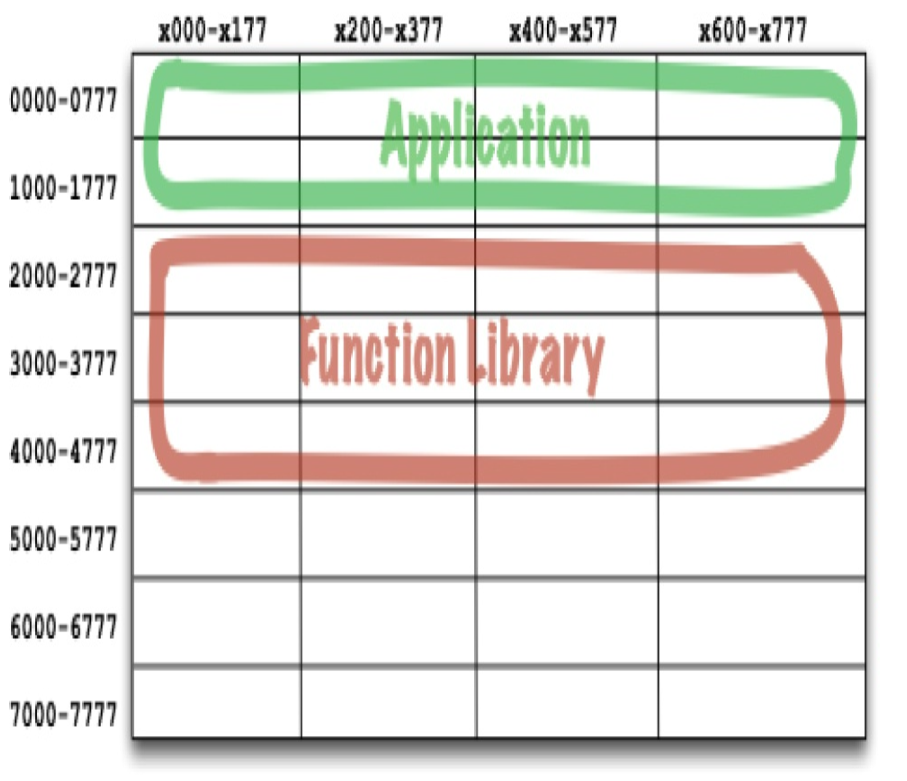
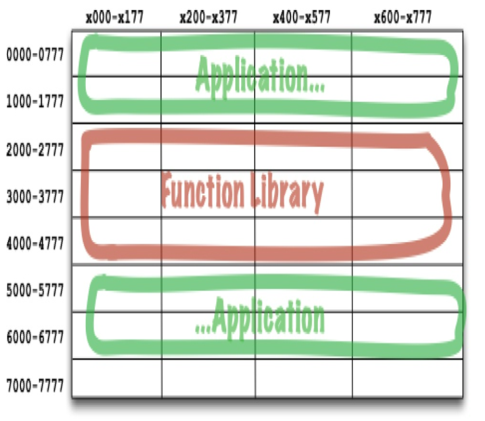

## 组件简史

在软件开发的早期，程序员控制着程序的内存位置和布局。
程序的第一行代码之一将是 `origin` 语句，它声明了程序要加载的地址。
考虑这个简单的 PDP-8 程序。
它包含一个名为 `GETSTR` 的子程序，从键盘输入一个字符串并将其保存在缓冲区中。
它还有一个小型单元测试程序来执行 `GETSTR`。

```
          *200
          TLS
START,    CLA
          TAD BUFR
          JMS GETSTR
          CLA
          TAD BUFR
          JMS PUTSTR
          JMP START
BUFR,     3000

GETSTR,   0
          DCA PTR
NXTCH,    KSF
          JMP -1
          KRB
          DCA I PTR
          TAD I PTR
          AND K177
          ISZ PTR
          TAD MCR
          SZA
          JMP NXTCH

K177,     177
MCR,      -15
```

注意程序开头的 `*200`。
这告诉编译器生成将在地址 200 ⁸ 处加载的代码。

⁸ 例如，[PPP02](../bib.md#ppp02) ，http://www.butunclebob.com/ArticleS.UncleBob.PrinciplesOfOod ，以及 https://en.wikipedia.org/wiki/SOLID_(object-oriented_design) （或直接搜索 SOLID）。

这对今天的大多数程序员来说是一个陌生的概念。
他们通常不必考虑程序在计算机内存中的加载位置。
但在早期，这是程序员需要做出的首要决定之一。
在那些日子里，程序是不可重定位的。

在那些日子里，你如何访问库函数？
上面的代码展示了我们是如何做到的。
我们将库函数的源代码与我们的应用程序代码一起包含，并将它们全部编译成一个单一的程序。²
库以源代码形式保存，而不是二进制形式。

² 我的第一位雇主在架子上存放了几十副子程序库源代码的卡片组。当你编写一个新程序时，你只需拿起其中一副卡片组，然后把它拍到你卡片组的末尾。

问题在于，在那些日子里，设备速度很慢，内存昂贵且因此受限。
编译器需要对源代码进行多次扫描，但内存太有限，无法容纳所有源代码。
因此，编译器必须使用那些慢速设备多次读取源代码。
这需要很长时间；你的函数库越大，编译器花费的时间就越长。
编译一个大型程序可能需要数小时。³
为了缩短编译时间，我们将函数库的源代码与应用程序分开。
我们单独编译函数库，并将二进制文件加载到一个已知地址，比如说 2000 ⁸。
我们为函数库创建了一个符号表，并将其与我们的应用程序代码一起编译。
当我们想运行一个应用程序时，我们会加载二进制函数库，⁴ 然后加载应用程序。

³ 这个视频展示了这个过程，我于2022年上传到 YouTube：https://www.youtube.com/playlist?list=PLINHgpdx-_Cq0bImYF-IWVO8U2XERZuit 。<br/>
⁴ 实际上，那些旧机器大多使用磁芯存储器，在关闭计算机电源时不会被擦除。所以我们经常一次将函数库加载好几天。

内存看起来像这样：

<br/>

只要应用程序能容纳在 0000⁸ 到 1777⁸ 之间，这就工作得很好。
但很快应用程序就增长到了超过分配空间的大小。
于是，程序员不得不将他们的应用程序分成两个地址段，在函数库周围跳转。

<br/>

很明显，这是一种不可持续的状况。
随着我们向函数库中添加更多函数，它超出了边界，我们不得不在 7000⁸ 附近为其分配更多空间。
随着计算机内存的增长，程序和库的这种碎片化必然继续下去。

显然，必须采取一些措施。

### 可重定位性

解决方案是 *可重定位二进制文件 (relocatable binaries)* 。
这个想法非常简单。
我们修改了编译器，使其输出以地址零为基址的二进制代码。
加载程序将被告知在何处加载可重定位代码，加载程序会将加载地址添加到二进制代码中的所有地址。
这比听起来要复杂一些，但我们找到了使其工作的方法。

现在我们可以告诉加载程序在哪里加载函数库，在哪里加载应用程序。
实际上，加载程序会接受多个二进制输入，并将它们一个接一个地加载到内存中，在加载时对它们进行重定位。
这使我们能够只加载我们需要的那些函数。

编译器也被修改为在可重定位二进制文件中将函数名称作为元数据发出。
如果一个程序调用了一个库函数，编译器会将该名称作为一个 *外部引用 (external reference)* 发出。
如果一个程序定义了一个函数，编译器会将该名称作为一个 *外部定义 (external definition)* 发出。
然后，加载程序可以在确定了这些定义加载到何处之后，将外部引用链接到外部定义。

于是，*链接加载程序 (linking loader)* 诞生了。

### 链接器

链接加载程序允许我们将程序划分成可以单独编译和加载的段。
当我们有相对较小的程序与相对较小的库链接时，这工作得很好。
然而，在 60 年代末和 70 年代初，我们变得更加雄心勃勃，程序变得大得多。

最终，链接加载程序变得慢得无法忍受。
这是因为我们的函数库存储在诸如磁带这样的慢速设备上。
即使当时的磁盘也相当慢。
使用这些相对慢速的设备，链接加载程序必须读取几十个（如果不是数百个）二进制库，以解析外部引用。
随着程序变得越来越大，以及库中积累了更多的库函数，一个链接加载程序可能需要一个多小时来加载程序。

于是加载程序和链接器被分成了两个阶段。
我们把慢的部分 ——做链接的部分—— 拿出来，放到了一个单独的应用程序中，称为 *链接器 (linker)* 。
链接器的输出是一个链接好的可重定位文件，重定位加载程序可以非常快速地加载它。
这允许我们使用慢速链接器准备一个可执行文件；但我们可以在任何时候快速加载它。

然后来到了 80 年代。
我们使用 C 或其他一些高级语言工作。
随着我们野心的增长，我们的程序也增长了。
包含数十万行代码的程序并不罕见。

我们将源代码模块从 `.c` 文件编译成 `.o` 文件，并将它们输入链接器以创建可以快速加载的可执行文件。
编译每个单独的模块相对较快；但编译所有模块需要一些时间。
然后链接器会花费最多的时间。
在许多情况下，周转时间再次增长到一小时或更长。

看起来我们注定要无休止地追逐我们的尾巴。
在整个 60 年代、70 年代和 80 年代，我们为加速工作流所做的所有更改都被我们的野心和我们编写的程序规模所挫败。
我们似乎无法摆脱长达一小时的周转时间。
加载时间仍然很快；但编译-链接时间是瓶颈。

我们当然正在经历程序规模的 *墨菲定律* ：

> 程序将会增长，以填满所有可用的编译和链接时间。

但墨菲并不是镇上唯一的竞争者。
摩尔 ⁵ 也来了，在 80 年代末，两者展开了较量。
摩尔赢得了那场战斗。
磁盘开始缩小，并呈指数级地变快。
计算机内存变得如此便宜，以至于磁盘上的许多数据都可以缓存在 RAM 中。
计算机时钟频率从 1MHz 增加到 100MHz。

⁵ 摩尔定律：计算机速度、内存和密度每 18 个月翻一番。
这条定律从 20 世纪 50 年代一直持续到 2000 年；但随后戛然而止。

到 90 年代中期，链接所花费的时间已经开始缩减得比我们的野心能使程序增长得更快。
在许多情况下，链接时间降到了几秒钟。
对于小型工作，链接加载程序的想法再次变得可行。

这是 ActiveX、共享库以及 `.jar` 和 `.dll` 文件开始出现的时代。
计算机和设备变得如此之快，以至于我们可以在加载时再次进行链接。
我们可以在几秒钟内将几个 `.jar` 文件或几个共享库链接在一起，并执行生成的程序。

于是，*组件插件架构 (component plug-in architecture)* 诞生了。

今天，我们通常将 `.jar` 文件、DLL 或共享库作为现有应用程序的插件发布。
例如，如果你想为 Minecraft 创建一个模组，你只需将你自定义的 `.jar` 文件包含在某个文件夹中。
如果你想将 ReSharper 插入 Visual Studio，你只需包含相应的 DLL。

这些动态链接文件，可以在运行时插在一起，就是我们架构中的软件组件。
这花了 50 年时间，但我们已经达到了这样一个阶段：组件插件架构可以成为随意的默认选项，而不是曾经那样需要付出巨大努力。
