## 组件耦合

接下来的三条原则涉及组件之间的关系。
在这里，我们将再次遇到可开发性与逻辑设计之间的张力。
影响组件结构架构的力量包括技术性、政治性和易变性。

### 无环依赖原则 (ADP)

> 在组件依赖图中不允许出现循环依赖。

你是否曾经历过：辛苦工作一整天，搞定了一些功能，然后回家，结果第二天早上回来发现你的东西不能用了？
为什么它不能用了？
因为有人比你晚走，更改了你所依赖的东西！
我称之为 “第二天早晨综合征”。

“第二天早晨综合征” 发生在许多开发人员修改同一组源文件的开发环境中。
在只有少数开发人员的相对较小的项目中，这算不上什么大问题。
但随着项目和开发团队规模的扩大，第二天早晨可能会变得相当可怕。
团队连续几周都无法构建一个稳定的项目版本，这种情况并不少见。
相反，每个人都在不停地修改自己的代码，试图让它能与别人刚刚做的最新更改协同工作。

#### 消除依赖循环

这个问题的解决方案是将开发环境划分为可发布的组件。
组件成为工作单元，可以由单个开发人员或一个开发团队负责。
当开发人员使某个组件能够正常工作时，他们就将其发布供其他开发人员使用。
他们为其分配一个版本号，并将其移入一个目录供其他团队使用。
然后他们在自己的私有区域中继续修改他们的组件。
其他所有人则使用已发布的版本。

当一个组件的新版本可用时，其他团队可以决定是否立即采用该新版本。
如果他们决定不采用，就继续使用旧版本。
一旦他们准备好，就开始使用新版本。

因此，没有一个团队会受制于其他团队。
对一个组件所做的更改不需要立即影响其他团队。
每个团队可以自行决定何时让自己的组件适配组件的新版本。
而且，集成是以小增量的方式进行的。
不存在一个所有开发人员必须聚集在一起、集成他们正在做的所有事情的时间点。

这是一个非常简单且合理的过程，并被广泛使用。
然而，要使其成功运行，你必须管理好组件的依赖结构。
不能有循环。

如果依赖结构中存在循环，那么 “第二天早晨综合征” 就无法避免。

考虑下面的组件图。

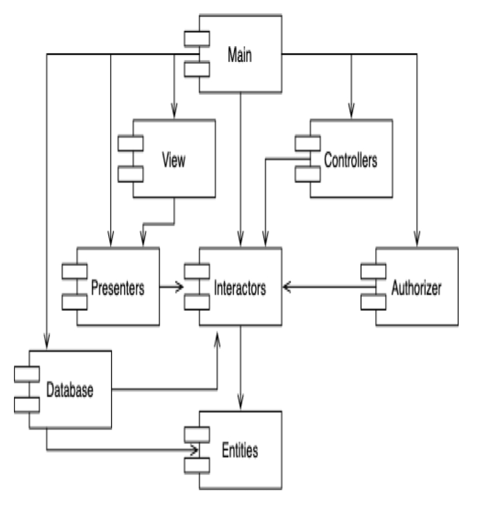 

这里我们看到一个相当典型的、组装成应用程序的组件结构。
对于本示例而言，该应用程序的功能并不重要。
重要的是组件的依赖结构。
请注意，这个结构是一个有向图。
组件是节点，依赖关系是有向边。

还要注意一点：无论你从哪个组件开始，都无法沿着依赖关系走回到该组件。
这个结构没有循环。
它是一个 *有向无环图 (DAG)* 。

现在注意当负责 `Presenters` 的团队发布其组件的新版本时会发生什么。
谁受到了这个版本的影响很容易找到：只需沿着依赖箭头反向追溯即可。
因此，`View` 和 `Main` 都将受到影响。
目前在这些组件上工作的开发人员将需要决定何时将他们的工作与 `Presenters` 的新版本进行集成。

还要注意，当 `Presenters` 被发布时，它对系统中许多其他组件完全没有影响。
其他组件不知道 `Presenters` 的存在，也不关心它何时变更。
这很好。
这意味着发布 `Presenters` 的影响相对较小。

当负责 `Presenters` 组件的开发人员想要对该组件运行测试时，他们只需使用当前正在使用的 `Interactors` 和 `Entities` 组件的版本，构建他们自己的 `Presenters` 版本即可。
系统中其他任何组件都无需参与。
这很好。这意味着负责 `Presenters` 的开发人员搭建测试环境的工作量相对较小，需要考量的变量也相对较少。

当需要发布整个系统时，过程是自底向上进行的。
首先，`Entities` 组件被编译、测试并发布；然后对 `Database` 和 `Interactors` 执行同样的操作。
接下来是 `Presenters`、`View`、`Controllers`，然后是 `Authorizer`。`Main` 排在最后。
这个过程非常清晰且易于处理。
我们知道如何构建系统，因为我们理解其各部分之间的依赖关系。

#### 组件依赖图中出现循环的影响

假设一个新的需求迫使我们对 `Entities` 中的某个类进行修改，使其使用 `Authorizer` 中的一个类。
例如，假设 `Entities` 中的 `User` 类使用了 `Authorizer` 中的 `Permissions` 类。
这就创建了一个依赖循环，如下所示。

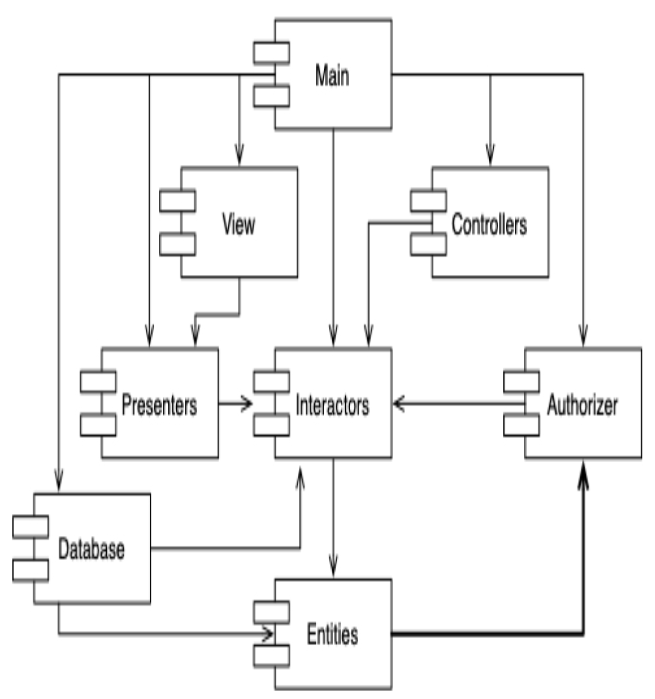 

这个循环实际上将 `Interactors`、`Entities` 和 `Authorizer` 合并成了一个单一的组件。
任何使用其中一个的组件都依赖于它们全部。
这使得构建和测试变得更加困难。
它也引发了关于正确构建顺序的问题。
你不能先构建 `Entities`，因为它依赖于 `Authorizer`。
但 `Authorizer` 又通过 `Interactors` 依赖于 `Entities`。
所以没有正确的构建顺序。
任何在没有正确构建顺序的情况下构建的系统，都是偶然运作的，而非按计划运作。

#### 打破循环

打破组件间的循环并将依赖图恢复为 DAG 总是可行的。
主要有两种机制：

1. *应用依赖反转原则 (DIP)* 。
在下面的例子中，我们可以创建一个包含 `User` 所需方法的接口。
然后将该接口放入 `Entities` 中，并让 `Authorizer` 继承它。
这反转了 `Entities` 和 `Authorizer` 之间的依赖关系，从而打破了循环。
请看下面的前后对比图。

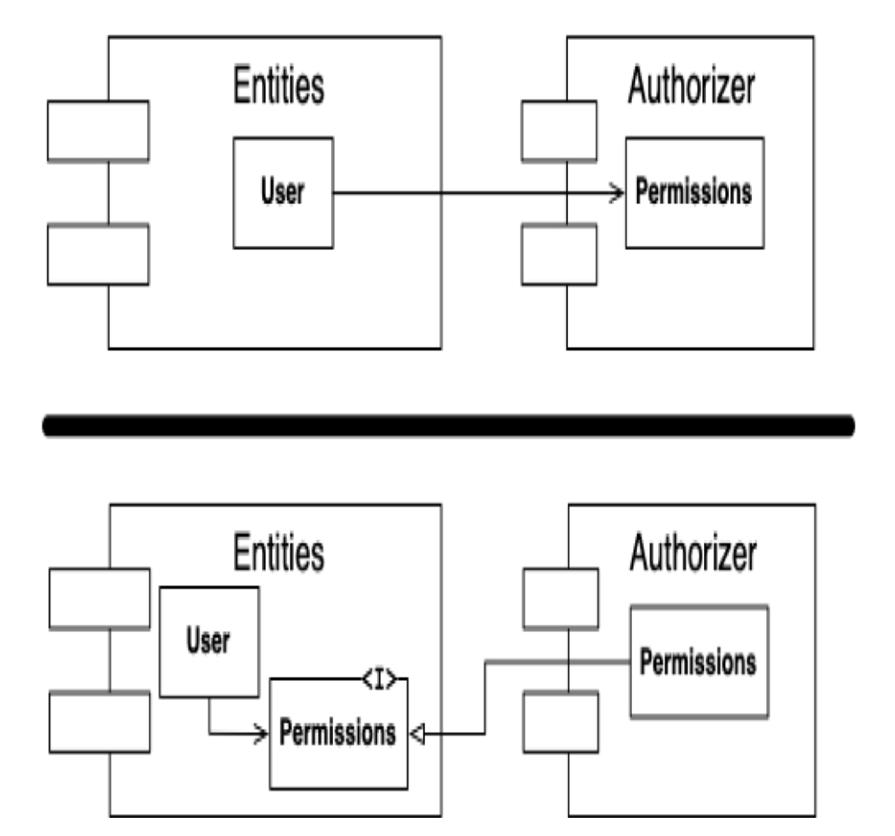 

2. *创建一个 `Entities` 和 `Authorizer` 都依赖的新组件* 。
将两者共同依赖的类移动到该新组件中。请看下图。

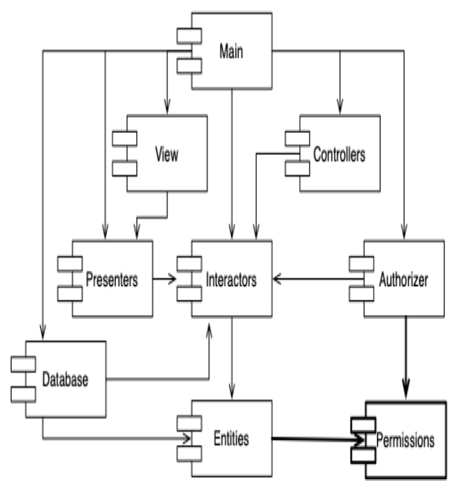 

#### “抖动”

第二个解决方案意味着组件结构在需求变化的情况下是不稳定的。
实际上，随着应用程序的增长，组件依赖结构会不断抖动和扩展。
因此，必须始终监控依赖结构是否存在循环。
当循环出现时，必须以某种方式打破它们。
有时这意味着创建新的组件，使依赖结构不断增长。

#### 自上而下的设计

到目前为止我们讨论的问题引出一个不可避免的结论：组件结构不能自上而下地设计。
它不是系统设计中首先确定的事情之一，而是随着系统的增长和变化而逐步演化的。

你们中的一些人可能会觉得这一点有悖直觉。
我们习惯于期望大粒度的分解（如组件）同时也是高层的功能分解。

当我们看到大粒度的分组（如组件依赖结构）时，我们相信这些组件应该以某种方式代表系统的功能。
然而，这似乎并不是组件依赖图的属性。

事实上，组件依赖图与描述应用程序的功能几乎没有什么关系。
相反，它们是应用程序 *可构建性* 和 *可维护性* 的映射图。
这就是为什么它们不是在项目开始时设计的。
一开始没有软件需要构建或维护，因此也就不需要构建和维护的映射图。
但是，随着实现和设计早期阶段积累越来越多的模块，管理依赖关系的需求也在增长，以便项目能够在没有 “第二天早晨综合征” 的情况下进行开发。
此外，我们希望尽可能将变更局部化，因此我们开始关注 SRP 和 CCP，并将很可能一起变更的类放在一起。

关于这种依赖结构，一个首要的关注点是 *隔离易变性* 。
我们不希望那些因随意原因而频繁变更的组件去影响那些本应稳定的组件。
例如，我们不希望 GUI 的外观修改影响到我们的业务规则。
我们不希望添加或修改报告影响到我们的最高层策略。
因此，组件依赖图是由开发人员创建和塑造的，目的是保护稳定、高价值的组件免受易变的低层组件的影响。

随着应用程序的持续增长，我们开始关注创建可复用的元素。
此时，CRP 开始影响组件的构成。
最后，当循环出现时，应用 ADP，组件依赖图随之抖动和增长。

如果我们试图在设计任何类之前就设计组件依赖结构，很可能会遭遇严重的失败。
我们不会了解太多关于共同闭包的信息，也不会意识到任何可复用的元素，而且几乎肯定会创建出产生依赖循环的组件。
因此，组件依赖结构是随着系统的逻辑设计一起增长和演化的。

### 稳定依赖原则 (SDP)

> 依赖的方向要指向稳定的方向。

设计不可能是完全静态的。
如果设计要保持可维护性，一定的易变性是必要的。
我们通过遵循 CCP 来实现这一点。
通过使用这一原则，我们创建了对某些类型变化敏感、但对其他变化免疫的组件。
其中一些组件被设计为易变的。
我们预期它们会发生变化。

任何我们预期会变化的组件，都不应该被一个难以变化的组件所依赖。
否则，这个易变组件也会变得难以变化。

软件的悖论在于：你设计成易于变更的模块，可能会因为别人仅仅是在它上面挂了一个依赖而变得难以变更。
你的模块中甚至不需要更改一行源代码，但它却突然变得难以变更。
通过遵循 SDP，我们确保那些意图易于变更的模块不会被那些更难变更的模块所依赖。

#### 稳定性

“稳定性” 是什么意思？
将一枚硬币立在其边缘。
这个位置稳定吗？
你可能会说 “不”。
然而，除非受到干扰，它会在那个位置保持很长一段时间。
因此，稳定性与变更频率没有直接关系。
硬币并没有在变化，但很难认为它是稳定的。

韦氏词典定义：某物如果 “不易移动”，则它是稳定的。
<ins>稳定性与进行变更所需的工作量有关</ins>。
立着的硬币并不稳定，因为使它倒下只需要很小的力。
一张桌子非常稳定，因为把它翻倒需要相当大的力气。

> 稳定性是一个连续体 (continuum)，而不是一个布尔值。

这与软件有什么关系？
许多因素可能使软件组件难以变更 —— 例如其规模、复杂性和清晰度等特征。
我们将忽略所有这些因素，而关注另一件事情。
<ins>使软件组件难以变更的一个可靠方法是：让许多其他软件组件依赖于它。
具有大量 *传入依赖 (incoming dependencies)* 的组件非常稳定，因为要协调任何变更与所有依赖组件之间的关系需要大量的工作</ins>。

下图展示了 X，这是一个稳定的组件。
这个组件有三个组件依赖于它，因此它有三个不改变的理由。
我们说 X 对这三个组件负有责任。
相反，X 不依赖于任何东西，因此没有外部影响迫使它改变。
我们说 X 是负责任且独立的：它是一个成年人。

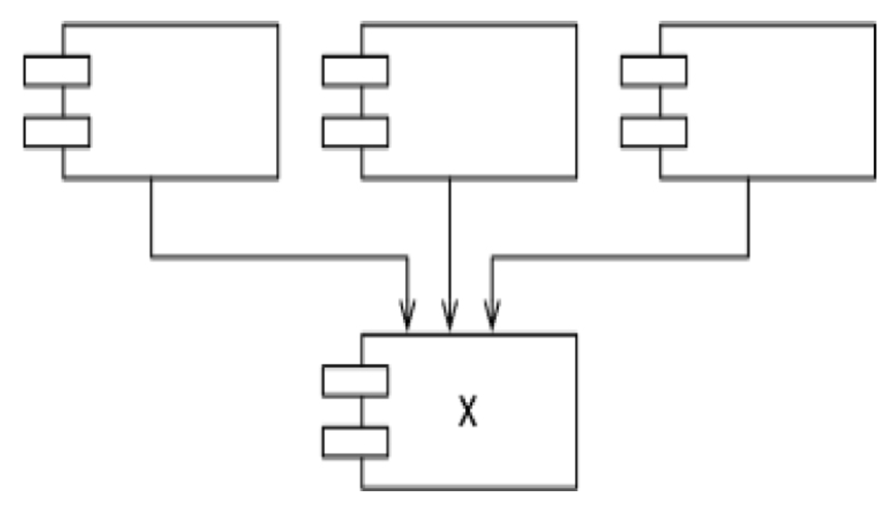 

另一方面，下图展示了 Y，这是一个非常不稳定的组件。
没有其他组件依赖于 Y，因此我们说它是不负责任的。
Y 还依赖于三个组件，因此变化可能来自三个外部来源。
我们说 Y 是有依赖的且不负责任的：它是一个青少年。

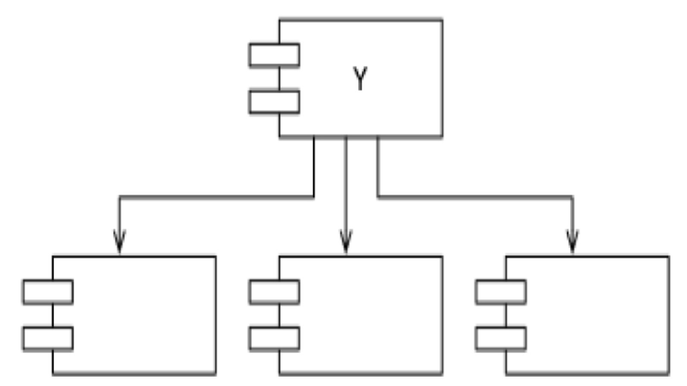 

#### 稳定性度量

我们如何衡量一个组件的稳定性？
一种方法是统计进入和离开该组件的依赖关系数量。
这些统计数字将使我们能够计算出该组件的 *位置稳定性* 。

- 传入依赖（Fan-in）：传入耦合数。
该指标标识了此组件外部依赖于该组件内部类的类的数量。

- 传出依赖（Fan-out）：传出耦合数。
该指标标识了此组件内部依赖于该组件外部类的类的数量。

- 不稳定性 I ：\( I = \frac{\text{Fan-out}}{\text{Fan-in} + \text{Fan-out}} \)。
该指标的取值范围为 [0, 1]。
\( I = 0 \) 表示最大程度稳定的组件。
\( I = 1 \) 表示最大程度不稳定的组件。

传入和传出指标 ⁷ 是通过统计所讨论组件外部与所讨论组件内部类之间存在依赖关系的类的数量来计算的。
考虑下面的示例：

⁷ 在之前的出版物中，我曾分别使用传出耦合和传入耦合（Ce 和 Ca）来表示 Fan-out 和 Fan-in。
那只是我个人的傲慢：我喜欢中枢神经系统的隐喻。

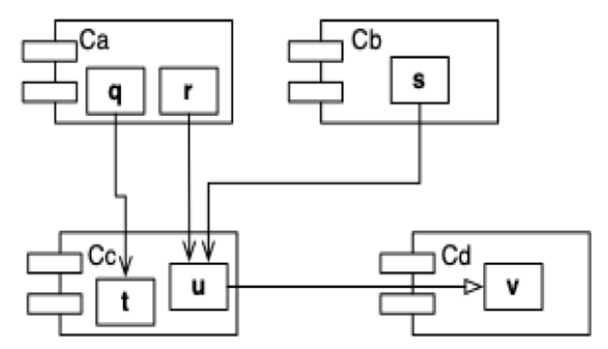 

假设我们要计算组件 `Cc` 的稳定性。
我们发现 `Cc` 外部有三个类依赖于 `Cc` 内部的类。
因此，`Fan-in = 3`。
此外，`Cc` 内部的类还依赖于 `Cc` 外部的一个类。
因此，`Fan-out = 1`，`I = 1/4`。

在 C++ 中，这些依赖关系通常由 `#include` 语句表示。
实际上，当你的源代码组织成每个源文件中只有一个类时，`I` 指标是最容易计算的。
在 Java 中，`I` 指标可以通过统计 `import` 语句和限定名来计算。
其他语言也有类似的机制，例如 `using` 或 `require`。

当 `I` 指标等于 1 时，意味着没有其他组件依赖于该组件（`Fan-in = 0`），而该组件依赖于其他组件（`Fan-out > 0`）。
这种情况是组件所能达到的最不稳定的状态：它是一个青少年，不负责任且有依赖性。
缺乏依赖者使得该组件没有理由不改变，而它所依赖的组件则可能给它充分的理由去改变。

相反，当 `I` 指标等于 0 时，意味着该组件被其他组件所依赖（`Fan-in > 0`），但本身不依赖于任何其他组件（`Fan-out = 0`）。
它是一个负责任且独立的成年人。
它达到了所能达到的最稳定状态。
它的依赖者使得该组件难以被更改，而它本身没有依赖关系会迫使其更改。

SDP 指出：一个组件的 `I` 指标应该大于它所依赖的组件的 `I` 指标。

`I` 指标应该沿着依赖的方向递减。

#### 并非所有组件都应该是稳定的

如果系统中的所有组件都达到最大程度的稳定，那么系统将变得不可更改。
这不是一个理想的状态。
实际上，我们希望设计组件结构时，使某些组件不稳定，而另一些组件稳定。
下图展示了一个包含三个组件的系统的符合配置。

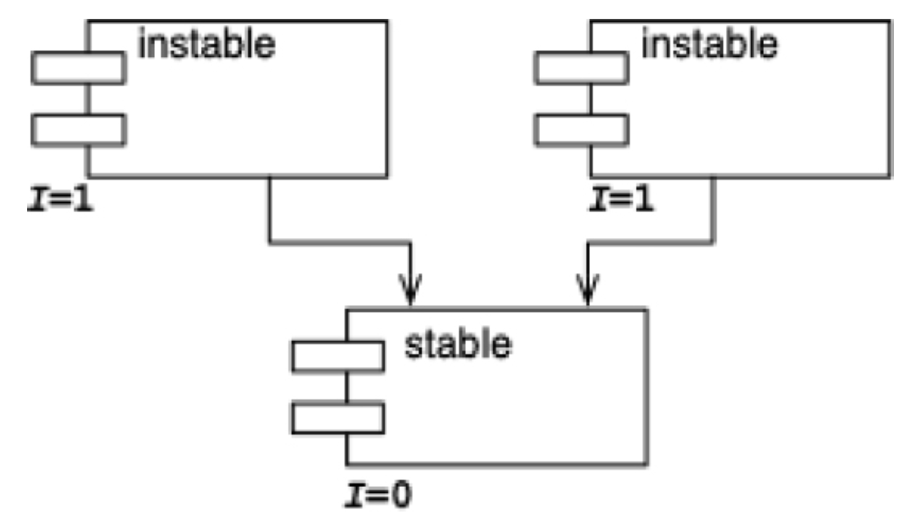 

可变的组件位于顶部，并依赖于底部稳定的组件。
将不稳定的组件放在图的上方是一个有用的惯例，因为任何向上的箭头都违反了 SDP（并且，正如我们将在下一章中看到的，也违反了 ADP ）。

下图展示了 SDP 可能被违反的情况。

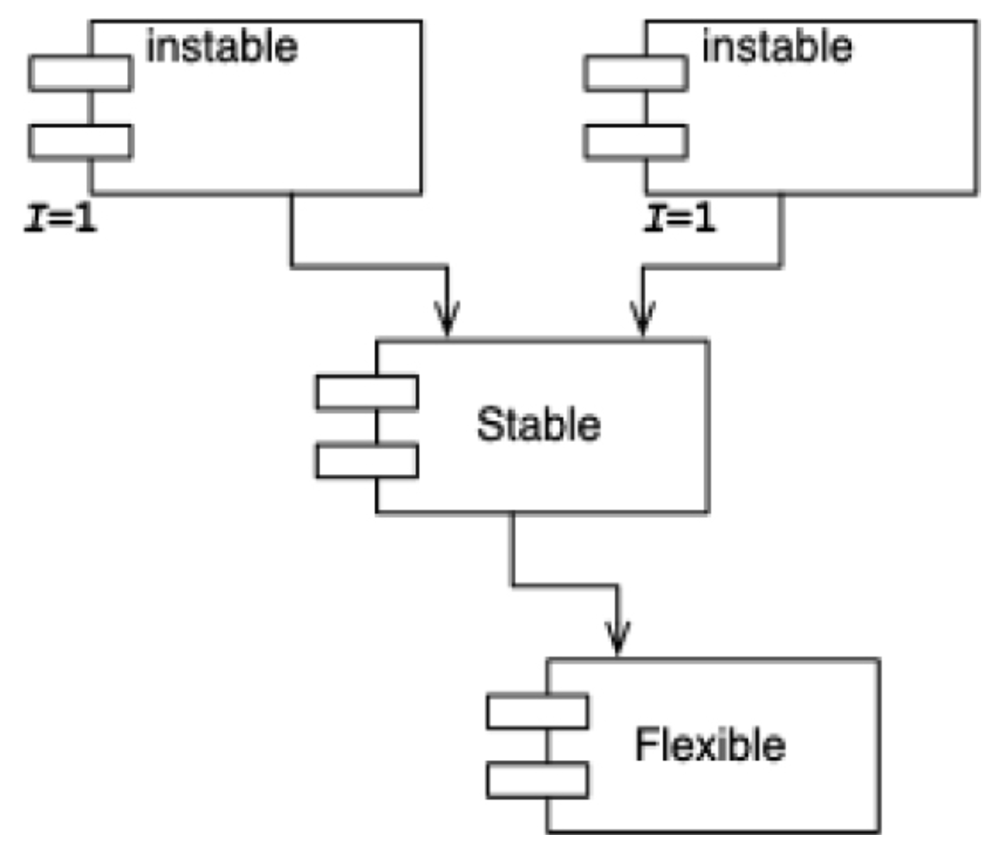 

`Flexible` 是一个我们设计为易于变更的组件。
我们希望 `Flexible` 是不稳定的。
然而，某个在名为 `Stable` 的组件中工作的开发者，在 `Flexible` 上挂了一个依赖。
这违反了 SDP，因为 `Stable` 的 `I` 指标远小于 `Flexible` 的 `I` 指标。
其结果是，`Flexible` 将不再易于变更。
对 `Flexible` 的更改将迫使我们同时处理 `Stable` 及其所有依赖者。

要解决这个问题，我们必须以某种方式打破 `Stable` 对 `Flexible` 的依赖。
为什么这种依赖会存在？
假设 `Flexible` 中有一个类 `C`，而 `Stable` 中的另一个类 `U` 需要使用它。

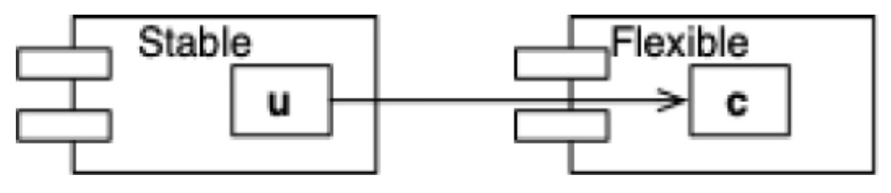 

我们可以通过应用 DIP 来解决这个问题。
我们创建一个名为 `US` 的接口类，并将其放入一个名为 `UServer` 的组件中。
我们确保该接口声明了 `U` 需要使用的所有方法。
然后我们让 `C` 实现这个接口，如下所示。
这打破了 `Stable` 对 `Flexible` 的依赖，并迫使两个组件都依赖于 `UServer`。
`UServer` 非常稳定（`I = 0`），而 `Flexible` 保留了其必要的不稳定性（`I = 1`）。
现在所有依赖都沿着 `I` 递减的方向流动。

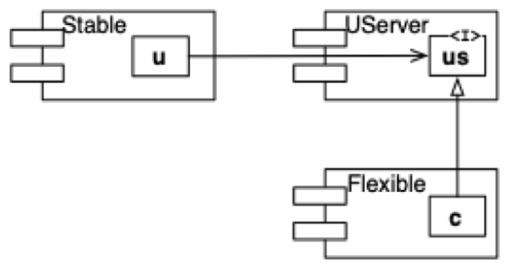 

#### 抽象组件

你可能会觉得创建一个只包含接口的组件（在本例中是 `UService`）有些奇怪。
这样的组件不包含任何可执行代码！
然而，在使用 Java 和 C# 这类静态类型语言时，这是一种非常常见且必要的策略。
这些抽象组件非常稳定，因此是不稳定组件依赖的理想目标。

当使用 Ruby 和 Python 这类动态类型语言时，这些抽象组件根本不存在，指向它们的依赖关系也不存在。
这些语言中的依赖结构要简单得多，因为依赖反转既不需要声明接口，也不需要继承接口。

### 稳定抽象原则 (SAP)

> 一个组件的抽象程度应该与其稳定程度一致。

接下来的内容会涉及一些数学和理论。
不要让这吓到你。
理论是重要的，即使实践只与它有松散的联系。
读到结尾，你就会明白我的意思。

#### 高层策略放在哪里？

系统中的某些软件不应该频繁变更。
这些软件代表了高层架构和策略决策。
我们不希望这些业务和架构决策是易变的。
因此，封装了系统高层策略的软件应该放入稳定的组件中（`I = 0`）。
不稳定的组件（`I = 1`）应该只包含易变的软件 —— 即我们希望能够快速、轻松地更改的软件。

然而，如果高层策略被放入稳定的组件中，那么表示这些策略的源代码将难以更改。
这可能会使整体架构缺乏灵活性。
一个最大程度稳定（`I = 0`）的组件如何能够足够灵活以承受变更？
答案在于 OCP。
该原则告诉我们，创建足够灵活、无需修改即可扩展的类是可能的，也是可取的。
什么样的类符合这一原则？ *抽象类* 。

SAP 在稳定性和抽象性之间建立了一种关系。
一方面，它指出一个稳定的组件也应该是抽象的，这样它的稳定性就不会妨碍它被扩展。
另一方面，它指出一个不稳定的组件应该是具体的，因为它的不稳定性使得其中的具体代码能够被轻松更改。

因此，如果一个组件要成为稳定的，它应该由接口和抽象类组成，以便能够被扩展。
稳定且可扩展的组件是灵活的，不会过度约束架构。

SAP 和 SDP 结合起来，相当于组件层面的 DIP。
这是因为 SDP 指出依赖应该沿着稳定性的方向运行，而 SAP 指出稳定性意味着抽象性。
因此，依赖关系沿着抽象的方向运行。

#### 度量抽象性

`A` 指标是组件抽象程度的度量。
它的值就是组件中接口和抽象类的数量与组件中类总数之比。

- `Nc`：组件中类的数量。
- `Na`：组件中抽象类和接口的数量。
- `A`：抽象性。
  `A = Na ÷ Nc`。`A` 指标的范围从 0 到 1。值为 0 意味着该组件根本没有抽象类。值为 1 意味着该组件只包含抽象类和/或接口。

#### 主序列

我们现在可以定义稳定性（`I`）与抽象性（`A`）之间的关系了。
我们创建一个以 `A` 为纵轴、`I` 为横轴的图。
如果将两种 “好” 的组件绘制在此图上，我们会发现最大程度稳定且抽象的组件（成年人）位于左上角 `(0, 1)`。
最大程度不稳定且具体的组件（青少年）位于右下角 `(1, 0)`。

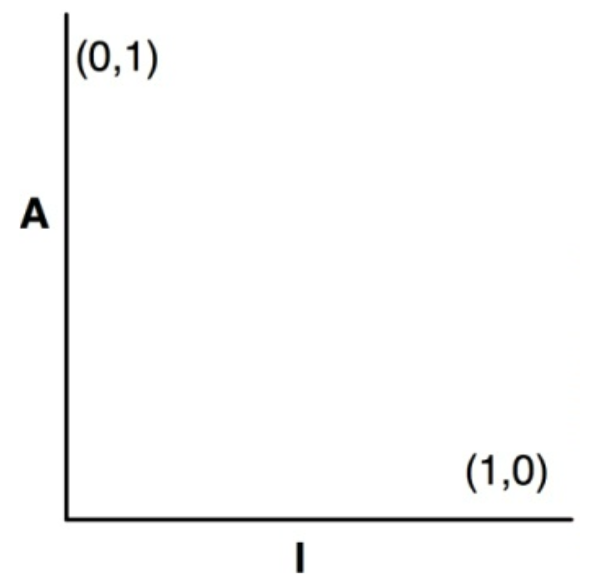 

并非所有组件都落在这两个位置之一，因为组件通常具有不同程度的抽象性和稳定性。
例如，一个抽象类从另一个抽象类派生是很常见的。
派生类是一个具有依赖关系的抽象体。
因此，尽管它是最大程度抽象的，
但它不会是最大程度稳定的。
它的依赖关系会降低其稳定性。

由于我们无法强制执行所有组件都位于 `(0, 1)` 或 `(1, 0)` 的规则，我们必须假设 `A`/`I` 图上存在一条轨迹，定义了组件的合理位置。
我们可以通过找出组件 *不应* 处于的区域来推断这条轨迹——即 *排除区* 。

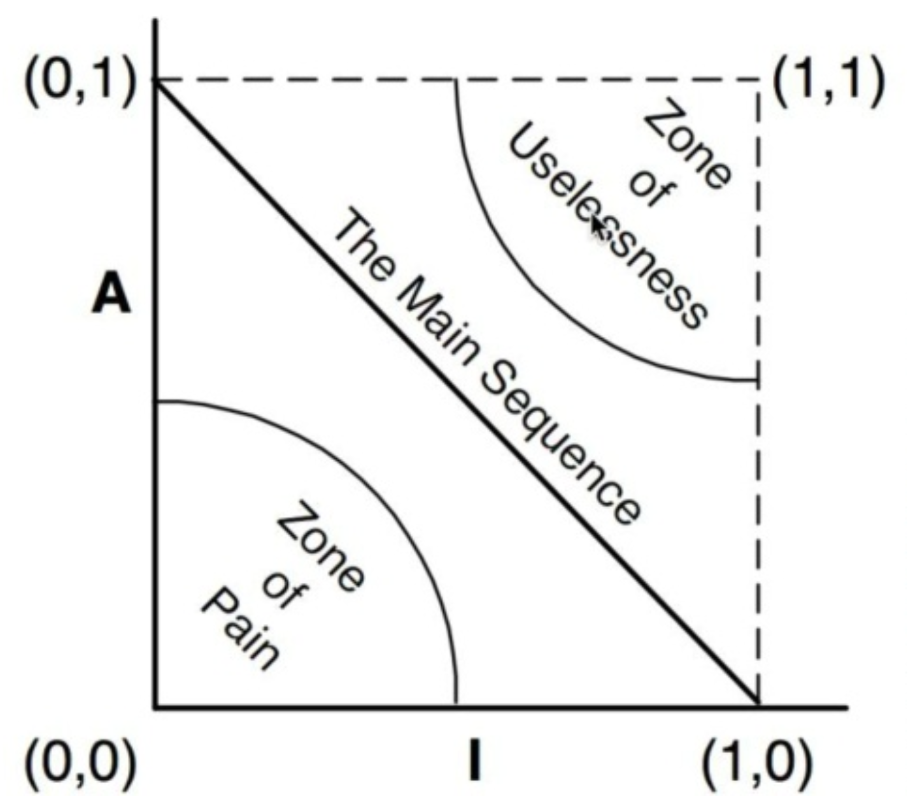 

#### 痛苦区

考虑位于 `(0, 0)` 区域的组件。
这是一个高度稳定且具体的组件。
这样的组件是不可取的，因为它是僵化的。
它无法被扩展，因为它不抽象；又因为它的稳定性，它非常难以更改。
因此，我们通常不会期望看到设计良好的组件位于 `(0, 0)` 附近。`(0, 0)` 周围的区域是一个排除区，称为 *痛苦区* 。

应该指出，有些软件实体确实落入了痛苦区。
例如，数据库 schemas。
数据库 schema 以易变、极其具体且被高度依赖而闻名。
这就是面向对象应用程序与数据库之间的接口难以管理的原因之一，也是 schema 升级通常很痛苦的原因之一。

另一个位于 `(0, 0)` 区域的软件示例是具体的工具库。
尽管这样的库的 `I` 指标为 1，但它实际上可能是非易变的。
例如，考虑 `String` 组件。尽管其中的所有类都是具体的，但由于它被广泛使用，更改它会引发混乱。
因此 `String` 是非易变的。

非易变组件在 `(0, 0)` 区域是无害的，因为它们不太可能被更改。
因此，只有在痛苦区中的 *易变* 软件组件才会有问题。
痛苦区中的组件越易变，它就越 “痛苦”。
实际上，我们可以将易变性视为图的第三个轴；而上面的图仅显示了最痛苦的平面，其中易变性 = 1。

#### 无用区

考虑位于 `(1, 1)` 附近的组件。
这个位置是不可取的，因为它最大程度地抽象，却没有依赖者。
这就像一个没有实现的接口。
这样的组件是没有用的。
因此，这个区域被称为 *无用区* 。

位于此区域的软件实体是一种残余物。
它们通常是无人实现的、被遗弃的抽象类。
我们时不时会在系统中发现它们，闲置在代码库中，未被使用。

或者它们可能是多余的接口 —— 一些类实现但从未有任何类使用过的接口。

一个处于无用区深处的组件必然包含相当大比例的此类实体。
显然，这些无用实体的存在是不可取的。

#### 主序列

我们希望最易变的组件尽可能地远离两个排除区。
离每个区域最远的点所构成的轨迹是连接 `(1, 0)` 和 `(0, 1)` 的直线。
我称这条线为 *主序列 (Main Sequence)* 。⁸

⁸ 作者恳请读者原谅其借用天文学中如此重要术语的傲慢行为。

位于主序列上的组件，相对于其稳定性而言不会 “过于抽象”，相对于其抽象性而言也不会 “过于不稳定”。
它既不是无用的，也不是特别痛苦的。
它的被依赖程度与其抽象程度相当，而它依赖其他组件的程度与其具体程度相当。

组件最理想的位置是主序列的两个端点之一。
我们努力将其大部分组件定位在这些端点上。
然而，根据我的经验，大型系统中有一小部分组件既不是完全抽象的，也不是完全稳定的。
如果这些组件位于主序列上或接近主序列，它们就具有最佳的特性。

#### 距主序列的距离

这引出了我们的最后一个度量。
如果组件位于主序列上或接近主序列是可取的，那么我们可以创建一个度量来衡量一个组件距离这个理想位置有多远。

- D ⁹ ：距离。
\( D = |A + I - 1| \)。
该度量的范围为 \([0, 1]\)。
值为 0 表示组件直接位于主序列上。
值为 1 表示组件尽可能远离主序列。

⁹ 在之前的出版物中，我称这个指标为 D'。我认为没有理由继续这种做法。

有了这个度量，就可以分析一个设计整体上对主序列的符合程度。
可以计算每个组件的 `D` 值。任何 `D` 值不接近零的组件都可以被重新审视和重构。
