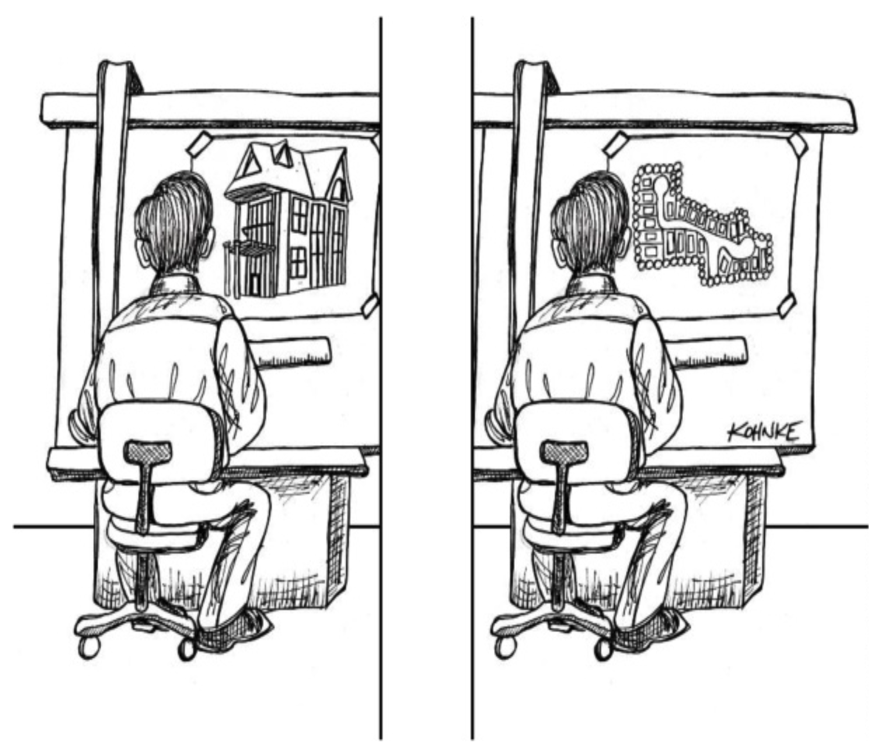

# 第 25 章 架构边界

 

软件架构是一门画线的艺术。
我称这些线为 *边界* 。
这些边界将软件元素彼此分隔开来，并限制一侧的元素知晓另一侧的内容。
其中一些线在项目生命周期的非常早期就被画下 —— 甚至在任何代码编写之前。
另一些线则画得晚得多。
那些早期画下的线，其目的是尽可能长时间地推迟决策，并防止这些决策污染核心业务逻辑。

请记住，架构的目标是最小化构建和维护所需系统的人力资源。
是什么消耗了人力资源？
*耦合* ——尤其是与过早决策的耦合。

哪些类型的决策是过早的？
那些与系统的业务需求（用例）无关的决策。
这些决策包括关于框架、数据库、Web 服务器、工具库、依赖注入等。
一个好的系统架构是这样的：像这样的决策是辅助性的、可推迟的。
一个好的系统架构不依赖于这些决策。
一个好的系统架构允许这些决策在最晚的可能时刻做出，且不会产生重大影响。
