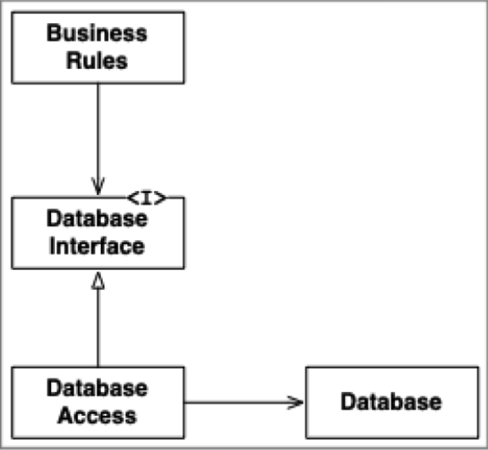
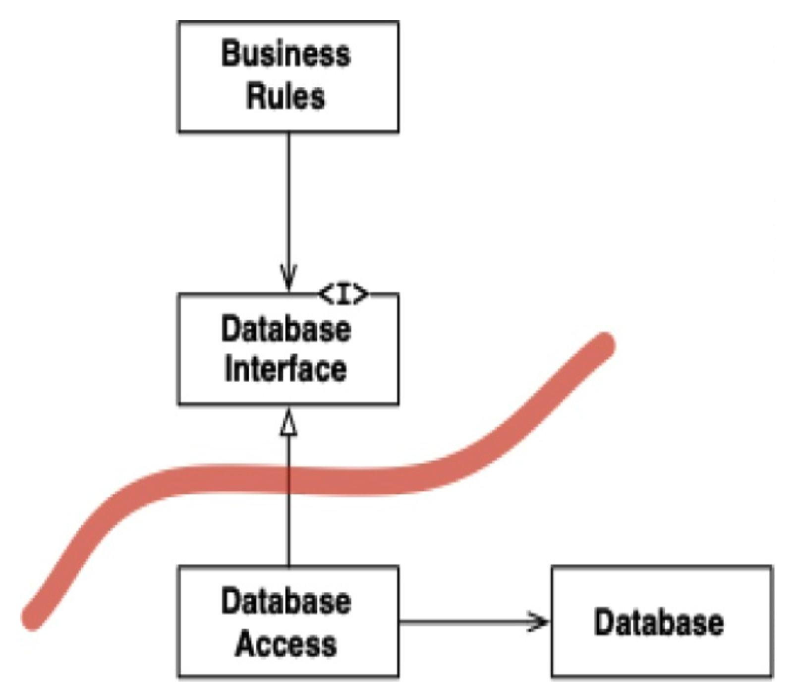
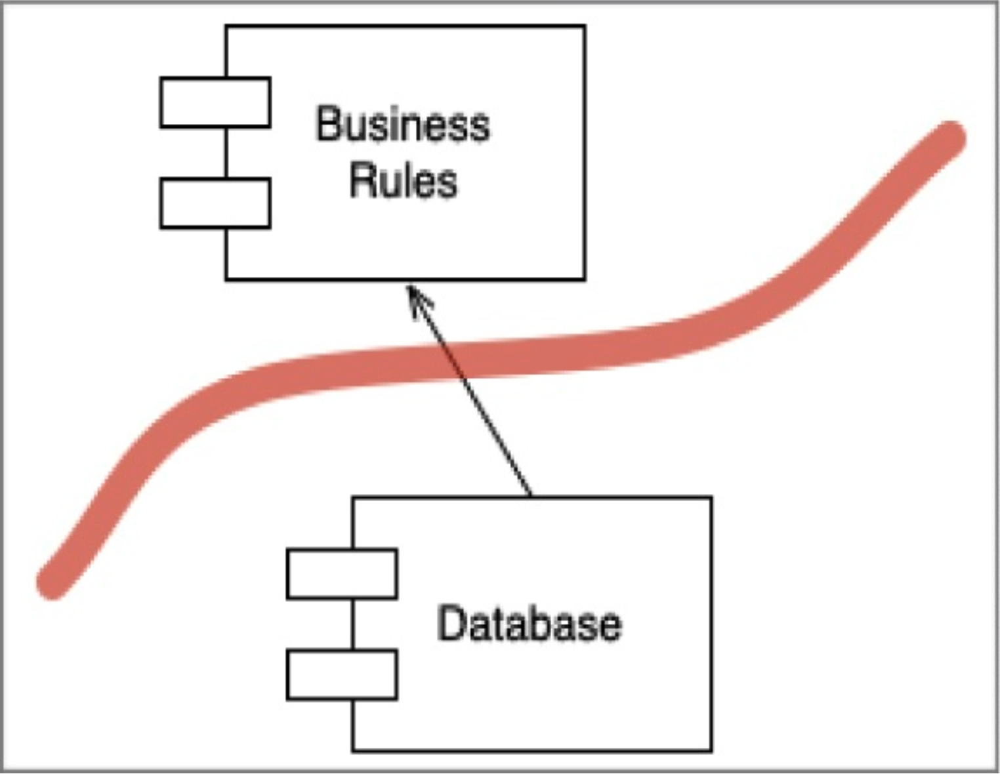

## 你画哪些线，以及何时画？

你在重要的事物和不重要的事物之间画线。
GUI 对业务规则不重要，因此它们之间应该有一条线。
数据库对 GUI 不重要，因此它们之间应该有一条线。
数据库对业务规则不重要，因此它们之间应该有一条线。

你们中的一些人可能不同意上述一个或多个说法，特别是关于业务规则不关心数据库的部分。
我们中的许多人被教导相信数据库与业务规则密不可分。
有些人甚至被说服认为数据库就是业务规则的体现。

但是，这种想法是被误导的。
数据库是业务规则可以间接使用的工具。
业务规则不需要知道 schema、查询语言或任何其他关于数据库的细节。
业务规则只需要知道存在一组可以用来获取或保存数据的函数。
这允许我们将数据库放在一个接口之后。

 

你可以在上图中清楚地看到这一点。
`BusinessRules` 使用 `DatabaseInterface` 来加载和保存数据。
`DatabaseAccess` 实现该接口并指导实际 `Database` 的操作。

此图中的类和接口是象征性的。
在一个真实的应用程序中，会有许多业务规则类、许多数据库接口类和许多数据库访问实现。
然而，所有它们都大致遵循相同的模式。

边界线在哪里？
边界画在继承/实现关系上，就在 `DatabaseInterface` 的下方，如下图所示。

 

注意离开 `DatabaseAccess` 类的两个箭头。
这两个箭头指向远离 `DatabaseAccess` 类的方向。
这意味着没有一个类知道 `DatabaseAccess` 类的存在。
那就是那条线。

现在让我们稍微退后一步。
我们将查看包含许多业务规则的组件，以及包含数据库及其所有访问类的组件。

 

注意箭头的方向。
`Database` 知道 `BusinessRules`。
`BusinessRules` 不知道 `Database`。
这意味着 `DatabaseInterface` 类位于 `BusinessRules` 组件中，而 `DatabaseAccess` 类位于 `Database` 组件中。

这条线的方向很重要。
它表明 `Database` 对 `BusinessRules` 无关紧要，但 `Database` 离开了 `BusinessRules` 就无法存在。

如果这对你来说似乎很奇怪，请记住这一点：`Database` 组件包含的代码，负责将 `BusinessRules` 发出的调用转换为数据库的查询语言。
正是这段转换代码知道 `BusinessRules` 的存在。

在两个组件之间画了这条边界线，并将箭头方向指向 `BusinessRules` 之后，我们现在可以看到：`BusinessRules` 可以使用任何类型的数据库。
`Database` 组件可以被许多不同的实现所替换 —— `BusinessRules` 不在乎。

数据库可以用 Oracle、MySQL、Couch、Datomic、甚至平面文件来实现。
业务规则根本不在乎。
这意味着数据库的决策可以被推迟，你可以专注于在不得不做出数据库决策之前，先编写和测试业务规则。
