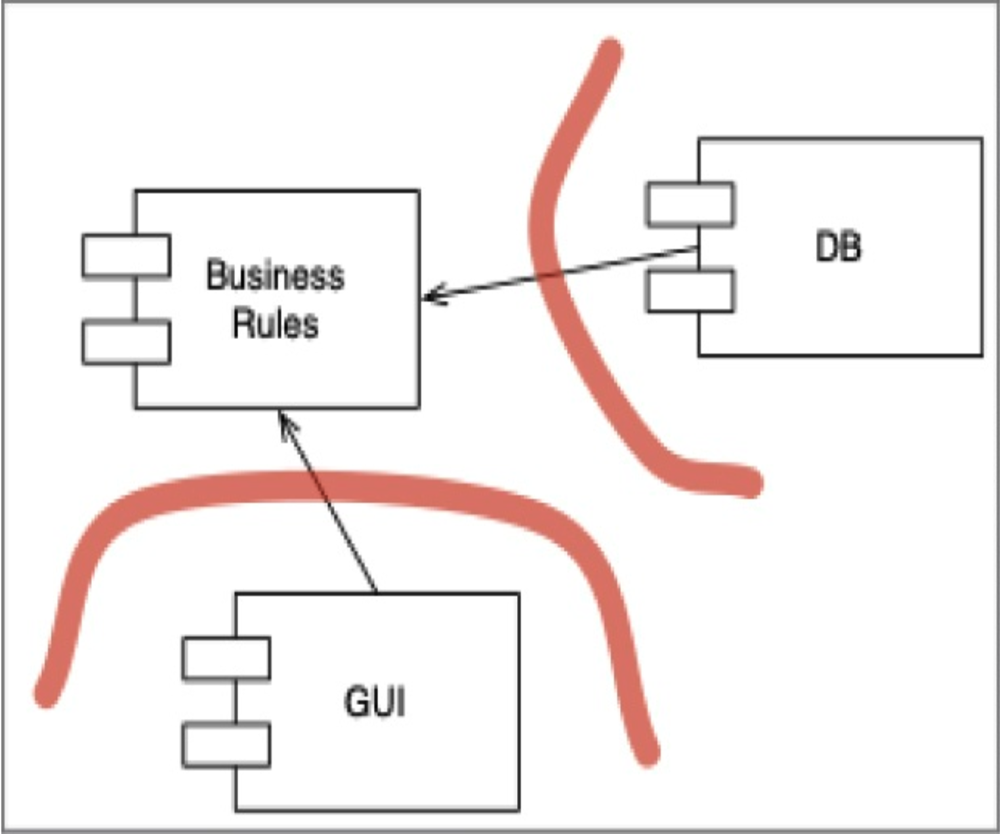

## 插件架构

看下面图中的两个边界。
它们将 `Database` 和 `GUI` 与 `BusinessRules` 分离开。
箭头从低层组件指向高层的 `BusinessRules` 组件。

 

`GUI` 和 `DB` 是 `BusinessRules` 的插件。
这种模式可以针对许多不同类型的组件重复。
核心业务规则可以与那些要么是可选的、要么可以以多种不同形式实现的组件保持分离且独立。

因此，由于此设计中的用户界面被视为一个插件，我们就有可能插入许多不同类型的用户界面。
它们可以基于 Web、基于客户端/服务器、基于 SOA、基于控制台，或基于任何其他类型的用户界面技术。

数据库也是如此。
既然我们选择将其视为一个插件，我们就可以用各种 SQL 数据库、或 NoSQL 数据库、或基于文件系统的数据库、或任何其他将来可能认为必要的数据库技术来替换它。

这些替换可能并非微不足道。
如果我们系统的初始部署是基于 Web 的，那么为客户端/服务器 UI 编写插件可能具有挑战性。
业务规则和新 UI 之间的一些通信很可能需要重新设计。
即便如此，通过从插件结构的假设开始，我们至少已经使这样的更改变得可行。
