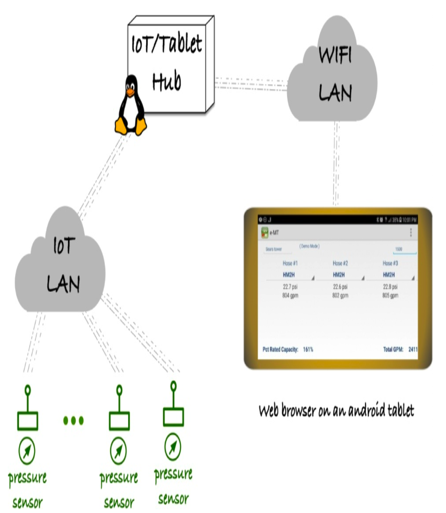
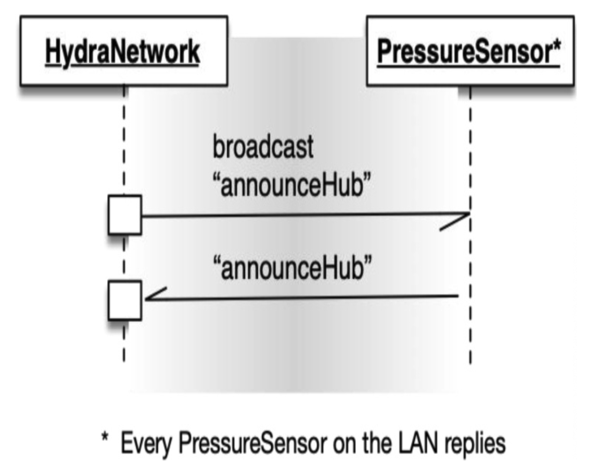
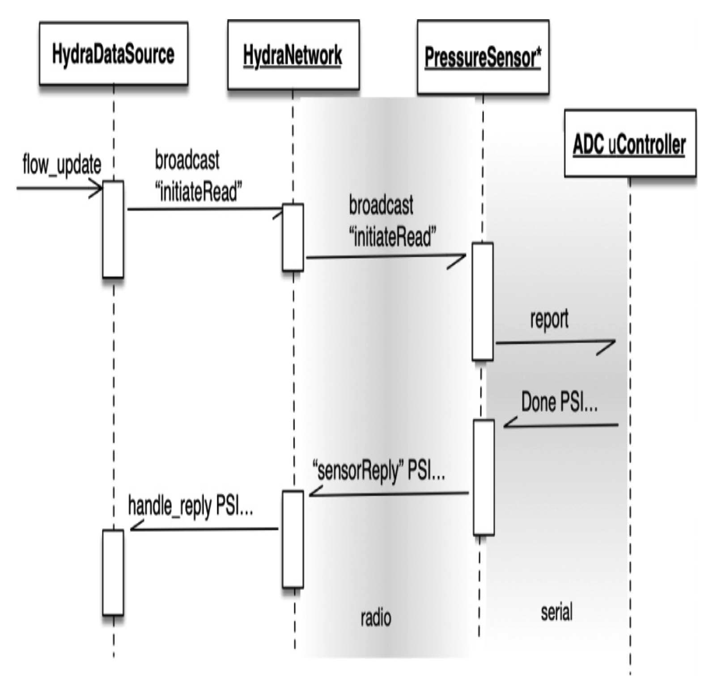

## 第三方 IoT 框架：多个边界

我的兄弟有一个想法，可以自动化他的产品用户执行的手动流程。
该产品由测试高容量水泵的技术人员使用。
水泵通过流动水并在几个喷嘴处手动测量和记录水压来进行测试。
根据喷嘴的几何形状，压力被转换为流速。

水泵永久安装在商业或工业建筑中；水流到外面，流到路边，然后流下雨水管。
水泵容量以每分钟数千加仑为单位测量。
手动测试可能需要 20 到 30 分钟，并且在此过程中浪费大量水。
通常，压力测量是在几个位置使用物理仪表进行的：在建筑内水泵旁边，以及在室外的喷嘴处，记录手动保存在剪贴板上。

这个好主意是使用可以每秒报告一次压力的电子仪表进行测量，并将读数显示在平板电脑或智能手机上。
第一个设计使用蓝牙从传感器通信到平板电脑。
它在实验室中工作得很好，但在现场总是有一堵砖墙（或更糟）挡在路上。
蓝牙无法穿透砖墙。所以我们想出了以下主意。

使用现成的物联网（IoT）基础设施，我们可以通过砖墙获得水压测量值。

<br/>

我们选择了一个物联网供应商，其基础设施允许我们用 Python 构建我们的应用程序。
他们现有的无线电系统，加上我们用 Python 编写的生产代码，将使我们可以快速开发概念验证原型。

我们开始构建原型，同时知道一旦我们进入市场，可能需要不同的供应商。
为什么我们对这个供应商有疑虑？
在原型阶段，我们并不那么关心成本。到我们进入市场时，情况可能会改变。
此外，在快速增长的物联网市场中，这个供应商可能会倒闭或被另一家物联网供应商收购。
我们希望保留我们的业务逻辑投资，因此在我们的原型中，我们需要整洁的代码、关注点分离，以及对供应商基础设施的有限依赖。

不错的是，我们的供应商提供了一个简单的 “hello world” 物联网应用程序来帮助我们入门。
他们的 “hello world” 演示允许我们在一个小型 Linux 盒子（有点像工业用的 Raspberry Pi）和将与我们的压力传感器结合的小型微控制器驱动的无线电之间发送消息。
我们可以将他们的 “hello world” 示例代码演变成一个包含对供应商基础设施所有依赖的层。

我通过艰难的方式学到了一些东西，这让我更倾向于从一个工作的系统开始，并专注于小的更改来增长功能而不破坏东西。
你知道，保持系统工作比在破坏它之后修复它更容易！
测试驱动开发（TDD）让我看到了小的、经过验证的更改的价值。

供应商有一个我们可以利用的复杂应用程序基础设施。
它有很多能力。
我们只是不需要它提供的所有东西。
我们想使用无线电进行一些简单的消息传递，而不是与供应商绑定（直到死亡将我们分开）。
因此，我们使用了供应商非常宽的接口的很小一部分。

让我们从传感器和集线器 (hub) 相互认识开始。
供应商使这非常容易。
集线器和无线电使用远程过程调用（RPC）机制进行交互。
集线器有一个完整的 Python 环境，而无线电仅限于 MicroPython。

该项目代号为 Hydra，以多头怪物命名。
`HydraNetwork` 类封装了集线器中对 IoT 供应商的所有依赖。
这些函数复杂度低，并委托给通信基础设施。

从开始，初始化，集线器向所有监听的无线电宣布自己，然后轮询框架以获取回复。

```python
# In the hub
class HydraNetwork:
    …
    def announceHub(self):
        self.broadcast('announceHub', '')
        self.poll_a_second()
```

通过基础设施 RPC 机制的魔力，`announceHub()` 函数在无线电中被调用。
无线电记住集线器的地址，并向集线器发送确认。

```python
# In the radio
def announceHub():
    global hub_addr
    hub_addr = rpcSourceAddr()
    info = nodeIdentity()
    sendAck(hub_addr, 'announceHub', info)
```

这个序列图显示了 `HydraNetwork` 集线器与其在 IoT LAN 上的 `PressureSensor` 之间的异步通信。

<br/>

现在，回到集线器，基础设施 RPC 工具调用集线器的 `HydraNetwork.processAck()` 函数。

```python
# In the hub
class HydraNetwork:
    …
    def processAck(self, command, payload):
        sensor_id = self.source_addr()
        self.ack_handler.handle_reply(sensor_id, command, payload)
```

`ack_handler` 是一个注入的依赖，恰好是 `HydraDataSource` 的一个实例。
`handle_reply()` 方法将接收到的记账信息和有效载荷传递给 Hydra 系统的其他部分。
事实证明，对于来自无线电的 `'announceHub'` ACK，没有什么可做的。

当调用 `HydraDataSource` 的 `flow_update()` 方法时，它会发起一个网络 PSI ¹ 读取。
`flow_update()` 方法在流量测试期间每秒被调用一次。
每次更新都有一个 `sync_token`，以便异步测量回复可以按秒分组。
当新的一秒开始时，前一秒的报告被保存。
稍后会详细介绍。

¹ 例如，[PPP02](../bib.md#ppp02) ，http://www.butunclebob.com/ArticleS.UncleBob.PrinciplesOfOod ，以及 https://en.wikipedia.org/wiki/SOLID_(object-oriented_design) （或直接搜索“SOLID”）。

```python
# In the hub
class HydraDataSource:
    …
    def flow_update(self):
        self.sync_token.next()
        self.network.broadcast(
            'initiateRead',
            self.sync_token.value())
        self.report = self.reply_dispatcher.report()
```

当 `'initiateRead'` 被广播到传感器网络时，每个无线电异步回复。
再次，通过 IoT 框架，`initiateRead()` 在 `PressureSensor` 模块中被调用。

首先，`initiateRead()` 以 ACK 响应，然后调用 `reportMeasurement(sync_token)` 以获取最新的 PSI 值。

我忘了告诉你另一个边界。
有一个独立的微控制器负责读取模数转换器（ADC）并进行所需的数学计算。
对 `reportMeasurement()` 的调用写入一个串行连接，向 ADC 微控制器请求下一次测量。

<br/>

```python
# In the radio
def initiateRead(sync_token):
    global hub_addr
    hub_addr = rpcSourceAddr()
    sendAck(hub_addr, 'initiateRead', sync_token)
    reportMeasurement(sync_token)

def reportMeasurement(sync_token):
    print 'RA ' + sync_token

@setHook(HOOK_STDIN)
def measurementDone(reply):
    stdin_info = getInfo(STDIN_INFO)
    if stdin_info != STDIN_RECEIVED:
        reply = 'Error: Invalid STDIN_INFO'+
            str(stdin_info)
    sendAck(hub_addr,'SensorReply',reply[:MAX_SIZE])
```

获取新的 ADC 值并将其转换为 PSI 需要一点时间。
当测量准备好时，ADC 微控制器通过串行连接发送回一个 CSV 字符串。
`HOOK_STDIN` 通知 `measurementDone()`，提供一个回复。
如果没有串行通信错误，回复包括 `sync_token` 和传感器配置。
该回复作为 `SensorReply` ACK 发送到集线器。

与此同时，回到集线器，集线器正在收集 ACK 消息。
ACK 消息被发送到 `handle_reply()`。
一个 `'SensorReply'` ACK 被交给 `reply_dispatcher.sensor_update()`。
`reply_dispatcher` 知道消息格式，以及一旦解析后发送到哪里。
有效载荷是一组简单的 CSV。
`reply_dispatcher` 及其协作者是测试驱动的，并且没有 IoT 依赖。

```python
class HydraDataSource:
    …
    def handle_reply(self, sensor_id,
                     command, payload):
        sync_token = self.sync_token.value
        if command == 'SensorReply':
            result = self.reply_dispatcher.
                sensor_update(sensor_id,
                              sync_token,
                              payload)
```

因为 `HydraNetwork` 封装了所有 IoT 框架依赖，我们可以替换不同供应商的 IoT 基础设施。
