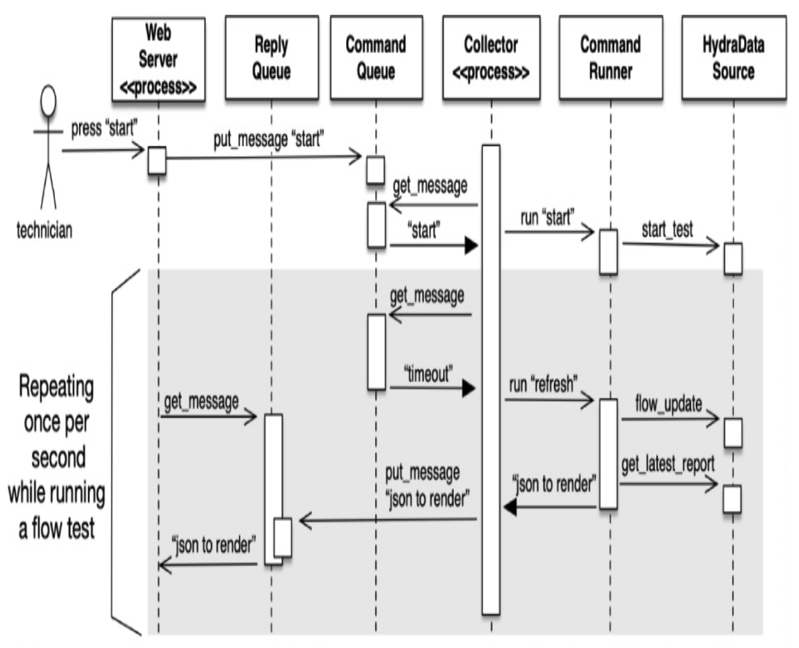
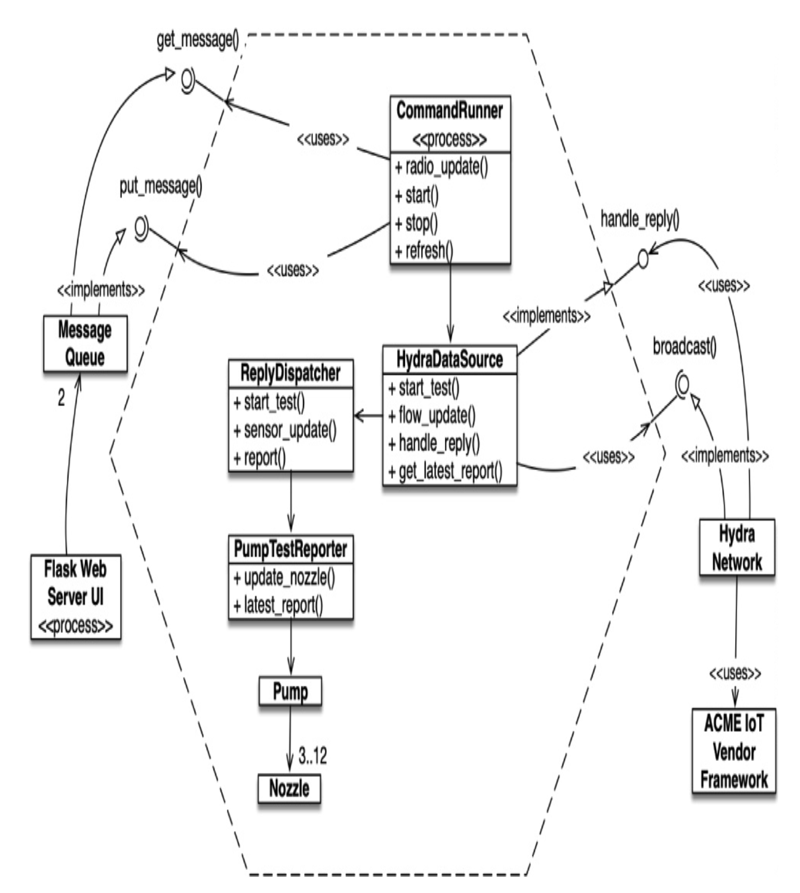

## UI / 应用边界

接下来，让我们看看 UI / 应用边界。
系统的用户界面是平板电脑或智能手机上的 Web 浏览器。
我们使用了流行的 Python/Flask Web 服务器框架。
应用程序作为两个进程在一个小型 Linux 盒子上运行。

`Collector` 进程从 `HydraNetwork` 收集测量值。
`WebServer` 进程在主线程中运行定制的 Flask Web 服务器。
用户有按钮来启动和停止流量测试，这些命令通过 `CommandQueue` 到达 `Collector`。
一旦收集到一组同步的测量值，测量更新就会异步地发送到 `ReplyQueue`。

<br/>

`Collector` 进程的入口点是 `measurement_loop()` 函数，它等待 `CommandQueue` 并设置一秒超时。
每次超时都会启动测量数据的刷新/流量更新，一直向下到 ADC 微控制器（未在此图中显示）。

```python
# Collector process entry function
def measurement_loop(command_q, reply_q,
                     command_runner, update_interval):
    command = None
    while command != HYDRA_EXIT:
        command = get_message(command_q, update_interval)
        if command == None:
            Command = HYDRA_REFRESH
        reply = command_runner.run(command)
        put_message(reply_q, reply)
```

还有许多应用程序对象未显示，但它们不在边界处。
我们很快会看到一个更大的图景。

让我们快速看一下 `hydra_run()`。
这个函数是从 `main()` 中调用的，并注入了它的 `data_source`。
在生产环境中，会注入一个带有 `HydraNetwork` 的 `HydraDataSource`。
在开发和测试期间，我们有一个模拟数据源，不需要网络。

`hydra_run()` 函数启动所有流程，并从 `main()` 中调用。
以下代码启动 `Collector` 进程，在主执行线程中运行 Web 服务器。

```python
def hydra_run(port, data_source, polling_rate,
              logger):
    logger.info("Hydra start")
    command_runner = CommandRunner(data_source,
                                   logger)
    collector = Process(
        target=measurement_loop,
        args=(command_q, reply_q,
              command_runner, polling_rate))
    collector.start()
    sleep(1)
    logger.info("Hydra collector started")
    run_hydra_web_server(port, command_q, reply_q)
    logger.info("Hydra web server exited")
    command_q.put(HYDRA_EXIT)
    collector.join()
    logger.info("Hydra shut down")
```

这有点混乱，因为所有依赖关系都汇聚在这里。
积极的一面是，代码并不复杂，而且可能不会有太多变化。

让我们回顾一下我们整洁边界的一些重要属性。

**关于 IoT 隔离** ：
- 业务逻辑不需要知道无线电系统的知识。
- 依赖于 IoT 的函数复杂度低。
- 依赖于 IoT 的函数不太可能频繁或大幅更改。

**关于 UI 隔离** ：
- 业务逻辑与 UI 分离。
- 应用程序与 Web 服务器之间的通信依赖于一个简单的队列机制。

**关于并发** ：
- 任何业务逻辑都不关心并发。
- 并发机制位于低复杂度的函数中，变更风险低。

**关于对象创建和绑定** ：
- 对象创建与对象使用分离。
- 在初始化期间，具体对象被创建并绑定到进程和彼此之间。
- 绑定基于按需知悉的原则。

### SOLID 与六边形架构

我们已经看了一些小的部分；现在让我们来看一个更大的图景，以及设计中类之间的关系。
遵循 SOLID 原则并隔离外部世界的依赖，自然会导致 Alistair Cockburn 所称的 *六边形架构 (Hexagonal architecture)* ²（又名端口与适配器）。

² [Hex]。

在六边形内部是所有产品的逻辑和行为。
而不是内部是一团泥球 (big ball of mud)，职责被分配到单独的类、函数和领域对象中。
在六边形外部是执行环境。
应用程序依赖于服务抽象层和六边形的边缘。

有两个 `MessageQueue` 实例：`CommandQueue` 和 `ReplyQueue`。
UI 通过 `CommandQueue` 驱动系统。
用户通过 Web 页面上的按钮启动测试，该按钮将 “start” 命令写入 `CommandQueue`。
`start` 命令一路工作到开始收集测量的传感器。
`CommandRunner` 对新的 UI 命令进行定时等待。
每个一秒的超时导致 `CommandRunner` 从传感器启动新的更新。
前一秒的传感器读数被打包成一个报告，发送到 `ReplyQueue`。
下图显示了该消息如何启动流量测试。

我们在前面的代码片段中也看到了 `measurement_loop()` 中 `CommandRunner` 与队列的连接。

<br/>

`HydraNetwork` 封装了对 ACME IoT 供应商框架的依赖。
`HydraNetwork.broadcast()` 告诉网络中的所有传感器报告它们的最新测量值。
当接收到各个无线电回复时，`HydraNetwork` 调用 `handle_reply()`，将最新的 `PressureSensor` 消息馈送到 Hydra 应用程序中。
Hydra 对 ACME IoT 一无所知。

`broadcast()` 和 `handle_reply()` 的接口更多地与应用程序想要从 ACME IoT 获得什么有关，而不是 ACME IoT 提供了什么。
`HydraDataSource` 知道它有一个传感器网络，但只需要它广播更新需求并接收更新。
重要的是，六边形边界上的接口是关于 Hydra 应用程序的需求，而不是关于 ACME 的提供。
ACME IoT 具有非常接近我们需求的设施，因此适配器非常薄且复杂度低。

随着我们的产品或 IoT 供应商产品的发展，我们可能想要更换供应商。
如果到了我们需要替换 ACME IoT 或支持多个供应商的时候，`HydraNetwork` 类将不得不演变。

想象一下，某个新的 IoT 供应商 BrandX，可以提供显著的成本节约。
不幸的是，BrandX 不像 ACME 那样内置广播功能。
相反，每个无线电都必须单独寻址。
BrandX 的 `HydraNetwork` 实现可以实现 `broadcast()`，但它需要知道每个传感器的连接才能这样做。
那一层可能会变得不平凡，但我们可以在不触及 Hydra 核心应用程序风险的情况下更换供应商。

### 探索和学习边界

第三方代码帮助我们在更短的时间内交付更多功能。
当我们想要利用某个第三方包时，我们应该从哪里开始？
测试第三方代码不是我们的工作，但为我们使用的第三方代码编写测试可能符合我们的最佳利益。

假设如何使用我们的第三方库并不清楚。
我们可能会花一两天（或更多）时间阅读文档并决定如何使用它。
然后，我们可能会编写我们的代码来使用第三方代码，看看它是否做了我们认为它应该做的事情。
如果我们发现自己陷入长时间的调试会话中，试图弄清楚我们遇到的错误是在我们的代码中还是他们的代码中，我们不会感到惊讶。

学习第三方代码很难。
集成第三方代码也很难。
同时做这两件事更难。

如果我们采用不同的方法呢？
我们可以在生产代码中实验和尝试新东西，而不是编写一些测试来探索我们对第三方代码的理解。
Jim Newkirk 称这样的测试为 *学习测试 (learning tests)* 。³

³ [BeckTDD](../bib.md$becktdd) ，第 136-137 页。

在学习测试中，我们按照我们在应用程序中预期使用的方式调用第三方 API。
我们本质上是进行受控实验，以检查我们对那个 API 的理解。
测试关注我们想要从 API 中获得什么。

由于我以前没有在 Python 中做过并发编程，我认为在使用并发和通信机制之前先学习它们是如何工作的会是一个好主意。
我可以简单地阅读文档并将它们的使用集成到我的生产代码中，或者我可以在测试用例的舒适环境中进行实验和学习。

查看文档后，我决定测试驱动两个函数 `put_message()` 和 `get_message()`，它们从队列中放入和获取消息。
以下测试帮助我确信我理解了 Python 的 `Queue` 是如何工作的。

```python
class QueueTest(unittest.TestCase):
    def test_get_message_returns_message(self):
        q = Queue(maxsize=1)
        self.assertTrue(put_message(q, 'hey'))
        self.assertEqual('hey', get_message(q, 1.0))

    def test_get_message_None_when_timeout(self):
        q = Queue(maxsize=1)
        self.assertEqual(None, get_message(q, 0.01))

    def test_get_message_None_empty_no_wait(self):
        q = Queue(maxsize=1)
        self.assertEqual(None, get_message(q, 0.0))

    def test_put_message_True_for_success(self):
        q = Queue(maxsize=1)
        self.assertTrue(put_message(q, 'hey'))
        self.assertEqual('hey', get_message(q, 1.0))

    def test_put_message_False_when_full(self):
        q = Queue(maxsize=1)
        self.assertTrue(put_message(q, 'hey1'))
        self.assertFalse(put_message(q, 'hey2'))
        self.assertEqual('hey1', get_message(q, 1.0))
```

既然我们知道 `Queue` 函数是如何工作的，让我们使用它们与一个 `Process` 通信。
首先，我们定义一个函数 `worker()`，它将在单独的 `Process` 上执行。
它从 `in_q` 获取消息，将消息放入 `out_q`，然后退出。
当时，我们期望使用这种方法将 Hydra 核心与 `WebServer` 分开。

```python
def worker(in_q, out_q):
    message = get_message(in_q, 0.05)
    if message:
        put_message(out_q, message)

class ProcessLearningTest(unittest.TestCase):
    def setUp(self):
        self.command_q = Queue(maxsize=1)
        self.reply_q = Queue(maxsize=1)
        self.process = Process(target=worker,
                               args=(self.command_q,
                                     self.reply_q,))
        self.process.daemon = True

    def test_thread_q_message_echos(self):
        put_message(self.command_q, 'Do this')
        self.process.start()
        reply = self.reply_q.get(True, 0.1)
        self.process.join()
        self.assertEqual('Do this', reply)

    def test_thread_message_timeout(self):
        self.process.start()
        reply = get_message(self.reply_q, 0.1)
        self.process.join()
        self.assertEqual(None, reply)
```

这些学习测试几乎没有成本。
无论如何，我们都必须学习机制，编写这些测试是获得这种知识的一种简单且隔离的方式。
学习测试是精确的实验，帮助提高了我们的理解。

学习测试不仅免费，而且有正的投资回报。
当第三方包有新版本发布时，我们运行学习测试以查看是否存在行为差异。

学习测试验证了我们正在使用的第三方包按照我们期望的方式工作。
一旦集成，无法保证第三方代码将保持与我们的需求兼容。
原始作者将有压力改变他们的代码以满足他们自己的新需求。
他们将修复错误并添加新功能。
每个新版本都带来新的风险。
如果第三方包以某种与我们的测试不兼容的方式改变，我们将立即发现。

在这种情况下，谁期望 Python 会改变？
所以，没有未来的回报。
嗯，实际上，Python 确实改变了。
在将 Hydra 代码从 Python 2 转换到 Python 3 时，打包发生了变化；需要进行一些编辑来编译和运行测试。
好的是，我们的学习测试向我们展示了行为被保留。

无论你是否需要学习测试提供的学习，一个整洁的边界都应该由一组边界测试来支持，这些测试以与生产代码相同的方式锻炼接口。
如果没有这些边界测试来简化迁移，我们可能会倾向于比我们应该的更长地停留在旧版本上。

### 使用尚不存在的代码

还有另一种边界，一种分隔已知与未知的边界。
在代码中，经常有我们的知识似乎消失的地方。
有时边界另一边的东西是不可知的（至少现在是这样）。
有时我们选择只看边界而不看更远。

几年前，我是一个为无线电通信系统开发软件的团队的一员。
有一个子系统，“发射机”，我们几乎不了解它，负责该子系统的人还没有达到定义他们接口的程度。
我们不想被阻塞，所以我们从远离代码未知部分的地方开始工作。

我们对我们的世界结束和新世界开始的地方有一个相当好的想法。
在我们工作时，我们有时会碰到这个边界。
尽管无知的迷雾和云层遮挡了我们超越边界的视野，但我们的工作使我们意识到我们想要边界接口是什么。
我们想要告诉发射机类似这样的事情：

> 在提供的频率上键控发射机，并发射来自此数据流的模拟表示。

我们不知道这将如何完成，因为硬件和 API 还没有被设计出来。
所以我们稍后必须解决细节问题。

为了不被阻塞，我们为我们自己的不存在的硬件定义了接口。
我们给它起了一个朗朗上口的名字，比如 `Transmitter`。
我们给它一个名为 `transmit` 的方法，它接受一个频率和一个数据流。
这是我们希望拥有的接口。

编写接口的一个好处是它在我们的控制之下。
这有助于保持客户端代码更可读，并专注于它试图完成的任务。
在边界的客户端一侧，我们不受许多实现细节的负担。
如果我们有一个硬件抽象层（HAL），我们可能已经开始依赖它了。
从应用程序的角度来看，HAL 通常不是那么抽象。
不知道 HAL，我们没有办法依赖它。
这不是一个负担，现在它反而是一个优势。

在下图中，你可以看到我们将 `CommunicationsController` 类与发射机 API（它不在我们的控制之下，并且目前未定义）隔离开来。
通过使用我们自己的应用特定接口，我们保持了 `CommunicationsController` 代码的整洁和富有表现力。

一旦发射机 API 被定义，我们编写了 `TransmitterAdapter` 来弥合差距。
适配器 ⁴ 封装了与 API 的交互，并在 API 演变时提供了一个单一的地方进行更改。

⁴ 参见 [GOF95](../bib.md#gof95) 中的适配器模式。
