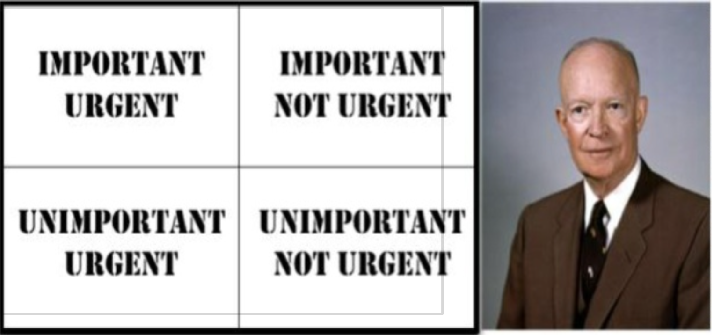

## 让它正确

正如我们在上一章中看到的，软件有两种价值。
有它行为价值，也有它结构价值。
在上一章中，我还指出结构价值比行为价值更重要。
这是因为，为了具有任何长期价值，软件系统必须能够响应需求的变化。

具有使其难以改变结构的软件，使得该软件更难保持与需求同步。
结构糟糕的软件很快就会过时。

因此，为了跟上需求，软件的结构必须足够整洁，以允许甚至鼓励变化。
易于改变的软件可以跟上不断变化的需求，使其能够以最小的努力保持价值。
但如果你有一个难以改变的软件系统，那么当需求变化时，你将很难保持该系统工作。

需求什么时候最可能改变？
需求在项目开始时最不稳定；就在用户看到最初几个功能工作之后。
那是因为他们第一次看到系统实际做什么，而不是他们认为它会做什么。

这意味着，如果早期开发要快速进行，系统的结构需要在最开始就保持整洁。
如果你一开始就制造混乱，那么即使是最初的发布也会被那个混乱拖慢。

好的结构支持好的行为，坏的结构阻碍好的行为。
结构越好，行为越好。
结构越差，行为越差。
行为价值关键取决于结构。
因此，结构价值是这两种价值中更关键的。

这意味着专业开发人员更优先考虑代码的结构而不是行为。

是的，首先你让它工作；但随后，你要确保你继续让它正确。
你在项目的整个生命周期中尽可能保持系统结构整洁。
从开始到结束，它必须保持整洁。

### 什么是好的结构？

好的结构使系统易于测试、易于改变和易于复用。
代码一部分的更改不会破坏代码的其他部分。
一个模块的更改不会强制大规模的重新编译和重新部署。
高层策略保持与低层细节分离且独立。

糟糕的结构使系统变得僵化、脆弱和不可移动。
这些是传统的设计坏味。

**僵化** 是指对系统相对较小的更改导致系统的大部分被重新编译、重新构建和重新部署。
当一个更改的集成工作远大于更改本身时，系统就是僵化的。

**脆弱** 是指对系统行为的小更改迫使大量模块中许多相应的更改。
这造成了高风险，即行为的小更改会悄无声息地破坏系统中的其他一些行为，然后这些行为被无意中部署。
当这种情况发生时，管理者和客户会开始相信团队已经失去了对软件的控制，并且不知道他们在做什么。

**不可移动** 是指现有系统中的一个模块包含你想要在新系统中使用的行为，但它与现有系统纠缠得太紧，以至于你无法提取它用于新系统。

这些问题都是结构问题，而不是行为问题。
系统可能通过了所有测试并满足了所有功能需求。
然而，这样的系统可能几乎毫无价值，因为它太难操作了。

具有讽刺意味的是，许多正确实现了价值行为的系统最终结构如此糟糕，以至于否定了那种价值并变得毫无价值。

“毫无价值” 这个词并不夸张。
在 [第 1 章](../ch1/0.md) 中，我告诉了你 “天空中的大重构” 的故事。
这是当开发人员告诉管理层，取得进展的唯一方法是从头开始重新设计整个系统时；那些开发人员已经评估当前系统是毫无价值的。

当管理者同意让开发人员重新设计系统时，这只是意味着他们已经同意开发人员的评估，即当前系统是毫无价值的。

是什么导致了这些导致系统毫无价值的设计坏味？
源代码和数据依赖关系！
我们如何修复那些依赖关系？
依赖管理！

我们如何管理依赖关系？
我们使用设计原则，如 SOLID ¹ 原则，来保持我们系统的结构免受会使它毫无价值的设计坏味的影响。

¹ 这些原则在 [Clean Arch](../bib.md#clean-arch) 和 [PPP02](../bib.md#ppp02) 中有描述。

既然结构价值大于行为价值，既然结构价值依赖于良好的依赖管理，既然良好的依赖管理源于良好的原则，那么系统的整体价值取决于对这些原则的正确应用。

### **艾森豪威尔矩阵**

德怀特·D·艾森豪威尔将军曾经说过：“我有两种问题，紧急的和重要的。紧急的并不重要，重要的从不紧急。”

这句话有一个深刻的真理。
一个关于工程的深刻真理。
我们甚至可以称其为 “工程师的座右铭”：

> 越紧急，越无关紧要。

以下是艾森豪威尔的决策矩阵。
紧急程度在纵轴上，重要性在横轴上。
四种可能的情况是：紧急且重要、紧急且不重要、重要但不紧急、既不重要也不紧急。

 

紧急是关于时间的。
重要则不是。
重要的事情是长期的。
紧急的事情是短期的。
结构是长期的；因此，它是重要的。
行为是短期的；因此，它仅仅是紧急的。

所以结构，即重要的事情，是第一位的。
行为是次要的。

你的老板可能不同意这个优先级；但那是因为担心结构不是老板的工作。
那是你的。
你的老板只是期望你在实现紧急行为的同时保持结构整洁。

这似乎违反了贝克定律：“首先，让它工作。然后，让它正确。”
现在我说结构比行为优先级更高。
这是一个先有鸡还是先有蛋的困境，不是吗？

我们先让它工作的原因是因为结构必须支持行为；所以我们先实现行为，然后我们给它正确的结构。
但结构比行为更重要。
我们给它更高的优先级。
我们在处理行为问题之前处理结构问题。

我们可以通过将问题分解成微小的单元来解决这个难题。
让我们从用户故事开始。
你让一个故事工作；然后你让它的结构正确。
在该结构正确之前，你不处理下一个故事。
当前故事的结构比下一个故事的行为优先级更高。

除了故事太大了。
我们需要更小。
不是故事……是测试。
测试是完美的尺寸。

首先你让一个测试通过，然后你修复通过该测试的代码的结构，然后你再让下一个测试通过。

整个讨论一直是良好测试准则（如测试驱动开发，TDD）的红-绿-重构循环的道德基础。

正是那个循环帮助我们防止对行为的伤害和对结构的伤害。
正是那个循环允许我们将结构优先于行为。
这就是为什么我们认为我们的测试准则是一种设计技术，而不是一种测试技术。
