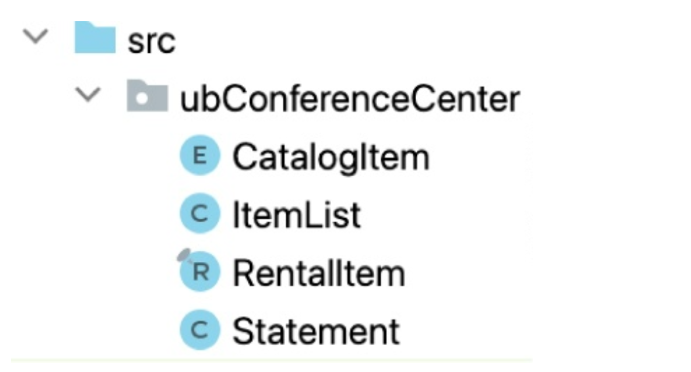
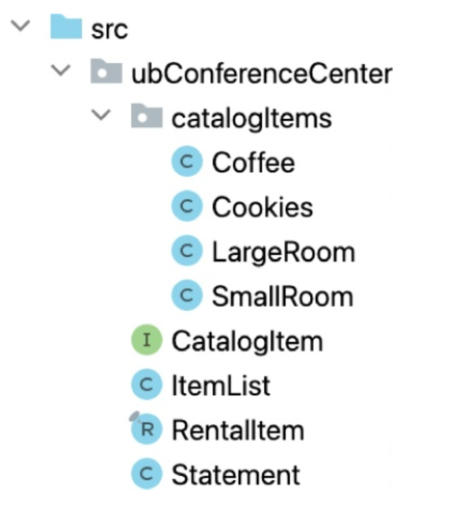
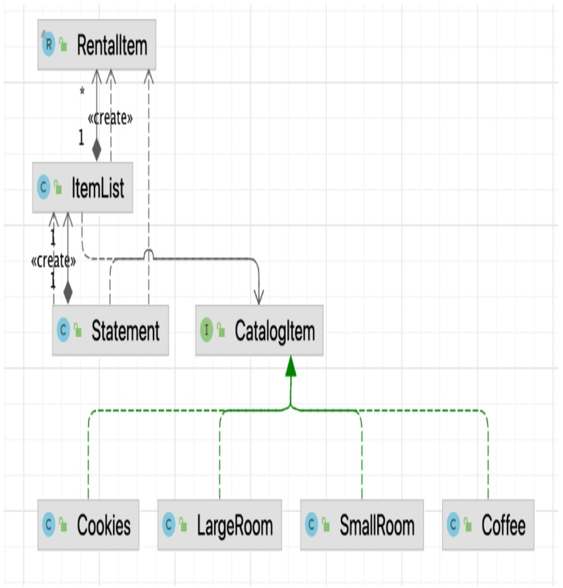
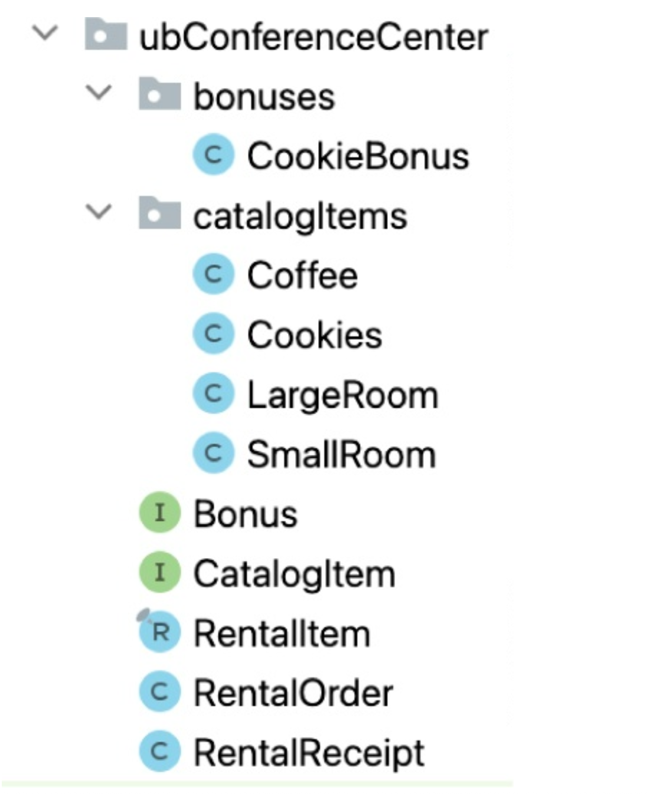
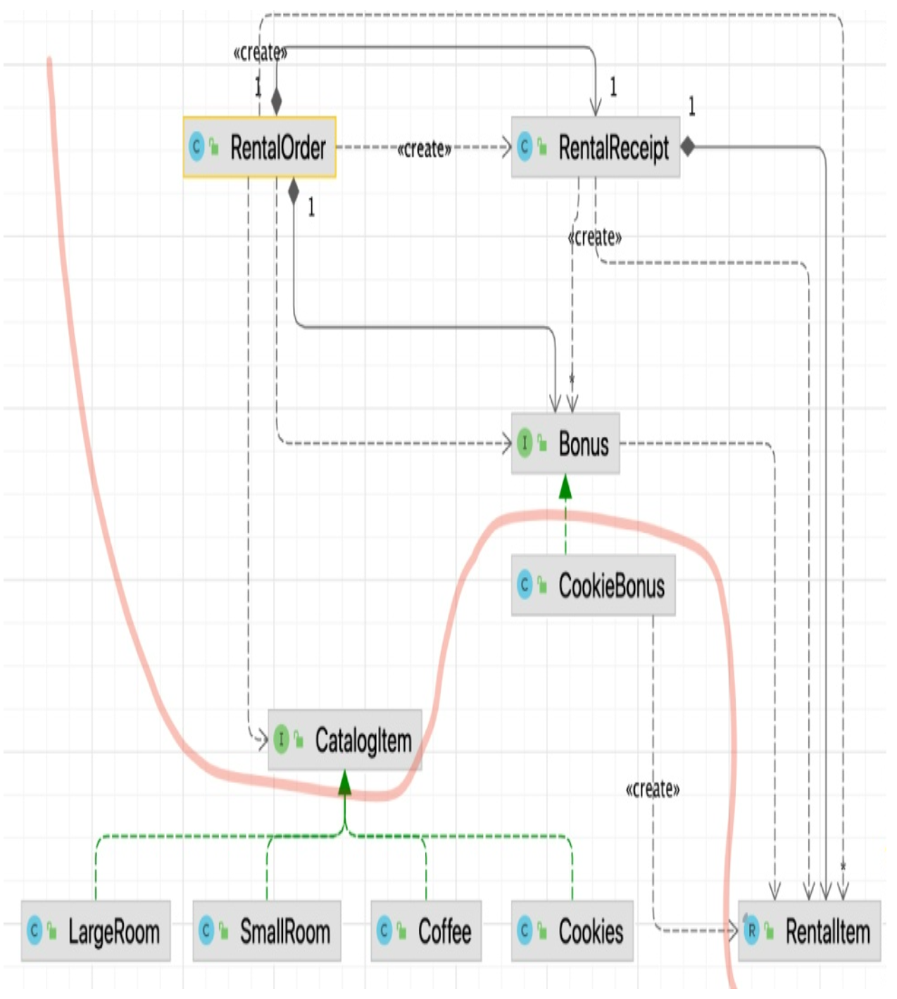

## 一个更重要的示例

这里我展示 Uncle Bob 会议室系统。
快速浏览一下。
它并不复杂 —— 大概吧。

———Statement.java———

```java
package ubConferenceCenter;

import java.util.ArrayList;
import java.util.List;

public class Statement {
    public enum CatalogItem {
        SMALL_ROOM, LARGE_ROOM,
        PROJECTOR, COFFEE, COOKIES
    }

    public record RentalItem(
            CatalogItem type,
            int days,
            int unitPrice,
            int price,
            int tax
    ) {
    }

    public record Totals(int subtotal, int tax) {
    }

    private String customerName;
    private int subtotal = 0;
    private int tax = 0;
    private List<RentalItem> items = new ArrayList<>();

    public Statement(String customerName) {
        this.customerName = customerName;
    }

    public void rent(CatalogItem item, int days) {
        int unitPrice = switch (item) {
            case SMALL_ROOM -> 100;
            case LARGE_ROOM -> 150;
            case PROJECTOR -> 50;
            case COFFEE -> 10;
            case COOKIES -> 15;
        };

        boolean eligibleForDiscount = switch (item) {
            case SMALL_ROOM, LARGE_ROOM -> days == 5;
            case PROJECTOR, COFFEE, COOKIES -> false;
        };

        int price = unitPrice * days;
        if (eligibleForDiscount) {
            price = (int) Math.round(price * .9);
        }
        subtotal += price;

        int thisTax = switch (item) {
            case SMALL_ROOM, LARGE_ROOM, PROJECTOR ->
                    (int) Math.round(price * .05);
            case COFFEE, COOKIES -> 0;
        };
        tax += thisTax;

        items.add(new RentalItem(item, days, unitPrice, price, thisTax));
    }

    public RentalItem[] getItems() {
        List<RentalItem> items = new ArrayList<>(this.items);
        boolean largeRoomFiveDays = items.stream().anyMatch(
                item -> item.type() == CatalogItem.LARGE_ROOM && item.days() == 5);
        boolean coffeeFiveDays = items.stream().anyMatch(
                item -> item.type() == CatalogItem.COFFEE && item.days() == 5);

        if (largeRoomFiveDays && coffeeFiveDays) {
            items.add(new RentalItem(CatalogItem.COOKIES, 5, 0, 0, 0));
        }
        return items.toArray(new RentalItem[0]);
    }

    public String getCustomerName() {
        return customerName;
    }

    public Totals getTotals() {
        return new Totals(subtotal, tax);
    }
}
```

我确信你明白了。
用户可以租用小房间、大房间、咖啡、投影仪和饼干。
（饼干怎么租？）小房间每天 100 美元。
大房间每天 150 美元。
如果你整周租用一个房间，可以享受 10% 的折扣。
所有非食品项目需缴纳 5%（向上取整）的税费。
咖啡每天 10 美元。饼干每天 15 美元。投影仪每天 50 美元。
而且，如果你整周租用大房间和咖啡，可以获得一天的免费饼干。

`Statement` 类代表一个销售清单，包括每项租赁物品、物品价格、租赁天数、小计和税费。
`Statement` 还包含所有物品的小计总和以及所有税费的总和。

简单吧。

这不太难理解，但你可以看出它是拼凑起来的。
它有点凌乱，但并不糟糕。
我们也许可以把它清理一下，但那值得花功夫吗？

但让我问你。
你是否见过一个系统开始时很简单，然后变得越来越复杂？
如果你在这个行业工作了一年左右，我知道你见过。
事实上，如果你在这个行业工作了五年或更久，你很可能见过一个系统开始时有点凌乱，但后来变得一团糟，对开发人员和组织来说变成了人间地狱。

所以让我们把这个例子变得更真实一些。
你不会认为这个程序是以目前的形式开始的吧？
不，起初它只是租用一个小房间。
然后，许多小房间。然后，不同单价的大房间。
然后，咖啡，没有销售税。
然后，增加了整周折扣。
然后是饼干，以及整周租用大房间的优惠。

换句话说，这个程序成长了。

让我们假设我们刚刚从一次全员会议回来，CEO 在会上给我们做了一份关于公司如何扩张的振奋人心的报告。
有新的市场、新的州、需要应对的新法律。
将有新的折扣和新的促销活动，以及新的税收法规。
这对业务来说是好事；但你看一下这个小型的 `rent` 函数，你会想……它将继续增长，不是吗？
随着它的增长，它会变得更加混乱和令人困惑。
它会像一块腐烂的肉一样退化。

所以让我们阻止这种情况发生。
让我们想出一种方法来领先于即将到来的业务增长，并让这个函数在增长的同时不会从内部腐烂。
让我们先把它整理好。³

³ [Tidy](../bib.md#tidy) 。

回顾一下 `rent` 函数，问问自己你不喜欢它什么。
就我个人而言，我认为它有点大且杂乱无章。
它做了几件事，我可以把它们拆分成只做一件事的函数。

所以首先，让我们使用提取方法的重构来创建只做一件事的函数，并把相关的东西聚集在一起，把不同的东西分离开。⁴

*「译注：extract method refactoring：把一段能独立描述其意图的代码块，从当前函数中提取出来，放到一个以该意图命名的新函数中，然后在原位置调用它。」*

⁴ 单一职责原则。

———Statement.java———

```java
public void rent(CatalogItem item, int days) {
    int unitPrice = getUnitPrice(item);
    int price = calculatePrice(item, days, unitPrice);
    int thisTax = getTax(item, price);
    items.add(new RentalItem(item, days, unitPrice, price, thisTax));
    subtotal += price;
    tax += thisTax;
}

private int getUnitPrice(CatalogItem item) {
    return switch (item) {
        case SMALL_ROOM -> 100;
        case LARGE_ROOM -> 150;
        case PROJECTOR -> 50;
        case COFFEE -> 10;
        case COOKIES -> 15;
    };
}

private int calculatePrice(CatalogItem item, int days, int unitPrice) {
    boolean eligibleForDiscount = isEligibleForDiscount(item, days);
    int price = unitPrice * days;
    if (eligibleForDiscount) {
        price = (int) Math.round(price * .9);
    }
    return price;
}

private boolean isEligibleForDiscount(CatalogItem item, int days) {
    return switch (item) {
        case SMALL_ROOM, LARGE_ROOM -> days == 5;
        case PROJECTOR, COFFEE, COOKIES -> false;
    };
}

private int getTax(CatalogItem item, int price) {
    return switch (item) {
        case SMALL_ROOM, LARGE_ROOM, PROJECTOR ->
                (int) Math.round(price * .05);
        case COFFEE, COOKIES -> 0;
    };
}
```

> **Future Bob**：在上一章中对 `fromRoman` 模块使用了 Grok3 之后，我想在这里也做同样的事情。
所以我告诉 Grok3 改进我的初始实现。
它的解决方案与我的几乎相同，这并不特别令人惊讶。

<ins>也许你看到这个，认为它代码更多。
但它不是更多的可执行代码；它只是更多的名称和更多的结构。
那额外的结构为增长留出了空间</ins>。
例如，如果税收规则变得更加复杂，增长的不会是 `rent` 函数；
相反，很可能是 `getTax` 函数会增长。

<ins>这是 *单一职责原则 (SRP)* ⁵ 的一个实例。
我们系统中那些最关心税收的利益相关者，很可能是唯一会要求更改 `getTax` 函数的人，
而对折扣感兴趣的利益相关者，则很可能是唯一会影响 `calculatePrice` 和 `isEligibleForDiscount` 的人</ins>。

⁵ 参见 [第 19 章](../ch19/0.md) “SOLID 原则”。

这对我们有帮助，因为在此更改之后，当税收发生变化时，我们不太可能破坏折扣；
当价格计算发生变化时，也不太可能破坏税收。
<ins>我们越能将这些不同利益相关者的职责分开并隔离，当进行更改时，我们的代码就越安全</ins>。

<ins>如果我们忽视 SRP，那么我们就会面临脆弱性症状的风险</ins>。
一个脆弱的系统会以意想不到的方式崩溃；
例如，当利益相关者要求我们修改税收而我们不经意间破坏了折扣。
这种情况对我们的利益相关者、管理者和用户来说是可怕的，因为它让他们窥见了引擎盖下的东西；
而且他们不喜欢他们所看到的。

我们的利益相关者有权期望税收的更改不会破坏折扣。
当我们违反这种期望时，他们唯一能得出的结论就是，我们已经失去了对系统的控制，并且真的不知道我们到底在做什么。

现在看看那段新代码。
你不喜欢它的什么？
我们可能关注的一点是那些 `switch` 语句。

<ins> `switch` 语句本身并不是坏的。
然而，如果 case 的数量可能增长，那么它们就违反了 *开闭原则 (OCP)* </ins>。

<ins>OCP 表明，当我们添加一个新功能时，我们应该在一个地方添加那个新功能，而不是在多个地方</ins>。
现在，如果我们要添加一个新的 `CatalogItem`，比如 `NotePads`，我们将不得不在代码中多达五个不同的地方添加那些更改。
通过将 `CatalogItem` 转换为数据结构，并用对这些数据结构的访问来替换 `switch` 语句，我们可以将其减少到两个地方。

———Statement.java———

```java
…
public enum CatalogItem {
    SMALL_ROOM(100, .05),
    LARGE_ROOM(150, .05),
    PROJECTOR(50, .05),
    COFFEE(10, 0),
    COOKIES(15, 0);
    private double taxRate;
    private int unitPrice;
    CatalogItem(int unitPrice, double taxRate) {
        this.unitPrice = unitPrice;
        this.taxRate = taxRate;
    }
}
…
public void rent(CatalogItem item, int days) {
    int unitPrice = item.unitPrice;
    int price = calculatePrice(item, days, unitPrice);
    int thisTax = (int) Math.round(price * item.taxRate);
    items.add(new RentalItem(item, days, unitPrice, price, thisTax));
    subtotal += price;
    tax += thisTax;
}
…
```

这样更好 —— 我不得不说我喜欢 Java 的枚举实际上是类，并且每个枚举项都是一个实例。
现在当我们添加 `NotePads` 时，我们只需要更改枚举，或许还有 `getItems` 函数。
然而，OCP 告诉我们保持新的更改远离旧模块。
所以从 OCP 的角度来看，更好的是将那个枚举完全移出 `Statement` 模块，这样当我们添加 `NotePads` 时，我们可以保持 `Statement` 模块不受影响。

———CatalogItem.java———

```java
package ubConferenceCenter;

public enum CatalogItem {
    SMALL_ROOM(100, .05),
    LARGE_ROOM(150, .05),
    PROJECTOR(50, .05),
    COFFEE(10, 0),
    COOKIES(15, 0);

    public double taxRate;
    public int unitPrice;

    CatalogItem(int unitPrice, double taxRate) {
        this.unitPrice = unitPrice;
        this.taxRate = taxRate;
    }
}
```

我们在这里做得相当不错。
我们已经隔离了 `CatalogItem` 枚举，并且已经去掉了 `switch` 语句。
SRP 和 OCP 都相当满意。
但还有另一个原则正在敲响警钟。

如果我们在 `CatalogItem` 中添加 `NotePads`，哪些模块应该被重新编译？
答案是：`CatalogItem.java`（当然）以及可能的 ⁶ `Statement.java`，因为它依赖于 `CatalogItem.java`。
现在问你自己，`Statement.java` 是否应该需要被重新编译。

⁶ Java 编译器通常足够聪明，能够根据下游更改确定上游模块是否需要重新编译。然而，最稳妥的假设是假设这些模块将被重新编译。

我认为，至少 `Statement.java` 中的 `rent` 函数在添加 `NotePads` 时不应该需要被重新编译，因为该函数内部没有任何内容需要了解 `NotePads`。

这是对 *依赖反转原则 (DIP)* 的违反。
当高层策略直接依赖于低层细节时，就违反了这一原则。
添加 `NotePads` 是一个低层细节，`rent` 函数不应该依赖于它。

你可能认为这不是什么大问题。
重新编译一个模块是快速且容易的，而且如果你编译了比所需更多的模块，你为什么要关心呢？
对于小型项目，你做出那个决定可能是对的。
但对于大型项目，重新编译和重新部署的负担可能会变得相当大。
对于 JavaScript 应用程序来说尤其如此，因为重新部署会被下载到浏览器中。

此外，还有试图记住哪些模块依赖于其他模块的认知负担。
所以让我们假设这个项目正在变得足够大，以至于这些问题成为一个关注点。
我们如何反转依赖关系以减少重新编译、重新部署和认知负担？

SRP 会在这里帮助我们。
`Statement.java` 模块正在做两件主要的事情。
`rent` 方法添加 `CatalogItem`，而 `getItems` 方法将它们合计并计算饼干优惠。
嗯，`getItems` 不是最好的名字，是吗？
我们会马上处理它。
首先，我们应该分离那两种主要行为。

第一步是将 `RentalItem` 记录提取到它自己的模块中。

———RentalItem.java———

```java
package ubConferenceCenter;

public record RentalItem(
        CatalogItem type,
        int days,
        int unitPrice,
        int price,
        int tax
) {
}
```

接下来，我们将为 `ItemList` 创建一个新模块。

———ItemList.java———

```java
package ubConferenceCenter;

import java.util.ArrayList;
import java.util.List;

public class ItemList {
    private List<RentalItem> items = new ArrayList<>();

    public void add(CatalogItem item, int days, int unitPrice,
                    int price, int thisTax) {
        items.add(new RentalItem(item, days, unitPrice, price, thisTax));
    }

    public RentalItem[] getItems() {
        boolean largeRoomFiveDays = items.stream().anyMatch(
                item -> item.type() == CatalogItem.LARGE_ROOM && item.days() == 5);
        boolean coffeeFiveDays = items.stream().anyMatch(
                item -> item.type() == CatalogItem.COFFEE && item.days() == 5);

        if (largeRoomFiveDays && coffeeFiveDays) {
            items.add(new RentalItem(CatalogItem.COOKIES, 5, 0, 0, 0));
        }
        return items.toArray(new RentalItem[0]);
    }
}
```

我们得回到这个模块，因为那个 `getItems` 方法让我感到不安 (willies) 。⁷ 
它闻起来有 SRP 违规的味道。
但目前，剩下的只是对 `Statement.java` 模块做一些调整。

⁷ 一个古老的术语，意思是紧张、不安或毛骨悚然。（根据 Grok 的说法。）

```java
…
public class Statement {
…
    private ItemList items = new ItemList();
…
    public RentalItem[] getItems() {
        return items.getItems();
    }
…
}
```

同样，你可能会担心我们把它切分成了太多块，而且所有这些块会使代码更难理解。
但我们的假设是这段代码将会增长，而且我们正在努力为那种增长留出空间。
无论如何，如果你看一下目录结构，你会看到有一个很好的路径图，可以帮助任何人理解这种组织。

<br/>

看到这个，你可以看到这些名称可能并不完美，但当我们更多地了解这种重组的方向时，我们会回到这个问题。
与此同时，我们仍然需要减少重新编译和重新部署的负担。

为此，我们将把 `CatalogItem` 从 `enum` 改为接口，每个枚举项成为一个派生类。
这会创建几个新类，并使目录看起来像这样。

<br/>

———CatalogItem.java———

```java
package ubConferenceCenter;

public interface CatalogItem {
    boolean isEligibleForDiscount(int days);
    int getUnitPrice();
    double getTaxRate();
    String getName();
}
```

这代表了应用程序工作方式的重大变化。
现在，我们不再使用 `switch` 和 `if` 语句来检查枚举项，而是将处理委托给 `CatalogItem` 接口的多态方法。
`getTaxRate` 和 `getUnitPrice` 方法是熟悉的，但另外两个方法是新的。
你可以在 `Statement.java` 和 `ItemList.java` 模块中看到它们是如何使用的。

———Statement.java———

```java
package ubConferenceCenter;

public class Statement {
…
    public void rent(CatalogItem item, int days) {
        int unitPrice = item.getUnitPrice();
        int price = calculatePrice(item, days, unitPrice);
        int thisTax = (int) Math.round(price * item.getTaxRate());
        items.add(item, days, unitPrice, price, thisTax);
        subtotal += price;
        tax += thisTax;
    }

    private int calculatePrice(CatalogItem item, int days, int unitPrice) {
        boolean eligibleForDiscount = item.isEligibleForDiscount(days);
        int price = unitPrice * days;
        if (eligibleForDiscount) {
            price = (int) Math.round(price * .9);
        }
        return price;
    }
…
}
```

———ItemList.java———

```java
package ubConferenceCenter;

import java.util.ArrayList;
import java.util.List;

public class ItemList {
    private List<RentalItem> items = new ArrayList<>();

    public void add(CatalogItem item, int days, int unitPrice,
                    int price, int thisTax) {
        items.add(new RentalItem(item.getName(), days,
                unitPrice, price, thisTax));
    }

    public RentalItem[] getItems() {
        boolean largeRoomFiveDays = items.stream().anyMatch(
                item -> item.type().equals("LARGE_ROOM") && item.days() == 5);
        boolean coffeeFiveDays = items.stream().anyMatch(
                item -> item.type().equals("COFFEE") && item.days() == 5);

        if (largeRoomFiveDays && coffeeFiveDays) {
            items.add(new RentalItem("COOKIES", 5, 0, 0, 0));
        }
        return items.toArray(new RentalItem[0]);
    }
}
```

注意，`RentalItem` 记录中的 `type` 字段已从 `enum` 更改为 `String`。
这是必要的，因为当我们放弃 `enum` 时，我们需要某种令牌 (token) 来表示 `CatalogItem` 类型；而 `String` 似乎是最明显的选择。
然而，使用那个字符串意味着我们不得不牺牲一点静态类型安全性。
编译器无法检查那些名称是否正确。
这种静态类型安全性的微小损失总是伴随着减少重新编译和重新部署负担、以及将低层细节与高层策略隔离的努力。

———RentalItem.java———

```java
package ubConferenceCenter;

public record RentalItem(
        String type,
        int days,
        int unitPrice,
        int price,
        int tax
) {
}
```

除了 `ItemList` 类的 `getItems` 方法之外，上面最后的几个代码清单代表了应用程序的高层策略。
我们将不得不对那个 `getItems` 方法做点什么。
现在，让我们看看低层细节是如何在 `CatalogItem` 的派生类中被隔离的。

———SmallRoom.java———

```java
package ubConferenceCenter.catalogItems;

import ubConferenceCenter.CatalogItem;

public class SmallRoom implements CatalogItem {
    public String getName() {
        return "SMALL_ROOM";
    }

    public boolean isEligibleForDiscount(int days) {
        return days == 5;
    }

    public int getUnitPrice() {
        return 100;
    }

    public double getTaxRate() {
        return 0.05;
    }
}
```

———LargeRoom.java———

```java
package ubConferenceCenter.catalogItems;

import ubConferenceCenter.CatalogItem;

public class LargeRoom implements CatalogItem {
    public boolean isEligibleForDiscount(int days) {
        return days == 5;
    }

    public int getUnitPrice() {
        return 150;
    }

    public double getTaxRate() {
        return 0.05;
    }

    public String getName() {
        return "LARGE_ROOM";
    }
}
```

———Coffee.java———

```java
package ubConferenceCenter.catalogItems;

import ubConferenceCenter.CatalogItem;

public class Coffee implements CatalogItem {
    public boolean isEligibleForDiscount(int days) {
        return false;
    }

    public int getUnitPrice() {
        return 10;
    }

    public double getTaxRate() {
        return 0;
    }

    public String getName() {
        return "COFFEE";
    }
}
```

———Cookies.java———

```java
package ubConferenceCenter.catalogItems;

import ubConferenceCenter.CatalogItem;

public class Cookies implements CatalogItem {
    public boolean isEligibleForDiscount(int days) {
        return false;
    }

    public int getUnitPrice() {
        return 15;
    }

    public double getTaxRate() {
        return 0;
    }

    public String getName() {
        return "COOKIES";
    }
}
```

一位评论第一版这本书的人看到这样的代码，称其 “简直可怕”。
你现在可能也有这种感觉。
但请记住，我们预期业务会增长，并且我们已经决定有必要在这段代码中为那种增长留出空间。

有些人可能会指责我们违反了 YAGNI。
他们认为它代表 “你不会需要它”。
但 YAGNI 的初衷是问自己：“如果你不需要它呢？”
这是一种要求我们在投资于为代码中我们可能不需要的东西留出空间之前，先衡量成本的方式。

但鉴于 CEO 的热情以及他所追求的市场类型，我们已经决定我们需要留出这个空间。
所以，在我们的案例中，我们已经决定对 YAGNI 的问题回答：“是的，我们会需要它。”

为什么这段代码更好？
让我们看看由我的 IDE 生成的依赖关系图。

<br/>

代表我们高层策略的四个类 ——`RentalItem`、`ItemList`、`Statement` 和 `CatalogItem`—— 被一个老鼠窝般的依赖关系纠缠在一起。
我们稍后会处理这个问题。
但看看低层细节被隔离得有多好。

<ins>先前的依赖关系已经被反转。
高层策略中的任何内容都不依赖于低层细节。
低层细节只依赖于 `CatalogItem`。
对自己一遍又一遍地说：高层策略不应该依赖于低层细节</ins>。

这意味着，如果任何低层细节被更改，高层策略中的任何内容都不一定需要被重新编译或重新部署。
高层策略的更改也不会强制低层细节的重新编译和重新部署。

让我换一种说法。
如果 Cookies 的单价发生变化，或者 Coffee 的税率发生变化，或者 SmallRoom 的折扣发生变化，高层策略中的任何类都不需要被重新编译或重新部署。
对这些低层细节的更改完全与高层策略隔离。

实际上，低层细节已经成为高层策略的一个插件。
或者，至少它们处于成为这样一个插件的位置。

但现在我们需要对由 `ItemList` 引起的那个老鼠窝做点什么。

我们把这个类叫做 `ItemList`，因为它最初包含我们的项目列表，并且我们需要一个地方来存放那个优惠代码。
现在我想把那个优惠代码从那里拿出来，并像我们对 `CatalogItem` 所做的那样处理它。
所以我将创建一个 `Bonus` 接口，并让 `CookieBonus` 实现它。
`ItemList` 可以包含一个 `Bonus` 实例列表，并简单地遍历所有实例来添加所有优惠。

这意味着 `ItemList` 负责汇总计算所有优惠。
这建议将 `ItemList` 重命名为类似 `RentalReceipt` 的名字，因为它代表了订单的最终状态。

这个名称更改建议将 `Statement` 重命名为类似 `RentalOrder` 的名字。
这些名称更改很重要。
当我们拆解设计并开始为增长留出空间时，我们会获得对真正发生的事情的洞察。
当问题很小时，名称可以是不一致的或模糊的，因为需要跟踪的概念不多。
但随着问题的增长，名称变得更加重要，因为它们帮助我们在头脑中保持概念的清晰。

所以，随着这些更改的到位，这里是目录结构：

<br/>

这个图看起来像这样。
`RentalOrder` 依赖于 `RentalReceipt`，但反之则不然。
两者都依赖于 `Bonus`，但 `CookieBonus` 是一个独立的低层细节。

最低层的细节是 `RentalItem` 记录。
这有点令人担忧，因为它非常具体。
如果它以任何方式被更改，那么几乎所有的东西都必须重新编译和重新部署。
有一些方法可以解决这个问题 —— 但我认为那是另一天的战斗。

注意那条弯曲的边界线。
那条线将项目划分为两个组件。
一个包含高层策略，另一个包含低层细节。
所有依赖关系都朝一个方向跨越那条线，朝向更高层的组件。
那条线是一个架构边界，分隔了那两个组件 —— 而架构边界的规则是依赖关系只能朝向更高层的一侧跨越。

<br/>

首先，让我们看看高层组件内部的代码。

———RentalOrder.java———

```java
package ubConferenceCenter;

import java.util.ArrayList;
import java.util.List;

public class RentalOrder {
    public record Totals(int subtotal, int tax) {
    }

    private String customerName;
    private int subtotal = 0;
    private int tax = 0;
    private RentalReceipt receipt = new RentalReceipt();
    private List<Bonus> bonuses = new ArrayList<>();

    public RentalOrder(String customerName) {
        this.customerName = customerName;
    }

    public void addBonus(Bonus bonus) {
        bonuses.add(bonus);
    }

    public void rent(CatalogItem item, int days) {
        int unitPrice = item.getUnitPrice();
        int price = item.getDiscountedPrice(days);
        int thisTax = (int) Math.round(price * item.getTaxRate());
        receipt.add(new RentalItem(item.getName(), days,
                unitPrice, price, thisTax));
        subtotal += price;
        tax += thisTax;
    }

    public RentalItem[] getReceipt() {
        return receipt.finalize(bonuses);
    }

    public String getCustomerName() {
        return customerName;
    }

    public Totals getTotals() {
        return new Totals(subtotal, tax);
    }
}
```

注意，几乎所有的业务规则都已从这个模块中撤离。
唯一剩下的规则是税费和总额的计算。
但折扣和优惠的计算已被移入 `CatalogItem` 和 `Bonus` 的相应派生类中。

———RentalReceipt.java———

```java
package ubConferenceCenter;

import java.util.ArrayList;
import java.util.List;

public class RentalReceipt {
    private List<RentalItem> items = new ArrayList<>();

    public void add(RentalItem item) {
        items.add(item);
    }

    public RentalItem[] finalize(List<Bonus> bonuses) {
        List<RentalItem> finalItems = new ArrayList<>(this.items);
        finalItems.addAll(addBonuses(bonuses));
        return finalItems.toArray(new RentalItem[0]);
    }

    private List<RentalItem> addBonuses(List<Bonus> bonuses) {
        List<RentalItem> bonusItems = new ArrayList<>();
        for (Bonus bonus : bonuses) {
            bonus.checkAndAdd(items, bonusItems);
        }
        return bonusItems;
    }
}
```

`RentalReceipt` 类遍历并应用优惠；但它不知道这些优惠的任何细节。
它创建了一个最终的收据，其中优惠已添加到所有项目中。

接下来是两个接口，它们反转了高层策略和低层细节之间的依赖关系。

———CatalogItem.java———

```java
package ubConferenceCenter;

public interface CatalogItem {
    int getDiscountedPrice(int days);
    int getUnitPrice();
    double getTaxRate();
    String getName();
}
```

———Bonus.java———

```java
package ubConferenceCenter;

import java.util.List;

public interface Bonus {
    void checkAndAdd(List<RentalItem> items, List<RentalItem> bonusItems);
}
```

高层组件中的最后一个模块是 `RentalItem`。
这是一个简单的具体数据结构。

———RentalItem.java———

```java
package ubConferenceCenter;

public record RentalItem(
        String type,
        int days,
        int unitPrice,
        int price,
        int tax
) {
}
```

如前所述，这个模块有些问题。
对这个数据结构的任何更改都将强制两个组件的重新编译和重新部署。
而对这个数据结构的更改并非完全不可能。

有一些处理这个问题的方法。
例如，我们可以将 `RentalItem` 变成一个哈希映射。
但这可能远远超出了我们当前为增长留出空间的目标。
我们现在先把那个想法放在口袋里。

现在让我们看看低层组件。

———SmallRoom.java———

```java
package ubConferenceCenter.catalogItems;

import ubConferenceCenter.CatalogItem;

public class SmallRoom implements CatalogItem {
    public String getName() {
        return "SMALL_ROOM";
    }

    public int getDiscountedPrice(int days) {
        double discountRate = (days == 5) ? 0.9 : 1.0;
        return (int) Math.round(getUnitPrice() * days * discountRate);
    }

    public int getUnitPrice() {
        return 100;
    }

    public double getTaxRate() {
        return 0.05;
    }
}
```

———LargeRoom.java___

```java
package ubConferenceCenter.catalogItems;

import ubConferenceCenter.CatalogItem;

public class LargeRoom implements CatalogItem {
    public int getDiscountedPrice(int days) {
        double discountRate = (days == 5) ? 0.9 : 1.0;
        return (int) Math.round(getUnitPrice() * days * discountRate);
    }

    public int getUnitPrice() {
        return 150;
    }

    public double getTaxRate() {
        return 0.05;
    }

    public String getName() {
        return "LARGE_ROOM";
    }
}
```

———Coffee.java———

```java
package ubConferenceCenter.catalogItems;

import ubConferenceCenter.CatalogItem;

public class Coffee implements CatalogItem {
    public int getDiscountedPrice(int days) {
        return getUnitPrice() * days;
    }

    public int getUnitPrice() {
        return 10;
    }

    public double getTaxRate() {
        return 0;
    }

    public String getName() {
        return "COFFEE";
    }
}
```

———Cookies.java———

```java
package ubConferenceCenter.catalogItems;

import ubConferenceCenter.CatalogItem;

public class Cookies implements CatalogItem {
    public int getDiscountedPrice(int days) {
        return getUnitPrice() * days;
    }

    public int getUnitPrice() {
        return 15;
    }

    public double getTaxRate() {
        return 0;
    }

    public String getName() {
        return "COOKIES";
    }
}
```

———CookieBonus.java———

```java
package ubConferenceCenter.bonuses;

import ubConferenceCenter.Bonus;
import ubConferenceCenter.RentalItem;
import java.util.List;

public class CookieBonus implements Bonus {
    public void checkAndAdd(List<RentalItem> items,
                            List<RentalItem> bonusItems) {
        boolean largeRoomFiveDays = items.stream().anyMatch(
                item -> item.type().equals("LARGE_ROOM") && item.days() == 5);
        boolean coffeeFiveDays = items.stream().anyMatch(
                item -> item.type().equals("COFFEE") && item.days() == 5);

        if (largeRoomFiveDays && coffeeFiveDays) {
            bonusItems.add(new RentalItem("COOKIES", 5, 0, 0, 0));
        }
    }
}
```

如你所见，所有业务规则都已被放入它们对应的派生类中。
如果需要为咖啡提供新的折扣，我们可以将其放在 `Coffee` 类中。
如果需要为小房间提供新的优惠，我们可以为其创建一个 `Bonus` 派生类。
如果我们想添加 `NotePads` 或 `Projectors`，我们可以通过将这些类添加到低层组件来实现。
这些更改都不会导致高层组件被重新编译或重新部署。
我们通过遵循 DIP 实现了这种隔离。

不过，你可能会担心一件事。
也许你想知道所有这些派生类是在哪里被实例化的。
我从未向你展示过我的测试，是吗。
那就是所有工作完成的地方。它们在这里。

———RentalOrderTest.java———

```java
package ubConferenceCenter;

import org.junit.jupiter.api.BeforeEach;
import org.junit.jupiter.api.Test;
import ubConferenceCenter.RentalOrder.Totals;
import ubConferenceCenter.bonuses.CookieBonus;
import ubConferenceCenter.catalogItems.Coffee;
import ubConferenceCenter.catalogItems.Cookies;
import ubConferenceCenter.catalogItems.LargeRoom;
import ubConferenceCenter.catalogItems.SmallRoom;
import static org.junit.jupiter.api.Assertions.assertEquals;

public class RentalOrderTest {
    private final SmallRoom SMALL_ROOM = new SmallRoom();
    private final LargeRoom LARGE_ROOM = new LargeRoom();
    private final Coffee COFFEE = new Coffee();
    private final Cookies COOKIES = new Cookies();
    private RentalOrder order;

    @BeforeEach
    void setUp() {
        order = new RentalOrder("Customer Name");
        order.addBonus(new CookieBonus());
    }

    private void assertTotalAndTax(int subtotal, int tax) {
        Totals totals = order.getTotals();
        assertEquals(subtotal, totals.subtotal());
        assertEquals(tax, totals.tax());
    }

    private void assertTypeDaysUnitTotalTax(RentalItem item, String type,
                                            int days, int unitPrice,
                                            int price, int tax) {
        assertEquals(type, item.type());
        assertEquals(days, item.days());
        assertEquals(unitPrice, item.unitPrice());
        assertEquals(price, item.price());
        assertEquals(tax, item.tax());
    }

    @Test
    public void oneSmallRoomForOneDay() throws Exception {
        assertEquals("Customer Name", order.getCustomerName());
        order.rent(SMALL_ROOM, 1);
        RentalItem[] receipt = order.getReciept();
        assertEquals(1, receipt.length);
        assertTypeDaysUnitTotalTax(receipt[0], "SMALL_ROOM", 1, 100, 100, 5);
        assertTotalAndTax(100, 5);
    }

    @Test
    public void oneSmallRoomForTwoDays() throws Exception {
        order.rent(SMALL_ROOM, 2);
        RentalItem[] receipt = order.getReciept();
        assertEquals(1, receipt.length);
        assertTypeDaysUnitTotalTax(receipt[0], "SMALL_ROOM", 2, 100, 200, 10);
        assertTotalAndTax(200, 10);
    }

    @Test
    public void oneLargeRoomForThreeDays() throws Exception {
        order.rent(LARGE_ROOM, 3);
        RentalItem[] receipt = order.getReciept();
        assertEquals(1, receipt.length);
        assertTypeDaysUnitTotalTax(receipt[0], "LARGE_ROOM", 3, 150, 450, 23);
        assertTotalAndTax(450, 23);
    }

    @Test
    public void oneSmallRoomForOneWeek() throws Exception {
        order.rent(SMALL_ROOM, 5);
        RentalItem[] receipt = order.getReciept();
        assertEquals(1, receipt.length);
        assertTypeDaysUnitTotalTax(receipt[0], "SMALL_ROOM", 5, 100, 450, 23);
        assertTotalAndTax(450, 23); /* 10% discount */
    }

    @Test
    public void twoSmallRoomsForOneDay() throws Exception {
        order.rent(SMALL_ROOM, 1);
        order.rent(SMALL_ROOM, 1);
        RentalItem[] receipt = order.getReciept();
        assertEquals(2, receipt.length);
        assertTypeDaysUnitTotalTax(receipt[0], "SMALL_ROOM", 1, 100, 100, 5);
        assertTypeDaysUnitTotalTax(receipt[1], "SMALL_ROOM", 1, 100, 100, 5);
        assertTotalAndTax(200, 10);
    }

    @Test
    public void oneSmallRoomAndCoffeeForOneDay() throws Exception {
        order.rent(SMALL_ROOM, 1);
        order.rent(COFFEE, 1);
        RentalItem[] receipt = order.getReciept();
        assertEquals(2, receipt.length);
        assertTypeDaysUnitTotalTax(receipt[0], "SMALL_ROOM", 1, 100, 100, 5);
        assertTypeDaysUnitTotalTax(receipt[1], "COFFEE", 1, 10, 10, 0);
        assertTotalAndTax(110, 5); /* No tax on coffee */
    }

    @Test
    public void oneSmallRoomAndCookiesForOneDay() throws Exception {
        order.rent(SMALL_ROOM, 1);
        order.rent(COOKIES, 1);
        RentalItem[] receipt = order.getReciept();
        assertEquals(2, receipt.length);
        assertTypeDaysUnitTotalTax(receipt[0], "SMALL_ROOM", 1, 100, 100, 5);
        assertTypeDaysUnitTotalTax(receipt[1], "COOKIES", 1, 15, 15, 0);
        assertTotalAndTax(115, 5); /* No tax on cookies */
    }

    @Test
    public void oneSmallRoomCookiesCoffeeForFiveDays() throws Exception {
        order.rent(SMALL_ROOM, 5);
        order.rent(COFFEE, 5);
        order.rent(COOKIES, 5);
        RentalItem[] receipt = order.getReciept();
        assertEquals(3, receipt.length);
        assertTypeDaysUnitTotalTax(receipt[0], "SMALL_ROOM", 5, 100, 450, 23);
        assertTypeDaysUnitTotalTax(receipt[1], "COFFEE", 5, 10, 50, 0);
        assertTypeDaysUnitTotalTax(receipt[2], "COOKIES", 5, 15, 75, 0);
        /* 10% discount on room but not on coffee */
        assertTotalAndTax(575, 23);
    }

    @Test
    public void oneLargeRoomAndCoffeeForWeekGetsCookies() throws Exception {
        order.rent(LARGE_ROOM, 5);
        order.rent(COFFEE, 5);
        RentalItem[] receipt = order.getReciept();
        assertEquals(3, receipt.length);
        assertTypeDaysUnitTotalTax(receipt[0], "LARGE_ROOM", 5, 150, 675, 34);
        assertTypeDaysUnitTotalTax(receipt[1], "COFFEE", 5, 10, 50, 0);
        assertTypeDaysUnitTotalTax(receipt[2], "COOKIES", 5, 0, 0, 0);
    }
}
```

这些测试是在本章任何重构开始之前编写的。
在重构的每一步中，我都保持这些测试通过。
对生产代码所做的一些更改导致了测试的更改，但我能够通过保持测试和生产代码解耦，以及将生产代码的细节与测试的细节隔离来最小化这些更改。
例如，为 `CatalogItem` 命名的最终字段替换了旧的枚举，而没有引起太大的麻烦。

*「译注：这里是采用边写代码边设计的方式来完成工作的，采用 DDD 也应该能达成类似的效果；但方式会变成先设计（建模）后写代码的方式。」*

### 独立部署能力

我们的设计现在有一个强大的架构边界，将其分为两个组件。
这两个组件可以独立部署。
它们可以被编译成两个单独的 jar 文件。
当一个组件发生变化时，只有那个 jar 发生变化，而另一个不需要被重新部署。

想象一下，这段代码是用 JavaScript 而不是 Java 编写的。
想象一下，它将被发送到浏览器中运行。
我们将其分为两个组件的事实有一个非常具体的好处。
如果这两个组件中的一个发生变化，并且如果浏览器维护了这些组件的缓存，那么只有发生变化的组件需要被重新加载到浏览器中。
在慢速网络连接上，这可能是一个很大的优势。
