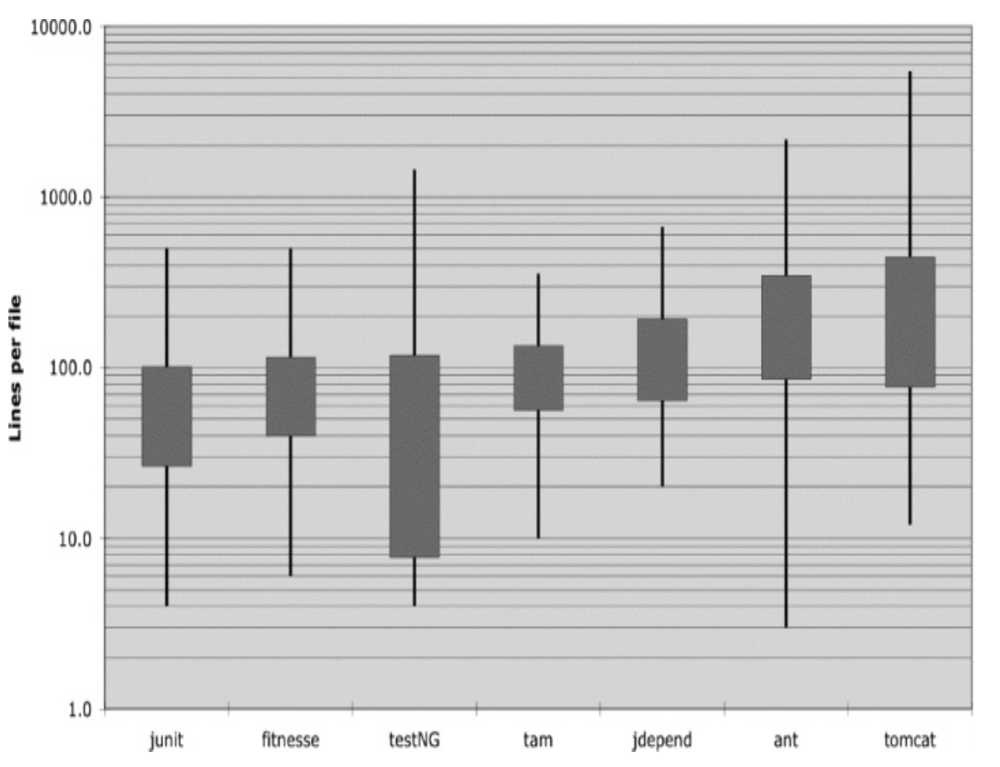

## 垂直格式

让我们从垂直尺寸开始。一个源文件应该有多大？
事实证明，文件大小差异很大，风格上也存在显著差异。
以下展示了其中一些差异。

<br/>

图中描绘了七个不同的项目：Junit、FitNesse、TestNG、Time and Money、JDepend、Ant 和 Tomcat。
穿过盒子的线条显示了每个项目中文件长度的最小值和最大值。
盒子显示了大约三分之一（一个标准差¹）的文件。
盒子的中间是平均值。
因此，FitNesse 项目中平均文件大小约为 65 行，大约三分之一的文件在 40 到 100+ 行之间。
FitNesse 中最大的文件约为 400 行，最小的为 6 行。
请注意，这是一个对数刻度，所以垂直位置上的微小差异意味着绝对尺寸上的巨大差异。

¹ 盒子显示了平均值上下 sigma/2 的范围。
是的，我知道文件长度分布不是正态的，因此标准差在数学上并不精确。
但我们在这里并不是追求精确。
我们只是想感受一下。

Junit、FitNesse 和 Time and Money 由相对较小的文件组成。
没有一个文件超过 500 行，而且这些文件中的大多数都小于 200 行。
另一方面，Tomcat 和 Ant 有一些文件长达几千行，接近一半的文件超过 200 行。

这对我们意味着什么？
似乎有可能用通常 200 行长、上限为 500 行的文件来构建重要的系统（在本次分析时，FitNesse 接近 50,000 行）。
虽然这不应是一条硬性规则，但它应被视为非常可取的。
小文件通常比大文件更容易理解和维护。

### 概念之间的垂直留白

几乎所有的代码都是从左到右、从上到下阅读的。
每一行代表一个表达式或一个子句，每一组行代表一个完整的思想。
这些思想应该用空行相互分隔。

考虑下面的代码。
有空行分隔了包声明、导入语句以及每个函数。
这个极其简单的规则对代码的视觉布局有着深远的影响。
每个空行都是一个视觉提示，标识了一个新的、独立的概念。
当你向下浏览列表时，你的眼睛会被空行之后的第一行所吸引。

```java
package fitnesse.wikitext.widgets;

import java.util.regex.*;

public class BoldWidget extends ParentWidget {
    public static final String REGEXP = "'''.+?'''";
    private static final Pattern pattern = Pattern.compile(
        "'''(.+?)'''",
        Pattern.MULTILINE | Pattern.DOTALL
    );

    public BoldWidget(ParentWidget parent, String text) throws Exception {
        super(parent);
        Matcher match = pattern.matcher(text);
        match.find();
        addChildWidgets(match.group(1));
    }

    @Override
    public String render() throws Exception {
        StringBuffer html = new StringBuffer("<b>");
        html.append(childHtml()).append("</b>");
        return html.toString();
    }
}
```

去掉那些空行会对代码的可读性产生显著的模糊效果。

```java
package fitnesse.wikitext.widgets;
import java.util.regex.*;
public class BoldWidget extends ParentWidget {
    public static final String REGEXP = "'''.+?'''";
    private static final Pattern pattern = Pattern.compile("'''(.+?)'''",
            Pattern.MULTILINE | Pattern.DOTALL);
    public BoldWidget(ParentWidget parent, String text) throws Exception {
        super(parent);
        Matcher match = pattern.matcher(text);
        match.find();
        addChildWidgets(match.group(1));
    }
    public String render() throws Exception {
        StringBuffer html = new StringBuffer("<b>");
        html.append(childHtml()).append("</b>");
        return html.toString();
    }
}
```

这种效果在你放松眼睛时更加明显。
在第一个示例中，不同的行组会向你凸显出来，而第二个示例看起来像是一团混乱。
这两个示例之间的区别仅仅是一点垂直留白。

### 垂直密度

如果说留白分隔了概念，那么垂直密度意味着紧密的关联。
因此，紧密相关的代码行应该在垂直方向上密集排列。
注意下面代码中无用的注释是如何打破两个实例变量之间的紧密关联的。

```java
public class ReporterConfig {
    /**
     * The class name of the reporter listener
     */
    private String m_className;

    /**
     * The properties of the reporter listener
     */
    private List<Property> m_properties = new ArrayList<Property>();

    public void addProperty(Property property) {
        m_properties.add(property);
    }
}
```

下面的代码容易读得多。
它 “一目了然”，至少对我来说是这样。
我可以看着它，看到这是一个有两个变量和一个方法的类，而不需要移动太多头部或眼睛。
前面的代码清单迫使我使用更多的眼睛和头部运动，更不用说处理那些分散注意力的注释的额外处理，才能达到同样的理解水平。

```java
public class ReporterConfig {
    private String m_className;
    private List<Property> m_properties = new ArrayList<Property>();

    public void addProperty(Property property) {
        m_properties.add(property);
    }
}
```

### 垂直距离

你是否曾经在一个类中来回追赶，从一个函数跳到另一个函数，在源文件中上下滚动，试图弄清函数之间的关系和操作，结果却迷失在一团混乱的鼠窝中？
你是否曾经沿着继承链向上查找变量或函数的定义？
这是令人沮丧的，因为你试图理解系统做什么，但你把时间和精力花在了试图定位和记住各部分在哪里。

<ins>紧密相关的概念应该在垂直方向上保持靠近</ins>。
显然，这条规则不适用于属于不同文件的概念。
但除非有充分的理由，紧密相关的概念不应该被分离到不同的文件中。
实际上，这也是应该避免使用 `protected` 变量的原因之一。

对于那些紧密相关以至于属于同一源文件的概念，它们的垂直间距应该是衡量它们对彼此可理解性的重要程度的尺度。
我们希望避免迫使我们的读者在源文件和类之间跳来跳去。

### 变量声明

变量应该尽可能声明在靠近它们使用的地方。
因为我们的函数非常短，局部变量应该出现在每个函数的顶部，就像 JUnit 4.3.1 中这个稍长的函数一样。

```java
private static void readPreferences() {
    InputStream is= null;
    try {
        is= new FileInputStream(getPreferencesFile());
        setPreferences(new Properties(getPreferences()));
        getPreferences().load(is);
    } catch (IOException e) {
        try {
            if (is != null)
                is.close();
        } catch (IOException e1) {
        }
    }
}
```

循环的控制变量通常应该声明在循环语句内部，就像同一源码中这个可爱的小函数一样。

```java
public int countTestCases() {
    int count= 0;
    for (Test each : tests)
        count += each.countTestCases();
    return count;
}
```

在极少数情况下，变量可能在块的顶部或在一个较长的函数中循环之前声明。
你可以在 TestNG 中这个非常长的函数片段中看到这样的变量。

```java
…
for (XmlTest test : m_suite.getTests()) {
    TestRunner tr = m_runnerFactory.newTestRunner(this, test);
    tr.addListener(m_textReporter);
    m_testRunners.add(tr);
    invoker = tr.getInvoker();
    for (ITestNGMethod m : tr.getBeforeSuiteMethods()) {
        beforeSuiteMethods.put(m.getMethod(), m);
    }
    for (ITestNGMethod m : tr.getAfterSuiteMethods()) {
        afterSuiteMethods.put(m.getMethod(), m);
    }
}
…
```

另一方面，实例变量应该声明在类的顶部或底部。
这不应该增加这些变量的垂直距离，因为在设计良好的类中，它们被类的许多方法（如果不是全部的话）所使用。

关于实例变量应该放在哪里，一直有很多争论。
在 C++ 中，我们通常实践所谓的 “剪刀规则”，即把所有实例变量放在底部。
这条规则的依据是公有成员应该放在顶部，私有成员应该放在底部。

这比 Java/C# 中将私有变量放在顶部的约定更有道理。
但由于这种约定在这些语言中如此普遍，遵循它可能比通过诉诸逻辑和常识来混淆所有人更好。

重要的是实例变量要声明在一个众所周知的位置。
每个人都应该知道去哪里查看声明。

例如，考虑 JUnit 4.3.1 中 `TestSuite` 类的奇怪情况。
我大大简化了这个类以说明问题。
如果你浏览列表大约一半的位置，你会看到在那里声明了两个实例变量。
很难找到一个更好的位置来隐藏它们。
阅读这段代码的人必须偶然发现这些声明（就像我做的那样）。

```java
public class TestSuite implements Test {
    static public Test createTest(Class<? extends TestCase> theClass,
                                  String name) {
        …
    }

    public static Constructor<? extends TestCase>
    getTestConstructor(Class<? extends TestCase> theClass)
    throws NoSuchMethodException {
        …
    }

    public static Test warning(final String message) {
        …
    }

    private static String exceptionToString(Throwable t) {
        …
    }

    private String fName;
    private Vector<Test> fTests= new Vector<Test>(10);

    public TestSuite() {
    }

    public TestSuite(final Class<? extends TestCase> theClass) {
        …
    }

    public TestSuite(Class<? extends TestCase> theClass, String name) {
        …
    }
    … … … … …
}
```

### 依赖函数

<ins>如果一个函数调用另一个函数，它们应该在垂直方向上靠近，并且如果可能的话，调用者应该在被调用者之上²。
这为程序提供了一种自然的流程</ins>。
如果这个约定被可靠地遵循，读者将能够相信函数定义会在它们被使用之后不久出现。
例如，考虑下面来自 FitNesse 的片段。
注意最顶层的函数调用（以粗体显示）了它下面的那些函数。
还要注意被调用的函数按照它们被调用的顺序出现。
这使得查找被调用的函数变得容易，并极大地提高了整个模块的可读性。

² 或者在像 Clojure 这样的反转语言中，在被调用者之下。

```java
public class WikiPageResponder implements SecureResponder {
    protected WikiPage page;
    protected PageData pageData;
    protected String pageTitle;
    protected Request request;
    protected PageCrawler crawler;

    public Response makeResponse(FitNesseContext context, Request request)
        throws Exception {
        String pageName = getPageNameOrDefault(request, "FrontPage");
        loadPage(pageName, context);
        if (page == null)
            return notFoundResponse(context, request);
        else
            return makePageResponse(context);
    }

    private String
    getPageNameOrDefault(Request request, String defaultPageName)
    {
        String pageName = request.getResource();
        if (StringUtil.isBlank(pageName))
            pageName = defaultPageName;
        return pageName;
    }

    protected void loadPage(String resource, FitNesseContext context)
        throws Exception {
        WikiPagePath path = PathParser.parse(resource);
        crawler = context.root.getPageCrawler();
        crawler.setDeadEndStrategy(new VirtualEnabledPageCrawler());
        page = crawler.getPage(context.root, path);
        if (page != null)
            pageData = page.getData();
    }

    private Response
    notFoundResponse(FitNesseContext context, Request request)
        throws Exception {
        return new NotFoundResponder().makeResponse(context, request);
    }

    private SimpleResponse makePageResponse(FitNesseContext context)
        throws Exception {
        pageTitle = PathParser.render(crawler.getFullPath(page));
        String html = makeHtml(context);
        SimpleResponse response = new SimpleResponse();
        response.setMaxAge(0);
        response.setContent(html);
        return response;
    }
...
}
```

顺便说一句，这个片段提供了一个很好的例子，说明将常量保持在适当的层次。
`"FrontPage"` 常量本可以隐藏在 `getPageNameOrDefault` 函数中，但这会将一个众所周知且预期的常量隐藏在一个不适当的低层函数中。
更好的做法是将该常量从理解它有意义的层次向下传递。

### 概念亲和力

某些代码片段希望靠近其他代码片段。
它们具有某种概念亲和力。
这种亲和力越强，它们之间的垂直距离就应该越小。

正如我们所见，这种亲和力可能基于直接依赖，例如一个函数调用另一个函数，或者一个函数使用一个变量。
但也存在其他可能的原因。
亲和力可能是因为一组函数执行相似的操作。
考虑 JUnit 4.3.1 中的这段代码：

```java
public class Assert {
    static public void assertTrue(String message, boolean condition) {
        if (!condition)
            fail(message);
    }

    static public void assertTrue(boolean condition) {
        assertTrue(null, condition);
    }

    static public void assertFalse(String message, boolean condition) {
        assertTrue(message, !condition);
    }

    static public void assertFalse(boolean condition) {
        assertFalse(null, condition);
    }
…
```

这些函数具有强烈的概念亲和力，因为它们共享一个共同的命名方案，并执行相同基本任务的变体。它们相互调用的事实是次要的。即使它们不调用彼此，它们仍然希望彼此靠近。
