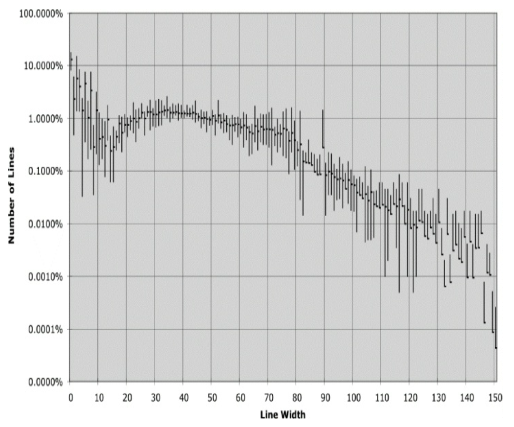

## 水平格式

一行应该有多宽？
为了回答这个问题，让我们看看典型程序中行的宽度。
同样，我们检查了这七个不同的项目。
下图显示了所有七个项目行长的分布。
规律性令人印象深刻，尤其是在 45 个字符左右。
实际上，从 20 到 60 的每个大小约占总行数的 1%。那是 40%！
也许另外 30% 的行宽度小于十个字符。
请记住，这是一个对数刻度，因此 80 个字符以上的下降的线性外观实际上非常显著。
程序员显然更喜欢短行。

<br/>

这表明我们应该努力保持行的短小。
旧的霍勒里斯 (Hollerith) 80 字符限制有点武断，我不反对行扩展到 100 甚至 120 字符。
但超过那个可能只是粗心大意。

我遵循一条规则：永远不应该强迫你的读者向右滚动。
考虑到现代显示器的尺寸和分辨率，我个人将水平限制设置为 120。
我在 IDE 中在那列画了一条浅灰色的线，我不会超过它。

### 水平留白与密度

我们使用水平空白来关联紧密相关的事物，并分隔关系较弱的事物。
考虑以下函数：

```java
private void measureLine(String line) {
    lineCount++;
    int lineSize = line.length();
    totalChars += lineSize;
    lineWidthHistogram.addLine(lineSize, lineCount);
    recordWidestLine(lineSize);
}
```

我在赋值运算符周围添加了空格以突出它们。
赋值语句有两个不同且主要的部分：左侧和右侧。
空格使这种分离变得明显。

另一方面，我没有在函数名和左括号之间加空格。
这是因为函数和它的参数是紧密相关的。
将它们分开会使它们看起来是分离的而不是连接的。
我在函数调用的括号内分隔参数，以突出逗号并表明参数是分开的。

空白的另一个用途是突出运算符的优先级。

```java
public class Quadratic {
    public static double root1(double a, double b, double c) {
        double determinant = determinant(a, b, c);
        return (-b + Math.sqrt(determinant)) / (2*a);
    }

    public static double root2(int a, int b, int c) {
        double determinant = determinant(a, b, c);
        return (-b - Math.sqrt(determinant)) / (2*a);
    }

    private static double determinant(double a, double b, double c) {
        return b*b - 4*a*c;
    }
}
```

注意到这些方程读起来多么好。
因子之间没有空格，因为它们的优先级高。
项之间用空格分隔，因为加法和减法的优先级较低。

不幸的是，大多数代码格式化工具对运算符的优先级视而不见，并在整个代码中施加相同的间距。
因此，像上面显示的微妙间距在你重新格式化代码后往往会丢失。

### 水平对齐

当我还是一个汇编语言程序员时，³ 我使用水平对齐来突出某些结构。
当我开始用 C、C++、Java 以及最终用 Clojure 编码时，我继续尝试在一组声明中对齐所有变量名，或在一组赋值语句中对齐所有的右值。
我的代码可能看起来像这样：

³ 我在开玩笑吗？我仍然是一个汇编语言程序员。你可以把男孩从机器旁带走，但你不能把机器从男孩心中带走！

```java
public class FitNesseExpediter implements ResponseSender
{
    private Socket          socket;
    private InputStream     input;
    private OutputStream    output;
    private Request         request;
    private Response        response;
    private FitNesseContext context;
    protected long          requestParsingTimeLimit;
    private long            requestProgress;
    private long            requestParsingDeadline;
    private boolean         hasError;

    public FitNesseExpediter(Socket s,
                             FitNesseContext context) throws Exception
    {
        this.context = context;
        socket = s;
        input = s.getInputStream();
        output = s.getOutputStream();
        requestParsingTimeLimit = 10000;
    }
```

然而，我发现这种对齐并没有什么用处。
对齐似乎强调了错误的东西，并把我的注意力从真正的意图上引开。
例如，在上面的声明列表中，你很容易被诱惑去向下阅读变量名列表，而不去注意它们的类型。
同样，在赋值语句列表中，你很容易被诱惑去向下查看右值列表，而从未看到赋值运算符。

所以，最终，我不再这样做了。
如今，我通常更喜欢不对齐的声明和赋值，如下所示，因为它们指出一个重要的缺陷。
如果我有很长的列表需要对齐，问题是列表的长度，而不是缺少对齐。
下面 `FitNesseExpediter` 中声明列表的长度表明这个类应该被拆分。

```java
public class FitNesseExpediter implements ResponseSender {
    private Socket socket;
    private InputStream input;
    private OutputStream output;
    private Request request;
    private Response response;
    private FitNesseContext context;
    protected long requestParsingTimeLimit;
    private long requestProgress;
    private long requestParsingDeadline;
    private boolean hasError;

    public FitNesseExpediter(Socket s, FitNesseContext context) throws Exception {
        this.context = context;
        socket = s;
        input = s.getInputStream();
        output = s.getOutputStream();
        requestParsingTimeLimit = 10000;
    }
}
```

### 缩进

源文件是一个层级结构，有点像大纲。
有些信息属于整个文件，有些属于文件中的各个类，有些属于类中的方法，有些属于方法中的块，并递归地属于块中的块。
这个层级的每个级别都是一个作用域，可以在其中声明名称，并在其中解释声明和可执行语句。

为了使这个作用域层级可见，我们根据源代码行在层级中的位置来缩进它们。
文件级别的语句，如大多数类声明，根本不缩进。
类中的方法缩进一级，位于类的右侧。
这些方法的实现缩进一级，位于方法声明的右侧。
块实现缩进一级，位于包含它的块的右侧，依此类推。

程序员严重依赖这种缩进方案。
他们视觉上对齐左边缘，以查看每行出现在哪个作用域中。
这使他们能够快速跳过与其当前情况无关的作用域，例如 `if` 或 `while` 语句的实现。
他们扫描左侧以查找新方法声明、新变量甚至新类。
如果没有缩进，程序对人类来说几乎不可读。

考虑以下在语法和语义上相同的程序：

```java
public class FitNesseServer implements SocketServer
{ private FitNesseContext context;
public FitNesseServer(FitNesseContext context)
{ this.context = context; } public void
serve(Socket s) { serve(s, 10000); }
public void serve(Socket s, long requestTimeout) { try
{ FitNesseExpediter sender = new FitNesseExpediter(s, context); sender.
setRequestParsingTimeLimit(requestTimeout);
sender.start(); } catch(Exception e)
{ e.printStackTrace(); } } }
```

对比：

```java
public class FitNesseServer implements SocketServer {
    private FitNesseContext context;

    public FitNesseServer(FitNesseContext context) {
        this.context = context;
    }

    public void serve(Socket s) {
        serve(s, 10000);
    }

    public void serve(Socket s, long requestTimeout) {
        try {
            FitNesseExpediter sender = new FitNesseExpediter(s, context);
            sender.setRequestParsingTimeLimit(requestTimeout);
            sender.start();
        }
        catch (Exception e) {
            e.printStackTrace();
        }
    }
}
```

你的眼睛可以迅速辨别出缩进文件的结构。
你几乎可以立即发现变量、构造函数、访问器和方法。
只需几秒钟就能意识到这是一个某种简单的 socket 前端，带有超时功能。
然而，未缩进的版本如果不仔细研究，几乎是无法理解的。

### 打破缩进

有时，对于简短的 `if` 语句、简短的 `while` 循环或简短的函数，人们会忍不住打破缩进规则。
每当我屈服于这种诱惑时，我几乎总是会回来并重新加入缩进。
所以我通常避免将作用域折叠成一行，像这样：

```java
public class CommentWidget extends TextWidget {
    public static final String REGEXP = "^#[^\r\n]*(?:(?:\r\n)|\n|\r)?";
    public CommentWidget(ParentWidget parent, String text)
    {super(parent, text);}
    public String render() throws Exception {return ""; }
}
```

我倾向于扩展并缩进作用域，像这样：

```java
public class CommentWidget extends TextWidget {
    public static final String REGEXP = "^#[^\r\n]*(?:(?:\r\n)|\n|\r)?";
    public CommentWidget(ParentWidget parent, String text) {
        super(parent, text);
    }
    public String render() throws Exception {
        return "";
    }
}
```

然而，有时一个简单的单行比悬挂的大括号在视觉上更吸引人。

```java
public int getCount() {return count;}
```
