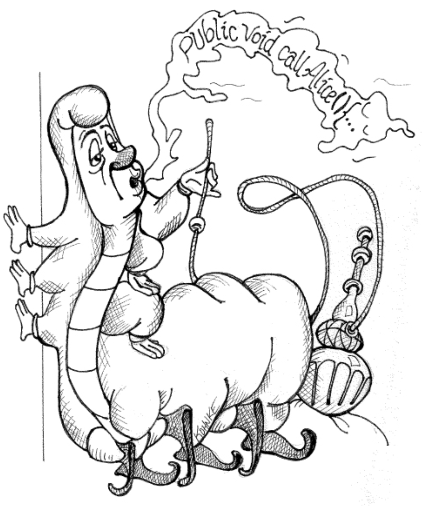

# 第 7 章 整洁函数

 

在计算的最早期，程序员将他们的系统编写为执行单个任务的例程序列。
他们很快发现其中一些例程具有通用性，于是将它们记在笔记本上，并称之为 *子程序 (subroutines)* 。
当需要时，他们会将那些子程序从笔记本直接誊写到他们正在创建的程序中。
没有调用 —— 那些子程序只是被内联编码在程序内部。

后来，在 50 年代早期，机器中加入了允许调用子程序的指令。
起初，程序员们不愿意使用这样的调用指令，因为它们在时间上很昂贵。
但随着机器能力的增长，调用指令变得不那么昂贵，程序员们开始越来越频繁地使用它们。

然后，在 Fortran 和 PL/1 时代，我们开始主要用子程序来构建系统，并引入了带有参数和返回值的 *函数 (functions)* 的特殊情况。
如今，只有函数幸存了下来。
函数是任何现代程序中组织的第一线。
如何写好函数是本章的主题。
