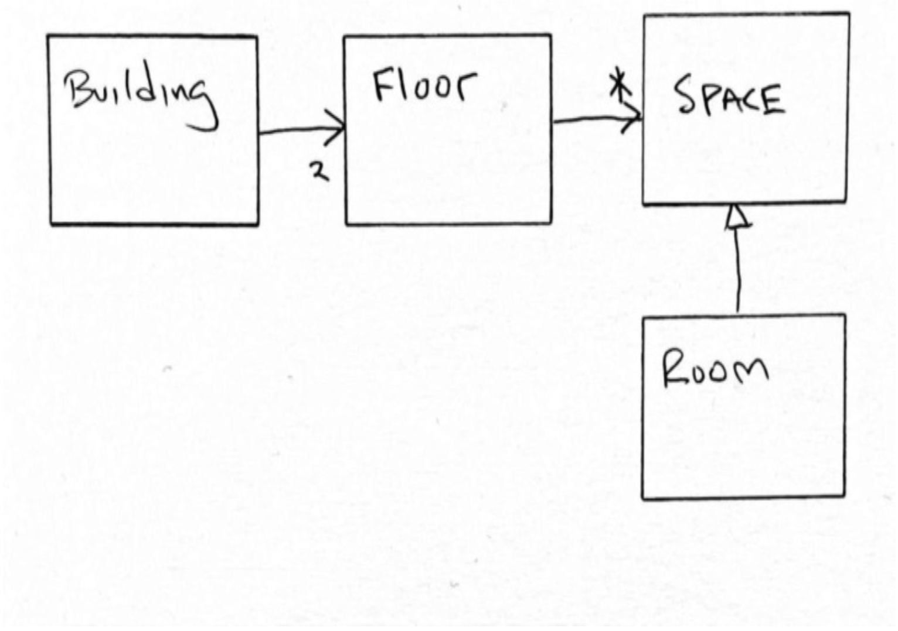

## DRY：不要重复自己

我们长期以来一直认为应该避免代码重复。
多年来，我们已经多次听到这个建议。
《The Pragmatic Programmer》⁴ 的作者在 2000 年就告诉了我们这一点。
但他们肯定不是第一个。
Codd 用于组织数据库的大多数范式都是减少数据重复的技术。
Bertrand Meyer 在 1988 年撰写关于 *单一选择原则 (Single Choice Principle)* ⁵ 时就告诉了我们这一点。
可以说，这个建议是古老的。

⁴ [Prag](../bib.md#prag) 。<br/>
⁵ [OOSC](../bib.md#oosc) 。

### 简单的重复代码

那么，重复代码意味着什么？
有一种明显的情况是，相同的 L 行代码在 P 个不同的地方被一遍又一遍地重复。
这通常是程序员对鼠标有点过于焦虑的结果。
如果 L 和 P 都很小，那么重复造成的损害很小，而消除这种重复的努力可能弊大于利。

例如，如果你看到这两行重复了两次，仅仅为了消除重复而将它们变成一个函数可能没有太大意义。

```python
count=0
list=[]
```

你可能会将它们提取到 `initializeList` 函数中，作为对读者的便利。
但那是另一回事。重复本身并不是非常有害。

如果 `L` 可能会增长呢？例如，如果你需要向该初始化中添加一个新变量呢？

```python
count=0
odds=0
list=[]
```

如果 `P` 是 2，那么你必须在两个地方进行更改。这可能有点不方便，但这是一个小问题。

另一方面，如果 `P` 很大，那么你将不得不找到所有重复的实例并添加新的初始化。
另一方面，如果你已经将初始化提取到 `initializeList` 函数中，你可以在一个地方进行更改。

所以，如果 `P` 很大，即使 `L` 很小，最好也将重复提取到一个单独的、命名良好的函数中。

一段 `L` 行代码在以后需要修改的可能性有多大？
这可能是 `L` 的一个函数。
`L` 越大，该片段需要被更改的可能性就越大。

因此，当 `L` 很大时，即使 `P` 很小，提取重复也可能会有所回报。
我们可以用这个表格来描述。

|        | L偏小       | L偏大     |
| ------ | ----------- | --------- |
| P偏小  | 可考虑提取  | 进行提取  |
| P偏大  | 进行提取    | 进行提取  |


### 相似的代码

我们经常会发现重复的代码片段，但它们并不是完全重复的。
它们可能相差一两个常量或变量。
这样的片段通常倾向于有更大的 `L`，因此应该被提取。

这里有一个来自本书第一版的例子 —— 也是 2001 年左右 FitNesse ⁶ 项目中的一个例子。
粗体部分相似，可以被提取。

⁶ http://fitnesse.org; https://github.com/unclebob/fitnesse

```java
public class TestableHtml {
    public static String testableHtml(
        PageData pageData,
        boolean includeSuiteSetup) throws Exception {
        WikiPage wikiPage = pageData.getWikiPage();
        StringBuffer buffer = new StringBuffer();
        if (pageData.hasAttribute("Test")) {
            if (includeSuiteSetup) {
                WikiPage suiteSetup =
                    PageCrawlerImpl.getInheritedPage(
                        SuiteResponder.SUITE_SETUP_NAME, wikiPage);
                if (suiteSetup != null) {
                    WikiPagePath pagePath =
                        suiteSetup.getPageCrawler().getFullPath(suiteSetup);
                    String pagePathName = PathParser.render(pagePath);
                    buffer.append("!include -setup .")
                        .append(pagePathName)
                        .append("\n");
                }
            }
            WikiPage setup =
                PageCrawlerImpl.getInheritedPage("SetUp", wikiPage);
            if (setup != null) {
                WikiPagePath setupPath =
                    setup.getPageCrawler().getFullPath(setup);
                String setupPathName = PathParser.render(setupPath);
                buffer.append("!include - setup.")
                    .append(setupPathName)
                    .append("\n");
            }
        }
        buffer.append(pageData.getContent());
        if (pageData.hasAttribute("Test")) {
            WikiPage teardown =
                PageCrawlerImpl.getInheritedPage("TearDown", wikiPage);
            if (teardown != null) {
                WikiPagePath tearDownPath =
                    teardown.getPageCrawler().getFullPath(teardown);
                String tearDownPathName = PathParser.render(tearDownPath);
                buffer.append("\n")
                    .append("!include - teardown.")
                    .append(tearDownPathName)
                    .append("\n");
            }
            if (includeSuiteSetup) {
                WikiPage suiteTeardown =
                    PageCrawlerImpl.getInheritedPage(
                        SuiteResponder.SUITE_TEARDOWN_NAME,
                        wikiPage
                    );
                if (suiteTeardown != null) {
                    WikiPagePath pagePath =
                        suiteTeardown.getPageCrawler().getFullPath(suiteTeardown);
                    String pagePathName = PathParser.render(pagePath);
                    buffer.append("!include -teardown .")
                        .append(pagePathName)
                        .append("\n");
                }
            }
        }
        pageData.setContent(buffer.toString());
        return pageData.getHtml();
    }
}
```

通常，像这样提取相似的代码片段只需向提取的函数中添加一两个参数即可。
让我们试试。

```java
public class TestableHtml {
    public static String testableHtml(
        PageData pageData,
        boolean includeSuiteSetup) throws Exception {
        WikiPage wikiPage = pageData.getWikiPage();
        StringBuffer buffer = new StringBuffer();
        if (pageData.hasAttribute("Test")) {
            if (includeSuiteSetup) {
                includeInheritedPage(SuiteResponder.SUITE_SETUP_NAME,
                                     wikiPage, buffer, "!include -setup .");
            }
            includeInheritedPage("SetUp", wikiPage, buffer,
                                 "!include -setup .");
        }
        buffer.append(pageData.getContent());
        if (pageData.hasAttribute("Test")) {
            includeInheritedPage("TearDown", wikiPage, buffer,
                                 "\n!include -teardown .");
            if (includeSuiteSetup) {
                includeInheritedPage(SuiteResponder.SUITE_TEARDOWN_NAME,
                                     wikiPage, buffer, "!include -teardown .");
            }
        }
        pageData.setContent(buffer.toString());
        return pageData.getHtml();
    }

    private static void
    includeInheritedPage(String pageName, WikiPage wikiPage,
                         StringBuffer buffer,
                         String includeString) {
        WikiPage inheritedPage =
            PageCrawlerImpl.getInheritedPage(pageName, wikiPage);
        if (inheritedPage != null) {
            WikiPagePath pagePath =
                inheritedPage.getPageCrawler().getFullPath(inheritedPage);
            String pagePathName = PathParser.render(pagePath);
            buffer.append(includeString)
                .append(pagePathName)
                .append("\n");
        }
    }
}
```

这显然更好。
它极大地改善了 `testableHtml` 函数的流程，并且确保对 `includeInheritedPage` 的任何修改都将在一个地方而不是四个地方。
然而，我们新函数的参数数量比我喜欢的要多。
所以让我们将其中一些变量移到字段中。

```java
public class TestableHtml {
    private static StringBuffer buffer;
    private static WikiPage wikiPage;

    public static String testableHtml(
        PageData pageData,
        boolean includeSuiteSetup) throws Exception {
        wikiPage = pageData.getWikiPage();
        buffer = new StringBuffer();
        if (pageData.hasAttribute("Test")) {
            if (includeSuiteSetup) {
                includeInheritedPage(SuiteResponder.SUITE_SETUP_NAME,
                                     "!include -setup .");
            }
            includeInheritedPage("SetUp", "!include -setup .");
        }
        buffer.append(pageData.getContent());
        if (pageData.hasAttribute("Test")) {
            includeInheritedPage("TearDown", "\n!include -teardown .");
            if (includeSuiteSetup) {
                includeInheritedPage(SuiteResponder.SUITE_TEARDOWN_NAME,
                                     "!include -teardown .");
            }
        }
        pageData.setContent(buffer.toString());
        return pageData.getHtml();
    }

    private static void
    includeInheritedPage(String pageName, String includeString) {
        WikiPage inheritedPage =
            PageCrawlerImpl.getInheritedPage(pageName, wikiPage);
        if (inheritedPage != null) {
            WikiPagePath pagePath =
                inheritedPage.getPageCrawler().getFullPath(inheritedPage);
            String pagePathName = PathParser.render(pagePath);
            buffer.append(includeString)
                .append(pagePathName)
                .append("\n");
        }
    }
}
```

这仍然更好。如果你仔细观察结果，你应该能够发现更多的重复。
我将把消除这些重复留给你。

### 循环重复

我们经常发现应用程序中存在必须在许多不同地方遍历的数据结构。
进行遍历的循环总是相同的，但循环体总是不同的。

如今，消除这种重复的流行方法是使用 lambda。
较老的、有时更好的选择是使用 *命令模式 (Command pattern)* 、 *策略模式 (Strategy pattern)* 或 *模板方法模式 (TemplateMethod pattern)* 。⁷

⁷ [GOF95](../bib.md#gof95) 。

作为这些技术的一个例子，考虑我和我的团队在 90 年代末面临的一个问题。
我们有一个描述建筑内部结构的数据结构。
下面是该数据结构的极大简化图。

<br/>

我们的任务是通过检查每个楼层和空间（以及门、窗和走廊，但那些暂且不管）来确定建筑的几十种不同的可评分特征。
这些特征的分数由一组 C++ 类决定，每个类都必须遍历数据结构以执行计算。

下面是一些 Ruby 代码，展示了所有这些特征可能导致的重复。

```ruby
class SpaceFeature
  def score(building)
    spaces = 0
    building.floors.each do |floor|
      floor.spaces.each do |space|
        spaces += 1
      end
    end
    spaces
  end
end

class AreaFeature
  def score(building)
    area = 0
    building.floors.each do |floor|
      floor.spaces.each do |space|
        area += space.width * space.length
      end
    end
    area
  end
end
```

<ins>你可以看到问题所在。
嵌套循环是相同的，但循环体在每种情况下都不同</ins>。
现在想象一下，这种情况重复几十次，并且数据结构和遍历循环要复杂得多。

我们可以在现代语言中使用 lambda（有时称为块）来解决这个问题，如下所示。

```ruby
class Feature
  def do_score(building, block)
    value = 0
    building.floors.each do |floor|
      floor.spaces.each do |space|
        value = block.call(value, floor, space)
      end
    end
    value
  end
end

class SpaceFeature < Feature
  def score(building)
    do_score(building, ->(value, floor, space) {return value+1})
  end
end

class AreaFeature < Feature
  def score(building)
    do_score(building, ->(value, floor, space)
      {return value + (space.width * space.length)})
  end
end
```

现在，遍历数据结构的循环只存在于 `Feature` 类中。
如果对该数据结构进行了任何更改，很可能只有该类需要被更改。
具体的特征，如 `SpaceFeature` 和 `AreaFeature`，很可能不会受到此类更改的影响。

另一种技术是使用 *模板方法模式 (TemplateMethod pattern)* 。

```ruby
class Feature
  def score(building)
    value = 0
    building.floors.each do |floor|
      floor.spaces.each do |space|
        value = score_space(value, floor, space)
      end
    end
    value
  end

  def score_space(value, floor, space)
    raise "Not Implemented"
  end
end

class SpaceFeature < Feature
  def score_space(value, floor, space)
    value+1
  end
end

class AreaFeature < Feature
  def score_space(value, floor, space)
    value + (space.width * space.length)
  end
end
```

实际上，我更喜欢这个而不是 lambda 解决方案 —— 而且这也是我们在 90 年代在 C++ 中使用的那个。
那时我们称之为 “Write a Loop Once”，因为《设计模式》这本书还没有出版。

我把策略模式和命令模式留给你自己去研究。

### 偶然重复与本质重复

<ins>到目前为止，我们一直在讨论 *本质重复 (essential duplication)* 。
但有时两段代码看起来是重复的，而实际上它们不是。
那些是 *偶然重复 (accidental duplicates)* </ins>。

本质重复是一起变化的。当一个变化时，它们都变化。它们一起演化。

偶然重复是不一起变化的。它们彼此分开演化。

因此，非常重要的是不要将它们组合到一个公共函数中。

<ins>你可以通过考虑 *单一职责原则 (SRP)* ⁸ 来区分偶然重复和本质重复。
如果两段相似的代码位于两个对不同参与者 (actors) 负责的模块中，那么它们很可能随着那些参与者要求不同的更改而分别演化。
如果你将它们提取到一个公共函数中，那么当你试图满足一个参与者时，你很可能会为另一个参与者破坏系统</ins>。

⁸ 参见 [第 19 章](../ch19/0.md) “SOLID 原则”。

<ins>另一方面，如果两段相似的代码位于对同一参与者负责的模块中，那么它们很可能一起演化。
如果你忘记更改其中一段代码，你就会为该参与者破坏系统</ins>。
