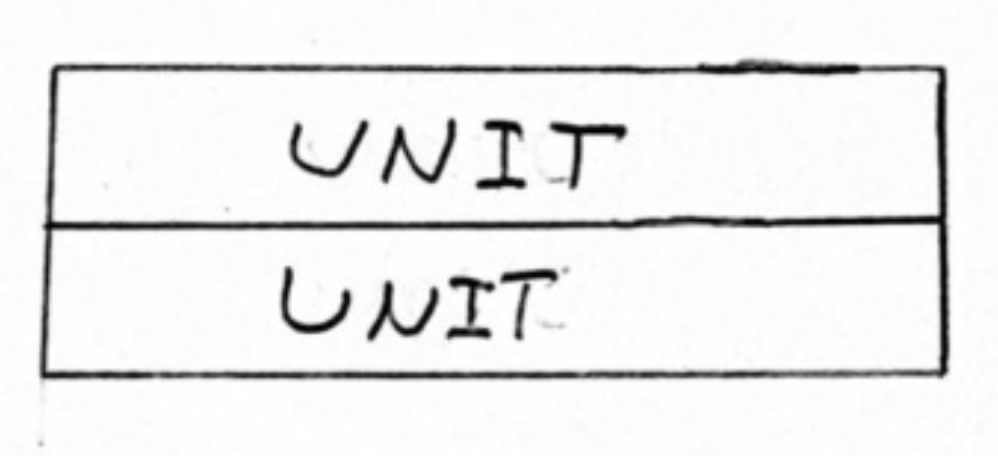
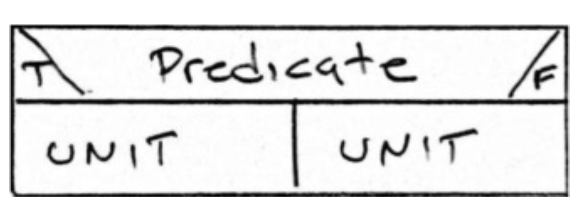
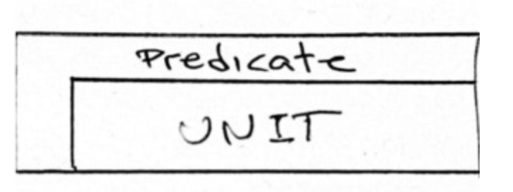
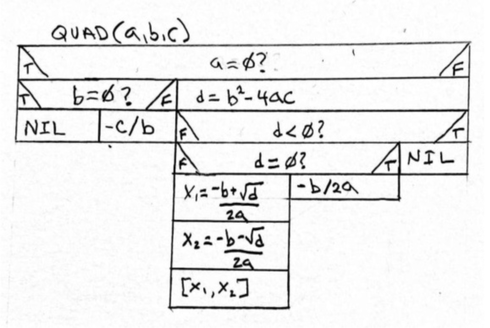

## 结构化编程

1968 年，Edsger Dijkstra 撰写了一篇论文，在近十年的时间里激起了编程界的波澜。
在那个时候，他在那篇论文中表达的观点引起了深刻的争议和激烈的辩论。
有些人认为 Dijkstra 是个傻瓜。
另一些人则认为他是个神。

但到了 80 年代，Dijkstra 关于结构化编程的简单想法已被广泛接受。
到了 90 年代，很难找到允许任何其他风格的语言了。

那篇论文当然是《Go To 语句被认为是有害的》(Go To Statement Considered Harmful)。
它作为致编辑的一封信发表在 1968 年 3 月的《ACM 通讯》(Communications of the ACM)上。
标题是由当时的编辑 Niklaus Wirth ¹¹ 给出的。
那篇论文改变了编程的世界。

¹¹ Pascal 语言的发明者。

这篇论文背后的思想非常简单。
所有程序应该只使用三种控制结构来编写： *顺序 (sequence)* 、 *选择 (selection)* 和 *迭代 (iteration)* 。

这在当时是革命性的，因为大多数编程语言使用跳转（GOTO）作为主要的，甚至是唯一的控制结构，程序员习惯于在他们的程序中跳来跳去。
这样的程序常常变成控制流的鼠窝。

Dijkstra 说所有程序应该被组织为递归应用的单元，每个单元有一个入口和一个出口。
这些单元有三种类型。

### 顺序 (Sequence)

 

顺序是两个（或多个）单元依次执行。
每个这样的单元在顶部有一个入口，在底部有一个出口。
一个单元可以简单到像一个单独的语句，如 `i=0;`，或者可以是一个函数调用，或者它自己的单元序列。

### 选择 (Selection)

 

选择是一个布尔谓词，选择它下面的两个单元之一。
该谓词是任何布尔表达式，如 `i<0`。

### 迭代 (Iteration)

 

迭代是一个谓词，它反复执行其下方的单元，直到谓词为假。

这些单元可以递归地应用于程序中，如下所示。

 

这种样式的图称为 *Nassi–Schneiderman 流程图* 。
该图本身描绘了通过二次方程求解器的控制流。

Dijkstra 将控制流限制为这些结构的理由是基于这样的论点：这些结构相对容易进行推理。
你可以跟踪每条路径并评估结果。
然而，如果允许 `goto` 语句将控制从程序中的任何一点转移到程序中的任何其他点，那么跟踪路径，并因此推理问题，就变得不切实际了。

如今，我们的语言为我们限制了控制流。
我们大多数人不使用带有 `goto` 语句的语言。
那些使用的人，往往也不会使用它。

在编写整洁函数时，记住这三个结构的递归应用是很有帮助的。
