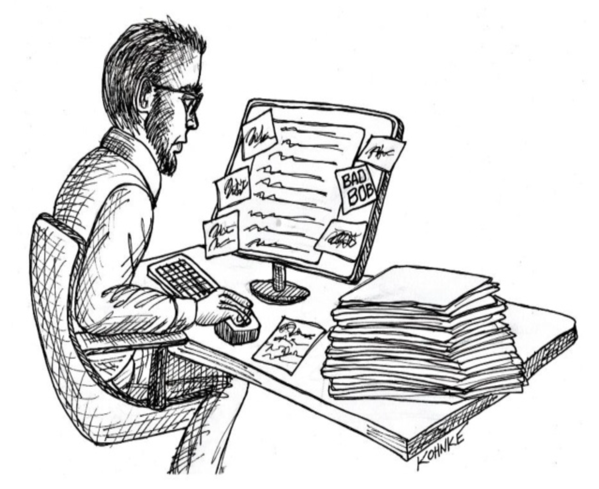

# 第 9 章 整洁方法

 

我们如何编写软件？
如今，当然，我们大多数人坐在笔记本电脑前，在 IDE 中打字。
我们在一个循环中工作。

1. 我们编写一小段代码（可能借助 AI 的帮助）。
2. 我们编译并测试它。
3. 我们回到步骤 1。

那个循环可能花费五秒到一小时不等，取决于你所遵循的纪律。

当然，过去并不是这样。
在最早的程序设计年代，循环更像这样：

1. 我们手动编写一大段代码。
2. 我们手动进行桌面检查。
3. 我们提交它以手动编码成机器可读的形式。
4. 我们提交它进行编译和测试。

那个循环通常需要一到三天的时间。
差异是明显的。
在过去，每行代码的投资是巨大的。
如今，那个成本是微不足道的。

当成本很高时，我们花费大量时间进行前期规划，以避免浪费。
当成本很低时，通过失败来探索更有意义。
在两种情况下，清理代码的想法通常被忽视。
