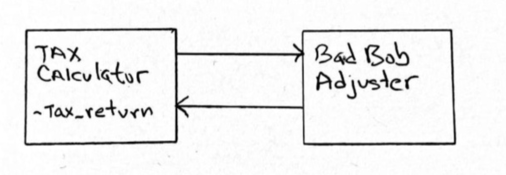
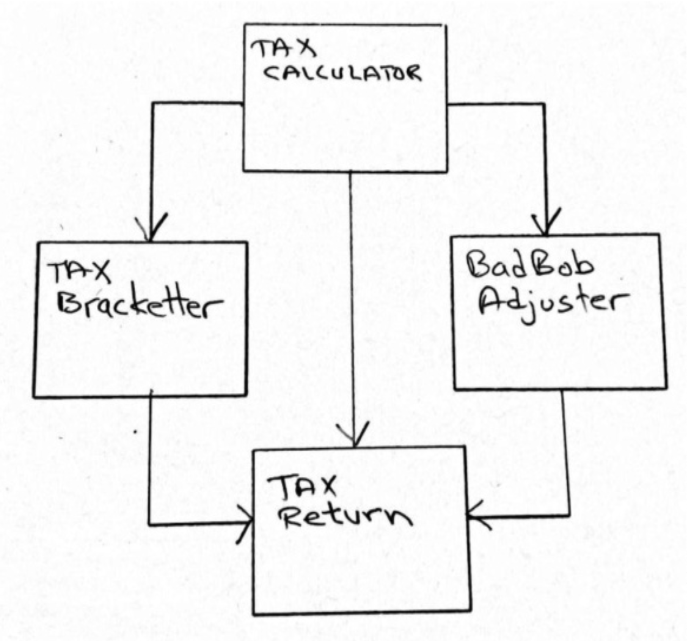
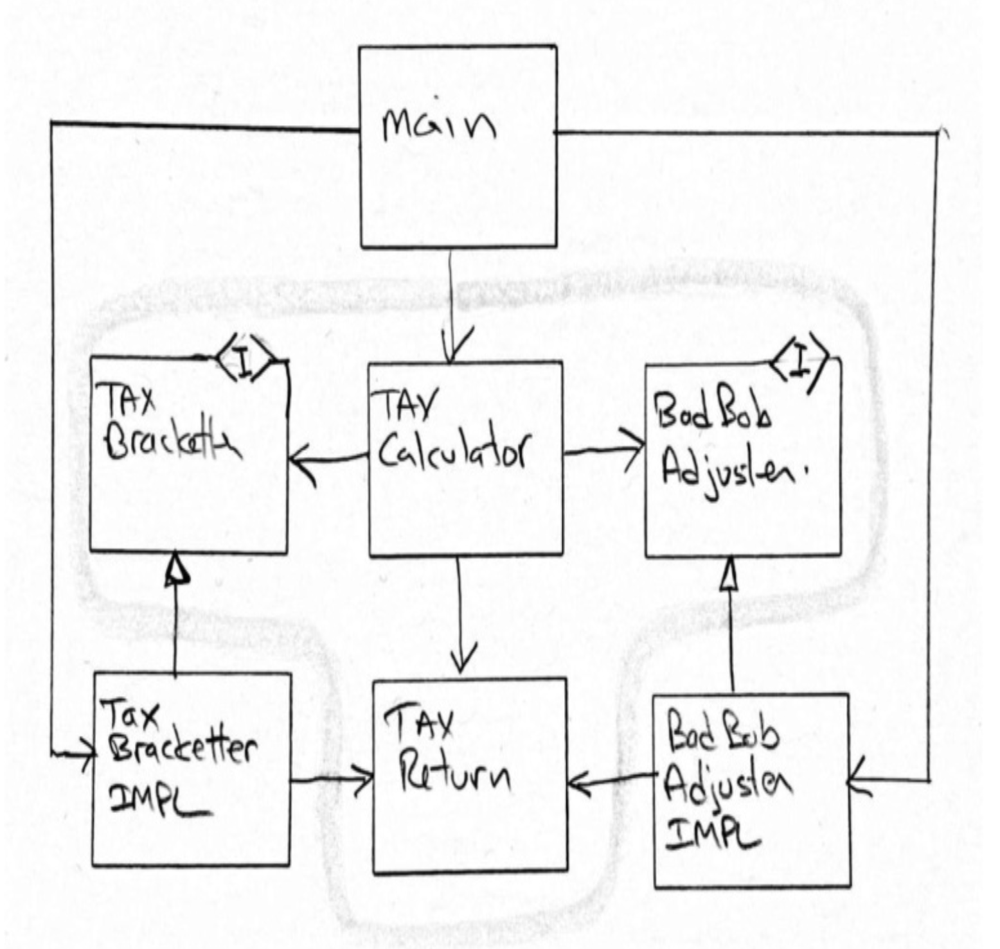

## 示例

也许理解如何编写整洁代码的最好方法是观察别人这样做。
因此，在本章中，我们将逐步讲解编写一个整洁模块的过程。
该技术将涉及：

- TDD 的测试纪律
- 重构
- 设计原则
- 设计模式

我们将从一个虚构的 Python 应用程序开始：Bobolia 这个神话之州的税务计算器。
我已经很久没有写过 Python 了，所以请耐心一点。

这是第一个测试。

———bobolia_taxes_test.py———

```python
import unittest
import bobolia_taxes

class bobolia_tax_tests(unittest.TestCase):
    def test_simplest_case(self):
        tax_return = {"income": {"salary": 50000}}
        tax_calculator = bobolia_taxes.tax_calculator(tax_return)
        self.assertEqual(7500, tax_calculator.get_tax())

if __name__ == '__main__':
    unittest.main()
```

在伟大的 Bobolia 州，基本税率为 15%。
因此，一个收入为 50,000 bobbles 的人必须缴纳 7,500 bobbles 的税款。
请注意，纳税申报表是一个简单的映射，其中有一个 `income` 键，该键又包含一个带有 `salary` 键的映射。

我们可以用一个简单的退化模块来让这个测试通过。

———bobolia_taxes.py———

```python
class tax_calculator:
    def __init__(self, tax_return):
        self.tax_return = tax_return
    def get_tax(self):
        return 7500
```

实际上，我先通过返回 `0` 让它失败，然后通过返回 `7500` 让它通过。
这是 TDD 的方式。
首先我们看到测试失败，然后我们让它通过。
如果这听起来像是在浪费时间，让我说，这个简单的实践已经为我节省了大量的调试时间。

但让我们继续看下一条税法。
年收入不超过 30,000 bobbles 的 Bobolia 公民无需缴纳任何税款。

———bobolia_taxes_test.py———

```python
class BoboliaTaxTests(unittest.TestCase):
    def setUp(self):
        self.tax_calculator = bobolia_taxes.TaxCalculator()

    def test_simplest_case(self):
        tax_return = {"income": {"salary": 50000}}
        self.assertEqual(7500, self.tax_calculator.get_tax(tax_return))

    def test_30K_limit(self):
        tax_return = {"income": {"salary": 30000}}
        self.assertEqual(0, self.tax_calculator.get_tax(tax_return))
```

在这里你可以看到我已经开始做一些设计更改了。
我没有用 `tax_return` 构造 `TaxCalculator`，而是决定将 `tax_return` 传递给 `get_tax` 函数。我还更改了类的名称以符合 PEP 8 标准。

让这些测试通过非常简单。

———bobolia_taxes.py———

```python
class TaxCalculator:
    def __init__(self):
        pass

    def get_tax(self, tax_return):
        total_income = tax_return["income"]["salary"]
        if total_income > 30000:
            return total_income * 0.15
        return 0
```

现在，这显然不公平。
你不能让一个收入为 30,001 bobbles 的公民缴纳 4,500 的税款。
因此，任何公民的税后收入都不应低于 30,000。

———bobolia_taxes_test.py———

```python
class BoboliaTaxTests(unittest.TestCase):
    def setUp(self):
        self.tax_calculator = bobolia_taxes.TaxCalculator()

    def test_15pct_tax_rate(self):
        tax_return = {"income": {"salary": 50000}}
        self.assertEqual(7500, self.tax_calculator.get_tax(tax_return))

    def test_no_tax_for_30K_and_below(self):
        tax_return = {"income": {"salary": 30000}}
        self.assertEqual(0, self.tax_calculator.get_tax(tax_return))

    def test_no_after_tax_income_less_than_30K(self):
        tax_return = {"income": {"salary": 30001}}
        self.assertEqual(1, self.tax_calculator.get_tax(tax_return))
        tax_return = {"income": {"salary": 35000}}
        self.assertEqual(5000, self.tax_calculator.get_tax(tax_return))
```

这里没什么意外的。
我改进了测试的名称。
一旦你对正在编写的应用程序有了更多了解，名称改进通常会发生。
让这些测试通过相当容易，尽管它迫使我稍微移动了一些旧代码。

———bobolia_taxes.py———

```python
def get_tax(self, tax_return):
    total_income = tax_return["income"]["salary"]
    tax = total_income * 0.15
    after_tax_income = total_income - tax
    if after_tax_income < 30000:
        return total_income - 30000
    else:
        return tax
```

现在，让我们来谈谈社会失信点系统。
Bobolia 是一个自由的州。
我们相信邻居做什么不关我们的事。
然而，有些行为对 Bobolia 州是有害的，我们相信从事这些行为的公民应该为他们所造成的损害对社会进行补偿。

所以所有公民在一年的过程中都会获得 badbob points ，他们必须在纳税申报表上报告这些坏点。
（不要作弊！我们有办法……）

Badbob points 在计算税款时被使用。
所以我们需要向纳税申报表添加一个 `badbobs` 键。
哦，但那意味着我们必须回去更改所有的测试。
任何时候你必须回去更改一堆测试，都意味着你的测试设计存在缺陷。
让我们在继续之前修复那个缺陷。

———bobolia_taxes_test.py———

```python
def make_return(args):
    tax_return = {"income": {"salary": 0},
                  "badbobs": 0}
    tax_return.update(args)
    return tax_return

class BoboliaTaxTests(unittest.TestCase):
    def setUp(self):
        self.tax_calculator = bobolia_taxes.TaxCalculator()

    def test_15pct_tax_rate(self):
        tax_return = make_return({"income": {"salary": 50000}})
        self.assertEqual(7500, self.tax_calculator.get_tax(tax_return))

    def test_no_tax_for_30K_and_below(self):
        tax_return = make_return({"income": {"salary": 30000}})
        self.assertEqual(0, self.tax_calculator.get_tax(tax_return))

    def test_no_after_tax_income_less_than_30K(self):
        tax_return = make_return({"income": {"salary": 30001}})
        self.assertEqual(1, self.tax_calculator.get_tax(tax_return))
        tax_return = make_return({"income": {"salary": 35000}})
        self.assertEqual(5000, self.tax_calculator.get_tax(tax_return))
```

这个简单的更改将测试与生产代码的期望解耦了。
`make_return` 函数将确保任何被省略的字段都被赋予一个合理的默认值。
因此，当新的字段被添加到纳税申报表时，现有的测试不太可能需要更改。

现在，继续处理 `badbob` 处理。

购买酒精饮料对社会是有害的。
因此，如果你在威士忌上花费 100 bobbles，你应该获得 100 个 `badbob` 。
酒精 `badbob` 属于 1 类，将以 50% 的税率加到你的税款中。
所以那瓶 100 bobble 的威士忌在报税时会让你再花 50 bobbles。

———bobolia_taxes_test.py———

```python
def make_return(args):
    tax_return = {"income": {"salary": 0},
                  "badbobs": {"class1": ()}}
    tax_return.update(args)
    return tax_return

class BoboliaTaxTests(unittest.TestCase):
    …
    def test_class_1_badbobs(self):
        tax_return = make_return({"income": {"salary": 50000},
                                  "badbobs": {"class1": (100,)}})
        self.assertEqual(7550, self.tax_calculator.get_tax(tax_return))
```

在编写这个测试时，我意识到我在 `make_return` 中放置的 `badbobs` 结构不够充分。
所以我更改了它，添加了 `class1` 键和空元组。
该测试显示了 100 个 1 类 `badbob` 在税款中额外增加了 50 bobbles。

让这个测试通过很容易，但有点令人不安。

———bobolia_taxes.py———

```python
def get_tax(self, tax_return):
    total_income = tax_return["income"]["salary"]
    tax = total_income * 0.15
    after_tax_income = total_income - tax
    if after_tax_income < 30000:
        tax = total_income - 30000
    tax += sum(tax_return["badbobs"]["class1"]) / 2
    return tax
```

这个函数变得混乱了。
我们至少可以把它拆分成几个更好的函数。

———bobolia_taxes.py———

```python
def get_tax(self, tax_return):
    total_income = tax_return["income"]["salary"]
    tax = self.determine_base_tax(total_income)
    tax += self.determine_badbob_adjustment(tax_return)
    return tax

def determine_badbob_adjustment(self, tax_return):
    return sum(tax_return["badbobs"]["class1"]) / 2

def determine_base_tax(self, total_income):
    tax = total_income * 0.15
    after_tax_income = total_income - tax
    if after_tax_income < 30000:
        tax = total_income - 30000
    return tax
```

那样好一点了。
我不确定为什么我把这些函数放在一个类中。
这个类只是强迫我在任何地方都加上 `self`。
也许我应该去掉那个类 —— 但我有一种挥之不去的感觉，觉得这个类会很重要，即使只是为了命名空间。

也许这个类会派上用场，让方法通过实例变量而不是参数来通信。
让我们试试。

———bobolia_taxes.py———

```python
class TaxCalculator:
    def __init__(self):
        self.tax_return = None

    def get_tax(self, tax_return):
        self.tax_return = tax_return
        tax = self.determine_base_tax()
        tax += self.determine_badbob_adjustment()
        return tax

    def determine_badbob_adjustment(self):
        return sum(self.tax_return["badbobs"]["class1"]) / 2

    def determine_base_tax(self):
        total_income = self.tax_return["income"]["salary"]
        tax = total_income * 0.15
        after_tax_income = total_income - tax
        if after_tax_income < 30000:
            tax = total_income - 30000
        return tax
```

我认为那样好一点了。我打算保留这个类。

伟大的 Bobolia 州认为购买汽油动力车辆对社会非常有害。
此类购买以每 bobble 一个 `badbob` 的比率赚取 2 类 `badbob` 。
2 类 `badbob` 根据下表增加税款：

| Class 2 badbobs | % of total income |
| ---- | ---- |
| 1001–10,000 | 5% |
| 10,001–50,000 | 10% |
| >50,000 | 15% |

———bobolia_taxes_test.py———

```python
def make_return(args):
    tax_return = {"income": {"salary": 0},
                  "badbobs": {"class1": (),
                              "class2": ()}}
    if "income" in args:
        tax_return["income"].update(args["income"])
    if "badbobs" in args:
        tax_return["badbobs"].update(args["badbobs"])
    return tax_return

class BoboliaTaxTests(unittest.TestCase):
    …
    def test_class_2_badbob_purchases_under_1001(self):
        tax_return = make_return({"income": {"salary": 50000},
                                  "badbobs": {"class2": (400, 600)}})
        self.assertEqual(7500, self.tax_calculator.get_tax(tax_return))

    def test_class_2_badbob_purchases_under_10001(self):
        tax_return = make_return({"income": {"salary": 50000},
                                  "badbobs": {"class2": (10000,)}})
        self.assertEqual(7500 + 2500,
                         self.tax_calculator.get_tax(tax_return))

    def test_class_2_badbob_purchases_under_50001(self):
        tax_return = make_return({"income": {"salary": 50000},
                                  "badbobs": {"class2": (10000,40000)}})
        self.assertEqual(7500 + 5000,
                         self.tax_calculator.get_tax(tax_return))

    def test_class_2_badbob_purchases_over_50000(self):
        tax_return = make_return(
            {"income": {"salary": 50000},
             "badbobs": {"class2": (10000,40000,1000)}})
        self.assertEqual(7500 + 7500,
                         self.tax_calculator.get_tax(tax_return))
```

这些测试相当清晰地显示了表中的四个条目。
我一次让一个测试通过，最终得到了以下生产代码。

———bobolia_taxes.py———

```python
class TaxCalculator:
    def __init__(self):
        self.tax_return = None
        self.total_income = None

    def get_tax(self, tax_return):
        self.tax_return = tax_return
        tax = self.determine_base_tax()
        tax += self.determine_badbob_adjustment()
        return tax

    def determine_badbob_adjustment(self):
        class1 = sum(self.tax_return["badbobs"]["class1"])
        class1_adjustment = class1 / 2

        class2 = sum(self.tax_return["badbobs"]["class2"])
        if class2 < 1001:
            class2_adjustment = 0
        elif class2 < 10001:
            class2_adjustment = self.total_income * 0.05
        elif class2 < 50001:
            class2_adjustment = self.total_income * 0.1
        else:
            class2_adjustment = self.total_income * 0.15

        return class1_adjustment + class2_adjustment

    def determine_base_tax(self):
        self.total_income = self.tax_return["income"]["salary"]
        tax = self.total_income * 0.15
        after_tax_income = self.total_income - tax
        if after_tax_income < 30000:
            tax = self.total_income - 30000
        return tax
```

这相当糟糕。
我预料所有这些数字都会随着时间改变。
我甚至预料表中的行数也会改变。
维护这将是非常劳动密集且容易出错的。
我们可能可以做得更好。

———bobolia_taxes.py———

```python
class TaxCalculator:
    …
    def get_tax(self, tax_return):
        self.tax_return = tax_return
        tax = self.determine_base_tax()
        tax += BadBobAdjuster(self).get_adjustment()
        return tax

    def determine_base_tax(self):
        self.total_income = self.tax_return["income"]["salary"]
        tax = self.total_income * 0.15
        after_tax_income = self.total_income - tax
        if after_tax_income < 30000:
            tax = self.total_income - 30000
        return tax

class BadBobAdjuster:
    def __init__(self, tax_calculator):
        self.tax_calculator = tax_calculator

    def get_adjustment(self):
        class1_adjustment = self.class1_adjustment()
        class2_adjustment = self.get_class2_badbob_adjustment()
        return class1_adjustment + class2_adjustment

    def get_class2_badbob_adjustment(self):
        class2 = sum(self.tax_calculator.tax_return["badbobs"]["class2"])
        class2_rate = self.get_class2_rate(class2)
        return class2_rate * self.tax_calculator.total_income

    def get_class2_rate(self, class2):
        class2_rate = 0
        class2_table = ((1001, 0),
                        (10001, 0.05),
                        (50001, 0.1),
                        ("max", 0.15))
        for row in class2_table:
            if row[0] == "max" or class2 < row[0]:
                class2_rate = row[1]
                break
        return class2_rate

    def class1_adjustment(self):
        class1 = sum(self.tax_calculator.tax_return["badbobs"]["class1"])
        class1_adjustment = class1 / 2
        return class1_adjustment
```

所以我创建了表和循环来提取税率。
然后，我认为整个 `badbob` 的想法应该被移到它自己的类中，只是为了有一个命名空间。

注意这里发生了什么。
生产代码正在演化和变形，变得更加通用。
它的一部分被剥离到它们自己的类中，并彼此分离。
与此同时，测试只是在线性增长。
随着每个新的测试用例，测试类变得更加具体。

随着测试变得更加具体，代码变得更加通用。

这种策略使得测试不会知道太多关于生产代码的信息。
当对生产代码进行更改时，需要对测试进行的更改更少。

但现在我们有一个问题。
如果一个公民攒钱买了一辆昂贵的汽车，他们最终可能会得到一个税率，使他们的税后收入显著低于 30,000 bobbles。
从某种意义上说，这是公平的。
危害社会的公民应该为这种危害做出补偿。
另一方面，强迫一个公民每年靠比如说低于 20,000 bobbles 生活将是残忍的。
所以让我们限制 `badbob` 的影响，使得没有任何 `badbob` 调整会将税后收入降低到 20,000 bobbles 以下。

———bobolia_taxes_test.py———

```python
…
def test_badbobs_do_not_reduce_after_tax_income_below_20000(self):
    tax_return = make_return({"income": {"salary": 20000},
                              "badbobs": {"class2": (10000,)}})
    self.assertEqual(0, self.tax_calculator.get_tax(tax_return))
```

这以一种意想不到的方式失败了。
它返回了 -9,000 bobbles 的税款。
负税款！我打赌公民们会喜欢这个。
另一方面，BRS（Bobolia 税务局）不会高兴。
这是一个 bug。
我通过设置一个守卫来修复它。

———bobolia_taxes.py———

```python
…
def determine_base_tax(self):
    self.total_income = self.tax_return["income"]["salary"]
    if self.total_income <= 30000:
        return 0
    …
```

是的，TDD 不是灵丹妙药。
你仍然会写一些 bug。
幸运的是，如本例所示，其他测试很可能会发现那些 bug。
修复了那个之后，我可以很容易地让测试通过。

———bobolia_taxes.py———

```python
…
def get_tax(self, tax_return):
    self.tax_return = tax_return
    base_tax = self.determine_base_tax()
    badbob_adujustment = BadBobAdjuster(self).get_adjustment()
    total_tax = base_tax + badbob_adujustment
    after_tax_income = self.total_income - total_tax
    if self.total_income < 20000:
        return 0
    elif after_tax_income < 20000:
        total_tax = self.total_income - 20000
    return total_tax
```

我刚刚添加的那两个守卫有点丑陋。
我想我可以直接用 `max` 函数来代替。

———bobolia_taxes.py———

```python
…
def get_tax(self, tax_return):
    self.tax_return = tax_return
    base_tax = self.determine_base_tax()
    badbob_adujustment = BadBobAdjuster(self).get_adjustment()
    total_tax = base_tax + badbob_adujustment
    after_tax_income = self.total_income - total_tax
    if after_tax_income < 20000:
        total_tax = max(0, self.total_income - 20000)
    return total_tax

def determine_base_tax(self):
    self.total_income = self.tax_return["income"]["salary"]
    tax = self.total_income * 0.15
    after_tax_income = self.total_income - tax
    if after_tax_income < 30000:
        tax = max(0, self.total_income - 30000)
    return tax
```

这样好多了。

现在……一年过去了，每个人都在缴税。
但在一些骚乱和非常恶毒的推文之后，我们决定，在伟大的 Bobolia 州，收入不平等是一种社会危害。
低收入者缴税太多，高收入者缴税太少。
那些赚太多 bobbles 的人应该比那些赚得少的人支付更高的税率。
不仅仅是更多的税，而是更高的税率。
我们已经确定，下表将代表 “他们的公平份额”：

| Income         | Tax rate                                           |
|----------------|----------------------------------------------------|
| 0–30,000       | 0%                                                 |
| 30,001–100,000 | 15% of the amount over 30,000                     |
| 100,001–250,000| 10,500 + 20% of the amount over 100,000            |
| 250,001–500,000| 40,500 + 30% of the amount over 250,000            |
| >500,000       | 115,500 + 40% of the amount over 500,000           |

当然，这改变了税款的计算方式，所以我们之前的许多测试将需要删除或更改。
由于我们的大多数测试都使用 50,000 的工资，让我们为 50,000 的税款创建一个常量，命名为 `tax_50K`，然后我们将在所有测试中使用它。
这样一来，如果税款计算再次改变，我们只需要更改常量，而不是所有测试。

———bobolia_taxes_test.py———

```python
…
tax_50K = 3000

class BoboliaTaxTests(unittest.TestCase):
    def setUp(self):
        self.tax_calculator = bobolia_taxes.TaxCalculator()
        self.tax_return = None

    def make_return(self, args):
        tax_return = {"income": {"salary": 0},
                      "badbobs": {"class1": (),
                                  "class2": ()}}
        if "income" in args:
            tax_return["income"].update(args["income"])
        if "badbobs" in args:
            tax_return["badbobs"].update(args["badbobs"])
        self.tax_return = tax_return

    def make_simple_return(self, salary):
        self.make_return({"income": {"salary": salary}})

    def get_tax(self):
        return self.tax_calculator.get_tax(self.tax_return)

    def test_class_1_badbobs(self):
        self.make_return({"income": {"salary": 50000},
                          "badbobs": {"class1": (100,)}})
        self.assertEqual(tax_50K + 50, self.get_tax())

    def test_class_2_badbob_purchases_under_1001(self):
        self.make_return({"income": {"salary": 50000},
                          "badbobs": {"class2": (400, 600)}})
        self.assertEqual(tax_50K, self.get_tax())

    def test_class_2_badbob_purchases_under_10001(self):
        self.make_return({"income": {"salary": 50000},
                          "badbobs": {"class2": (10000,)}})
        self.assertEqual(tax_50K + 2500, self.get_tax())

    def test_class_2_badbob_purchases_under_50001(self):
        self.make_return({"income": {"salary": 50000},
                          "badbobs": {"class2": (10000, 40000)}})
        self.assertEqual(tax_50K + 5000, self.get_tax())

    def test_class_2_badbob_purchases_over_50000(self):
        self.make_return({"income": {"salary": 50000},
                          "badbobs": {"class2": (10000, 40000, 1000)}})
        self.assertEqual(tax_50K + 7500, self.get_tax())

    def test_badbobs_do_not_reduce_after_tax_income_below_20000(self):
        self.make_return({"income": {"salary": 20000},
                          "badbobs": {"class2": (10000,)}})
        self.assertEqual(0, self.get_tax())

    def test_0_30_tax_bracket(self):
        self.make_simple_return(15000)
        self.assertEqual(0, self.get_tax())
        self.make_simple_return(30000)
        self.assertEqual(0, self.get_tax())

    def test_30_100_tax_bracket(self):
        self.make_simple_return(30001)
        self.assertEqual(0, self.get_tax())
        self.make_simple_return(50000)
        self.assertEqual(tax_50K, self.get_tax())
        self.make_simple_return(100000)
        self.assertEqual(10500, self.get_tax())

    def test_100_250_tax_bracket(self):
        self.make_simple_return(100001)
        self.assertEqual(10500, self.get_tax())
        self.make_simple_return(200000)
        self.assertEqual(30500, self.get_tax())
        self.make_simple_return(250000)
        self.assertEqual(40500, self.get_tax())

    def test_250_500_tax_bracket(self):
        self.make_simple_return(250001)
        self.assertEqual(40500, self.get_tax())
        self.make_simple_return(500000)
        self.assertEqual(115500, self.get_tax())

    def test_500_up_tax_bracket(self):
        self.make_simple_return(500001)
        self.assertEqual(115500, self.get_tax())
        self.make_simple_return(1000000)
        self.assertEqual(315500, self.get_tax())
```

我对测试做了相当多的更改，以尽量减少噪音。
我将 `make_return` 方法移到了测试类中，并添加了 `make_simple_return` 和 `get_tax`。
我还将 `tax_return` 变成了测试类的一个实例变量，这样我就不必一直赋值和传递它了。

生产代码是对 `determine_base_tax` 方法的一个相对简单的更改。

———bobolia_taxes.py———

```python
…
def determine_base_tax(self):
    self.total_income = self.tax_return["income"]["salary"]
    if self.total_income <= 30000:
        return 0
    elif self.total_income <= 100000:
        return round(0.15 * (self.total_income - 30000))
    elif self.total_income <= 250000:
        return round(0.2 * (self.total_income - 100000) + 10500)
    elif self.total_income <= 500000:
        return round(0.3 * (self.total_income - 250000) + 40500)
    else:
        return round(0.4 * (self.total_income - 500000) + 115500)
…
```

那些测试相当丑陋。让我们通过使用组合断言来清理它们。

———bobolia_taxes_test.py———

```python
…
def assert_tax_with_badbobs(self, income, badbobs, tax):
    self.make_return({"income": {"salary": income},
                      "badbobs": badbobs})
    self.assertEqual(tax, self.get_tax())

def test_class_1_badbobs(self):
    self.assert_tax_with_badbobs(50000,
                                 {"class1": (100,)},
                                 tax_50K + 50)

def test_class_2_badbob_purchases_under_1001(self):
    self.assert_tax_with_badbobs(50000,
                                 {"class2": (400, 600)},
                                 tax_50K)

def test_class_2_badbob_purchases_under_10001(self):
    self.assert_tax_with_badbobs(50000,
                                 {"class2": (10000,)},
                                 tax_50K + 2500)

def test_class_2_badbob_purchases_under_50001(self):
    self.assert_tax_with_badbobs(50000,
                                 {"class2": (10000, 40000)},
                                 tax_50K + 5000)

def test_class_2_badbob_purchases_over_50000(self):
    self.assert_tax_with_badbobs(50000,
                                 {"class2": (10000, 40000, 1000)},
                                 tax_50K + 7500)

def test_badbobs_do_not_reduce_after_tax_income_below_20000(self):
    self.assert_tax_with_badbobs(20000,
                                 {"class2": (10000,)},
                                 0)

def assert_tax_for(self, income, tax):
    self.make_simple_return(income)
    self.assertEqual(tax, self.get_tax())

def test_0_30_tax_bracket(self):
    self.assert_tax_for(15000, 0)
    self.assert_tax_for(30000, 0)

def test_30_100_tax_bracket(self):
    self.assert_tax_for(30001, 0)
    self.assert_tax_for(50000, tax_50K)
    self.assert_tax_for(100000, 10500)

def test_100_250_tax_bracket(self):
    self.assert_tax_for(100001, 10500)
    self.assert_tax_for(200000, 30500)
    self.assert_tax_for(250000, 40500)

def test_250_500_tax_bracket(self):
    self.assert_tax_for(250001, 40500)
    self.assert_tax_for(500000, 115500)

def test_500_up_tax_bracket(self):
    self.assert_tax_for(500001, 115500)
    self.assert_tax_for(1000000, 315500)
…
```

那样好多了。
那些测试现在处于一种状态，如果将来需要，可以变成参数化（表驱动）的 —— 但我认为我们还没到那一步。

另一方面，生产代码迫切需要一种表驱动的方法。
你不认为我们已经看到了税级的最后一个，是吗？
所以让我们来处理这个问题。

———bobolia_taxes.py———

```python
…
def determine_base_tax(self):
    tax_brackets = ((30000, 0),
                    (100000, .15),
                    (250000, .20),
                    (500000, .30),
                    (None, .40))
    self.total_income = self.tax_return["income"]["salary"]
    previous_maximum = 0
    offset = 0
    for maximum, rate in tax_brackets:
        if maximum is None or self.total_income <= maximum:
            return round(
                rate *
                (self.total_income - previous_maximum) +
                offset)
        else:
            offset = (maximum - previous_maximum) * rate + offset
            previous_maximum = maximum
…
```

好的，那更好了。
任何新的等级都可以很容易地添加。

在这一点上，你可能会问，测试是否应该使用相同的 `tax_brackets` 表。
我通常不赞成让测试知道生产代码的细节。
测试的全部意义在于它们是意图的第二个陈述。
使用生产代码来测试生产代码几乎没有意义。
所以我更喜欢手动进行计算并将它们输入到测试中。

### 考虑设计与架构

现在让我们退后一步。
到目前为止，你已经看到我使用一个过程编写了一个小模块，该过程在其成长和变化时保持其 “整洁” 和可测试。
我希望这个过程已经有所启发。
该模块已经发展成两个具有以下关系的类。

<br/>

首先，我不喜欢那种相互的关系。
它之所以存在，仅仅是因为 `BadBobAdjuster` 使用了 `TaxCalculator` 的 `tax_return` 字段。
其次，我认为这有点不对称。
为什么 `BadBobAdjuster` 值得拥有它自己的特殊类，而税级计算却被埋在 `TaxCalculator` 中？
让我们稍微清理一下。
我希望它看起来像这样。

<br/>

这个更改只需要对测试进行微小的修改，所以我们的测试设计保持了稳定性。

———bobolia_taxes_test.py———

```python
…
def make_return(self, args):
    tax_return_data = {"income": {"salary": 0},
                       "badbobs": {"class1": (),
                                   "class2": ()}}
    if "income" in args:
        tax_return_data["income"].update(args["income"])
    if "badbobs" in args:
        tax_return_data["badbobs"].update(args["badbobs"])
    self.tax_return = bobolia_taxes.TaxReturn(tax_return_data)
…
```

———bobolia_taxes.py———

```python
class TaxCalculator:
    def get_tax(self, tax_return):
        total_income = tax_return.get_total_income()
        base_tax = TaxBracketter(tax_return).determine_base_tax()
        badbob_adjustment = BadBobAdjuster(tax_return).get_adjustment()
        total_tax = base_tax + badbob_adjustment
        after_tax_income = total_income - total_tax
        if after_tax_income < 20000:
            total_tax = max(0, total_income - 20000)
        return total_tax

class TaxBracketter:
    tax_brackets = ((30000, 0),
                    (100000, .15),
                    (250000, .20),
                    (500000, .30),
                    (None, .40))

    def __init__(self, tax_return):
        self.tax_return = tax_return

    def determine_base_tax(self):
        total_income = self.tax_return.get_total_income()
        previous_maximum = 0
        offset = 0
        for maximum, rate in self.tax_brackets:
            if maximum is None or total_income <= maximum:
                return round(rate *
                             (total_income - previous_maximum) +
                             offset)
            else:
                offset = (maximum - previous_maximum) * rate + offset
                previous_maximum = maximum

class BadBobAdjuster:
    def __init__(self, tax_return):
        self.tax_return = tax_return
        self.total_income = tax_return.get_total_income()

    def get_adjustment(self):
        class1_adjustment = self.class1_adjustment()
        class2_adjustment = self.get_class2_badbob_adjustment()
        return class1_adjustment + class2_adjustment

    def get_class2_badbob_adjustment(self):
        class2 = self.tax_return.get_total_class2_badbobs()
        class2_rate = self.get_class2_rate(class2)
        return class2_rate * self.total_income

    class2_table = ((1001, 0),
                    (10001, 0.05),
                    (50001, 0.1),
                    (None, 0.15))

    def get_class2_rate(self, class2):
        for limit, rate in self.class2_table:
            if limit is None or class2 < limit:
                return rate
        return None

    def class1_adjustment(self):
        class1 = self.tax_return.get_total_class1_badbobs()
        return class1 / 2

class TaxReturn:
    def __init__(self, tax_return_data):
        self.tax_return_data = tax_return_data

    def get_total_income(self):
        return self.tax_return_data["income"]["salary"]

    def get_total_class1_badbobs(self):
        return sum(self.tax_return_data["badbobs"]["class1"])

    def get_total_class2_badbobs(self):
        return sum(self.tax_return_data["badbobs"]["class2"])
```

在这一点上，你可能会指责这个设计患上了 “类多症（classitis）” ² —— 即创建太多类从而使设计复杂化的倾向。
我不同意。
这三个新类并没有增加任何原本不存在的复杂性。
它们只是将那种复杂性移到了命名良好的地方。

² [APOD](../bib.md#apod) ，第 26 页。

> A place for everything, and everything in its place!

`TaxReturn` 类的一个主要优势是，它向应用程序的其余部分隐藏了 `tax_return_data` 的内部数据结构。
当对该数据结构进行更改时，应用程序中的其他模块将不需要被更改。

无论如何，那些类的优势应该很快就会变得明显；因为我们是时候再次退后一步，思考这个系统的整体架构了。

<ins>在我看来，这个系统到目前为止有两个变化轴。
一个是基础税的计算，由 `TaxBracketter` 完成；然后是社会失信分数的计算，由 `BadBobAdjuster` 完成</ins>。

<ins>如果我们期望这个系统增长（哪个税收系统不增长呢？），那么我们可能希望在我们的系统架构中确立这些变化轴。
或者，换句话说，我们可能希望画出架构边界来隔离和保护它们</ins>。

我们将使用 *单一职责原则 (SRP)* 来做到这一点，并使用 *依赖反转原则 (DIP)* 来创建像这样的结构。³

³ 参见 [第 19 章](../ch19/0.md) “SOLID 原则”。

<br/>

注意围绕四个中心类所画的架构边界。
还要注意，跨越该边界的每个箭头都指向内部，遵循架构的 *依赖规则 (Dependency Rule)* ⁴ 。
在该边界内部是该系统的高层策略。
外部是较低层的细节。
`main` 组件是系统中最低层。
它创建 `TaxBracketter` 和 `BadBobAdjuster` 的实现，并在计算任何税款之前将它们交给 `TaxCalculator`。

⁴ 参见 [第 26 章](../ch26/0.md) “整洁架构”。

`TaxCalculator` 使用 *策略模式 (Strategy pattern)* ⁵ 将税级和社会失信计算委托给适当的对象。
策略的规范形式要求策略实现派生自接口。
然而，在 Python 中，接口不需要作为独立的源代码实体存在。
Python 是动态类型的，因此多态分发是通过鸭子类型完成的。
所以上面显示的 “接口” 只是 `TaxCalculator` 期望调用的方法签名。

⁵ [GOF95](../bib.md#gof95) 。

`main` 组件的角色将由我们的测试来扮演。

———bobolia_taxes_test.py———

```python
def setUp(self):
    self.tax_bracketter = tax_bracketter.TaxBracketter()
    self.badbob_adjuster = badbob_adjuster.BadBobAdjuster()
    self.tax_calculator = tax_calculator.TaxCalculator(
        self.tax_bracketter, self.badbob_adjuster)
    self.tax_return = None
```

`TaxCalculator` 和 `TaxReturn` 存在于它们自己的模块中。

———tax_calculator.py———

```python
class TaxCalculator:
    def __init__(self, tax_bracketter, badbob_adjuster):
        self.tax_bracketter = tax_bracketter
        self.badbob_adjuster = badbob_adjuster

    def get_tax(self, tax_return):
        total_income = tax_return.get_total_income()
        base_tax = self.tax_bracketter.determine_base_tax(tax_return)
        badbob_adjustment = self.badbob_adjuster.get_adjustment(tax_return)
        total_tax = base_tax + badbob_adjustment
        after_tax_income = total_income - total_tax
        if after_tax_income < 20000:
            total_tax = max(0, total_income - 20000)
        return total_tax

class TaxReturn:
    def __init__(self, tax_return_data):
        self.tax_return_data = tax_return_data

    def get_total_income(self):
        return self.tax_return_data["income"]["salary"]

    def get_total_class1_badbobs(self):
        return sum(self.tax_return_data["badbobs"]["class1"])

    def get_total_class2_badbobs(self):
        return sum(self.tax_return_data["badbobs"]["class2"])
```

然后是 `TaxBracketter` 和 `BadBobAdjuster` 模块。

———tax_bracketter.py———

```python
class TaxBracketter:
    tax_brackets = ((30000, 0),
                    (100000, .15),
                    (250000, .20),
                    (500000, .30),
                    (None, .40))

    def determine_base_tax(self, tax_return):
        total_income = tax_return.get_total_income()
        previous_maximum = 0
        offset = 0
        for maximum, rate in self.tax_brackets:
            if maximum is None or total_income <= maximum:
                return round(rate *
                             (total_income - previous_maximum) +
                             offset)
            else:
                offset = (maximum - previous_maximum) * rate + offset
                previous_maximum = maximum
```

———badbob_adjuster.py———

```python
class BadBobAdjuster:
    def __init__(self):
        self.total_income = None
        self.tax_return = None

    def get_adjustment(self, tax_return):
        self.tax_return = tax_return
        self.total_income = tax_return.get_total_income()
        class1_adjustment = self.class1_adjustment()
        class2_adjustment = self.get_class2_badbob_adjustment()
        return class1_adjustment + class2_adjustment

    def get_class2_badbob_adjustment(self):
        class2 = self.tax_return.get_total_class2_badbobs()
        class2_rate = self.get_class2_rate(class2)
        return class2_rate * self.total_income

    class2_table = ((1001, 0),
                    (10001, 0.05),
                    (50001, 0.1),
                    (None, 0.15))

    def get_class2_rate(self, class2):
        for limit, rate in self.class2_table:
            if limit is None or class2 < limit:
                return rate
        return None

    def class1_adjustment(self):
        class1 = self.tax_return.get_total_class1_badbobs()
        return class1 / 2
```
