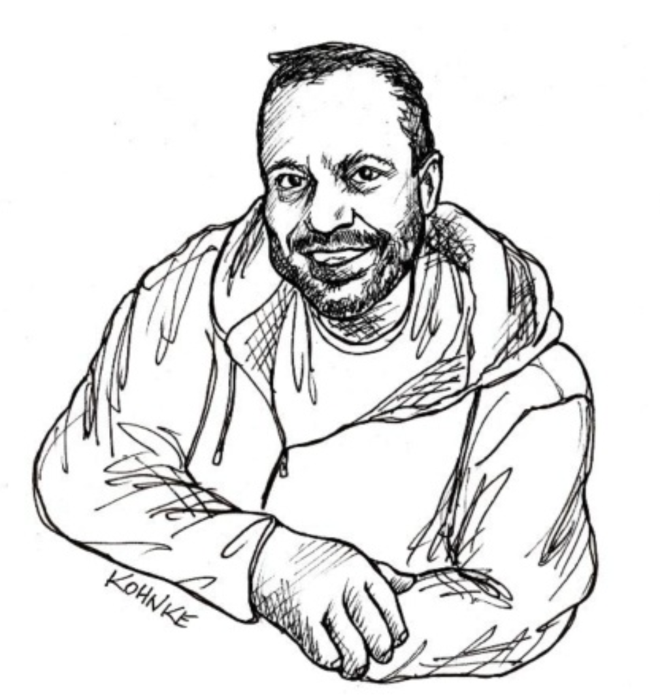

# 序言

 
Micah Daniel Martin

你手中掌握着构建高质量软件的秘诀 —— 这些秘诀会让你变得比现在更好，这些秘诀将帮助你成为一名工匠大师 (master craftsman)。

如同 Antonio Stradivari（也许是有史以来最杰出的制琴师）一样，Uncle Bob 倾尽一生来筛选和开发编写代码的最佳技术。
与 Stradivari 不同，后者将他的秘诀秘而不宣，以便只有他能制作出最好的小提琴，
而 Uncle Bob 则自愿、公开地分享他的秘诀，希望你也能够编写出精湛的代码。

这就是道 (the Way)：整洁代码之道 (the Way of Clean Code)。
这些是我的纪律、我的原则、我的技术。
我努力掌握它们全部。
为什么？
因为它们让我变得更好。
而且，这也是我父亲教导我的方式。

是的，Uncle Bob 是我的父亲。
他授予我撰写这篇序言的荣誉。
此外，请允许我介绍我的兄弟 Justin，他也是一名整洁代码践行者 (Clean Coder)，他撰写了后记。
两本 Uncle Bob 的第二版书籍能够将他的《整洁代码》第二版夹在中间，这是多么恰当啊。
（是的……当我写这句话时，听起来有点俗气，但我还是要写上去。）

让我告诉你一些关于 Uncle Bob 的事情，或者至少是我所认识的作为 “爸爸” 的那个版本的他。

我最早的记忆之一是骑在父亲的肩膀上，玩 “机器人” 游戏。
规则很简单。
我父亲是机器人，他完全按照我的指令行事……一丝不苟。

我：“去我的房间。”

爸爸：“我不知道怎么去。”

我：（思考……）“转。”

爸爸：“哪个方向？”

我：“向右转。”

爸爸：（开始顺时针旋转）90°……180°……360°……他没有停下来。

我：“停！”

爸爸：停下来。站在原地，面对着完全错误的方向。

我：“向右转……停！”

爸爸：顺从地转身并停下。我们现在正对着走廊，方向对了。

我：“开始走。”

爸爸：“我不知道怎么走。”

在接下来的几分钟里，我教机器人如何“走路”：把一条腿抬起适当的幅度，向前倾倒，然后用另一条腿重复这个动作。
我们同意将这个活动命名为 “走路”。

我：“开始走。”

爸爸：开始走路。

我：面对这个 “无知” 的机器人，我感到精疲力尽，但同时也因为成功地让它执行了我的命令而感到胜利。
我为最后的动作做准备——在走廊尽头左转。
“向左转！”

爸爸：“我还在走路”……然后我们 “砰” 地撞上了墙。
显然这个机器人是单线程的。
我们从墙上弹开，机器人继续走路……我们又 “砰” 地撞上了墙……一次又一次。

我：笑得停不下来。

在那 4 岁或 5 岁的稚嫩年纪，我的父亲正在通过 “机器人” 游戏教我如何编程。
那很有趣。
快进 5 年，我父亲带回了一台 Commodore 64。
“这是什么？” 我问道。
“一台电脑。”父亲回答。
“它是用来做什么的？”我仍然困惑地问道。
“嗯，有了电脑，你可以做这做那，做这做那，你甚至可以玩游戏。”

“游戏？给我看看！” 我接手了那台 Commodore 64，或者也许是我父亲把它给了我……无论如何，它都在我的房间里，我在上面玩了很多游戏。
我家附近有个孩子知道怎么盗版游戏，我们每周都会进行一次软盘交换。
除了从磁盘加载游戏外，我真的不知道如何使用电脑，每当出现问题时，比如 “按下磁带播放键”……我就会喊：“爸爸！救命！”

有一次，他让我坐到 Commodore 前，向我介绍了 Logo，一种带有海龟图形的编程语言。
他向我展示了如何让海龟转向、向前移动。
这就是机器人游戏！
我玩了一会儿 Logo，但觉得……很无聊。
我又回去玩游戏了。

然后，我观察到我的父亲使用 Logo 工作了很长时间（看起来像是永远，但可能只是几天）。
当他最终不再占用我的电脑时，他向我展示了他刚刚构建的登月着陆器 (Lunar Lander) 游戏。
那一刻我目瞪口呆，因为我意识到游戏就是这样构建的。
哇！登月着陆器 (Lunar Lander) 被纳入了我的游戏轮换列表，我自豪地向朋友们炫耀它。

几年后，我父亲带回家一台全新的 Apple Macintosh。
它太棒了。
“那个东西是什么？”
“这是一个鼠标。”太新奇了。
而且它有更多的游戏。
更好的游戏！Mac 放在我父亲的办公室（地下室）里，但当他去上班时，Mac 就归我了。
类似于登月着陆器 (Lunar Lander) 的事件，我父亲花了数周时间占用 Mac 来创建一款他称之为 “法老 (Pharaoh)” 的游戏。
“法老 (Pharaoh)” 比登月着陆器 (Lunar Lander) 大得多。
你是法老，你的目标是每年购买足够的牛、种植足够的庄稼、养活足够的工人，以便在你死之前建造一座金字塔。
这是一款有趣的游戏，我能看出我父亲在构建它时也很有趣。

编程太有趣了！这就是我到了上大学的年纪时得出的结论。
在我整个童年时期，如果我不是在电脑上玩得开心，那就是我父亲在编程时玩得开心。
我为什么会选择计算机科学以外的任何专业呢？
大学里的编程……并不有趣。
毕业后，我得到了一份 ThoughtWorks 的工作，谢天谢地，我父亲也提供了一份与他在 Object Mentor 一起工作的机会。
我当然接受了我父亲的邀请，在那里我有机会与业内一些最著名的人物和最优秀的软件工程师一起工作。
再一次，编程变得有趣了。
正是在 Object Mentor，我从父亲那里学到了整洁代码之道，构建了许多内部工具和开源项目，比如你将在本书后面看到的 FitNesse。

Object Mentor 主要是一家培训和咨询公司。
我们告诉人们如何构建好的软件。
我们并不真正为他们编写软件。
我承认，在做了几年培训师之后，我又萌生了构建软件的念头，而不是教别人如何构建软件。

一个机会出现了，Object Mentor 开始为一个客户开发软件。
这很棒，结果证明这是一种可靠的商业模式。
所以，我说服我父亲，Object Mentor 应该做更多的软件开发合同。
他同意了。
然后我试图说服他，我应该负责那个业务分支。
哎呀……那一步走得太远了。
他的回应像卡车一样撞击了我。
“如果你想管理事情，你应该自己创业。”
哇！这是他让我认清自己位置的方式吗？
还是他真的在建议我自己创业？
我断定是后者，所以我告诉他：“我辞职。”

我创建了一家名为 8th Light 的公司。
它（现在仍然是）一家合同软件开发公司。
客户雇佣我们为他们构建软件。
8th Light 的独特之处在于我们实践了整洁代码之道。
我们当时并没有这样称呼它，因为《整洁代码》第一版还没有写出来。
但我们把我父亲教给我的一切都付诸实践。
“Uncle Bob 编码之道” 听起来不那么顺口。
此外，8th Light 采纳了学徒制，这是我们在 Object Mentor 时曾尝试过的东西。
每个加入 8th Light 的人都必须经过 3 到 12 个月的学徒期，在此期间他们学习整洁代码之道。
我们完全投入在整洁代码上。
它奏效了吗？
当然！
对整洁代码的需求急剧上升。
我们训练学徒的速度无法满足需求。
到 2015 年我离开 8th Light 时，我们已经有了近一百名团队成员，其中大多数是 “整洁代码” 工匠，在我们的客户项目上工作。

但也许 8th Light 只是一个侥幸。
2020 年，我父亲和我决定创办 Clean Coders Studio。
这是我们现有合作关系 Clean Coders 的一个分支，我们通过它销售教育软件视频（ https://cleancoders.com ）。
然而，“Studio” 是我们业务中的合同软件开发分支，是的，由我负责运营。
再一次，我们比以往任何时候都更加全力投入整洁代码。
它奏效了吗？
当然。
又一次，我们训练学徒的速度无法满足需求。

这个行业想要整洁代码 (Clean Code)。
这个行业 **需要** 整洁代码 (Clean Code)。
这本书是你进入整洁代码 (Clean Code) 世界的指南。

关于如何最好地使用这本书，我有一些建议给你：

1. **不要急于求成。** 
这些页面涵盖了大量内容。
Clean Coders Studio 的学徒需要数月时间来内化所有材料。
不要觉得你需要在一周内把它全部塞进去。

2. **将其用作参考。** 
你可能想在有些页面上贴上标签。
例如，**SOLID 原则**；
当你试图与同伴讨论代码坏味时，你可能会想跳回那一节。

3. **阅读代码示例。**
当 Uncle Bob 逐步讲解代码更改时，例如 **Video Store** 示例，你可能会想直接跳到结尾。
不要这样。
跟着一步一步来。
理想情况下，你会让 Uncle Bob 坐在你旁边，与你结对编写这段代码。
他的逐步讲解是次优的选择。

4. **练习。**
“微积分不是一项旁观运动。”我仍然能听到我的教授在布置作业时背诵这句话。
编码也不是一项旁观运动。
你需要练习它来内化它。
尤其是 **TDD**。

5. **享受乐趣！**
Uncle Bob 在编码时享受乐趣。
相信我，他确实如此。
我也是。
整洁代码 (Clean Code) 应该帮助你在编写代码时也获得更多乐趣。

—— Micah Daniel Martin

