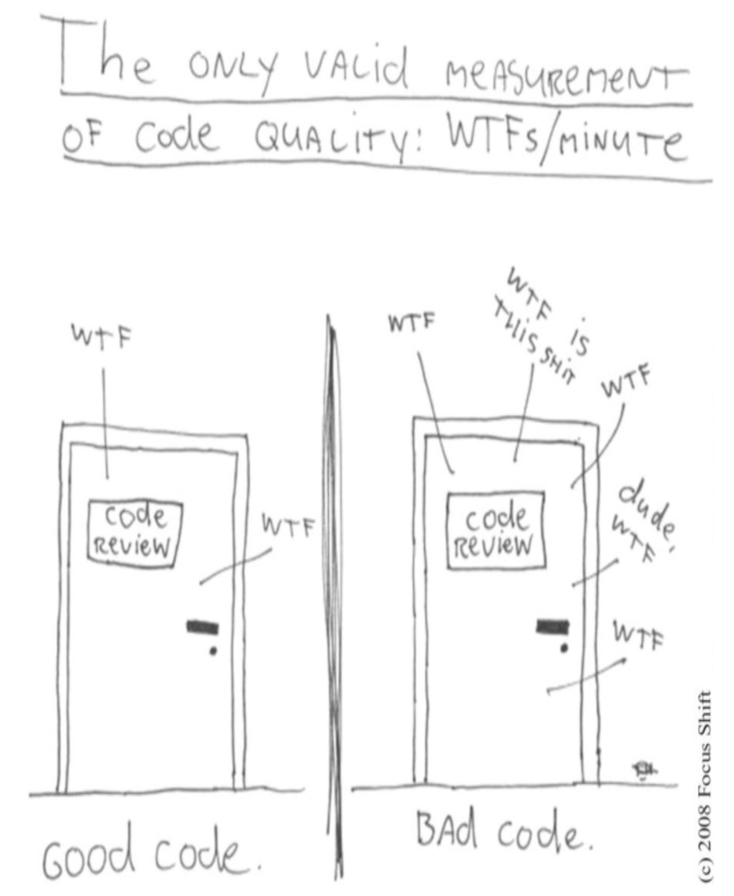

# 引言（来自久远的过去）
（这是第一版的引言。经过编辑和删减。）

 
经 Thom Holwerda (www.osnews.com/story/19266/WTFs_m) 友好许可转载。

看看上面的画。
哪扇门代表你的代码？
哪扇门代表你的团队或你的公司？
我们为什么在那个房间里？
这只是一次普通的代码审查，还是我们在上线后不久就发现了一连串可怕的问题？

我们是在恐慌中调试，仔细检查我们本以为能正常工作的代码吗？
客户是否在成群结队地流失，经理们是否正紧盯着我们？
我们如何确保在困难来临时，自己能站在正确的门后面？
答案是：工匠精神 (craftsmanship)。

学习工匠精神有两个部分：知识和工作。
你必须获得工匠所熟知的原则、模式、实践和启发法的知识，并且你还必须通过努力工作和实践，将这些知识磨炼到你的手指、眼睛和直觉中。

我可以教你骑自行车的物理学。
事实上，经典的数学相对简单。
重力、摩擦、角动量、质心等等可以用不到一页的方程式来证明。
有了这些公式，我可以向你证明骑自行车是可行的，并给你所有使其工作所需的知识。

然而，你第一次爬上那辆自行车时，仍然会摔倒。

编码也不例外。
我们可以写下所有关于整洁代码的 “感觉良好” 的原则，然后相信你会去做（换句话说，让你在骑上自行车时摔倒），
但那样的话，我们会是什么样的老师，你又会是什么样的学生呢？

不。
那不是这本书的运作方式。

学习编写整洁代码是艰苦的工作。
它需要的不仅仅是原则和模式的知识。
你必须为此付出汗水。
你必须自己练习，并看着自己失败。
你必须看着别人练习并失败。你必须看到他们跌跌撞撞并退回原路。
你必须看到他们为决策而痛苦，并看到他们为以错误的方式做出这些决策而付出的代价。

在阅读这本书时，请准备好努力工作。
这不是一本你可以在飞机上阅读并在降落前读完的 “感觉良好” 的书。
这本书会让你工作，并且是努力工作。
你会做什么样的工作呢？
你将会阅读代码 —— 大量的代码。
并且你将被挑战去思考那段代码中什么是正确的，什么是错误的。
你将被要求跟随我们（作者）将模块拆解并重新组合在一起。
这将需要时间和精力；但我们认为这将是值得的。
