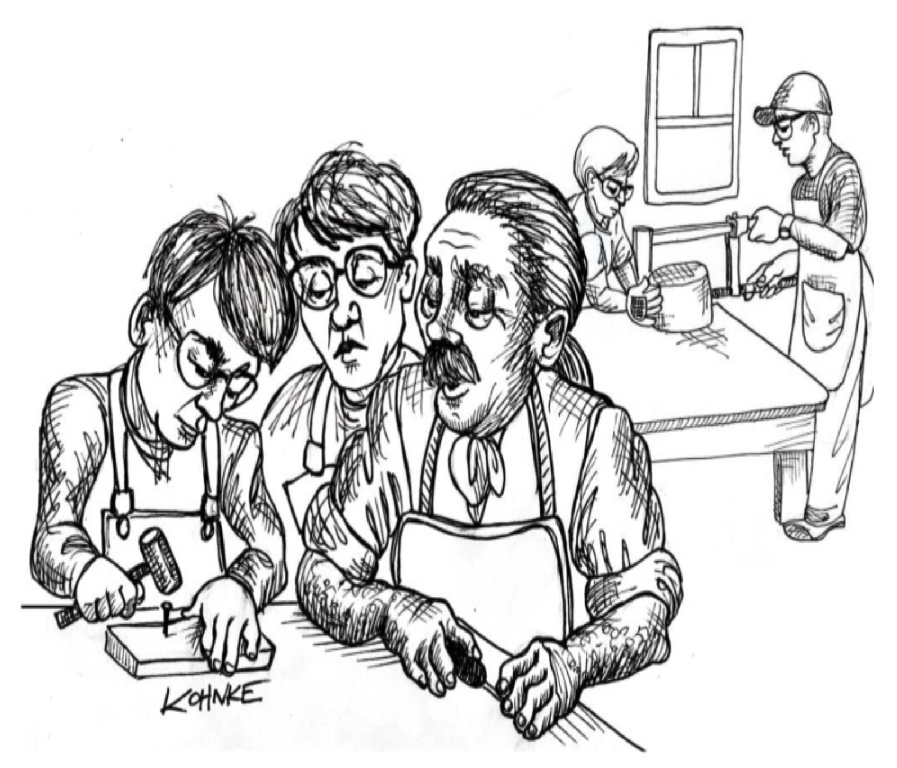

# 第四部分 工匠精神

 

以下内容是我从《Clean Craftsmanship》一书中删减和编辑的摘录。

软件职业的开端，在 1935 年夏天，以不吉利的方式开始，当时 Alan Turing 开始着手他的论文。
他的目标是解决一个使数学家困惑了十年或更久的数学难题： *判定问题 (Entscheidungsproblem)* 。

在这个目标上，他取得了成功；但当时他并不知道，他的论文将催生一个全球性的产业，我们都将依赖它，它现在构成了我们整个文明的命脉。

1945 年，Turing 为自动计算引擎（ACE）编写了代码。
他用二进制机器语言编写了这段代码，使用 32 进制数字。
在那之前，只有不到十二个人编写过这样的代码，所以 Turing 不得不发明和实现子程序、堆栈和浮点数等概念。

## “大量”

在花费数月时间发明了基础知识并用它们解决数学问题之后，他写了一份报告，陈述了以下结论。

> “我们将需要大量有能力的数学家，因为这类工作很可能需要大量进行。”

“大量”。
他怎么知道的？
实际上，他完全不知道那句陈述有多么具有先见之明；他无法想象我们现在拥有的那 “大量”。
但他说的另一件事是什么？
“有能力的数学家”。
你认为自己是有能力的数学家吗？
Turing 是的。

在同一份报告中，他接着写道：

> “我们的困难之一将是维持适当的纪律，这样我们就不会忘记我们在做什么。”

纪律！
Alan Turing 展望了八十年，看到我们的问题将是纪律。
就这样，他在软件专业精神的框架中放下了第一块石头。
他说，我们应该是有能力的数学家，并维持适当的纪律。

那是我们吗？那是你吗？

## 八十年

一个人的一生。
这就是截至本文撰写时我们职业的年龄。
在那八十年里发生了什么？

1945 年，世界上有屈指可数的几台计算机，程序员的数量也同样少。
在计算机科学术语中，这大约是 1 的量级：O(1)。
这些数字在最初几年迅速增长。
但让我们以此作为我们的原点。

1945 年。
计算机：O(1)。程序员：O(1)。

在接下来的十年里，真空管的可靠性、一致性和功耗得到了显著提高。
这使得建造更大、更强大的计算机成为可能。

到 1960 年，IBM 已经售出了 140 台 700 系列计算机。
这些是巨大、昂贵的庞然大物，只有军方、政府和非常大的公司才能负担得起。
按照我们的标准，它们是缓慢、贫乏且脆弱的。

正是在 50 年代，Grace Hopper 发明了高级语言的概念，并创造了 “编译器” 一词。
到 1960 年，她的工作导致了 COBOL 的出现。

1952 年，John Backus 提交了 FORTRAN 规范。
随后迅速开发了 ALGOL。
到 1958 年，John McCarthy 开发了 LISP。
因此，语言动物园的扩散开始了。

在那些日子里，没有操作系统，没有框架，没有函数库。
如果有东西在你的计算机上执行，那是因为你编写了它。
所以，在那些日子里，需要十几名或更多的程序员团队来维持一台计算机的运行。

到 1960 年，即 Turing 之后的 15 年，世界上大约有 O(100) 台计算机。
程序员的数量则高了一个数量级：O(1000)。

这些程序员是谁？
他们是像 Grace Hopper、Edsger Dijkstra、John von Neumann、John Backus 和 Jean Jennings 这样的人。
他们是科学家、数学家和工程师。
大多数人已经有了职业，并且已经理解了他们所雇用的企业和学科。
他们中的许多（如果不是大多数）都在 30 岁、40 岁和 50 岁左右。

20 世纪 60 年代是晶体管的十年。
这些小巧、简单、廉价且可靠的设备一点一点地取代了真空管。
这对计算机的影响是颠覆性的。

到 1965 年，IBM 已经生产了超过 10,000 台基于晶体管的 1401 计算机。
它们每月租金约为 2,500 美元，使成千上万的中型企业能够负担得起。

这些机器使用汇编器、Fortran、COBOL 和 RPG 进行编程。
所有租用这些机器的公司都需要配备程序员团队来编写他们的应用程序。

IBM 当时并不是唯一制造计算机的公司；所以我们只说，到 1965 年，世界上大约有 O(1E4) 台计算机。
如果每台计算机需要十名程序员来维持运行，那么一定存在 O(1E5) 名程序员。

Turing 之后二十年，世界上一定已经有几十万程序员。
这些程序员是从哪里来的？
没有足够的数学家、科学家和工程师来满足需求。
而且，大学里也没有计算机科学毕业生，因为没有任何地方有计算机科学学位课程。

所以公司从他们最优秀、最聪明的会计师、办事员、规划师中抽取 —— 任何具有已证明的技术能力的人。
他们找到了很多。

而且，这些人已经是另一个领域的专业人士。
他们 30 岁、40 岁、50 岁。
他们已经理解了截止日期和承诺，什么该保留，什么该省略。¹
而且，尽管这些人本身不是数学家，但他们是有纪律的专业人士。
Turing 很可能会赞同。

¹ 向 Bob Seeger 致歉。

但曲柄继续转动。
到 1966 年，IBM 每月生产 1,000 台 System/360。
这些计算机到处都是。
它们在当时是极其强大的。
型号 30 可以寻址 64K 字节的内存，每秒执行 35,000 条指令。

正是在这个时期，在 60 年代中期，Ole-Johan Dahl 和 Kristen Nygaard 发明了 SIMULA 67，第一种面向对象语言。

也正是在这个时期，Edsger Dijkstra 发明了结构化编程。

也正是在这个时候，Ken Thompson 和 Dennis Ritchie 发明了 C 和 Unix。

曲柄仍在转动。
在 70 年代初，集成电路开始常规使用。
这些小芯片可以容纳几十、几百甚至几千个晶体管。
它们使电子电路能够大规模小型化。

于是小型计算机诞生了。

在 60 年代末到 70 年代，数字设备公司（Digital Equipment Corporation）销售了 50,000 台 PDP8 系统和数十万台 PDP11 系统。

他们并不是唯一的！
小型计算机市场爆炸式增长。
到 70 年代中期，有几十家公司销售小型计算机。

因此，到 1975 年，即 Turing 之后的 30 年，世界上大约有 O(1E6) 台计算机。
那么有多少程序员呢？
比例开始改变。
计算机的数量正在接近程序员的数量。
所以，到 1975 年，大约有 O(1E6) 名程序员。

这数百万程序员从哪里来？
他们是谁？

他们是我。
我和我的伙伴们。
我和我那一群年轻、精力充沛、极客的男孩们。

成千上万的新电气工程和计算机科学毕业生 —— 我们都年轻。
我们都聪明。
在美国，我们都关心征兵问题。
而且我们几乎都是男性。

哦，并不是说女性在离开这个领域 —— 还没有。
那直到 80 年代中期才开始。
不，只是有更多的男孩（而且我们是男孩）进入这个领域。

1969 年，我作为程序员的第一次工作中，有大约二十几个程序员。
他们都 30 或 40 多岁，三分之一到一半是女性。

十年后，我在一家大约有五十名程序员的公司工作，其中大约有三名女性。

因此，在 Turing 之后的 30 年，编程的人口统计已经急剧转向非常年轻的男性。
成千上万的二十多岁的男性。

我们通常不是 Turing 会描述的那种有纪律的数学家。

但企业必须有程序员。
需求非常旺盛。
而非常年轻的男性在纪律方面的不足，他们会用精力来弥补。

而且我们也很便宜。
尽管今天程序员的起薪很高，但在那时，公司可以相当便宜地招聘程序员。
我 1969 年的起薪是每年 7,200 美元。

从那以后，这一直是趋势。
年轻男性和女性每年从计算机科学项目中大量涌现；而行业似乎对他们有着永不满足的需求。

在 1945 年到 1975 年的 30 年间，程序员的数量至少增长了一百万倍。
在那之后的 40 年里，增长率有所放缓，但仍然非常高。

你认为今年（2025年）世界上有多少程序员？
如果你包括 VBA 程序员，我认为这个数字一定是 O(1E8)。
今天世界上一定有数亿程序员。

这显然是指数增长。
指数增长曲线有一个倍增率。
你可以算一算。
嘿，Albert，如果我们从 1 增长到 1E8，在 80 年里，倍增率是多少？

> 1 亿以 2 为底的对数大约是 27 —— 除以 80，你得到大约 2.96。
所以，也许程序员的数量大约每三年左右翻一番。

实际上，正如我们之前看到的，在前几十年增长率更高，现在有所放缓。
我猜倍增率大约是五年。
每五年，世界上的程序员数量翻一番。

这个假设的含义是惊人的。
如果世界上的程序员数量每五年翻一番，这意味着世界上有一半的程序员经验不足五年；只要这种倍增率持续下去，这将永远成立。
这使得编程行业处于一个岌岌可危的地位 —— 永远缺乏经验。

### 书呆子与救世主

永远缺乏经验。
哦，别担心，这并不意味着你永远缺乏经验。
这只是意味着，一旦你获得了五年的经验，程序员的数量就会翻一番。
到你有十年经验时，程序员的数量已经翻了四番。

也许你认为 AI 会减缓这个速度。
不要被迷惑。
每一种本应减缓这个速度的新软件技术，实际上都只加速了它。
随便选一种新软件技术。
Fortran、C、Unix、OO、C++、Java、C#、Ruby、函数式……它们中没有一种减少了对新程序员的需求。
如果说有什么影响的话，那就是需求加速了，因为每一种技术都使这个领域对越来越多的人 ——主要是年轻人—— 变得可及。

人们看到编程行业中有这么多年轻人，就得出结论说这是一个年轻人的职业。
他们问：“所有的老年人都去哪了？”

我们都还在这里！我们没有去任何地方。
只是 50 年前我们没有那么多。

问题在于，我们这些老家伙不够多，无法教导进来的新程序员。
对于每一个有 30 年经验的程序员，大约有 63 个程序员需要向她（或他）学习一些东西；其中 32 个是全新的。

<ins>所以，永远缺乏经验，加上没有足够的导师来纠正问题。
于是，同样的老错误一遍又一遍地重复</ins>。

### 名声

但在过去的 80 年里，还发生了另一件事。
程序员获得了某些我确信 Alan Turing 从未预料到的东西：名声。

在 50 年代和 60 年代，没有人知道程序员是什么。
我们的人数不足以产生社会影响。
程序员没有住在很多人的隔壁。

这种情况在 70 年代开始改变。
到那时，父亲们已经在建议他们的儿子（有时是女儿）获得计算机科学学位。
世界上有足够的程序员，以至于每个人都认识某个认识程序员的人。
于是，书呆子、爱吃零食的极客形象诞生了。

很少有人见过计算机；但几乎每个人都听说过它们。
计算机出现在电视节目中，如《星际迷航》，以及电影中，如《2001太空漫游》和《巨人：福宾计划》。
在那些节目中，计算机本身往往被塑造为反派。

然而，请注意，在这些例子中，程序员都不是重要角色。
当时社会不知道如何看待程序员。
与机器本身相比，他们是模糊的、隐藏的，并且在某种程度上无关紧要。

我对这个时代的一则电视广告有着美好的回忆。
一位妻子和她的丈夫，一个戴着眼镜、有口袋保护器和计算器的书呆子小个子男人，正在杂货店比较价格。
Olsen 夫人将他描述为 “计算机天才”，并接着向妻子和丈夫讲解了某个特定品牌咖啡的好处。

那则广告中的计算机程序员是天真、书呆子气且无足轻重的。
一个聪明的人，但没有智慧或常识。
不是你会在聚会上邀请的人。

事实上，计算机程序员被视为那种在学校经常挨打的人。

到 1983 年，个人电脑开始出现；青少年出于多种原因对它们感兴趣，这一点很明显。
到这时，相当多的人至少认识一个计算机程序员。
我们被视为专业人士；但仍然神秘。

那一年，电影《战争游戏》将年轻的 Matthew Broderick 描绘成一个精通电脑的青少年黑客。
他侵入了美国武器控制系统 WOPR，以为这是一个视频游戏，并启动了热核战争的倒计时。
在电影结尾，他说服计算机唯一的制胜之道就是不要玩，从而拯救了世界。

计算机和程序员的角色互换了。
现在计算机是天真幼稚的角色，而程序员是智慧的渠道，如果不是来源的话。

我们在 1986 年的电影《霹雳五号》中看到了类似的情况，其中名为 “五号” 的计算机化机器人天真无辜，但在其笨手笨脚的创造者及其女友的帮助下学会了智慧。

到 1993 年，情况发生了巨大变化。
在电影《侏罗纪公园》中，程序员是反派，而计算机根本不是角色。
它只是一个工具。

社会开始理解我们是谁以及我们扮演的角色。
我们在短短 20 年内从书呆子升格为老师，再降格为反派。

但形象再次改变。在 1999 年的电影《黑客帝国》中，主要角色既是程序员又是救世主。
事实上，他们神一般的力量来自于他们阅读和理解 “代码” 的能力。

我们的角色变化很快。
在短短几年内从反派到救世主。
整个社会开始理解我们拥有的善恶力量。

### 榜样与反派

十五年后，2014 年，我访问了斯德哥尔摩的 Mojang 办公室，就整洁代码和测试驱动开发（TDD）进行讲座。

Mojang，如果你不知道的话，是制作游戏《我的世界》的公司。

之后，由于天气很好，Mojang 的程序员和我坐在外面的啤酒花园里聊天。

突然，一个大约 12 岁的小男孩跑到栅栏旁，向其中一位程序员喊道：“你是 Jeb 吗？”

他指的是 Jens Bergensten，Mojang 的首席程序员之一。

那个小伙子向 Jens 索要了签名，并向他提了很多问题。
他的眼中没有其他人。

程序员已经成为我们孩子的榜样和偶像。
他们梦想着长大后像 Jeb、Dinnerbone 或 Notch 一样。

程序员，现实生活中的程序员，是英雄。

但有英雄的地方，也有反派。

2015 年 10 月，大众汽车北美首席执行官 Michael Horn 在美国国会作证，关于他们汽车中欺骗 EPA 测试设备的软件。

当被问及公司为什么这样做时，他指责程序员。他说：“这是几个软件工程师出于某种原因加入的。”

当然，他在 “某种原因” 上撒谎。
他非常清楚原因是什么，大众公司上下也很清楚。
他试图将责任推给程序员的拙劣尝试相当明显。

另一方面，他说得完全正确。
正是某些程序员编写了那些撒谎、欺骗的代码。

而那些程序员，无论他们是谁，都给我们所有人带来了坏名声。
如果我们有一个真正的专业组织，他们作为程序员的资格应该并且将会被撤销。
他们背叛了我们所有人。他们玷污了我们职业的荣誉。

所以我们已经毕业了。
花了 80 年。
但我们已经在那段时间里从无名小卒，到书呆子，到榜样，到英雄和反派。

社会已经开始 ——仅仅开始—— 理解我们是谁，以及我们代表的威胁和承诺。
（更多内容，请参见 [第 1 章](ch1/0.md) “整洁代码” 中的 “我们为什么要保持整洁？” 部分。）

### 我们统治世界

但社会还没有完全理解一切。
事实上，我们也没有。
正如我在引言中告诉你的，你和我，我们程序员；我们统治世界。

这听起来可能有些夸张。
但想想看。
现在世界上的计算机数量比人口还多。
而且数量超过我们的计算机为我们执行着无数重要的任务。

它们记录我们的提醒。
它们管理我们的日历。
它们传递我们的 Facebook 消息并保存我们的相册。
它们连接我们的电话并传递我们的短信。

它们控制我们汽车的发动机，以及刹车、油门，有时甚至是方向盘。

没有它们我们无法做饭。
没有它们我们无法洗衣服。
它们在冬天让我们的房子保持温暖。
它们清扫和拖地我们的地板。
当我们无聊时它们娱乐我们。
它们记录我们的银行记录和信用卡。
它们帮助我们支付账单。

事实上，西方世界的大多数人每天醒着的每一分钟都在与某个软件系统交互。
有些人甚至在睡觉时继续交互。

关键是，没有软件，我们的社会什么也不会发生。
没有产品被买卖。
没有法律被制定或执行。
没有汽车行驶。
没有亚马逊产品被送达。
没有电话连接。
没有电力从插座输出。
没有食物被送到商店。
没有水从水龙头流出。
没有气体被输送到熔炉。
没有软件监控和协调这一切。

而 **我们** 编写那些软件。
这使我们成为世界的统治者。

哦，其他人认为他们制定规则 —— 但他们把那些规则交给我们，而 **我们** 编写在机器中执行的规则，这些机器监控和协调我们生活的方方面面。

社会还没有完全理解这一点。
不太理解。
还没有。
但总有一天社会会非常清楚地理解这一点。

我们程序员也还没有完全理解这一点。
没有真正理解。
但同样，总有一天它会残酷地让我们明白。

### 灾难

多年来，我们已经看到了大量的软件灾难。
其中一些相当壮观。

在 2018 年至 2019 年间，两架 737 MAX 飞机以接近音速的速度俯冲坠地，造成 346人 死亡。
原因：硬件故障暴露的软件弱点。

2016 年，我们失去了斯基亚帕雷利火星着陆器和漫游车，因为一个软件问题导致着陆器认为它已经着陆，而实际上它距离地表近 4 公里。

1999 年，我们失去了火星气候轨道器，因为一个地面软件错误使用英制单位（磅-秒）而不是公制单位（牛顿-秒）向轨道器传输数据。
这个错误导致轨道器下降到火星大气层太深，在那里被撕成碎片。

1996 年，阿丽亚娜 5 号运载火箭和有效载荷在发射后 37 秒被摧毁，原因是当一个 64 位浮点数进行未经检查的转换为 16 位整数时发生了整数溢出异常。
该异常导致机载计算机崩溃，飞行器自毁。

我们是否应该谈谈 Therac-25 辐射治疗机，由于竞争条件，它用高功率电子束轰击患者，导致三人死亡，三人受伤？

或者也许我们应该谈谈 Knight Capital，他们在 45 分钟内损失了 4.6 亿美元，因为他们重用了激活系统中无意中留下的死代码的标志。

或者也许我们应该谈谈丰田堆栈溢出漏洞，该漏洞导致汽车失控加速 —— 可能造成多达 89 人死亡。

或者也许我们应该谈谈 Healthcare.gov 以及几乎推翻一项新的、有争议的美国医疗保健法律的软件故障。

这些灾难已经花费了数十亿美元和许多生命。
而它们是由程序员造成的。

我们，程序员，通过我们编写的代码，正在杀人。

现在我知道你进入这个行业不是为了杀人。
很可能你成为程序员是因为你写了一个无限循环打印了你的名字一次，你体验到了那种权力的喜悦感。

但事实就是事实。
我们现在在社会中处于一个我们的行为可以摧毁财富、生计和生命的地位。

总有一天，可能不会太久，某个可怜的程序员会做一些有点愚蠢的事情，数万人将会死亡。

这不是疯狂的猜测 —— 这只是时间问题。

当这种情况发生时，世界上的政客们将要求一个说法。
他们将要求我们向他们展示我们将如何防止这种情况在未来发生。

如果我们没有伦理声明就出现；如果我们没有任何标准或定义的纪律就出现；如果我们出现并抱怨我们的老板设定了不合理的进度和截止日期……

那么我们将被认定 **有罪** 。

## 誓词

因此，为了开始定义我们作为软件开发人员的伦理，我提供以下誓词。

为了捍卫和维护计算机程序员职业的荣誉，我承诺，尽我最大的能力和判断：

1. 我不会产生有害的代码。

2. 我生产的代码将永远是我最好的工作。
我不会故意允许在行为或结构上有缺陷的代码积累。

3. 我将在每次发布时，提供一个快速、确定且可重复的演示，证明代码的每个元素都按预期工作。

4. 我将进行频繁的小规模发布，以免阻碍他人的进度。

5. 我将抓住每一个机会，无畏且不懈地改进我的作品。
我永远不会降低它们的质量。

6. 我将尽我所能，使自己和他人保持尽可能高的生产力。
我不会做任何降低生产力的事情。

7. 我将持续确保其他人可以替代我，我也可以替代他们。

8. 我将提供在幅度和精度上都诚实的估算。
没有合理的确定性，我不会做出承诺。

9. 我将尊重我的程序员同行，因为他们的伦理、标准、纪律和技能。
在我对同行程序员的尊重中，任何其他属性或特征都不会成为因素。

10. 我将永不停止学习和改进我的手艺。
