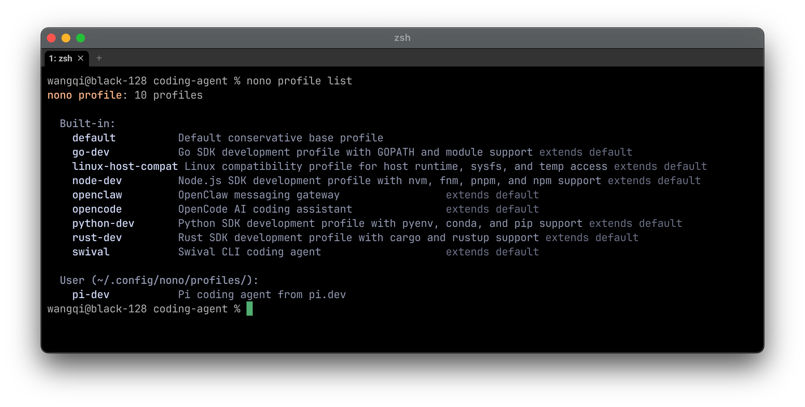
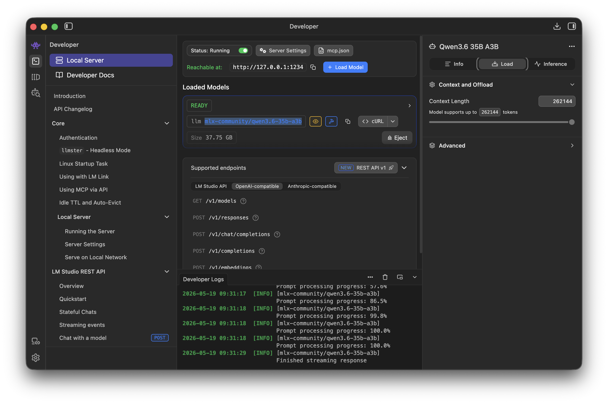
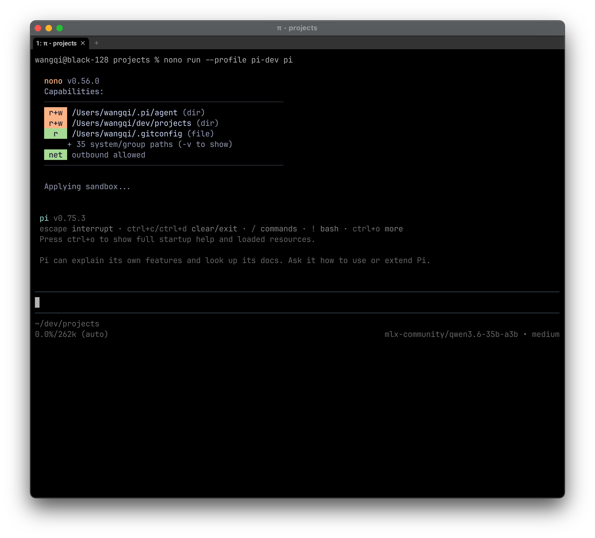

# pi.dev 安装步骤

这里简要描述了如何安装 [nono.sh](https://nono.sh/docs/cli/getting_started/installation) 以及 [pi.dev](https://pi.dev) ，同时集成 [LM Studio](https://lmstudio.ai/) 中运行的 LLM 。
## 安装 Nono

nono 将限制 coding harness 的权限，同时只占用很少的系统资源（CPU，内存），比容器方式更加高效。

1. 访问 [nono.sh](https://nono.sh/docs/cli/getting_started/installation)

2. 使用 brew 进行安装 `brew install nono`

3. 为 pi 准备一个 nono profile，细节请参考 [官方文档](https://nono.sh/docs/cli/features/profiles-groups#creating-user-profiles) 。

```sh
# 创建一个继承 default 配置、并启用 node_runtime 组的 profile。
nono profile init pi-mono --extends default --groups node_runtime

# 验证生成的 profile
nono profile validate ~/.config/nono/profiles/pi-mono.json

# 使用 profile
nono run --profile pi-mono -- pi
```

4. 将 [pi-mono.json](./pi-mono.json) 添加至目录 `~/.config/nono/profiles/`
  - 这是个 pi.mono 的 profile 文件，
  - 保持文件名不变
  - 运行 `nono profile list` 确保配置文件没有错误

请参考下图



 pi-mono.json
```json
{
  "extends": "default",
  "meta": {
    "name": "pi-mono"
  },
  "groups": {
    "include": [
      "node_runtime"
    ]
  },
  "workdir": {
    "access": "readwrite"
  },
  "filesystem": {
    "allow": [
      "$HOME/.pi/agent/", // 这个是 pi 的默认安装路径
      "$HOME/dev/projects/" // 把这个换成你自己的项目目录
    ],
    "read": [
    ]
  },
  // 下面是运行 nono run --profile pi-mono -- pi后， MacOS 系统提示添加的内容
  "unsafe_macos_seatbelt_rules": ["(allow user-preference-read)"]
}
```

## 启动 LM Studio

 [LM Studio](https://lmstudio.ai/) 将提供 LLM 及推理引擎。你需要预先下载相应的 LLM 模型，这个例子中使用的是：qwen3.6-35b-a3b。

- 在 Developer 页签，
  - 启动并加载模型：`mlx-community/qwen3.6-35b-a3b`
  - 下面的配置文件中将使用这个模型
- 设置模型的上下文大小：262144 (这个值取决于具体的模型)
- 检查 LM Studio 服务器运行在 1234 端口
  - 运行 `curl http://127.0.0.1:1234/v1/models`
  - 能返回模型列表 → 正常
- 请参考下图



## 安装 pi.dev

- 访问 [pi.dev](https://pi.dev/)
- 运行安装程序 `curl -fsSL https://pi.dev/install.sh | sh`
- 进入授权的工作目录 `cd $HOME/dev/projects` 
  - `dev/projects` 是示例工作目录，你可进入自己的工作目录
  - 如果你的工作目录不同，则要修改 [pi-mono.json](./pi-mono.json) 中的 `filesystem` 部分。
  - 若在任意目录中启动，nono 会询问你是否授权读写当前目录
- 在 nono 沙箱中运行 pi，同时检查授权访问情况
  - 运行 pi： `nono run -v --profile pi-dev pi` 
  - -v 选项，打印所有授权内容 
  - 此时你可以检查 nono 授权了对哪些资源的访问
  - 确认授权无误后，`ctrl-c` 退出 pi
- 为 pi 运行，配置推理引擎
  - 将 [models.json](./models.json) 另存为文件 `~/.pi/agent/models.json`
  - `models.json` 中已经预置了上一节中加载的模型，你可以查看一下这个文件，
  - 若你使用不同的 LLM，则需要修改 `models.json` 中相应的内容。
  - 注意推理引擎不受 nono 控制
- 在 nono 沙箱中运行 pi，同时连接推理引擎
  - 运行 pi： `nono run --profile pi-mono pi`
- 请参考下图



## 为 pi 设置中文回答

路径： `~/.pi/agent/AGENTS.md`，内容如下：

 ```
# Global Instructions

- 始终用中文回答（包括代码注释、文档说明）
- 除非用户明确要求使用其他语言
 ```

## 安装 Lattice

### 为 pi 安装 Lattice skills

```sh
git clone https://github.com/techygarg/lattice.git
cd lattice
./tools/install.sh ~/.pi/agent/skills/
```

