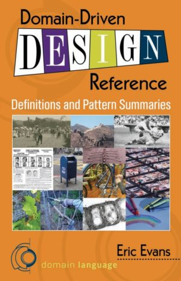

## 领域驱动设计参考：定义和模式总结（非盈利，非官方）
---

### 目录

- [致谢](ack.md)
- [定义](definitions.md)
- [模式语言概述](overview.md)
- [I. 将模型付诸实践](ch1/0.md)
  * [有界上下文: Bounded Context](ch1/1.md)
  * [通用语言: Ubiquitous Language](ch1/2.md)
  * [持续集成: Continuous Integration](ch1/3.md)
  * [模型驱动设计: Model-Driven Design](ch1/4.md)
  * [实践型建模师: Hands-on Modelers](ch1/5.md)
  * [重构以获得更深层的洞察](ch1/6.md)
- [II. 模型驱动设计的基石](ch2/0.md)
  * [分层架构: Layered Architecture](ch2/1.md)
  * [实体: Entities](ch2/2.md)
  * [值对象: Value Objects](ch2/3.md)
  * [领域事件: Domain Events *](ch2/4.md)
  * [服务: Services](ch2/5.md)
  * [模块: Modules](ch2/6.md)
  * [聚合体: Aggregates](ch2/7.md)
  * [存储库: Repositories](ch2/8.md)
  * [工厂: Factories](ch2/9.md)
- [III. 灵活设计](ch3/0.md)
  * [意图显露接口: Intention-Revealing Interfaces](ch3/1.md)
  * [无副作用函数: Side-Effect-Free Functions](ch3/2.md)
  * [断言: Assertions](ch3/3.md)
  * [独立类: Standalone Classes](ch3/4.md)
  * [操作闭包: Closure of Operations](ch3/5.md)
  * [声明式设计: Declarative Design](ch3/6.md)
  * [借鉴成熟的形式体系: Drawing on Established Formalisms](ch3/7.md)
  * [概念轮廓: Conceptual Contours](ch3/8.md)
- [IV. 战略设计的上下文地图](ch4/0.md)
  * [上下文地图: Context Map](ch4/1.md)
  * [伙伴关系: Partnership *](ch4/2.md)
  * [共享内核: Shared Kernel](ch4/3.md)
  * [客户/供应商开发团队: Customer/Supplier Development](ch4/4.md)
  * [顺从者: Conformist](ch4/5.md)
  * [反腐层: Anticorruption Layer](ch4/6.md)
  * [开放主机服务: Open-host Service](ch4/7.md)
  * [公开的语言: Published Language](ch4/8.md)
  * [分道扬镖: Separate Ways](ch4/9.md)
  * [一团乱麻: Big Ball of Mud *](ch4/10.md)
- [为战略设计提炼](ch5/0.md)
  * [Core Domain](ch5/1.md)
  * [Generic Subdomains](ch5/2.md)
  * [Domain Vision Statement](ch5/3.md)
  * [Highlighted Core](ch5/4.md)
  * [Cohesive Mechanisms](ch5/5.md)
  * [Segregated Core](ch5/6.md)
  * [Abstract Core](ch5/7.md)
- [Large-scale Structure for Strategic Design](ch6/0.md)
  * [Evolving Order](ch6/1.md)
  * [System Metaphor](ch6/2.md)
  * [Responsibility Layers](ch6/3.md)
  * [Knowledge Level](ch6/4.md)
  * [Pluggable Component Framework](ch6/5.md)
