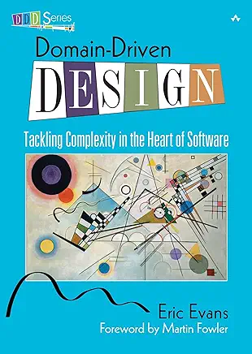

## 领域驱动设计：中文版（非盈利，非官方）
----

### 目录
* [对《领域驱动设计》的赞誉](praise.md)
* [序言](foreword.md)
* [前言](preface/0.md)
  - [对比三个项目](preface/1.md)
  - [复杂性的挑战](preface/2.md)
  - [设计与开发流程](preface/3.md)
  - [本书结构](preface/4.md)
  - [谁应该阅读本书](preface/5.md)
  - [领域驱动团队](preface/6.md)
* [致谢](acknowledgments.md)
* [第一部分：让领域模型发挥作用](part1.md)
  - [第一章 提炼知识](ch1/0.md)
    * [有效建模的要素](ch1/2.md)
    * [知识提炼](ch1/2.md)
    * [持续学习](ch1/3.md)
    * [知识密集型设计](ch1/4.md)
    * [深度模型](ch1/5.md)
  - [第二章 沟通与语言运用](ch2/0.md)
    * [通用语言](ch2/1.md)
    * [大声说出模型](ch2/2.md)
    * [一个团队，一种语言](ch2/3.md)
    * [文档与图表](ch2/4.md)
    * [解释性模型](ch2/5.md)
  - [第三章 绑定模型与实现](ch3/0.md)
    * [模型驱动设计](ch3/1.md)
    * [建模范式与工具支持](ch3/2.md)
    * [让骨架显露：模型为何对用户至关重要](ch3/3.md)
    * [实践型建模师](ch3/4.md)
* [第二部分：模型驱动设计的基石](part2.md)
  - [第四章 领域隔离](ch4/0.md)
    * [分层架构](ch4/1.md)
    * [领域层是模型栖身之所](ch4/2.md)
    * [智能 UI 的 “反模式”](ch4/3.md)
    * [其他类型的隔离](ch4/4.md)
  - [第五章 软件表达的模型](ch5/0.md)
    * [关联关系](ch5/1.md)
    * [实体（又称引用对象）](ch5/2.md)
    * [值对象](ch5/3.md)
    * [服务](ch5/4.md)
    * [模块（又称包）](ch5/5.md)
* [附录：本书中模式的运用](appendix.md)
* [术语表](glossary.md)
* [参考文献](references.md)
* [图片鸣谢](photo-credits.md)
