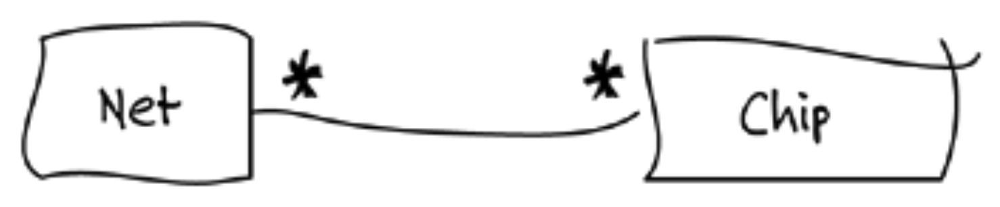
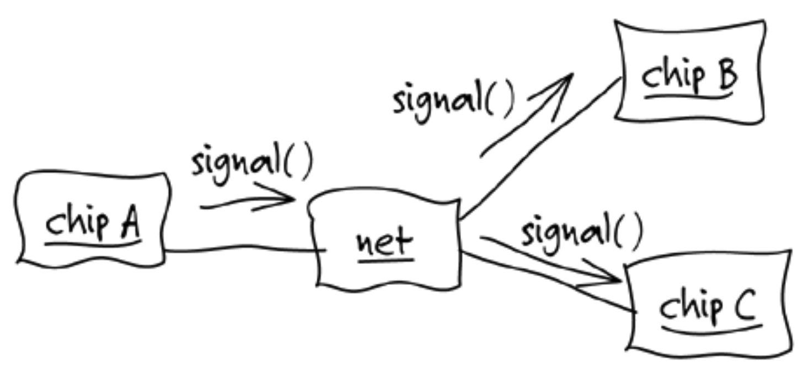
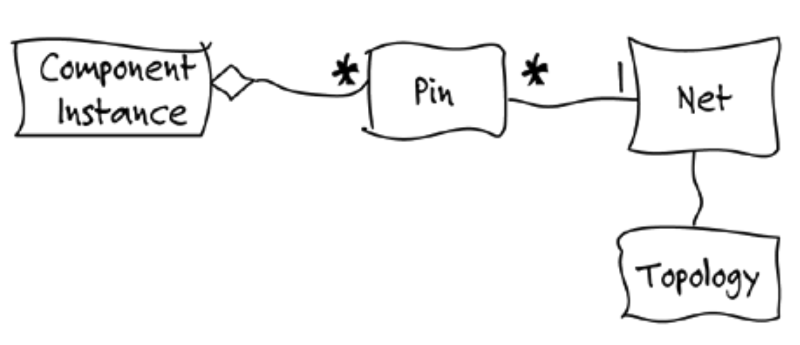
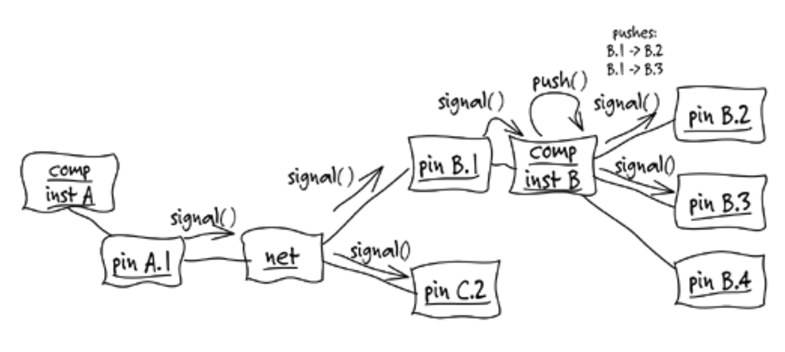
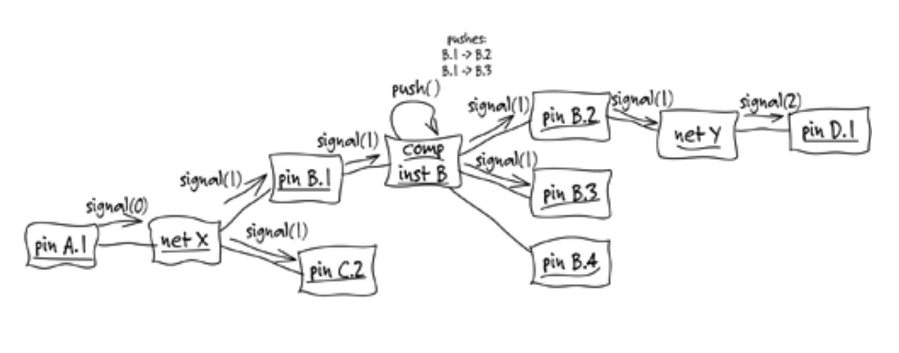
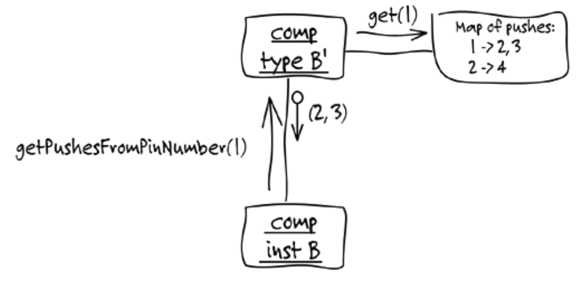
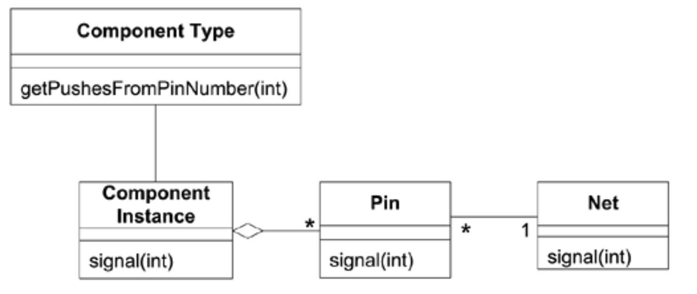

## 第 1 章 消化知识

#### ▶[上一节](../part1.md)

几年前，我着手设计一款用于印刷电路板（PCB）设计的专用软件工具。问题在于：我对电子硬件一窍不通。我能接触到一些 PCB 设计师，但他们通常三分钟就能让我头晕目眩。我该如何掌握足够知识来编写这款软件？在交付期限前成为电气工程师显然是不可能的！

我们尝试让 PCB 设计师详细说明软件功能需求。这显然是个错误的决定。他们虽是顶尖的电路设计师，但提出的软件方案无非是读取 ASCII 文件、进行排序、添加标注后输出报告。这显然无法实现他们期望的生产力飞跃。

最初几次会议令人沮丧，但他们要求的报告中却透出一线希望。这些报告总离不开`nets`及其各种细节。在这个领域，`net`本质上是一种导线，能够连接 PCB 上的任意数量组件，并将电信号传递至所有连接点。我们由此获得了领域模型的首个要素。

#### Figure 1.1

在讨论他们对软件功能的需求时，我开始为他们绘制示意图。我采用了一种非正式的对象交互图变体来演示各种场景。

#### Figure 1.2

**PCB专家 1**：组件不必是芯片。

**开发者（我）**：那我直接称它们为`components`就行？

**专家 1**：我们称之为`component instances`。同类组件可能存在多个实例。

**专家 2**：那个`net`框看起来就像组件实例。

**专家 1**：他没用我们的符号体系。对他们来说，所有东西都是方框吧。

**开发者**：很抱歉，确实如此。看来我得再详细解释下这个符号体系了。

他们不断纠正我的错误，而随着纠正的过程，我开始学习。我们逐步消除了术语中的冲突和歧义，化解了技术观点的分歧，而他们也在学习。他们开始更精确、更一致地阐述问题，我们由此共同构建起模型。

**专家 1**：仅说信号到达某个`ref-des`是不够的，我们必须知道具体是哪根引脚。

**开发者**：`ref-des`？

**专家 2**：就是`component instances`的意思。在我们使用的特定工具里，它被称为`ref-des`。

**专家 1**：总之，`net`是将某个实例的特定引脚连接到另一个实例的特定引脚。

**开发者**：您的意思是每个引脚只属于一个`component instance`，且只连接一个`net`？

**专家 1**：没错。

**专家 2**：此外，每个`net`都有拓扑结构，这种布局决定了`net`元素的连接方式。

**开发者**：明白了，这个怎么样？

#### Figure 1.3

为集中探索方向，我们暂时将研究范围限定于某个特定特性。通过 “探针仿真 (probe simulation)” 追踪信号传播路径，可定位设计中各类问题的潜在发生点。
 
**开发者**：我理解信号如何通过`Net`传输至所有连接`Pins`，但后续传播机制如何？`Topology`结构是否涉及其中？

**专家 2**：不涉及。组件会将信号推送通过。

**开发者**：我们显然无法建模芯片内部行为，那过于复杂。

**专家 2**：不必如此。我们可以采用简化方案，只需列出信号从特定`Pins`推送至其他引脚的传递路径。

**开发者**：像这样吗？

\[经过反复尝试，我们共同勾勒出一个场景\]

#### Figure 1.4

**开发者**：但具体来说，你们需要从这个计算中了解什么？

**专家 2**：我们要关注的是信号延迟过长的路径 —— 比如超过两到三个跳点的信号路径。这是经验法则。如果路径过长，信号可能无法在时钟周期内到达。
 
**开发者**：超过三跳……所以我们需要计算路径长度。那么什么算作一次跳跃？

**专家 2**：信号每次跨越一个`Net`时，就计为一次跳跃。

**开发者**：那我们可以传递跳跃次数，当信号经过`Net`时递增计数，比如这样。

#### Figure 1.5

**开发者**：唯一不明确的是这些 “推送” 数据的来源。我们是否为每个`Component Instance`都存储这些数据？

**专家 2**：所有组件实例的推送数据应保持一致。

**开发者**：所以推送内容由组件类型决定？每个实例的推送内容都相同？

#### Figure 1.6

**专家 2**：我不太确定其中某些内容的具体含义，但我想每个组件存储推送通过数据时应该类似于那种形式。

**开发者**：抱歉刚才说得太详细了，我只是在梳理思路……那么现在`Topology`结构该如何融入其中？

**专家 1**：这部分不用于探针仿真。

**开发者**：那我暂时先移除它，行吗？等涉及相关功能时再加入。

讨论就这样持续着（实际过程比这里描述的更磕绊）。我们不断头脑风暴、反复打磨，既提出质疑又相互阐释。随着我对领域知识的深入理解，以及他们对模型如何融入解决方案的认知提升，模型也随之演进。早期模型的类图大致如下所示：

#### Figure 1.7

经过几天兼职工作后，我感觉自己已掌握足够知识可以尝试编写代码。我基于自动化测试框架编写了一个极其简单的原型。刻意避开了所有基础架构。既没有持久化存储，也没有用户界面（UI）。这让我能专注于行为逻辑的实现。短短几天后，我便成功演示了简单的探测模拟。尽管使用了虚拟数据并以原始文本形式输出到控制台，但它确实通过 Java 对象完成了路径长度的实际计算。这些 Java 对象体现了领域专家与我共同认可的模型。

这个原型的具体性让领域专家更清晰地理解了模型的含义及其与运行软件的关联。从那时起，我们的模型讨论变得更具互动性，他们能看到我如何将新获得的知识融入模型并转化为软件，同时还能通过原型获得具体反馈来评估自己的想法。

该模型中蕴含着与我们所解决问题相关的 PCB 领域知识，其复杂程度自然远超此处所示。它整合了大量同义词和描述中的细微差异，同时剔除了数百条工程师虽了然于心却与核心问题无关的信息，例如组件的实际数字特性。像我这样的软件专家只需几分钟就能通过图表掌握软件核心逻辑。它提供了一个框架，帮助我们快速整理新信息、更精准判断关键要素、更高效地与 PCB 工程师沟通。

当工程师描述所需新功能时，我会要求他们逐步演示对象交互场景。当模型对象无法支撑关键场景时，我们便集思广益设计新对象或改造旧对象，深度挖掘他们的知识储备。模型由此不断精炼，代码实现协同进化。数月后，PCB 工程师们获得了一套远超预期的强大工具。

#### ▶[下一节](1.md)
