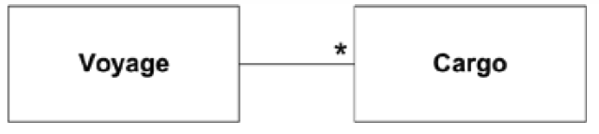
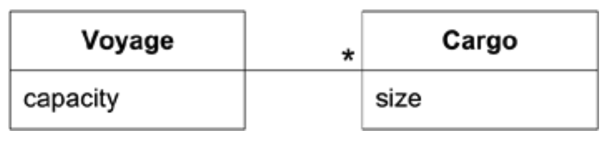
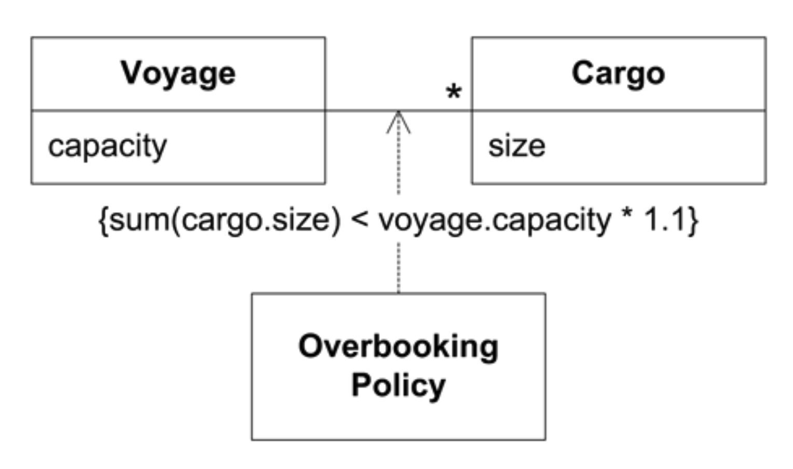

## 知识密集型设计

#### ▶[上一节](3.md)

<ins>PCB 示例模型所捕获的知识远不止于 “找出名词”。业务活动与规则对领域而言，其重要性不亚于涉及的实体；任何领域都包含各类概念。知识消化能生成反映此类洞见的模型</ins>。在模型变更的同时，开发人员重构实现方案以体现模型，使应用程序能够运用这些知识。

正是突破实体与值的局限，知识消化才可能深入展开，因为业务规则间可能存在实际矛盾。领域专家通常未意识到其思维过程的复杂性：他们在工作中驾驭所有规则、调和矛盾、用常识填补空白，这些操作往往在无意识中完成。软件无法完成此类工作。唯有通过与软件专家紧密协作进行知识处理，才能厘清规则、完善细节、化解矛盾或明确排除范围。

#### 示例：提取隐藏概念

让我们从一个非常简单的领域模型开始，它可以作为船舶航次货物预订应用程序的基础。

#### Figure 1.8
</br>

我们可以明确，预订应用程序的职责是将每批`Cargo`与`Voyage`关联起来，并记录和追踪这种关联关系。
目前进展顺利。在应用程序代码的某个位置，可能存在如下方法：

```java
public int makeBooking(Cargo cargo, Voyage voyage) {
   int confirmation = orderConfirmationSequence.next();

   voyage.addCargo(cargo, confirmation);
   return confirmation;
}
```

由于总会有最后一刻的取消，航运业的标准做法是接受超过特定船舶单次航程承载能力的货物量，这被称为 “超额预订”。有时采用简单的运力百分比，例如预订 110% 的运力；在其他情况下则应用复杂规则，优先考虑大客户或特定类型的货物。

这是航运领域的基本策略，任何航运从业者都知晓此法，但软件团队中的技术人员未必都能理解。

需求文档包含以下内容：

- *允许超额预订 10%。*

类图和代码现已调整为如下形式：

#### Figure 1.9
</br>

```java
public int makeBooking(Cargo cargo, Voyage voyage) {
   double maxBooking = voyage.capacity() * 1.1;

   if ((voyage.bookedCargoSize() + cargo.size()) > maxBooking)
      return -1;

   int confirmation = orderConfirmationSequence.next();
   voyage.addCargo(cargo, confirmation);
   return confirmation;
}
```

现在，一条重要的业务规则被隐藏在应用程序方法的守护子句中。在后续的 [第 4 章](../ch4/0.md) 中，我们将探讨 [LAYERED ARCHITECTURE](../ch4/1.md) 原则，该原则将引导我们将超额预订规则移至领域对象。但目前，让我们专注于如何使该知识更明确且对项目中的每个人都更易获取。这将使我们得出类似的解决方案。

1. 按此代码的写法，即使有开发人员的指导，任何商业专家也很难通过阅读代码来验证规则。

2. 对于技术人员而非商业人士而言，将需求文档与代码建立关联将相当困难。

若规则更为复杂，则风险将成倍增加。

我们可调整设计以更精准地体现此知识。超额预订规则本质上是一种策略 (policy)。 *策略 (Policy)*  即设计模式中 [STRATEGY](../ch12/1.md) （ [Gamma 等人，1995](../references.md#gamma-1995) ）的别称。该模式通常源于替换不同规则的需求，据我们所知，此处并无此类需求。但我们试图捕捉的概念确实契合策略的 *含义*，这在领域驱动设计中同样是重要的设计动机（参见 [第 12 章 设计模式与模型的关联](../ch12/0.md) ）。

#### Figure 1.10
</br>

代码现在是：

```java
public int makeBooking(Cargo cargo, Voyage voyage) {
   if (!overbookingPolicy.isAllowed(cargo, voyage)) return -1;

   int confirmation = orderConfirmationSequence.next();
   voyage.addCargo(cargo, confirmation);
   return confirmation;
}
```

新的`Overbooking Policy`类包含以下方法：

```java
public boolean isAllowed(Cargo cargo, Voyage voyage) {
   return (cargo.size() + voyage.bookedCargoSize()) <= (voyage.capacity() * 1.1);
}
```

所有人都将清楚地认识到，超额预订是一项独立的政策，其实施规则明确且独立。

*不过，我并非建议将如此精细的设计应用于领域中的每个细节。* [第 15 章 提炼](../ch15/0.md) 深入探讨了如何聚焦核心要素，同时最小化或分离其余内容。<ins>本例旨在说明：领域模型及其对应设计可用于保障知识安全并促进知识共享。更显性 (explicit) 的设计具有以下优势：</ins>

1. <ins>为了使设计达到这一水准，程序员及所有相关人员必须深刻理解超额预订的本质，这不仅是晦涩的计算，更是独特且重要的业务规则。</ins>

2. <ins>程序员可以向业务专家展示技术成果，甚至是代码，这些内容应当对领域专家可理解的（在指导下），从而实现反馈闭环。</ins>

#### ▶[下一节](5.md)
