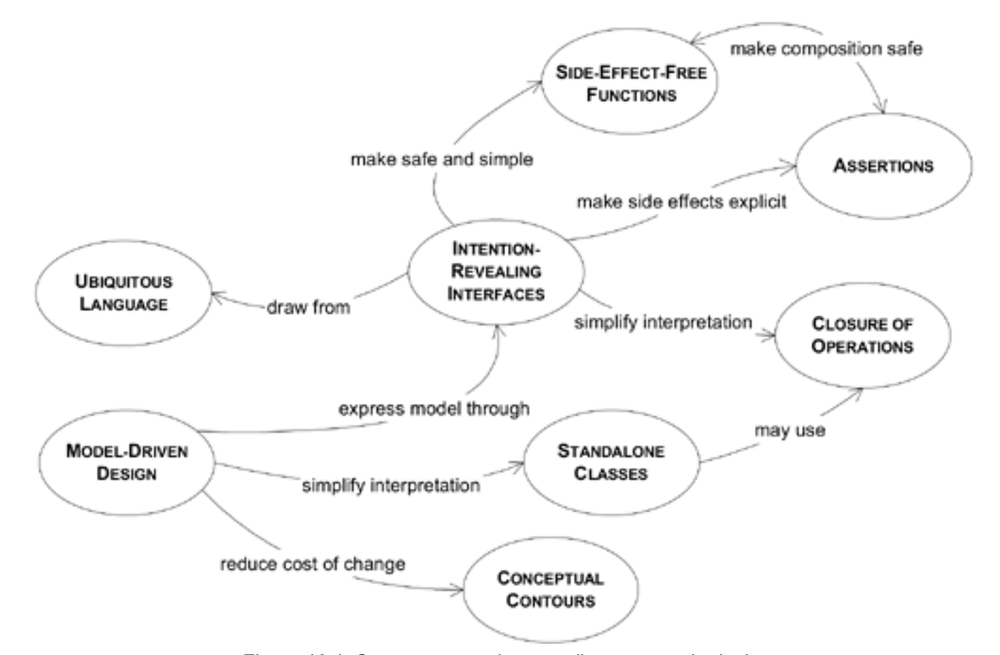

## 第 10 章 灵活设计

#### ▶[上一节](../ch9/2.md)

<ins>软件的终极目标是服务用户。但首先，同款软件必须服务开发者。</ins>在强调重构的开发流程中，这一点尤为重要。随着程序演进，开发者将不断重组和重写每个模块，将领域对象整合到应用程序中，并与新领域对象协同工作。即便数年之后，维护程序员仍会持续修改和扩展现有代码。人们必须与这些代码共事。但他们愿意吗？

当具有复杂行为的软件缺乏良好设计时，重构或组合元素便变得困难。一旦开发者无法准确预测计算的全部影响，代码重复便会悄然滋生。当设计元素过于臃肿时，重复便不可避免 —— 这些模块无法被重新组合。虽然可以拆分类和方法以提升复用性，但追踪每个细微组件的功能却变得愈发艰难。当软件设计不够简洁时，开发者甚至不敢直面现有的混乱局面，更不敢进行可能加剧纠缠或因未预见依赖关系导致功能损坏的改动。在除最小型系统外的任何系统中，这种脆弱性都为可构建的行为丰富度设定了上限，阻碍了重构与迭代优化进程。

要让项目在开发过程中加速推进 —— 而非被自身遗留问题拖累 —— 就需要一种令人愉悦、欢迎变更的设计。一种灵活的设计。

<ins>灵活的设计是深度建模的补充。当你挖掘出隐含概念并将其显性化后，便获得了原始素材。通过迭代循环，你将素材锤炼成实用形态，培育出能简洁清晰捕捉核心要点的模型，并塑造出让客户开发者真正运用该模型的设计方案。</ins>设计与代码的开发过程会催生洞见，进而优化模型概念。如此循环往复 —— 我们又回到了迭代循环与重构的轨道，朝着更深层的洞察不断推进。但你究竟要达成怎样的设计？过程中又该尝试哪些实验？这正是本章要探讨的核心问题。

许多过度设计的行径都打着灵活性的旗号。但更多时候，过多的抽象层和间接操作反而成了绊脚石。观察那些真正赋能使用者的软件设计，你会发现它们往往简洁明了。简洁并非易事。要打造既能组合成复杂系统又保持可理解性的组件，必须将对 [MODEL-DRIVEN DESIGN](../glossary.md#model-driven-design) 的坚持与适度严谨的设计风格相结合。这种设计可能需要相对高超的设计技能才能创造或运用。

开发者承担着双重角色，而设计必须同时满足这两种需求。同一个人可能同时扮演两种角色 —— 甚至在几分钟内切换 —— 但其与代码的关系依然存在本质差异。<ins>其一是客户端开发者，他们将领域对象编织进应用程序代码或其他领域层代码中，充分利用设计所赋予的能力。灵活的设计能揭示深层底层模型，使其潜力清晰可见。</ins>客户端开发者可灵活运用最小化的松耦合概念集，来表达领域中的各种场景。设计元素以自然的方式相互契合，最终形成可预测、特征鲜明且稳健的成果。

<ins>同样重要的是，设计必须服务于致力于改变它的开发者。</ins>要具备可变性，设计必须易于理解，展现出与客户开发者所依赖的 *相同* 底层模型。它必须遵循领域深度模型的轮廓，使大多数变更都能在灵活点上调整设计。其代码效果必须清晰透明，以便轻松预判变更的后果。

设计初稿往往僵化呆板。许多方案在项目周期或预算范围内始终无法获得灵活性。我从未见过大型项目能始终保持这种特性。但当复杂性阻碍进展时，将最关键的复杂部分打磨成灵活设计，就能决定是深陷遗留系统维护泥潭，还是突破复杂性天花板。

设计此类软件并无固定公式，但我根据经验提炼出一套模式，当它们恰当运用时往往能赋予设计以灵活性。这些模式与示例应能让人体会到灵活设计的本质及其背后的思维方式。

#### Figure 10.1

*有助于实现灵活设计的若干模式*

新方法名称或许无法向读者完整揭示 “混合 (mixing in)” 另一个`Paint`的效果（为此我们需要稍后几页将介绍的`ASSERTIONS`）。但它足以引导读者开始使用该类，尤其配合测试提供的示例。同时它能让客户端代码的读者理解客户端的意图。在本章后续示例中，我们将再次重构该类以提升其清晰度。

🌼🌼🌼

#### ▶[下一节](1.md)
