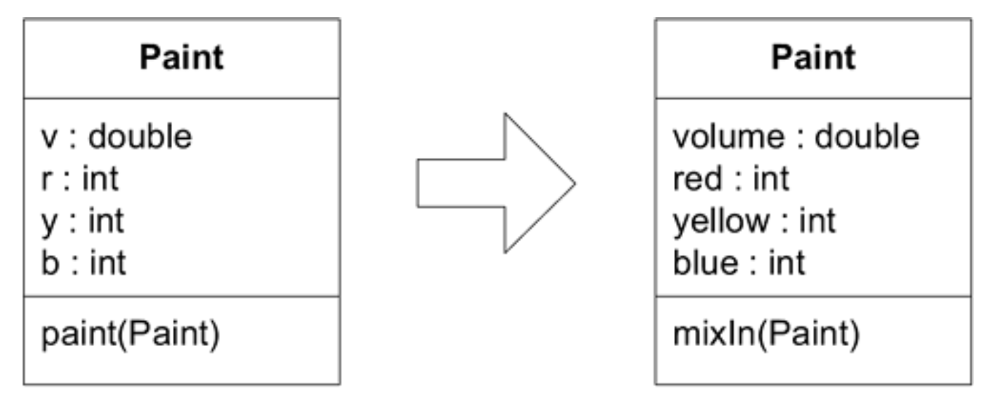

## 意图显露接口：`INTENTION-REVEALING INTERFACE`

#### ▶[上一节](0.md)

在领域驱动设计中，我们需要思考有意义的领域逻辑。那些未明确说明规则却产生规则效果的代码，迫使我们思考分步的软件流程。同样，那些仅通过运行代码得出结果却未明确说明的计算也是如此。若与模型缺乏清晰关联，便难以理解代码的效果或预判变更的影响。前一章深入探讨了显式建模规则与计算的方法。实现此类对象需要深入理解计算的繁琐细节或规则的细则。<ins>对象的精妙之处在于其封装能力，它能将这些复杂性包裹其中，使客户端代码保持简洁，并能通过更高层次的概念进行解读。</ins>

但是如果接口没有告诉客户端开发人员如何有效使用该对象所需的信息，他仍然必须深入内部来理解细节。客户端代码的阅读者也必须这样做。这样的话，大部分封装的价值就丧失了。我们总是在与认知过载作斗争：如果客户端开发人员的大脑被关于组件如何完成其工作的细节所淹没，他的大脑就无法清晰地理清客户端设计的复杂性。即使同一个人在扮演这两个角色，开发和使用自己的代码，这种情况仍然存在，因为即便他不必学习那些细节，他能同时考虑的因素是有限的。

<ins> **如果开发者必须考虑组件的实现才能使用它，那么封装的价值就丧失了。当原始开发者之外的人员必须根据实现推断对象或操作的目的时，新开发者推断出的功能可能仅是偶然契合该操作或类的作用。若这并非设计初衷，代码虽可能暂时运行，但设计理念的基础已被破坏，两位开发者将陷入目标相悖的困境。** </ins>

要充分体现将概念显式建模为类或方法的价值，我们必须为这些程序元素赋予能反映其概念内涵的名称。类与方法的命名既是提升开发者间沟通效率的良机，也是增强系统抽象能力的关键途径。

Kent Beck 曾提出，方法名称应通过`INTENTION-REVEALING SELECTOR`传达其目的（ [Beck 1997](../references.md#beck-1997) ）。设计中所有公开元素共同构成其接口，而每个元素的命名都提供了揭示设计意图的机会。类型名、方法名和参数名共同构成了 [INTENTION-REVEALING INTERFACE](../glossary.md#intention-revealing-interface) 。

因此：

<ins> **为类和操作命名时，应描述其效果和目的，而无需提及实现承诺功能的具体手段。这能让客户端开发者无需理解内部实现细节。命名应遵循 [UBIQUITOUS LANGUAGE](../ch2/1.md) 规范，以便团队成员快速理解其含义。在创建行为之前先编写测试，迫使自己以客户端开发者的思维模式思考。** </ins>

所有复杂的机制都应封装在抽象接口之后，这些接口应以意图而非手段为表达方式。

在领域的公共接口中，描述状态关系和规则，但不描述其执行方式；描述事件和动作，但不描述其执行过程；提出方程，但不提供求解的数值方法。提出问题，但不提供寻找答案的途径。

### 示例：重构：一款涂料调色应用程序

面向涂料商店的程序可向顾客展示标准涂料混合后的效果。以下是初始设计，其中包含单一领域类。

#### Figure 10.2


要猜出`paint(Paint)`方法的作用，唯一的方法就是阅读代码。
```java
public void paint(Paint paint) {
  v = v + paint.getV(); //After mixing, volume is summed
  // Omitted many lines of complicated color mixing logic
  // ending with the assignment of new r, b, and y values.
}
```
好的，看来这个方法是将两种颜料混合在一起，混合后的结果体积更大且呈现混合色。

为了转换视角，我们来为这个方法编写一个测试。（此代码基于 JUnit 测试框架。）
```java
public void testPaint() {
  // Create a pure yellow paint with volume=100
  Paint yellow = new Paint(100.0, 0, 50, 0);
  // Create a pure blue paint with volume=100
  Paint blue = new Paint(100.0, 0, 0, 50);

  // Mix the blue into the yellow
  yellow.paint(blue);

  // Result should be volume of 200.0 of green paint
  assertEquals(200.0, yellow.getV(), 0.01);
  assertEquals(25, yellow.getB());
  assertEquals(25, yellow.getY());
  assertEquals(0, yellow.getR());
}
```
通过测试只是起点。此时测试结果并不令人满意，因为测试代码并未说明其具体行为。让我们重写测试，使其体现客户端应用程序使用`Paint`对象时的预期方式。初始阶段该测试将失败，甚至无法编译通过。我们编写此测试的目的是从客户端开发者的视角探索`Paint`对象的接口设计。
```java
public void testPaint() {
  // Start with a pure yellow paint with volume=100
  Paint ourPaint = new Paint(100.0, 0, 50, 0);
  // Take a pure blue paint with volume=100
  Paint blue = new Paint(100.0, 0, 0, 50);

  // Mix the blue into the yellow
  ourPaint.mixIn(blue);

  // Result should be volume of 200.0 of green paint
  assertEquals(200.0, ourPaint.getVolume(), 0.01);
  assertEquals(25, ourPaint.getBlue());
  assertEquals(25, ourPaint.getYellow());
  assertEquals(0, ourPaint.getRed());
}
```
我们应当花时间编写能体现期望交互方式的测试。之后，通过重构`Paint`类使测试通过。

#### Figure 10.3


新方法名称或许无法向读者完整揭示 “混合 (mixing in)” 另一个`Paint`的效果（为此我们需要稍后几页将介绍的`ASSERTIONS`）。但它足以引导读者开始使用该类，尤其配合测试提供的示例。同时它能让客户端代码的读者理解客户端的意图。在本章后续示例中，我们将再次重构该类以提升其清晰度。

🌼🌼🌼

整个子域可以被拆分成独立的模块，并封装在`INTENTION-REVEALING INTERFACES`之后。如何利用这种拆分来聚焦项目并管理大型系统的复杂性将在 [第 15 章](../ch15/0.md) “提炼” 中进一步讨论，涉及`COHESIVE MECHANISMS`和`GENERIC SUBDOMAINS`。

但在接下来的两种模式中，我们将致力于使方法使用后果变得高度可预测。复杂逻辑可安全地封装在`SIDE-EFFECT-FREE FUNCTIONS`中。改变系统状态的方法则可通过`ASSERTIONS`进行特征描述。

#### ▶[下一节](2.md)
