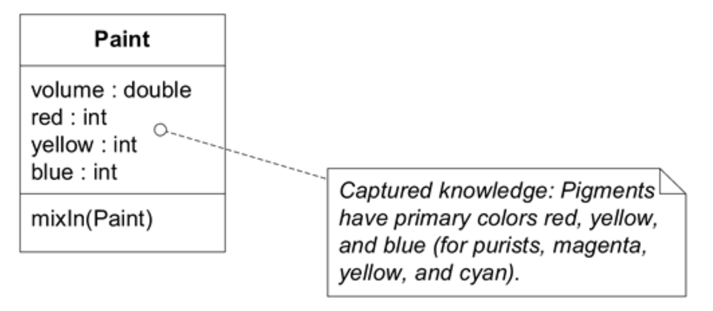
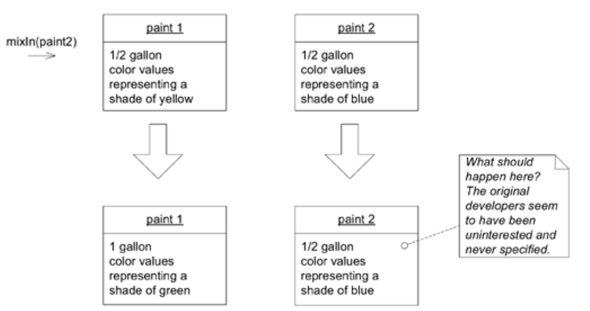
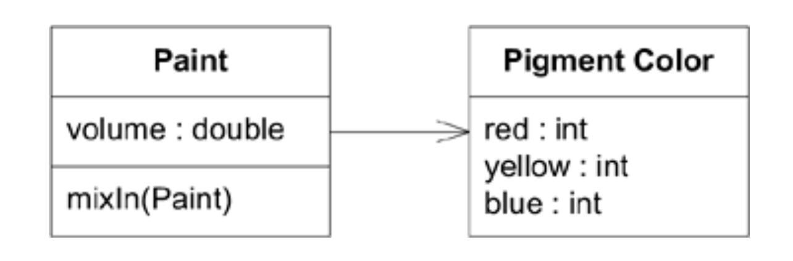
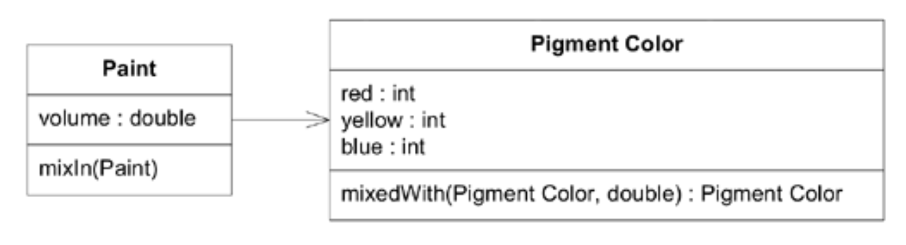
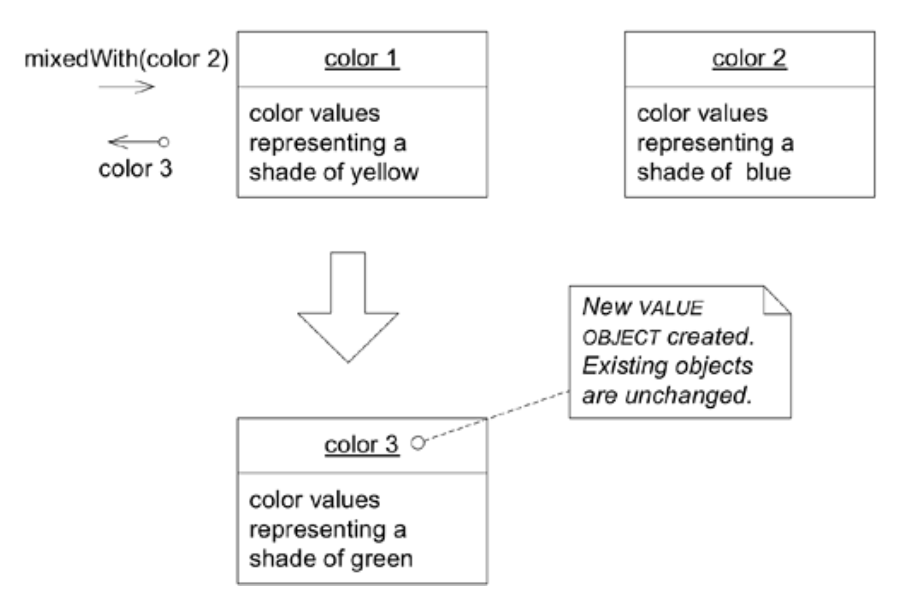

## 无副作用函数：`SIDE-EFFECT-FREE FUNCTIONS`

#### ▶[上一节](1.md)

操作大致可分为两类：命令与查询。查询从系统获取信息，可能只是访问变量中的数据，也可能基于该数据执行计算。命令（也称为修改器）则是会改变系统状态的操作（简单来说，比如设置变量）。在标准英语中， *副作用* 一词暗示着非预期的后果，但在计算机科学中，它指的是对系统状态产生的任何影响。为便于理解，我们将此概念限定为：任何会影响后续操作的系统状态变化。

为何将 *副作用* 这一术语应用于操作所引发的完全有意为之的变化？我推测这源于复杂系统的实践经验。大多数操作会调用其他操作，而被调用的操作又会进一步调用其他操作。一旦涉及这种任意深度的嵌套，就很难预见调用某个操作的所有后果。客户端开发者可能并未预见到二级、三级操作的影响 —— 这些影响在任何意义上都成了副作用。复杂设计中的元素还会通过其他方式相互作用，同样可能产生不可预测的结果。使用 *副作用* 一词正突显了这种交互的必然性。

<ins>**多重规则交互或计算组合的预测难度极高。调用操作的开发者必须理解其实现方式及其所有委托的实现细节，才能预判结果。若开发者被迫揭开抽象面纱，接口抽象的实用性便大打折扣。缺乏安全可预测的抽象层时，开发者不得不限制组合爆炸，从而对可构建行为的丰富性设置了较低上限。**</ins>

返回结果且不产生副作用的操作称为 *函数 (functions)* 。函数可被多次调用，每次返回相同值。函数可调用其他函数，无需担心嵌套深度。相较于具有副作用的操作，函数更易于测试。基于这些原因，函数能降低风险。

显然，在大多数软件系统中无法避免使用命令，但可以通过两种方式缓解这个问题。首先，将命令和查询严格分离到不同的操作中。确保引发变更的方法不返回领域数据，并尽可能保持简单。所有查询和计算都应在不产生可观察副作用的方法中执行（ [Meyer 1988](../references.md#meyer-1988) ）。

其次，通常存在替代模型和设计方案，完全无需修改现有对象。取而代之的是创建并返回一个新的 [VALUE OBJECT](../glossary.md#value-object) ，该对象代表计算结果。这是常见的技术手段，后续示例将予以说明。[VALUE OBJECT](../glossary.md#value-object) 可在响应查询时创建，完成传递后即可被遗忘——这与生命周期受严格管控的 [ENTITY](../glossary.md#entity) 截然不同。

`VALUE OBJECTS`是不可变的，这意味着除创建时调用的初始化器外，其所有操作均为函数。如同函数，`VALUE OBJECTS`更安全且易于测试。将逻辑或计算与状态变更混合的操作应重构为两个独立操作（ [Fowler 1999](../references.md#fowler-1999) , p. 279）。但根据定义，这种将副作用分离为简单命令方法的做法仅适用于`ENTITIES`。在完成修改与查询分离的重构后，可考虑二次重构：将复杂计算的责任移交至 [VALUE OBJECT](../glossary.md#value-object) 。通过创建 [VALUE OBJECT](../glossary.md#value-object) `值对象`替代状态变更，或将全部责任移交至 [VALUE OBJECT](../glossary.md#value-object) ，通常能彻底消除副作用。

因此：

<ins> **尽可能将程序的逻辑封装到函数中，这些函数应返回结果且不产生可观察的副作用。将命令（会修改可观察状态的方法）严格拆分为极其简单的操作，这些操作不应返回领域信息。当出现符合职责的概念时，通过将复杂逻辑移入`VALUE OBJECTS`来进一步控制副作用。** </ins>

`SIDE-EFFECT-FREE FUNCTIONS`，尤其是在不可变的`VALUE OBJECTS`中，允许安全地组合操作。当一个`FUNCTION`通过 [INTENTION-REVEALING INTERFACE](../glossary.md#intention-revealing-interface) 呈现时，开发者可以在不了解其具体实现的情况下使用它。

### 示例：重新重构涂料调色应用程序

面向涂料商店的程序可向顾客展示标准涂料混合后的效果。承接上例内容，以下是唯一的领域类：

#### Figure 10.4


```java
public void mixIn(Paint other) {
  volume = volume.plus(other.getVolume());
  // Many lines of complicated color-mixing logic
  // ending with the assignment of new red, blue,
  // and yellow values.
}
```

#### Figure 10.5

*`mixIn()`方法的副作用*

`mixIn()`方法中发生了许多操作，但该设计确实遵循了修改与查询分离的原则。一个值得关注的问题（我们稍后会讨论）是：作为`mixIn()`方法参数的`paint 2`对象的体积处于悬而未决的状态。该操作并未改变`Paint 2`的体积，这在当前概念模型中似乎不太合理。这对原始开发者并非问题，据我们所知，他们对操作后的`paint 2`对象毫无兴趣。但难以预判副作用或其缺失带来的后果。我们将在讨论`ASSERTIONS`时重返此议题。现在先聚焦于颜色。

颜色是该领域的重要概念。让我们尝试将其显式化为对象。该如何命名？`Color`是首选，但前期知识梳理已揭示关键洞见：颜料混合与常见的 RGB 光显示存在本质差异。命名需体现这一特性。

#### Figure 10.6


将 `Pigment Color` 抽取出来确实比之前的版本传达了更多信息，但计算方式还是相同的，仍然在 `mixIn()` 方法中。当我们把颜色数据移出来时，也应该把相关的行为一起带出来。在执行之前，需要注意的是 `Pigment Color` 是一个 [VALUE OBJECT](../glossary.md#value-object) 。因此，它应该被视为不可变的。当我们调配油漆时，`Paint` 对象本身会发生变化。它是一个有持续生命周期的 [ENTITY](../glossary.md#entity) 。相比之下，表示特定黄色的 `Pigment Color` 总是恰好就是那种颜色。混合操作会产生一个新的 `Pigment Color` 对象，代表新的颜色。

#### Figure 10.7


```java
public class PigmentColor {
  public PigmentColor mixedWith(PigmentColor other,
    double ratio) {
    // Many lines of complicated color-mixing logic
    // ending with the creation of a new PigmentColor object
    // with appropriate new red, blue, and yellow values.
  }
}

public class Paint {
  public void mixIn(Paint other) {
    volume = volume + other.getVolume();
    double ratio = other.getVolume() / volume;
    pigmentColor =
      pigmentColor.mixedWith(other.pigmentColor(), ratio);
  }
}
```
#### Figure 10.8



现在`Paint`中的修改代码已尽可能简化。新的`Pigment Color`类明确封装了知识并清晰传达，它提供了一个 [SIDE-EFFECT-FREE FUNCTION](../glossary.md#side-effect-free-function) ，其结果易于理解、易于测试且安全可靠，可直接使用或与其他操作组合。正因其安全性极高，色彩混合的复杂逻辑才得以真正封装。使用该类的开发者无需理解其实现细节。

🌼🌼🌼

#### ▶[下一节](3.md)
