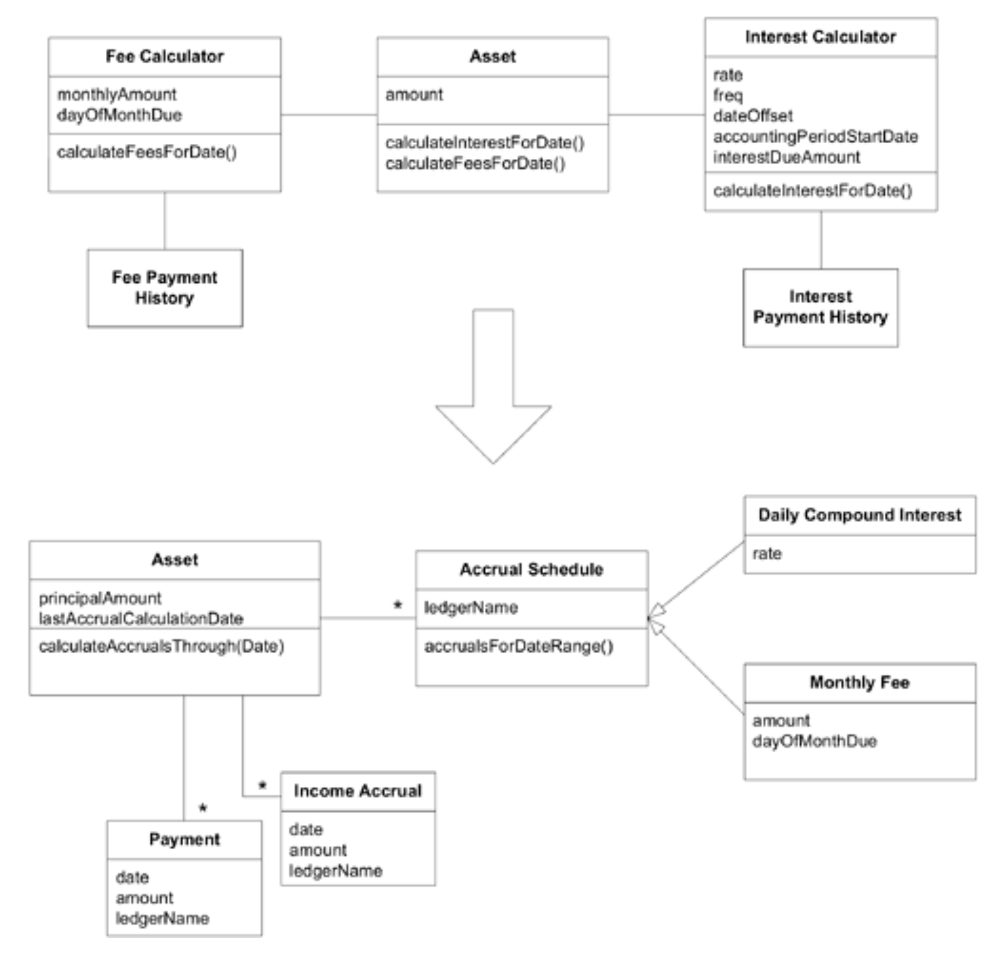
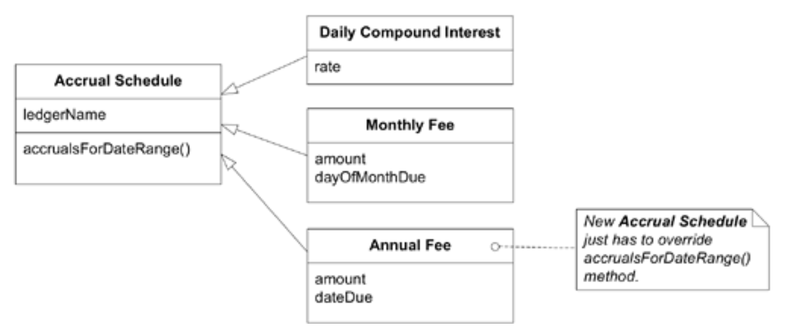
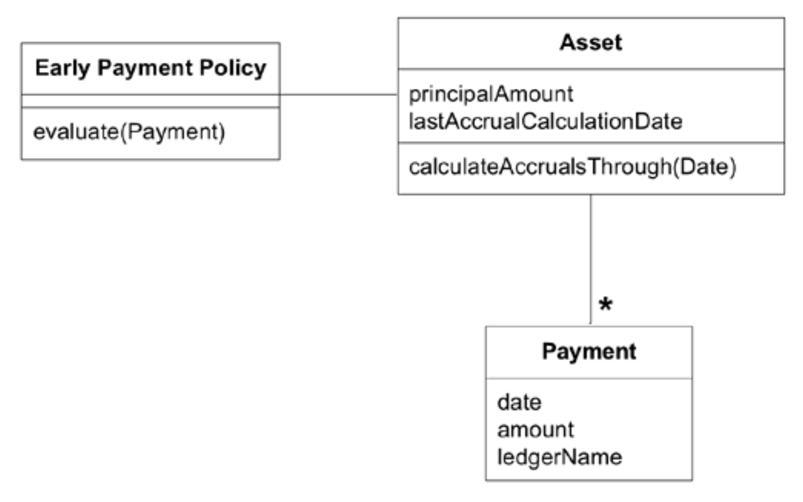

## 概念轮廓

#### ▶[上一节](3.md)

有时人们将功能拆解得细碎，以实现灵活组合；有时又将其整合为大块，以封装复杂性；有时则追求一致的粒度，使所有类和操作保持相似的规模。这些都是过度简化的概括，无法作为通用规则有效运作。但它们背后存在着一组基本问题。

<ins>**当模型或设计中的元素被嵌入单体结构时，其功能会发生冗余。外部接口无法完整呈现客户端可能关注的所有内容。由于不同概念相互混杂，其含义难以理解。**</ins>

<ins>**另一方面，拆分类和方法会徒增客户端的复杂性，迫使客户端对象理解细碎组件如何组合。更糟的是，概念可能彻底丧失。铀原子的一半不再是铀。当然，关键不仅在于粒度大小，更在于粒子的分布走向。**</ins>

菜谱规则行不通。但大多数领域深处都存在逻辑一致性，否则它们在自身领域内便无法成立。这并非说领域本身完美一致，人们讨论它们的方式更谈不上统一。<ins>但逻辑脉络终究存在，否则建模便毫无意义。正因这种内在一致性，当我们发现某个模型与领域某部分产生共鸣时，它往往也更可能与后续发现的其他部分保持一致。</ins>有时新发现难以被现有模型适应，此时我们便通过重构获得更深层的洞察，以期契合下一次发现。

这就是反复重构最终能带来灵活性的原因之一。当代码适应新理解的概念或需求时，`CONCEPTUAL CONTOURS`便随之显现。

高凝聚性与低耦合性这两大核心原则贯穿于所有层级的设计，从单个方法到类与`MODULES`，直至大规模结构（参见 [第 16 章](../ch16/0.md) ）。这两项原则既适用于概念，也适用于代码。为避免陷入机械化的认知陷阱，请通过不断地与领域直觉保持联系来调和技术思维。每次决策时都应自问： “这是基于当前模型与代码特定关联的权宜之计，还是映射了底层领域的某种轮廓？”

寻找概念上具有意义的功能单元，由此产生的设计将兼具灵活性与可理解性。例如，若两个对象的 “addition” 操作在领域中具有连贯意义，则应在此层级实现方法。不要将`add()`拆分为两步操作，也不要在同一操作内进入下一步。在稍大的尺度上，每个对象都应构成单一完整概念，即一个 [WHOLE VALUE](../glossary.md#whole-value) 。[1](#1)

同样地，在任何领域中，都存在一些细节对于软件的目标用户来说并不重要。我们假设的调色应用程序的用户不会单独添加红色颜料或蓝色颜料；他们混合的是包含三种颜料的完整涂料。将不需要拆分或重新排列的事物归类起来，可以避免杂乱，并更容易看到那些真正需要重新组合的元素。如果用户的物理设备允许添加单独的颜料，那么领域就会改变，单独的颜料可能会被操作。涂料化学家需要更精细的控制，这将涉及完全不同的分析，可能会产生比我们为调色抽象出的颜料颜色更详细的涂料成分模型。但对于参与调色应用程序项目的人来说，这完全无关紧要。

因此：

<ins> **将设计元素（操作、接口、类和`AGGREGATES`）分解为具有凝聚力的单元，同时结合你对领域中重要划分点的直觉认知。通过连续重构观察变化与稳定的轴线，寻找能解释这些剪切模式的底层`CONCEPTUAL CONTOURS`。使模型与领域的一致性方面保持对齐，正是这些使其成为可行的知识领域。** </ins>

目标是构建一套简洁的接口集合，它们通过逻辑组合能在 [UBIQUITOUS LANGUAGE](../glossary.md#ubiquitous-language) 中形成合理表达，同时避免无关选项带来的干扰和维护负担。这通常是重构的结果：难以在前期实现。但它可能永远不会从技术导向的重构中产生；唯有通过追求更深层洞见的重构，它才会自然显现。

即使设计遵循`CONCEPTUAL CONTOURS`，仍需进行修改与重构。当连续重构往往局限于局部，未动摇模型的多重核心概念时，这表明模型契合良好。若遇到迫使对象与方法分解发生重大变更的需求，则意味着：我们对领域模型的理解尚需深化。这正是深化模型、使设计更具弹性的契机。

### 示例：应计的`CONTOURS`

在 [第 9 章](../ch9/0.md) 中，基于对会计概念的更深入理解，对贷款追踪系统进行了重构：

#### Figure 10.11

新模型仅比旧模型多了一个对象，但职责划分却发生了重大改变。

原先在`Calculator`类中通过条件逻辑处理的调度 (schedules)，现已拆解为针对不同费用和利息类型的独立类。另一方面，此前分开管理的费用和利息支付功能，如今则被整合到了一起。

由于新明确概念的共鸣效应以及`Accrual Schedule`层级的凝聚力，开发者认为该模型更能契合领域中某些`CONCEPTUAL CONTOURS`。

#### Figure 10.12

*该模型支持新增各类`Accrual Schedules`。*

开发者唯一能确信预测的变化是新增`Accrual Schedules`。这些需求早已蓄势待发。因此，除了让现有功能更清晰简洁外，她还选择了便于引入新调度的模型。但她是否找到了能随着应用和业务演进而助力领域设计变革与成长的`CONCEPTUAL CONTOURS`？设计能否应对意外变更本无定论，但她认为自己已提升了应对概率。

#### 意料之外的变化

随着项目推进，处理提前付款与延迟付款的详细规则成为必要。开发者在研究问题时欣喜地发现，利息支付与费用支付几乎适用相同的规则。这意味着新模型元素将自然地与单一的`Payment`类相衔接。

#### Figure 10.13

旧设计本会导致两个`Payment History`类之间出现重复。（这种困难或许会引发洞察，`Payment`类应当共享，从而通过另一条路径得出类似的模型。）<ins>这种易于扩展的特性并非源于她预见了变更。更非因她设计得如此灵活多变，足以适应任何可预见的变更。其根源在于前次重构时，设计已与领域概念的本质相契合。</ins>

🌼🌼🌼

`INTENTION-REVEALING INTERFACES`使客户端能够将对象呈现为意义单元而非单纯机制。`SIDE-EFFECT-FREE FUNCTIONS`与`ASSERTIONS`确保了这些单元的安全使用及复杂组合。`CONCEPTUAL CONTOURS`的形成既稳定了模型各部分，也使单元更直观地被使用和组合。

当相互依赖关系迫使我们同时处理过多概念时，仍可能遭遇概念过载……

#### ▶[下一节](5.md)

---
#### 1
[WHOLE VALUE](../glossary.md#whole-value) 模式，作者 Ward Cunningham 。
