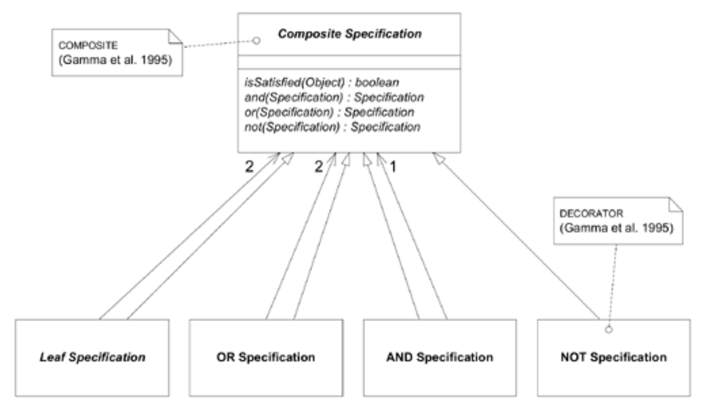

## 声明式设计风格

#### ▶[上一节](7.md)

一旦你的设计具备了`INTENTION-REVEALING INTERFACES`、`SIDE-EFFECT-FREE FUNCTIONS`以及`ASSERTIONS`，你就已经接近声明式领域了。一旦你拥有可组合的元素，这些元素能够传达它们的意义，并且具有特征化或显而易见的效果，或者根本没有可观察的效果，声明式设计的许多好处便会体现出来。

灵活的设计能够使客户端代码采用声明式设计 *风格* 。为说明此点，下一节将整合本章中的若干模式，使`SPECIFICATION`更具灵活性与声明性。

### 以声明式风格扩展`SPECIFICATIONS`

[第 9 章](../ch9/0.md) 介绍了`SPECIFICATION`的基本概念、其在程序中的作用，以及实现过程中的若干要点。现在让我们探讨几种在处理复杂规则时非常实用的扩展功能。

`SPECIFICATION`是对既定形式化方法，谓词的改编。谓词还具备其他实用特性，我们可以有选择地加以利用。

#### 使用逻辑运算符组合`SPECIFICATIONS`

在使用`SPECIFICATIONS`时，您很快会遇到需要组合它们的情况。正如前文所述，`SPECIFICATION`是谓词的实例，谓词可通过 “AND”、“OR” 和 “NOT” 运算进行组合与修改。这些逻辑运算在谓词范围内具有闭包性，因此`SPECIFICATION`组合将展现`CLOSURE OF OPERATIONS`特性。

由于`SPECIFICATIONS`中已构建了重要的通用能力，创建一个可用于各类`SPECIFICATIONS`的抽象类或接口变得非常有用。这意味着将参数类型化为某种高级抽象类。
```java
public interface Specification {
  boolean isSatisfiedBy(Object candidate);
}
```
该抽象要求在方法开头添加一个守护子句，但除此之外不会影响功能。例如，`Container Specification`（来自 [第 9 章](../ch9/0.md) 第 236 页的示例）将按以下方式修改： *(TODO page navigation)*
```java
public class ContainerSpecification implements Specification {
  private ContainerFeature requiredFeature;
  
  public ContainerSpecification(ContainerFeature required) {
    requiredFeature = required;
  }

  boolean isSatisfiedBy(Object candidate) {
    if (!candidate instanceof Container) 
      return false;
    return (Container)aContainer.getFeatures().contains(requiredFeature);
  }
}
```
现在，让我们通过添加三个新操作来扩展`Specification`接口：
```java
public interface Specification {
  boolean isSatisfiedBy(Object candidate);

  Specification and(Specification other);
  Specification or(Specification other);
  Specification not();
}
```
请注意，某些`Container Specifications`被配置为要求通风`Containers`，而另一些则要求装甲`Containers`。一种既易挥发 *又* 易爆的化学品，理应同时满足这 *两* 项`SPECIFICATIONS`。借助新方法，这很容易实现。
```java
Specification ventilated = new ContainerSpecification(VENTILATED);
Specification armored = new ContainerSpecification(ARMORED);

Specification both = ventilated.and(armored);
```
该声明定义了一个具有预期属性的新`Specification`对象。这种组合原本需要更复杂的`Container Specification`，且仍将属于特殊用途。

假设我们有多种通风的`Container`。对于某些物品而言，它们被装入哪种类型的容器可能并不重要，可以放入任意一种类型。
```java
Specification ventilatedType1 =
  new ContainerSpecification(VENTILATED_TYPE_1);
Specification ventilatedType2 =
  new ContainerSpecification(VENTILATED_TYPE_2);
Specification either = ventilatedType1.or(ventilatedType2);
```
若将沙子储存在专用容器中被视为浪费，我们可通过`SPECIFYING`一个无特殊功能的“廉价”容器来禁止此行为。
```java
Specification cheap = (ventilated.not()).and(armored.not());
```
该约束本可避免 [第 9 章](../ch9/0.md) 所述原型仓库打包器中某些次优行为的发生。

通过简单元素构建复杂规范的能力增强了代码的表达力。这些组合以声明式风格编写。

根据`SPECIFICATIONS`的具体实现方式，这些运算符的提供可能简单也可能困难。以下是一个极其简单的实现方案，在某些情况下效率低下，而在其他情况下却相当实用。它仅作为*说明性示例*，如同任何模式一样，存在多种实现方式。
```java
public abstract class AbstractSpecification implements Specification {
  public Specification and(Specification other) {
    return new AndSpecification(this, other);
  }
  public Specification or(Specification other) {
    return new OrSpecification(this, other);
  }
  public Specification not() {
    return new NotSpecification(this);
  }
}

public class AndSpecification extends AbstractSpecification {
  Specification one;
  Specification other;
  public AndSpecification(Specification x, Specification y) {
    one = x;
    other = y;
  }
  public boolean isSatisfiedBy(Object candidate) {
    return one.isSatisfiedBy(candidate) &&
      other.isSatisfiedBy(candidate);
  }
}

public class OrSpecification extends AbstractSpecification {
  Specification one;
  Specification other;
  public OrSpecification(Specification x, Specification y) {
    one = x;
    other = y;
  }
  public boolean isSatisfiedBy(Object candidate) {
    return one.isSatisfiedBy(candidate) ||
      other.isSatisfiedBy(candidate);
  }
}

public class NotSpecification extends AbstractSpecification {
  Specification wrapped;
  public NotSpecification(Specification x) {
    wrapped = x;
  }
  public boolean isSatisfiedBy(Object candidate) {
    return !wrapped.isSatisfiedBy(candidate);
  }
}
```

#### Figure 10.14

*`SPECIFICATION`的`COMPOSITE`设计*

这段代码旨在尽可能便于在书籍中阅读。正如我所说，某些情况下它可能不够高效。不过，我们仍可采用其他实现方案来减少对象数量、提升运行速度，或适配某些项目中特有的技术规范。关键在于构建能准确捕捉领域核心概念的模型，并确保实现过程忠实于该模型。这为解决性能问题留下了充分的空间。

此外，这种完全的通用性在许多情况下并非必要。特别是，与其他运算相比，AND 运算的使用频率往往更高，且其实现复杂度也更低。若仅需实现 AND 功能，请不必犹豫，直接实现即可。

早在 [第 2 章](../ch2/0.md) 第 30 页的示例对话框中，开发者显然尚未实现其`SPECIFICATION`的 “satisfied by” 行为。在此之前，该`SPECIFICATION`仅用于按需构建。即便如此，抽象层依然完整，后续功能的添加也相对容易。使用模式并不意味着必须构建不需要的功能。只要概念不被混淆，这些功能随时可以后期添加。 *(TODO page navigation)*

### 示例：`COMPOSITE` `SPECIFICATION` 的一个替代实现方案

某些实现环境并不擅长处理粒度极细的对象。我曾参与一个项目，该项目使用的对象数据库坚持为每个对象分配ID并进行追踪。每个对象在内存空间和性能上都存在大量开销，而总地址空间成为限制因素。我在领域设计的关键节点采用了`SPECIFICATIONS`规范，这无疑是明智之举。但当时实施的方案比本章描述的版本更为复杂，这显然是个错误。最终导致系统产生数百万个精细粒度对象，严重拖慢了系统运行效率。

以下是一个替代实现的示例，它将组合`SPECIFICATION`编码为字符串或数组形式，用于表示逻辑表达式，并在运行时进行解释。

（不必担心当前无法理解如何实现此方案。关键在于认识到：使用逻辑运算符实现`SPECIFICATION`的方法多种多样，因此若简单方案在您的场景中不可行，尚有其他选择。）

---
`Cheap Container` 的 `SPECIFICATION` 堆栈
```
Top   AndSpecificationOperator (FLY WEIGHT)
      NotSpecificationOperator (FLY WEIGHT)
      Armored
      NotSpecificationOperator
      Ventilated
```
---
当需要测试候选表达式时，必须解析该结构，具体操作是依次弹出每个元素，根据运算符要求对其进行求值或弹出下一个元素。最终结果如下：
```java
and(not(armored), not(ventilated))
```
该设计存在以下优点(+)与缺点(–)：
* \+ 对象数量少
* \+ 内存利用率高
* \- 需要更资深的开发人员

您需要根据自身情况寻找权衡得当的实现方案。相同的模式和模型可以支撑截然不同的实现方式。

#### 包含

这个最终特性通常不需要，且实现起来可能很困难，但偶尔它能解决真正棘手的问题。它还阐明了`SPECIFICATION`的含义。

再考虑第 235 页示例中的化学品仓库包装工。回想每个`Chemical`都配有`Container Specification`，而`Packer` [SERVICE](../glossary.md#service) 保证在将`Drums`分配给`Containers`时满足所有规格要求。一切看似顺利……直到有人修改了法规。 *(TODO page navigation)*

每隔几个月就会发布一套新规则，我们的用户希望能够生成一份清单，列出当前要求更严格的化学品类型。

当然，我们也可以给出一个部分答案（用户可能也想要的答案）：通过在库存中对每个`Drum`进行验证，采用新的`SPECIFICATIONS`标准，找出所有不再符合`SPEC`要求的`Drum`。这将告知用户需要移动现有库存中的哪些`Drums`。

但他们 *要求的* 是处理标准已趋严格的化学品清单。或许目前公司内部没有这类物品，又或许它们恰好被装入了更严格的容器。无论哪种情况，前述报告都不会将它们列入其中。

让我们引入一项新操作，用于直接比较两个`SPECIFICATIONS`。
```java
boolean subsumes(Specification other);
```
更严格的`SPEC`包含较宽松的`SPEC`。它可替代后者，且不会忽略任何先前要求。

#### Figure 10.15

*汽油容器的`SPECIFICATION`已收紧。*

用`规格`术语来说，新`规格`包含旧`规格`，因为任何满足新`规格`的候选方案也必然满足旧`规格`。

若将这些`SPECIFICATIONS`视为谓词，则包含关系等同于逻辑蕴含。采用常规符号表示法，A→B 意味着陈述 A 蕴含陈述 B，即当 A 为真时，B 亦为真。

让我们将这种逻辑应用到容器匹配需求中。当`SPECIFICATION`被修改时，我们需要判断新提出的`SPEC`是否满足旧版本的所有条件。

`New Spec` → `Old Spec`

也就是说，如果新规范成立，那么旧规范也成立。证明逻辑蕴含在一般情况下非常困难，但特殊情况可能很简单。例如，特定参数化的`SPECS`可以定义自己的包含规则。
```java
public class MinimumAgeSpecification {
  int threshold;
  public boolean isSatisfiedBy(Person candidate) {
    return candidate.getAge() >= threshold;
  }

  public boolean subsumes(MinimumAgeSpecification other) {
    return threshold >= other.getThreshold();
  }
}
```
一个 JUnit 测试可能包含以下内容：
```java
drivingAge = new MinimumAgeSpecification(16);
votingAge = new MinimumAgeSpecification(18);
assertTrue(votingAge.subsumes(drivingAge));
```
另一个实用的特殊情况，适合解决`Container Specification`问题，是一个结合了包含关系与单一逻辑运算符 AND 的`SPECIFICATION`接口。
```java
public interface Specification {
  boolean isSatisfiedBy(Object candidate);
  Specification and(Specification other);
  boolean subsumes(Specification other);
}
```
仅使用 AND 运算符证明蕴含关系很简单：
```
A AND B → A
```
或在更复杂的情况下：
```
A AND B AND C → A AND B
```
因此，如果`Composite Specification`能够收集所有通过 “AND” 运算组合的叶节点`SPECIFICATIONS`，那么我们只需验证包含`SPECIFICATION`是否包含被包含规范的所有叶节点，同时可能还包含额外叶节点 —— 其叶节点集合是对其他`SPEC`叶节点集合的超集。
```java
public boolean subsumes(Specification other) {
  if (other instanceof CompositeSpecification) {
    Collection otherLeaves =
      (CompositeSpecification) other.leafSpecifications();
    Iterator it = otherLeaves.iterator();
    while (it.hasNext()) {
      if (!leafSpecifications().contains(it.next()))
        return false;
    }
  } else {
    if (!leafSpecifications().contains(other))
      return false;
  }
  return true;
}
```
这种交互可以得到增强，以便仔细比较精心选择的参数化叶节点`SPECIFICATIONS`及其他复杂情况。遗憾的是，当包含 OR 和 NOT 运算符时，这些证明会变得极其复杂。在大多数情况下，最佳做法是通过做出取舍来避免这种复杂性，要么放弃某些运算符，要么放弃包含关系。若两者皆不可或缺，则需审慎权衡其带来的收益是否足以抵消操作难度。

---
苏格拉底`SPECIFICATIONS`
```java
/*人皆必死。*/        Specification manSpec = new ManSpecification();
                    Specification mortalSpec = new MortalSpecification();
                    assert manSpec.subsumes(mortalSpec);
/*苏格拉底是人。*/    Man socrates = new Man();
                    assert manSpec.isSatisfiedBy(socrates);
/*故苏格拉底必死。*/  assert mortalSpec.isSatisfiedBy(socrates);
```
---

#### ▶[下一节](9.md)
