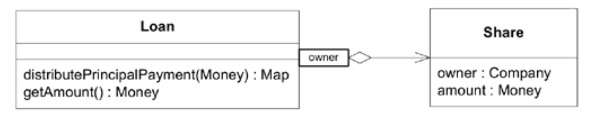
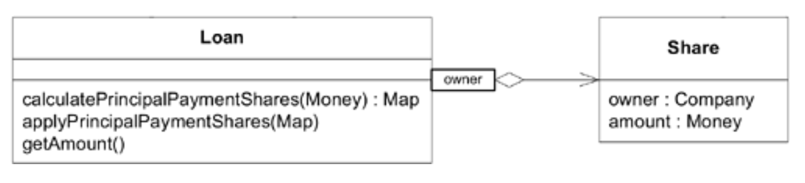
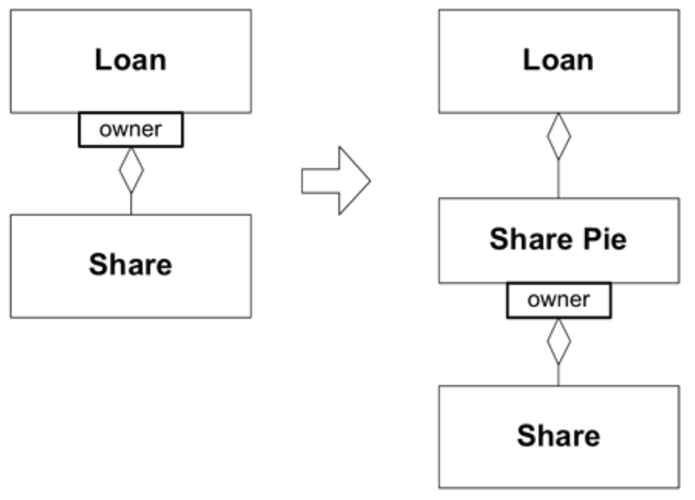
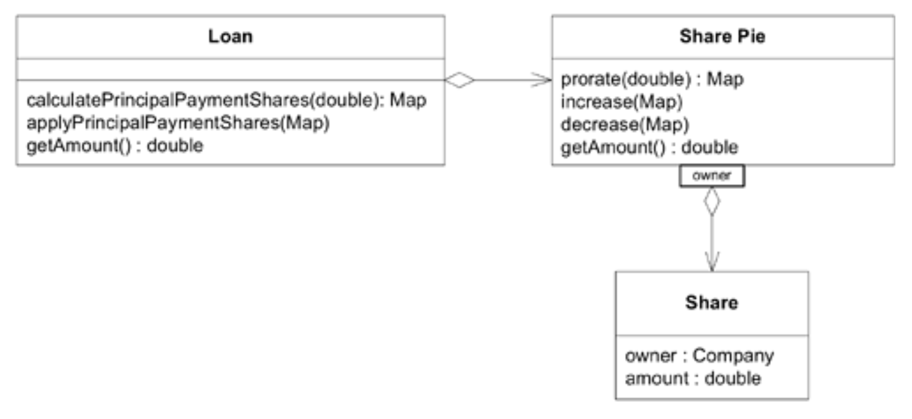

## 攻击角度

#### ▶[上一节](8.md)

本章介绍了诸多技术手段，旨在阐明代码意图、使使用后果透明化，并解耦模型元素。即便如此，此类设计仍具挑战性。面对庞大系统时，你无法简单宣告“让我们让它变得灵活”。必须设定目标。以下提供一些大致的方法，并通过扩展示例展示如何整合这些模式，进而应用于更大的设计中。

### 拆分子域

你不可能一次性搞定整个设计。要逐步推进。系统某些方面会自然启发解决方案，这些方案可以抽离出来单独打磨。当你发现模型中存在可视为专业数学运算的部分时，将其分离。你的应用程序强制执行复杂的状态变更规则；将这些规则抽离至独立模型或简易框架中进行声明。每次拆分后，新模块不仅结构清晰，原有模块也变得更精简明了。剩余部分将采用声明式风格编写，即通过特定数学模型、验证框架进行规则声明，或其他子领域形式。

与其分散精力，不如在某个领域产生重大影响，让设计的一部分真正灵活自如。[第 15 章](../ch15/0.md) 将深入探讨如何选择和管理子领域。

### 在可能的情况下，借鉴成熟的框架

从零开始构建严谨的概念框架并非日常可为之事。有时你会在项目生命周期中发现并完善这样的框架。但更常见的做法是，直接采用并改造领域内或跨领域的成熟概念体系。其中部分体系历经数百年锤炼已臻精炼。例如多数商业应用都涉及会计体系，会计学定义了一套完善的 [ENTITIES](../ch5/2.md) 模型与规则体系，能轻松适配深度模型并实现灵活设计。

此类形式化的概念框架不胜枚举，但我个人最钟爱数学。令人惊叹的是，对基础算术稍作变通竟能发挥如此大的作用。许多领域都蕴含着数学元素。去寻找它，挖掘它。专业数学体系严谨，遵循清晰的组合规则，且易于人们理解。我曾创立的 “Shares Math” 便是例证，本章将以此作为结束。

### 示例：模式整合：`Shares Math`

[第 8 章](../ch8/0.md) 讲述了一个关于建立银团贷款系统项目中模型突破的故事。现在这个例子将详细说明，只关注与该项目类似设计中的一个功能。

该应用程序的一项要求是：当借款人偿还本金时，资金默认按贷款方在贷款中的份额进行按比例分配。

#### 支付分配的初始设计

随着我们进行重构，这段代码会变得更易理解，所以不必纠结于当前版本。

#### Figure 10.16


```java
public class Loan {
    private Map shares;

    //Accessors, constructors, and very simple methods are excluded

    public Map distributePrincipalPayment(double paymentAmount) {
       Map paymentShares = new HashMap();
       Map loanShares = getShares();
       double total = getAmount();
       Iterator it = loanShares.keySet().iterator();
       while(it.hasNext()) {
          Object owner = it.next();
          double initialLoanShareAmount = getShareAmount(owner);
          double paymentShareAmount =
             initialLoanShareAmount / total * paymentAmount;
          Share paymentShare =
             new Share(owner, paymentShareAmount);
          paymentShares.put(owner, paymentShare);
          double newLoanShareAmount =
             initialLoanShareAmount - paymentShareAmount;
          Share newLoanShare =
             new Share(owner, newLoanShareAmount);
          loanShares.put(owner, newLoanShare);
       }
       return paymentShares;
    }

    public double getAmount() {
       Map loanShares = getShares();
       double total = 0.0;
       Iterator it = loanShares.keySet().iterator();
       while(it.hasNext()) {
          Share loanShare = (Share) loanShares.get(it.next());
          total = total + loanShare.getAmount();
       }
       return total;
    }
}
```
#### 分离命令与 [SIDE-EFFECT-FREE FUNCTIONS](2.md)

该设计已具备 [INTENTION-REVEALING INTERFACES](1.md) 。但`distributePaymentPrincipal()`方法存在危险操作：它既计算待分配份额，又修改贷款数据。让我们重构代码，将查询操作与修改操作分离。

#### Figure 10.17


```java
public void applyPrincipalPaymentShares(Map paymentShares) {
    Map loanShares = getShares();
    Iterator it = paymentShares.keySet().iterator();
    while(it.hasNext()) {
       Object lender = it.next();
       Share paymentShare = (Share) paymentShares.get(lender);
       Share loanShare = (Share) loanShares.get(lender);
       double newLoanShareAmount = loanShare.getAmount() -
          paymentShare.getAmount();
       Share newLoanShare = new Share(lender, newLoanShareAmount);
       loanShares.put(lender, newLoanShare);
    }
}
public Map calculatePrincipalPaymentShares(double paymentAmount) {
    Map paymentShares = new HashMap();
    Map loanShares = getShares();
    double total = getAmount();
    Iterator it = loanShares.keySet().iterator();
    while(it.hasNext()) {
       Object lender = it.next();
       Share loanShare = (Share) loanShares.get(lender);
       double paymentShareAmount =
          loanShare.getAmount() / total * paymentAmount;
       Share paymentShare = new Share(lender, paymentShareAmount);
       paymentShares.put(lender, paymentShare);
    }
    return paymentShares;
 }
```
客户端代码现在如下所示：
```java
Map distribution =
    aLoan.calculatePrincipalPaymentShares(paymentAmount);
 aLoan.applyPrincipalPaymentShares(distribution);
```
还不错。`FUNCTIONS` 通过 [INTENTION-REVEALING INTERFACES](1.md) 封装了大量复杂性。但当我们添加 `applyDrawdown()`、`calculateFeePaymentShares()` 等方法时，代码量开始增加。每次扩展都会增加代码复杂度并拖累运行效率。这可能表明当前粒度过于粗糙。常规做法是将计算方法拆分为子程序，这固然是合理过渡，但我们最终需要洞察底层概念边界并深化模型。具备如此`CONCEPT-CONTOURING`粒度的设计元素，可组合生成所需的变体。

#### 将隐含概念显性化

现有线索已足够开始探索新模型。当前实现中`Share`对象处于被动状态，且通过复杂的底层方式进行操作。这是因为关于股份的大多数规则和计算并非针对单个股份，而是针对股份集合。这里存在一个缺失的概念：股份之间如同构成整体的各个部分相互关联。将这个概念显式化后，我们将能更简洁地表达这些规则和计算。

#### Figure 10.18


`Share Pie`表示特定`Loan`的总分配。它是一个 [ENTITY](../ch5/2.md) ，其身份在`Loan`的 [AGGREGATE](../ch6/1.md) 内是局部的。实际的分配计算可以委托给`Share Pie`完成。

#### Figure 10.19


```java
public class Loan {
    private SharePie shares;

    //Accessors, constructors, and straightforward methods
    //are omitted

    public Map calculatePrincipalPaymentDistribution( double paymentAmount) {
       return getShares().prorated(paymentAmount);
    }
    public void applyPrincipalPayment(Map paymentShares) {
       shares.decrease(paymentShares);
  }
}
```
`Loan`模块已简化，而`Share`计算集中于一个专注于该职责的 [VALUE OBJECT](../ch5/3.md) 中。然而，这些计算并未真正变得更灵活或更易于使用。

#### `Share Pie`成为 [VALUE OBJECT](../ch5/3.md) ：洞察层层递进

实践中，新设计的实施往往会引发对模型本身的全新认知。在此案例中，`Loan`与`Share Pie`的紧密耦合似乎模糊了`Share Pie`与`Shares`之间的关系。若将`Share Pie`改为 [VALUE OBJECT](../ch5/3.md) 会如何？

这意味着`increase(Map)`和`decrease(Map)`将不被允许，因为`Share Pie`必须是不可变的。要修改`Share Pie`的值，必须替换整个`Pie`。因此可以实现诸如`addShares(Map)`之类的操作，该操作将返回一个全新的、更大的`Share Pie`。

让我们一直走到 [CLOSURE OF OPERATIONS](6.md) 。与其 “增加” 一个`Share Pie`或向其中添加`Shares`，不如直接把两个`Share Pies`加在一起：结果就是新的、更大的`Share Pie`。

我们只需改变返回类型，就能部分实现对`Share Pie`的`prorate()`操作。将其重命名为`prorated()`可强调其无副作用的特性。`Shares Math`开始初具雏形，最初包含四项运算。

#### Figure 10.20


我们可以对新的 [VALUE OBJECTS](../ch5/3.md) ，`Share Pies`，做出一些明确的 [ASSERTIONS](3.md) 。每个方法都具有特定含义。
```java
public class SharePie {
  private Map shares = new HashMap();

  //Accessors and other straightforward methods are omitted

  public double getAmount() {
    double total = 0.0;
    Iterator it = shares.keySet().iterator();
    while(it.hasNext()) { The whole is equal to the sum of its parts.
      Share loanShare = getShare(it.next());
      total = total + loanShare.getAmount();
    }
    return total;
  }

  public SharePie minus(SharePie otherShares) {
    SharePie result = new SharePie();
    Set owners = new HashSet();
    owners.addAll(getOwners());
    owners.addAll(otherShares.getOwners());
    // The difference between two Pies is the difference between each owner's share.
    Iterator it = owners.iterator();
    while(it.hasNext()) {
      Object owner = it.next();
      double resultShareAmount = getShareAmount(owner) –
        otherShares.getShareAmount(owner);
      result.add(owner, resultShareAmount);
    }
    return result;
  }

  public SharePie plus(SharePie otherShares) { 
    // The combination of two Pies is the combination of ↩ each owner's share.
    //Similar to implementation of minus()
  }

  public SharePie prorated(double amountToProrate) {
    SharePie proration = new SharePie();
    double basis = getAmount();
    // An amount can be divided proportionately among all shareholders.
    Iterator it = shares.keySet().iterator();
    while(it.hasNext()) {
      Object owner = it.next();
      Share share = getShare(owner);
      double proratedShareAmount =
             share.getAmount() / basis * amountToProrate;
      proration.add(owner, proratedShareAmount);
    }
    return proration;
  }
}
```
#### 新设计的灵活性

此时，至关重要的`Loan`类中的方法可以简单到如下程度：
```java
public class Loan {
    private SharePie shares;

    //Accessors, constructors, and straightforward methods
    //are omitted

    public SharePie calculatePrincipalPaymentDistribution(
                                         double paymentAmount) {
       return shares.prorated(paymentAmount);
    }

    public void applyPrincipalPayment(SharePie paymentShares) {
       setShares(shares.minus(paymentShares));
    }
```
这些简短方法各自阐明了其 *含义* 。应用本金支付意味着逐股从贷款中扣除该笔款项。分配本金支付则是将金额 *按比例* 分摊给各股东。`Share Pie`的设计使我们在`Loan`代码中得以采用声明式风格，生成的代码开始呈现出商业交易的概念性定义特征，而非单纯的计算逻辑。

其他交易类型（此前过于复杂而未列举）现可轻松声明。例如，贷款提款将根据各贷款方在`Facility`中的份额进行分配。新提款金额将计入未偿还的`Loan`余额。用我们的新领域语言表示：
```java
public class Facility {
  private SharePie shares;
  ...
  public SharePie calculateDrawdownDefaultDistribution(double drawdownAmount) {
    return shares.prorated(drawdownAmount);
  }
}

public class Loan {
  ...
  public void applyDrawdown(SharePie drawdownShares) {
    setShares(shares.plus(drawdownShares));
  }
}
```
要查看每位贷款方与其约定出资额的偏差，需取未偿还`Loan`金额的理论分配额，并将其从`Loan`的实际份额中扣除：
```java
SharePie originalAgreement =
    aFacility.getShares().prorated(aLoan.getAmount());
 SharePie actual = aLoan.getShares();
 SharePie deviation = actual.minus(originalAgreement);
```
`Share Pie`设计的某些特性使得代码中的重组和通信变得轻松。

- **复杂逻辑被封装在专用的 [VALUE OBJECTS](../ch5/3.md) 中，这些对象使用 [SIDE-EFFECT-FREE FUNCTIONS](2.md) 实现。** 绝大多数复杂逻辑已被封装在这些不可变对象中。由于`Share Pies`属于 [VALUE OBJECTS](../ch5/3.md) ，数学运算可创建新实例，我们可自由使用这些新实例替换过时的实例。

  所有`Share Pie`方法均不会对现有对象产生任何改动。这使得我们能够在中间计算中自由使用`plus()`、`minus()`和`pro-rated()`方法，将它们组合使用，并预期它们仅按其名称所示执行操作，不会产生额外影响。同时，这也允许我们基于相同方法构建分析特征。（此前这些方法仅能在实际分配发生时调用，因为每次调用后数据都会发生变化。）
- **状态修改操作简单明了，并以 [ASSERTIONS](3.md) 为特征。** `Shares Math`的高级抽象使事务不变量能够以声明式风格简洁地编写。例如，偏差值即实际份额减去基于`Facility`的`Share Pie`按比例计算的`Loan`金额。
- **模型概念相互解耦；操作对其他类型的依赖降至最低。** `Share Pie`上的某些方法体现了 [CLOSURE OF OPERATIONS](6.md) （`add`或`subtract`方法在`Share Pies`下具有闭包性）。其他方法则直接以简单数值作为参数或返回值；它们虽不具备闭包性，但不会增加概念负担。`Share Pie`仅与另一个类`Share`紧密交互。因此该类具备自包含特性，易于理解、测试，并能轻松组合形成声明式事务。这些特性继承自数学形式化方法。
- **熟悉的形式主义使协议易于理解。** 本可基于金融术语设计一套全新的股份操作协议。理论上它可以灵活多变，但存在两大弊端：首先，这需要从零开始创造，既困难又充满不确定性。其次，每位使用者都需重新学习新规则。而当人们看到`Shares Math`时，便能立即识别出熟悉的系统——由于设计严格遵循算术规则，用户不会产生误解。

将问题中对应数学形式主义的部分抽离出来，我们最终为`Shares`设计出一个灵活的方案，进一步提炼出核心的`Loan`和`Facility`方法。（关于 [CORE DOMAIN](../ch15/1.md) 的讨论详见 [第 15 章](../ch15/0.md) 。）

灵活的设计对软件应对变化与复杂性的能力具有深远影响。正如本章示例所示，其成败往往取决于相当精细的建模与设计决策。这种影响可能超越特定建模与设计问题范畴。[第 15 章](../ch15/0.md) 将探讨灵活设计作为提炼领域模型的工具之一所具有的战略价值，该方法能使大型复杂项目更易于掌控。

#### ▶[下一节](../ch11/0.md)
