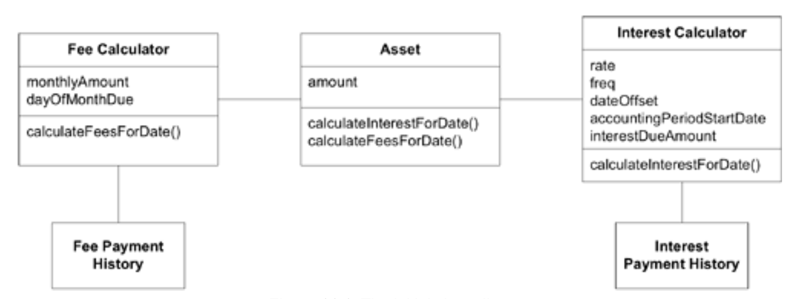
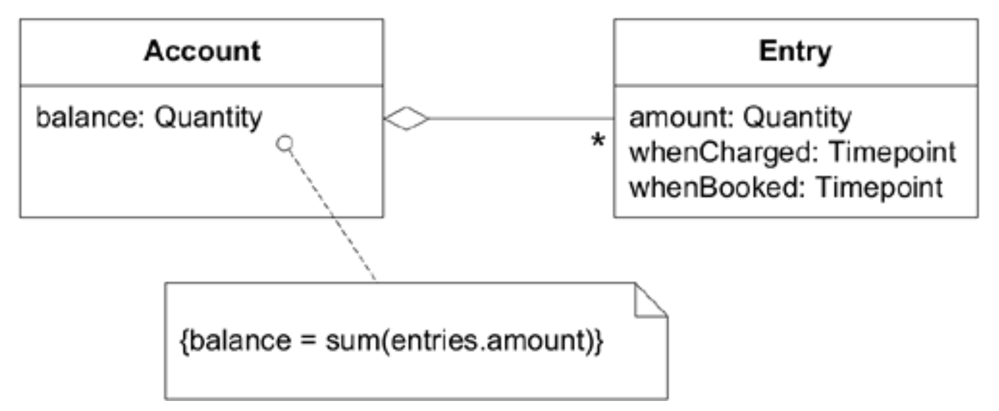
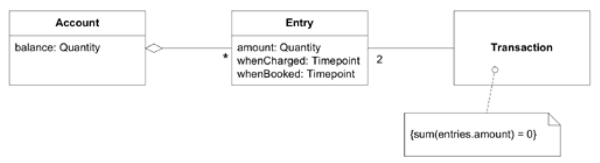
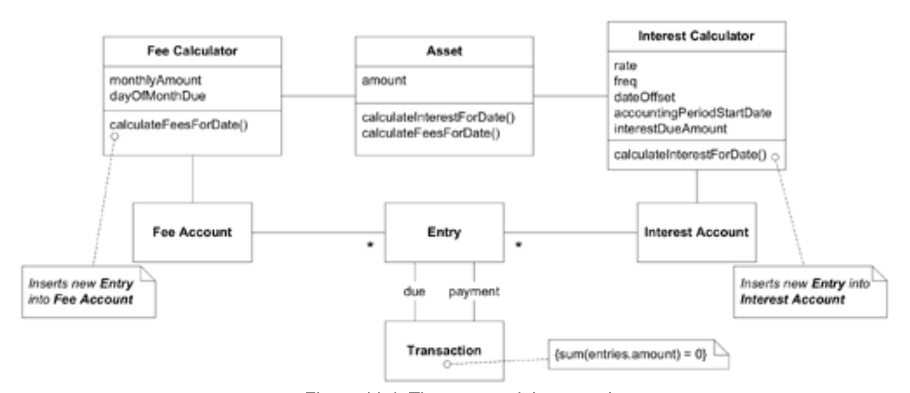
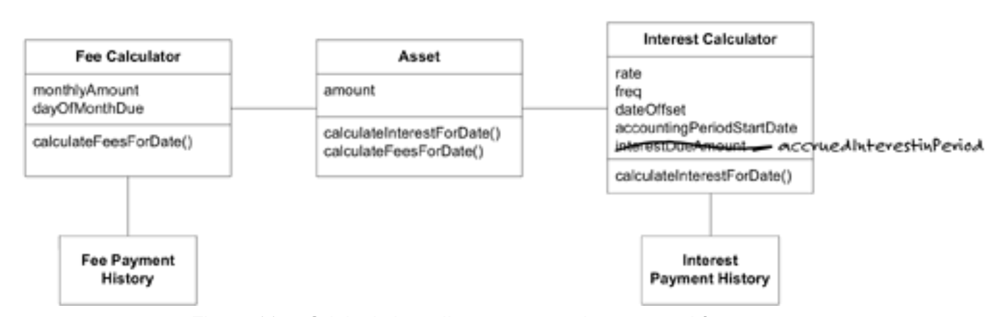
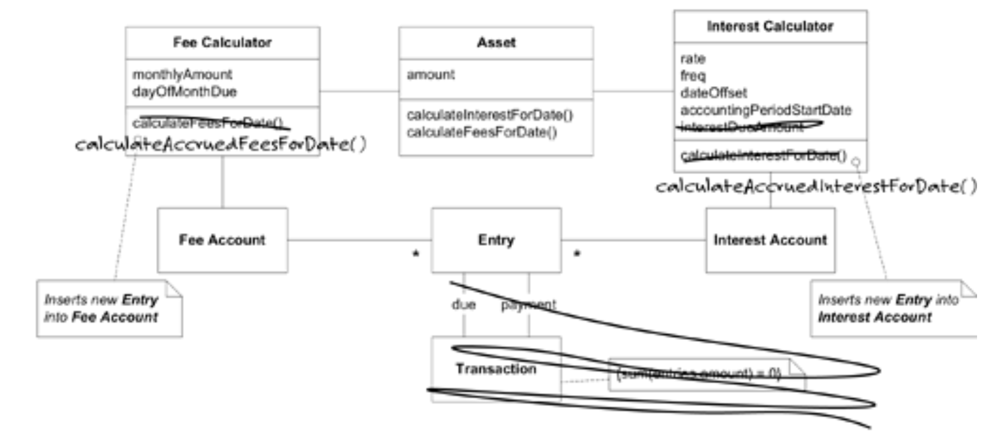
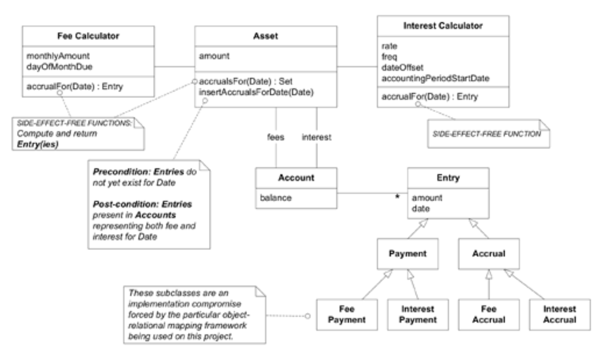

## 示例：利用账户赚取利息

#### ▶[上一节](0.md)

[第 10 章](../ch10/0.md) 展示了开发者为特定专业会计应用程序探索更深入模型时可能采用的多种途径。这里再提供一个场景。这次，开发者将从 Fowler 的 *《Analysis Patterns》* 一书中挖掘有用的思路。

简而言之，这款用于追踪贷款及其他计息资产的应用程序，负责计算产生的利息与费用，并追踪借款人的还款情况。夜间批处理流程会提取这些数据，将其传递至传统会计系统，同时标明每笔款项应记入的具体账簿。该设计虽能运作，但操作笨拙、变更困难且缺乏良好的信息传递机制。

#### Figure 11.1

*初始类图*

开发者决定阅读 *《Analysis Patterns》* 第六章 “库存与会计”。以下是她认为最相关部分的摘要。

* *《Analysis Patterns》* 中的`Accounting Models`

  各类商业应用程序都会追踪 *账户*，这些账户承载着具有价值的事物，通常是金钱。在许多应用中，仅仅记录账户余额是不够的。必须对余额的每次变动进行核算和控制，这正是最基础会计模型诞生的动因。 *（译注：参看 [Figure 11.2](#figure-112) ）*

  通过插入（正值的）`Entry`可增加余额，插入负值的`Entry`则减少余额。所有`Entry`永不删除，因此完整历史记录得以保留。余额是所有`Entry`累积效应的体现，可按需计算或缓存，该实现决策由`Account`接口封装。

  会计的基本原则是 *守恒 (conservation)* 。金钱不会凭空出现，也不会无影无踪地消失。它只是从一个`Account`转移到另一个。 *（译注：参看 [Figure 11.3](#figure-113) ）*

  这是 *复式记账法* 中公认的基本原理：每笔贷方都对应一笔借方。当然，如同其他守恒原理，它仅适用于封闭系统，即包含所有来源与汇聚点的系统。许多简单应用并不需要如此严格的处理。

  在他的书中，Fowler 不仅收录了这些模型的更复杂形式，还对其中的权衡取舍进行了深入探讨。

#### Figure 11.2

*基础会计模型*

#### Figure 11.3

*交易模型*

这次阅读让开发者（**开发者 1**）获得了若干新思路。她将该章节展示给同事（**开发者 2**），这位同事不仅与她共同参与过利息计算逻辑的开发，还编写了夜间批处理程序。两人共同对模型进行了初步调整，融入了阅读中涉及的部分模型元素。

#### Figure 11.4

*新模型提案*

随后他们邀请领域专家（**专家**）参与讨论新模型构想。

**开发者 1** ：采用这个新模型后，我们会为赚取的利息在`Interest Account`中创建一条`Entry`记录，而不是仅仅调整`interestDueAmount`。随后，另一条支付`Entry`记录会将其抵消。

**专家** ：这样我们就能看到所有利息累积的历史记录以及支付记录了？这正是我们一直想要的功能。

**开发者 2** ：我不确定我们对`Transaction`的用法是否完全正确。定义中提到的是将资金从一个`Account`转移到另一个`Account`，而不是在同一个`Account`内相互抵消的两笔记录。

**开发者 1** ：说得对。我也担心书中似乎特别强调交易必须一次性创建。利息支付可能延迟几天。

**专家** ：这些支付未必是延迟。其支付时间存在很大灵活性。

**开发者 1** ：这可能是个死胡同。我认为我们或许发现了某些隐含概念。让`Interest Calculator`创建`Entry`对象确实能更清晰地传达逻辑。而`Transaction`似乎完美地将计算出的利息与付款关联起来。

**专家** ：为何要将应计利息与付款强行关联？它们在会计系统中本是独立的记账项目。`Account`余额才是核心要素。结合单个`Entries`数据，我们已具备所需全部信息。

**开发者 2** ：你是说你们不追踪他们是否支付了利息？

**专家** ：当然追踪啦。但这可不像你们这种“一次计息/一次付款”的方案那么简单。

**开发者 2** ：其实不必再纠结这个关联，反而能简化很多事情。

**开发者 1** ：好的，这样如何？ *\[取出旧类图副本开始勾勒修改方案\]* 对了，你刚才多次提到 *应计 (accruals)* 这个词，能具体说明它的含义吗？

**专家** ：当然。应计指在费用或收入发生时进行核算，而不考虑资金实际流动的时间点。例如利息按日计提，但月底（例如）才会收到相应款项。

**开发者 1** ：没错，我们确实需要这样的术语。好的，这样看起来如何？

#### Figure 11.5

*原始类图，应计与付款分离*

**开发者 1** ：现在我们可以消除计算器中因关联付款产生的所有复杂性，同时引入了 *应计 (accruals)* 这一术语，更能清晰体现设计意图。

**专家** ：所以我们不打算使用`Account`对象？我原本期待能通过它统一查看所有内容，包括应计项目、支付记录和余额。

**开发者 1** ：真的吗？！既然如此，或许 *这个* 方案可行。*\[取出另一张图稿开始绘制\]*

#### Figure 11.6

*基于账户的图示，不含`Transaction`*

**专家** ：这看起来相当不错！

**开发者 2** ：批处理脚本很容易改用这些新对象。

**开发者 1** ：让新的`Interest Calculator`正常运行需要几天时间，因为需要修改不少测试用例。不过修改后测试代码会更清晰易读。

两位开发者随即着手根据新模型进行重构。随着他们深入代码并优化设计，逐渐获得的洞见反过来又完善了模型。

`Entries` 被细分为 `Payment` 和 `Accrual`，因为深入分析发现它们在应用程序中的职责存在细微差异，且两者都是重要的领域概念。另一方面，`Entries` 无论源于费用还是利息，在概念和行为上并无区别，它们仅需出现在相应的 `Account` 中即可。

然而遗憾的是，开发人员发现他们不得不放弃这个最后的抽象层来实现具体功能。数据存储在关系表中，项目标准要求这些表在不运行程序的情况下也能被理解。这意味着必须将费用条目和利息条目分别存放在不同的表中。开发者使用特定的对象关系映射框架时，唯一实现方式就是创建具体的子类（如`Fee Payments`、`Interest Payments`等）。若采用不同的基础设施，或许就能避免这种笨拙的扩展。

我在这篇虚构故事中加入这个转折，正是为了展现我们时刻遭遇的现实磨砺。我们必须做出深思熟虑的妥协，然后继续前行，绝不让这些磕绊偏离我们的 [MODEL-DRIVEN DESIGN](../ch3/1.md)。

#### Figure 11.7

*实现后的类图*

新设计更易于分析和测试，因为最复杂的功能都集中在`SIDE-EFFECT-FREE FUNCTIONS`中。剩余的命令具有简单代码（因其调用各种`FUNCTIONS`），并以`ASSERTIONS`为特征。

有时，我们甚至不会察觉程序中某些部分其实具备从领域模型中获益的潜力。这些部分可能最初设计得极其简单，随后机械式地演变而来。它们看似复杂的应用程序代码，而非领域逻辑。分析模式尤其能帮助我们发现这些盲点。

在下面的示例中，一位开发者对夜间批处理程序这个黑盒子有了新的认识，此前该程序从未被视为领域导向的。

#### ▶[下一节](2.md)
