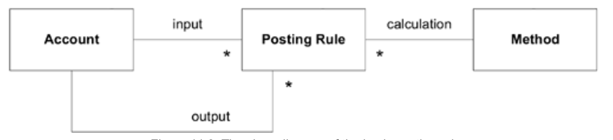
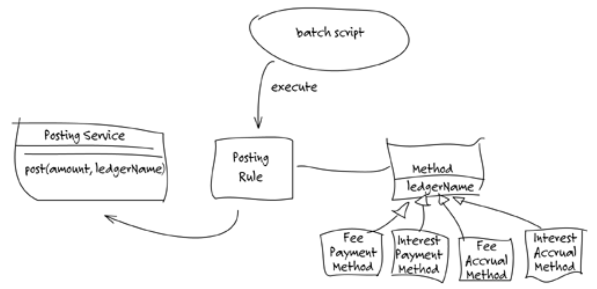
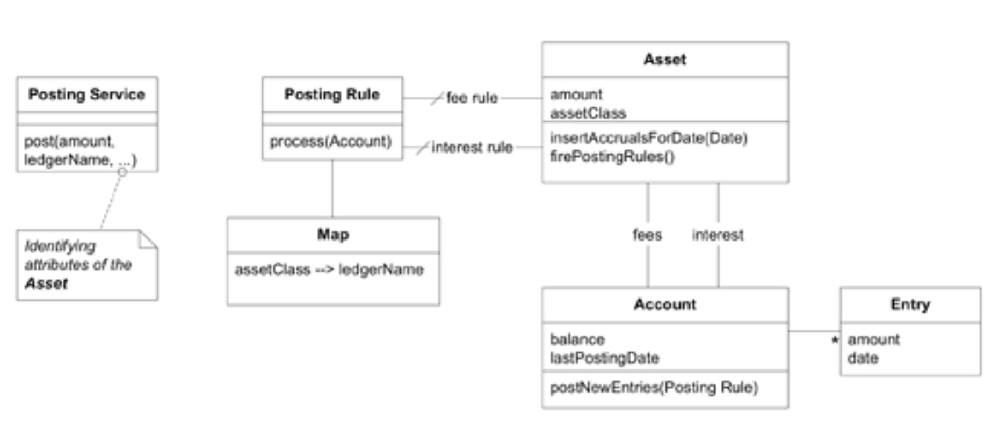
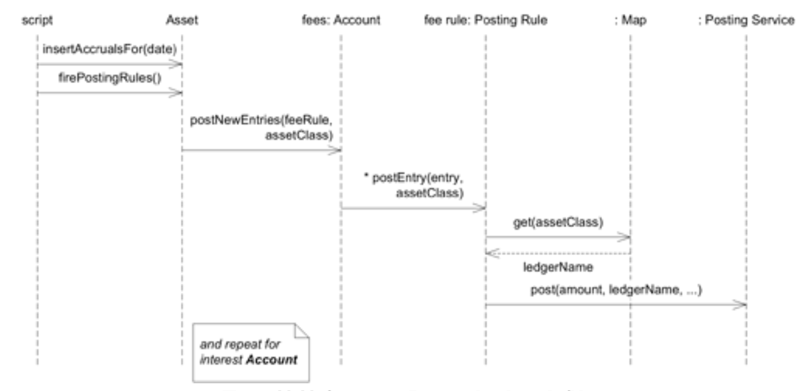

## 示例：夜间批处理的洞察

#### ▶[上一节](1.md)

经过几周的运行，基于改进的`Account`模型已逐渐稳定。正如常有的情况，新设计的清晰度反而让其他问题更显眼。负责将夜间批处理适配至新设计的开发者（ **开发者 2** ）开始发现批处理行为与 *《Analysis Patterns》* 中某些概念的关联。以下是他认为最相关的概念摘要。

* 记账规则 (Posting Rules)

  会计系统通常会提供同一基础财务信息的多种视角。一个账户可能追踪收入，另一个账户则可能追踪该收入的预估税款。若系统需自动更新预估税款账户，这两个账户的实现将变得高度交织。某些系统中，绝大多数账目记录都源于此类规则；在这种系统里，依赖逻辑往往变得混乱不堪。即便在规模较小的系统中，此类交叉记账也可能相当棘手。要理清依赖关系的纠葛，首要步骤是通过引入新对象来明确这些规则。

  当 “输入” 账户出现新的`Entry`时，记账规则会被触发。随后它会（根据自身的计算`Method`）生成新的`Entry`，并将该条目插入其 “输出” `Account`中。在薪资系统中，薪资账户中的某条`Entry`可能触发一条`Posting Rule`，该规则会计算出 30% 的预估所得税，并将其作为一条`Entry`插入到代扣税款账户中。

#### Figure 11.8

*基本记账规则的类图*

* 执行记账规则

  记账规则已在`Accounts`之间建立了概念依赖关系，但若模式仅止步于此，则可能难以理解。依赖关系设计中最棘手的部分之一在于更新的时机与控制。Fowler 探讨了三种方案。

  1. “立即触发” 是最明显的方案，但通常也是最不实用的。每当向`Account`插入一条`Entries`时，它会立即触发`Posting Rules`，所有更新都将即时生效。
  2. “基于账户的触发” 允许延迟处理。当消息发送至某个`Account`时，会触发其`Posting Rules`处理自上次触发以来插入的所有`Entries`。
  3. 最后，“基于记账规则触发” 由外部代理启动，该代理会通知`Posting Rule`进行触发。`Posting Rule`负责检索自上次触发以来，所有输入账户中新增的`Entries`。 
  尽管系统中可混合使用多种触发模式，但每套特定规则都需明确界定触发点，并明确识别输入`Account Entries`的责任主体。将三种触发模式引入 [UBIQUITOUS LANGUAGE](../ch2/1.md) ，对模式的成功实施而言与模型对象定义本身同等重要。此举消除了模糊性，将决策过程直接引导至明确定义的选项集。这些模式揭示了易被忽视的挑战，并提供支持清晰讨论的术语体系。

**开发人员 2** 需要一个倾诉对象来讨论他的新想法。他遇见了他的同事（ **开发人员 1** ），这位开发人员主要负责建模应计项目。

**开发者 2** ：从某个节点开始，夜间批处理沦为我们掩盖问题的场所。脚本执行过程中暗含着领域逻辑，且日趋复杂。我长期以来都想为批处理实施模型驱动设计，分离出领域层，让脚本本身成为领域层之上的简化层。但始终无法厘清该领域模型应有的形态。当时觉得或许只是些无法转化为对象的过程。最近研读 *《Analysis Patterns》* 中关于`Posting Rules`的章节时，我逐渐有了思路。具体构想如下：\[递过草图\]

#### Figure 11.9

*批处理中尝试使用`Posting Rules`过账规则*

**开发者 1**：这个`Posting Service`是什么？

**开发者 2**：这是个`FACADE`，它暴露会计应用的 API 并将其呈现为 [SERVICE](../ch5/4.md) 。其实我之前就创建了这个组件来简化批处理代码，同时它也为向遗留系统进行过账提供了 [INTENTION-REVEALING INTERFACE](../ch10/1.md) 。

**开发者 1**：有意思。那么，你打算为这些`Posting Rules`采用哪种触发方式？

**开发者 2**：我还没考虑那么远呢。

**开发者 1** ：对于`Accruals`，立即触发确实可行，因为批处理实际上会指示`Asset`进行插入操作。但对于`Payments`则不可行，因为它们是在当天实时录入的。

**开发者 2** ：我认为无论如何都不该将计算方式与批处理如此紧密耦合。若未来需要在不同时间点触发利息计算，这种设计会引发混乱。从概念上讲，这种做法本身就不合理。

**开发者 1** ：听起来像是基于`Posting Rule`的触发机制。批处理会通知每个`Posting Rule`执行，规则会去查找合适的新`Entries`，然后执行其操作。这基本符合你画的示意图。

**开发者 2** ：这样就能避免在批处理设计上产生大量依赖关系，同时批处理仍保持控制权。听起来没错。

**开发者 1** ：我对这些对象与`Accounts`和`Entries`的交互关系仍有些模糊。

**开发者 2** ：我也是这么想的。书中的示例直接将`Accounts`与`Posting Rules`关联起来。这种逻辑看似合理，但我不认为它适合我们的场景。每次都得从数据实例化这些对象，所以必须先确定适用规则才能关联。而`Asset`对象才是掌握每个`Account`内容的实体，自然也知道该应用哪条规则。总之，剩下的部分该怎么处理？

**开发者 1** ：我不想吹毛求疵，但感觉我们用 “Method” 用的不太对。我认为概念是`Method`计算应记账金额 —— 比如对收入预扣 20% 的税款。但我们的情况很简单：记账金额始终是全额。我认为`Posting Rule`本身应该知道记入哪个`Account`，这对应于我们的 “Ledger name”。

**开发者 2** ：哦。既然`Posting Rule`负责获取正确的账本名称，那我们可能根本不需要`Method`。

实际上，选择合适的账簿名称这件事正变得越来越复杂。它已经需要结合收入类型（手续费或利息）与“asset class”（企业为每个`Asset`分配的分类）。这正是我期待新模型能提供帮助的地方。

**开发者 1** ：好的，我们先聚焦于此。`Posting Rule`负责根据`Account`的属性选择分类账。目前我们可以采用直接处理资产类别及区分利息与费用的方式。未来你将拥有可扩展的`OBJECT MODEL`，用于处理更复杂的场景。

**开发者 2** ：我需要再仔细斟酌一下。让我好好琢磨，重新研读设计模式，之后再尝试解决。明天下午能再和你讨论这个吗？

接下来的几天里，两位开发者共同设计出模型并重构了代码，使批处理流程仅需遍历`Assets`对象，向每个对象发送几条自解释性消息，最后提交数据库事务即可。复杂性被转移到领域层，通过对象模型使其既更明确又更抽象。

#### Figure 11.10

*包含`Posting Rules`的类图*

#### Figure 11.11

*展示规则触发的序列图*

开发者在实现过程中显著偏离了 *《Analysis Patterns》* 中提出的模型细节，但他们认为仍保留了概念的精髓。他们对让`Asset`参与`Posting Rule`的选择略感不安。之所以这样设计，是因为`Asset`既掌握着每个`Account`的性质（费用或利息），又是脚本的自然访问入口。若将规则对象直接关联至`Account`，则每次实例化对象时（即每次批处理运行时）都需与`Asset`对象协作。相反，他们让`Asset`对象通过`SINGLETON`访问机制查找两个相关规则，并向其传递对应的`Account`。这种做法使代码更直观，因此他们做出了务实的选择。

他们都认为，从概念上讲，将`Posting Rules`仅与`Accounts`关联会更合理，同时让`Asset`专注于生成`Accruals`的核心功能。他们期待后续的重构和更深入的理解能让他们重新审视这一方案，找到在保持代码清晰度的前提下实现这种明确划分的方法。

#### ▶[下一节](3.md)
