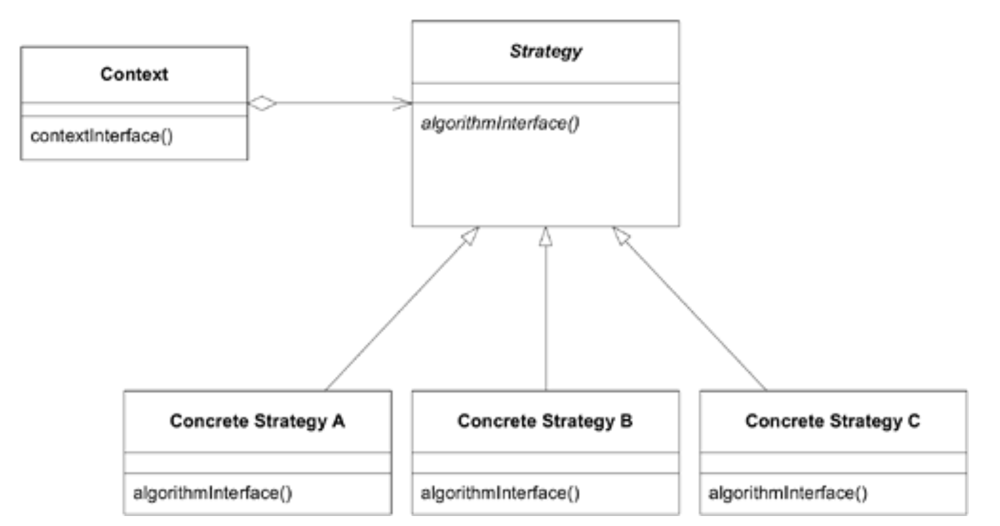
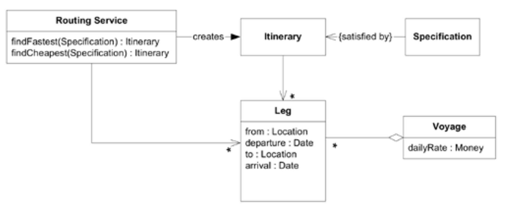
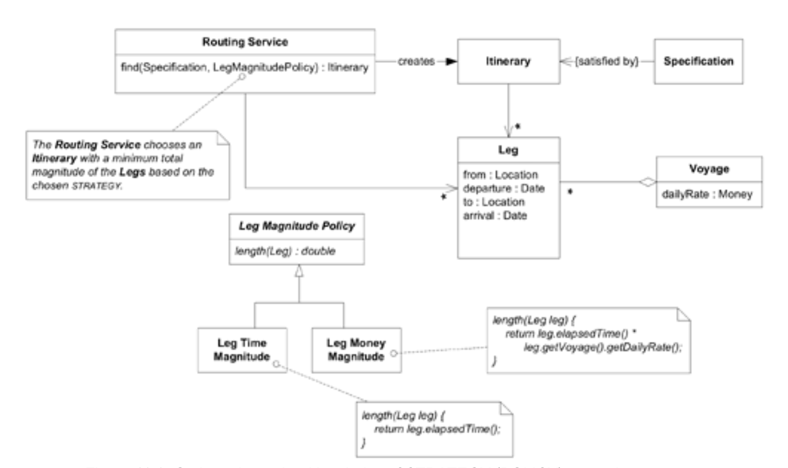

## Strategy (A.K.A.Policy)

#### ▶[上一节](0.md)

*定义一组算法，封装每个算法，并使其可互换。`STRATEGY`使算法能够独立于使用它的客户端进行变化。[Gamma et al. 1995](../references.md#gamma-1995)*

<ins>**领域模型包含的流程并非基于技术驱动，而是在问题领域中具有实际意义。当必须提供替代流程时，选择合适流程的复杂性与多重流程本身的复杂性相互叠加，导致局面失控。**</ins>

在建模流程时，我们常会发现存在多种合理操作方式。当开始描述这些选项时，流程定义便变得笨拙而复杂。我们实际需要抉择的行为替代方案，因与其他行为混杂在一起而变得模糊不清。

我们希望将这种变体与流程的核心概念分离，这样就能更清晰地看到主流程和选项。软件设计领域已成熟应用的`STRATEGY`模式正是为解决此类问题而生，尽管其侧重于技术层面。在此，该模式被作为概念应用于模型设计，并体现在该模型的代码实现中。同样需要将流程中高度可变的部分与相对稳定的部分解耦分离。

因此：

<ins>**将流程中可变的部分提取为模型中的独立 “策略” 对象。将规则与其控制的行为分离。遵循`STRATEGY`设计模式实现规则或可替换流程。策略对象的不同版本代表流程的多种实现方式。**</ins>

传统上将`STRATEGY`视为设计模式时，其核心在于替换不同算法的能力；而作为领域模式使用时，则侧重于表达概念的能力，通常是流程或策略规则。

### 示例：路线规划策略

当向`Routing Service`传递`Route Specification`时，该服务将构建满足`SPECIFICATION`的详细`Itinerary`。此`SERVICE`作为优化引擎，可通过调优实现寻找最快路线或最经济路线的功能。

#### Figure 12.1

*带选项的`SERVICE`接口需要条件逻辑。*

这个设置看起来没问题，但仔细查看路由代码就会发现每个计算中都存在条件判断，导致在最快与最便宜之间做抉择的情况随处可见。当新增选择路线的细微标准时，问题将更加棘手。

一种方法是将这些调优参数拆分为`STRATEGIES`。这样就能明确表示它们，并作为参数传递给`Routing Service`。

如今`Routing Service`以统一且无条件的方式处理所有请求，寻找具有低权重的`Legs`序列，由`Leg Magnitude Policy`计算得出。

该设计具备 *《Design Patterns》* 中`STRATEGY`模式的核心优势。在应用多样性和灵活性层面，通过安装合适的`Leg Magnitude Policy`，现可控制并扩展`Routing Service`的行为。[Figure 12.2](#figure-122) 所示的`STRATEGIES`（最快或最便宜）仅是最显而易见的实现方式，兼顾速度与成本的组合方案同样可行。还可能存在其他考量因素，例如倾向于将货物预订在公司自有运输工具上，而非外包给其他航运公司的运输工具。这些修改本可不依赖`STRATEGIES`实现，但逻辑将缠绕于`Routing Service`内部，导致其接口臃肿。解耦设计使其清晰易于测试。

#### Figure 12.2

*由作为参数传递的`STRATEGY`（POLICY）的选择所决定的选项*

该领域中一条至关重要的规则，在构建`Itinerary`时选择某条`Leg`而非另一条的依据，现已明确且清晰。它传达了这样的认知：单个航段的特定属性（可能为衍生属性）被浓缩为单一数值，正是路线规划的基准。这使得领域语言能够用简洁的表述定义`Routing Service`的行为：`Routing Service`将根据选定的`STRATEGY`，选择`Legs`总数值最小的`Itinerary`。

注：此讨论暗示`Routing Service`在搜索`Itinerary`时实际上会评估`Legs`。这种方法在概念上较为直观，可作为合理的原型实现方案，但其效率可能无法接受。本应用将在 [第 14 章](../ch14/0.md) “维护模型完整性” 中再次探讨，届时将使用相同接口，但采用完全不同的`Routing Service`实现方案。

🌼🌼🌼

当我们在领域层运用技术设计模式时，必须赋予其额外的动机，增添一层深层含义。当`STRATEGY`模式对应实际业务策略或政策时，该模式便超越了单纯的实用实现技巧（尽管后者本身也具有重要价值）。

设计模式的 *后果* 完全适用。例如，在 *《Design Patterns》* 中，Gamma 等人指出客户端必须了解不同的`STRATEGIES`，这也是建模层面的考量。纯粹的实现层面的问题在于`STRATEGIES`可能增加应用程序中的对象数量。若此为问题，可通过将`STRATEGIES`实现为上下文可共享的无状态对象来降低开销。 *《Design Patterns》* 中关于实现方法的详尽讨论在此同样适用。这是因为我们仍在使用`STRATEGY`模式。虽然动机存在部分差异，将影响某些选择，但设计模式中蕴含的经验仍可供我们借鉴。

#### ▶[下一节](2.md)
