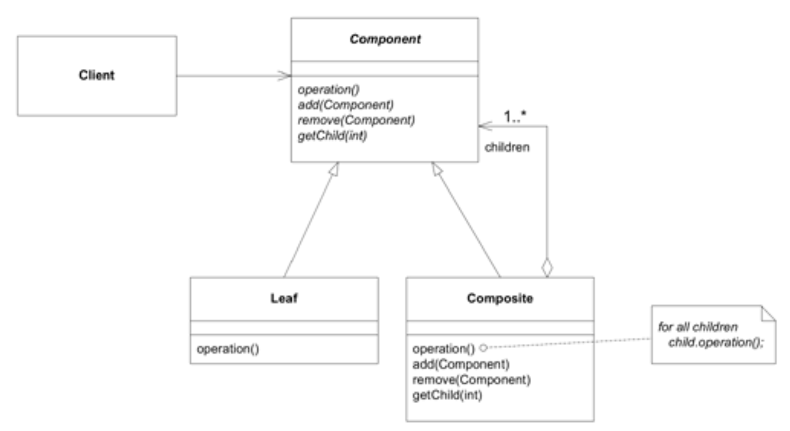
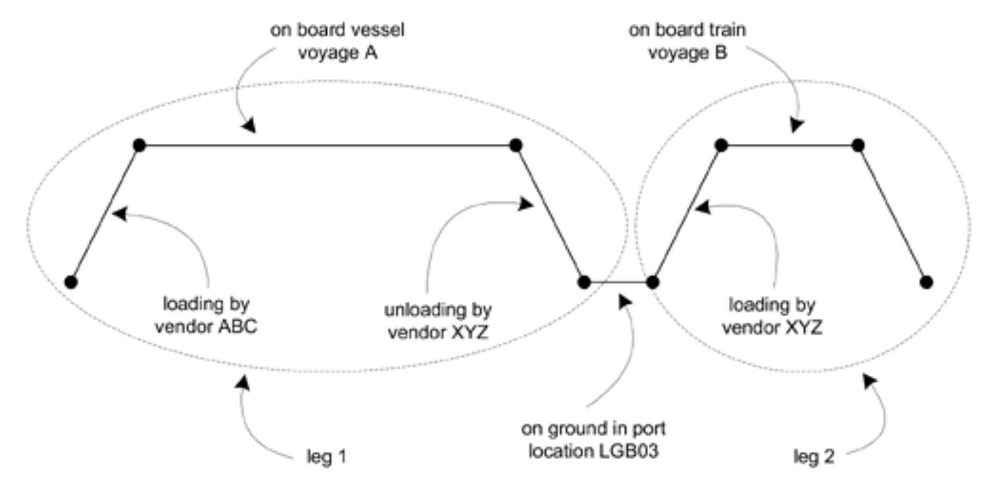
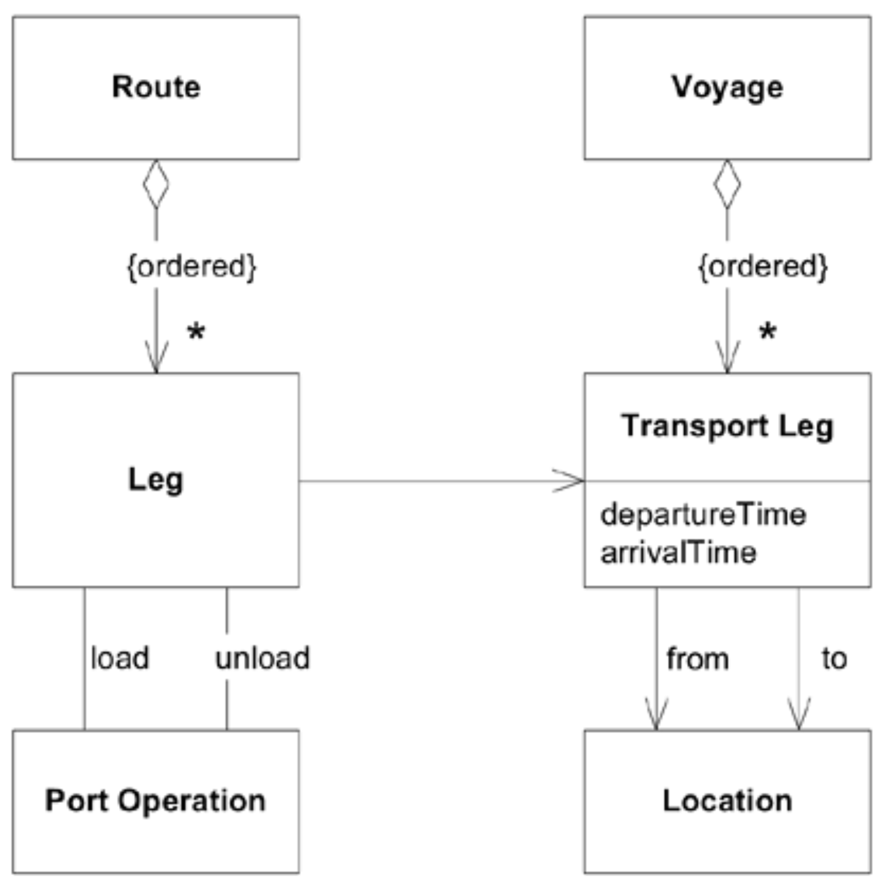
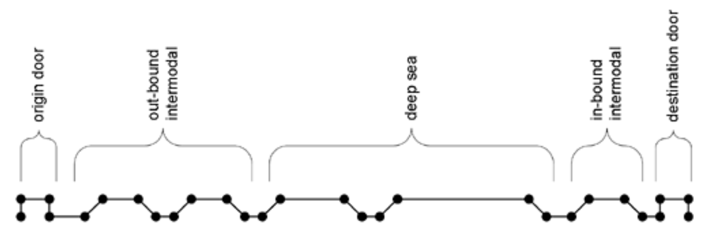
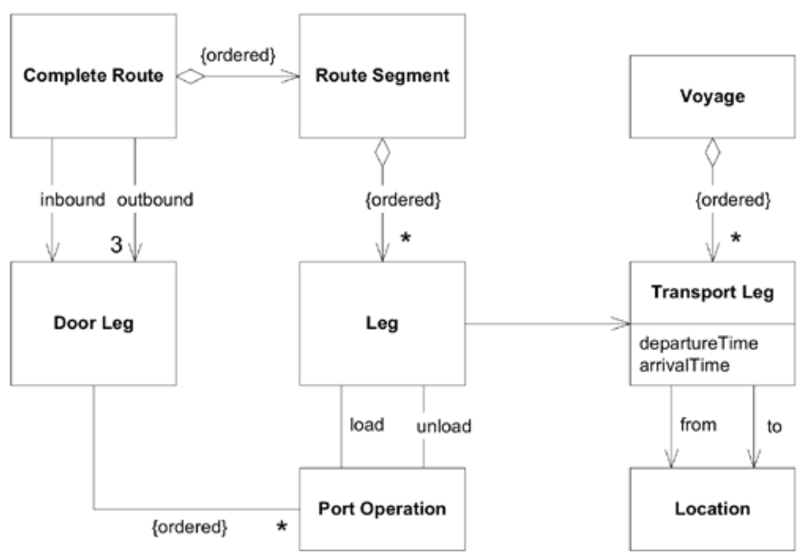
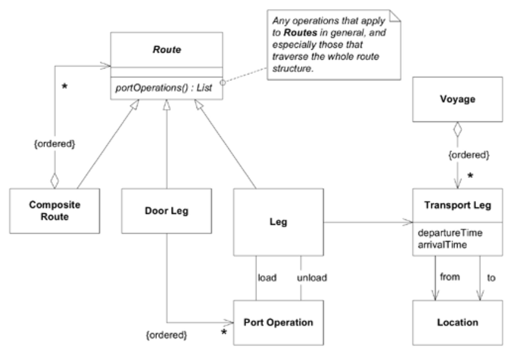
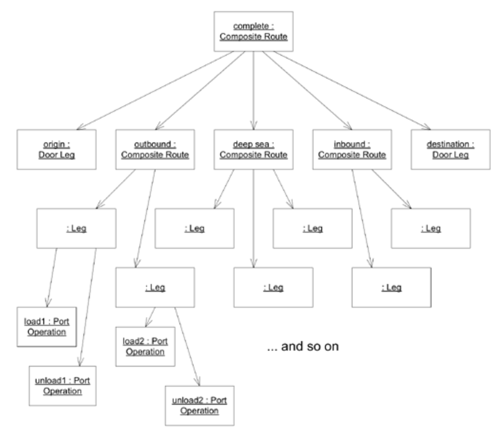

## 组合：`COMPOSITE`

#### ▶[上一节](1.md)

*将对象组合成树状结构以表示部分-整体层次关系。`COMPOSITE`使客户端能够统一处理单个对象及其组合体。[Gamma et al. 1995](../references.md#gamma-1995)*

在建模复杂领域时，我们常会遇到这样一种重要对象：它由若干部分组成，而这些部分本身又包含更小的部分，如此层层嵌套，有时甚至能无限深地嵌套下去。在某些领域中，这些层级在概念上是截然不同的；但在其他情况下，部分与整体本质上属于同一类事物，只是尺寸更小而已。

<ins>**当嵌套容器的关联性未在模型中体现时，层次结构的每个层级都需重复实现通用行为，且嵌套关系变得僵化（例如容器通常无法在其自身层级包含其他容器，且层级数量固定）。客户端必须通过不同接口处理层次结构的不同层级，即使这些层级在概念上并无差异。通过递归遍历层次结构来生成聚合信息的过程极为复杂。**</ins>

在领域中应用任何设计模式时，首要考虑的是该模式理念是否真正契合领域概念。递归遍历关联对象或许便捷，但该领域是否存在真正的整体-部分层次结构？你是否找到了能使所有部分真正属于相同概念类型的抽象层？若答案为肯定，`COMPOSITE`模式将使模型中这些方面更清晰，同时让你能借鉴该设计模式精心构思的设计与实现考量。

因此：

<ins>**定义一个抽象类型，涵盖`COMPOSITE`的所有成员。容器节点的方法实现返回信息，用于返回其内容的聚合信息。“叶子 (Leaf)” 节点根据自身值实现这些方法。客户端只需处理抽象类型，无需区分叶节点与容器。**</ins>

在结构层面上，这是一种相当明显的模式，但设计师往往未能深入挖掘该模式在操作层面的实现细节。`COMPOSITE`模式在每个结构层级都提供相同的行为，无论是微小还是庞大的组件，都能清晰地反映其构成并提出有意义的问题。这种严谨的对称性正是该模式强大功能的核心所在。

### 示例：由航段组成的运输路线

完整的货物运输路线极为复杂。首先需用卡车将集装箱运至铁路枢纽，再转运至港口，随后通过船舶运往另一港口，期间可能转运至其他船舶，最终在目的地通过陆路运输完成。

#### Figure 12.3

*由 “航段” 组成的 “路线” 示意图*

应用开发团队创建了一个对象模型，用于表示这些可任意延伸的航段，它们组合起来便形成了一条路线。

#### Figure 12.4
 
*由`Legs`组成`Route`的类图*

基于此模型，开发人员能够根据预订请求创建`Route`对象。他们能够将`Legs`处理成运营计划 (operational plan)，用于分步骤处理货物。随后他们发现了一个问题。

开发人员一直将路线视为一串任意且未区分的区段。

#### Figure 12.5

*开发人员对路线的认知*

事实证明，领域专家将路线视为五个逻辑区段的序列。

#### Figure 12.6

*业务专家对运输路线的认知*

这些子路线可能由不同人员在不同时间规划，因此必须视为独立存在。细察之下，“门段运输 (door legs)” 与其他运输环节截然不同：它涉及本地雇佣的卡车甚至客户自运，而其他环节则是精心安排的铁路和船舶运输。

反映所有这些区别的对象模型开始变得复杂起来。

#### Figure 12.7
 
*`Route`的复杂类图*

从结构上看，该模型并不算太糟，但运营计划处理的一致性已不复存在，因此代码甚至行为描述都变得复杂得多。其他问题也开始显现：任何路线遍历都涉及多种不同类型对象的集合。

引入`COMPOSITE`。对于某些客户端而言，将该构造中的不同层级统一视为由路线组成的路线会更理想。从概念上讲，这种视角是合理的。`Route`的每个层级都代表集装箱从一点到另一点的移动，直至最底层的单个航段。（参见 [Figure 12.8](#figure-128) 。）

#### Figure 12.8

*使用`COMPOSITE`的类图*

静态类图无法像前图那样清晰展现门段运输 (door legs) 与其他部件的组合方式。但模型远不止于静态类图。我们将通过其他图示（见 [Figure 12.9](#figure-129) ）及（如今大幅简化的）代码传递组装信息。该模型精准捕捉了各类`Route`对象间的深层关联性。生成运营计划的过程再度变得简单，其他路线遍历操作亦然。

#### Figure 12.9

*表示完整`Route`的实例*

当路线由其他路线组成，通过端对端拼接实现从一地到另一地的路径时，您可以实现不同详细程度的路线。您可以截断路线末端并接入新终点，可以任意嵌套细节层级，并能利用各种可能有用的选项。

当然，我们目前尚不需要这些选项。在需要那些路线分段和不同的门段运输 (door legs) 之前，我们没有`COMPOSITE`也运作得很好。设计模式应当仅在需要时才被应用。

🌼🌼🌼

#### ▶[下一节](3.md)
