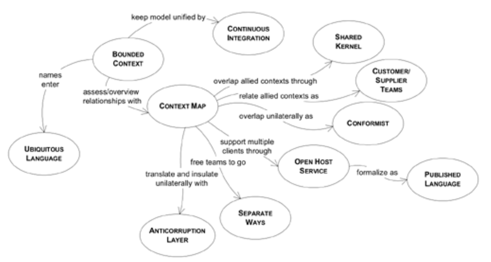

## 第 14 章 维护模型完整性

#### ▶[上一节](../part4.md)

我曾参与一个项目，多个团队并行开发一个大型新系统。某天，负责客户开票模块的团队准备实现一个名为`Charge`的对象时，发现另一团队已构建了相同对象。他们认真地着手复用现有对象，却发现缺少 “费用代码 (expense code)” 属性，于是添加了该字段。该对象恰好具备他们需要的 “记账金额 (posted amount)” 属性。他们原本打算将其命名为 “应付金额 (amount due)”，但 ——名称何足挂齿？—— 最终还是改了名。通过添加若干方法和关联关系，他们最终得到一个看似符合需求的对象，且未破坏原有结构。虽然不得不忽略许多不需要的关联关系，但他们的应用模块成功运行了。

几天后，账单支付应用模块出现了神秘故障，该模块正是最初编写`Charge`程序的场景。系统突然生成了一些无人记得输入且毫无意义的异常`Charge`记录。当调用某些功能时程序开始崩溃，尤其是月度累计税款报告功能。调查发现，崩溃源于调用某项计算当月所有付款可抵扣总额的功能。这些神秘记录的 “可抵扣百分比 (percent deductible)” 字段竟为空值，尽管数据录入应用程序的验证逻辑要求该字段存在，甚至设置了默认值。

问题在于这两个团队采用 *不同的模型* ，却未意识到差异存在，且缺乏检测机制。双方各自对费用性质做出了符合自身场景的假设（面向客户的计费与面向供应商的支付）。当代码合并时未能解决这些矛盾，最终导致软件不可靠。

倘若他们能更清醒地认识到这个现实，本可以有意识地决定如何应对。这或许意味着共同协作，敲定一个通用模型，再编写自动化测试套件以防未来出现意外。又或许只是达成共识：各自开发独立模型，互不干涉对方的代码。无论哪种方式，都始于对模型适用边界的明确约定。

他们发现问题后做了什么？他们分别创建了`Customer Charge`和`Supplier Charge`类，并根据对应团队的需求分别定义了这些类。眼下的问题解决后，他们又照旧继续原来的做法。唉。

尽管我们很少明确思考这一点，但模型的最基本要求是其内部一致性：术语始终具有相同含义，且不包含矛盾规则。当模型内部每个术语都明确无歧义且规则互不冲突时，这种内部一致性被称为 *统一性 (unification)* 。若缺乏逻辑一致性，模型便毫无意义。在理想状态下，企业应拥有覆盖整个领域范围的统一模型。该模型将实现完全统一，不存在术语定义的矛盾或重叠，所有关于该领域的逻辑陈述都将保持一致。

但在大型系统开发领域，理想状态难以实现。若试图在整个企业系统中维持如此高度的统一性，其代价远大于收益。系统不同部分允许存在多种模型是必要的，但我们必须审慎抉择：哪些部分可允许差异化发展，以及它们之间应建立何种关联。我们需要确保模型关键部分保持紧密统一的方法。这些目标既不会自动实现，也无法仅凭良好意愿达成，唯有通过有意识的设计决策和建立特定流程才能实现。<ins>**对于大型系统而言，领域模型的完全统一既不可行，也不具成本效益。**</ins>

有时人们会抗拒这个事实。多数人能看到多重模型带来的代价，它们限制了集成，使沟通变得繁琐。更何况，使用多个模型总显得不够优雅。这种对多重模型的抵触，有时会催生极具野心的尝试：企图将大型项目中的所有软件统一到单一模型之下。我承认自己也曾犯过这种过度扩张的错误。但请权衡其中的风险。

1. 可能同时尝试替换过多遗留系统。
2. 大型项目可能因协调开销超出其能力范围而陷入停滞。
3. 具有特殊需求的应用程序可能不得不采用无法完全满足其需求的模型，迫使它们将行为逻辑转移到其他地方。
4. 相反，试图用单一模型满足所有需求可能导致选项过于复杂，使模型难以使用。

此外，模型分歧既可能源于技术问题，也可能源于政治分裂和管理优先级的差异。不同模型的出现可能源于团队组织结构和开发流程。因此，即使没有技术因素阻碍完全整合，项目仍可能面临多种模型并存的局面。

鉴于为整个企业维持统一模型并不可行，我们不必坐以待毙。通过主动决定哪些要素需要统一，同时务实地承认哪些要素无法统一，我们能够构建清晰且共享的现状图景。以此为基础，我们既能确保需要统一的部分保持一致性，又能防止非统一部分引发混乱或数据损坏。

我们需要一种方法来标记不同模型之间的边界和关系。我们需要有意识地选择策略，然后始终如一地遵循该策略。

本章阐述了识别、传达和选择模型边界及其与其他模型关联的方法。一切始于绘制项目当前的疆域图。[BOUNDED CONTEXT](1.md) 界定了每个模型的适用范围，而 [CONTEXT MAP](3.md) 则提供了项目上下文及其相互关系的整体概览。这种模糊性的消除本身将改变项目运作方式，但未必足够。当我们建立起 [BOUNDED CONTEXT](1.md) 后， [CONTINUOUS INTEGRATION](2.md) 流程将确保模型的统一性。

那么，从这个稳定的状态出发，我们可以开始向更有效的`BOUNDING CONTEXTS`策略迁移，并建立它们之间的关联，从具有`SHARED KERNELS`的紧密关联上下文，到各自`SEPARATE WAYS`的松耦合模型。

#### Figure 14.1

*模型完整性模式导航图*

#### ▶[下一节](1.md)
