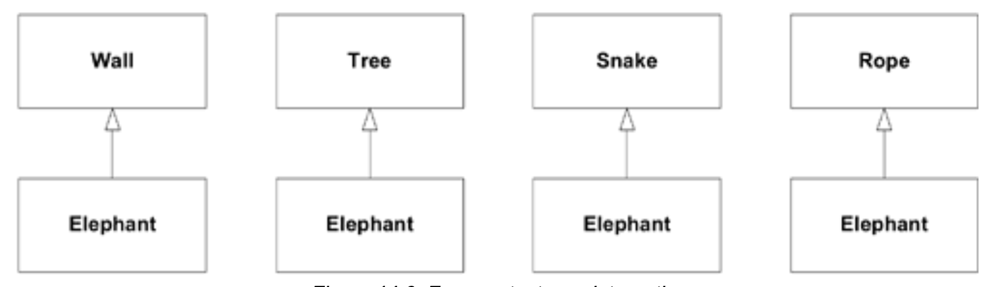
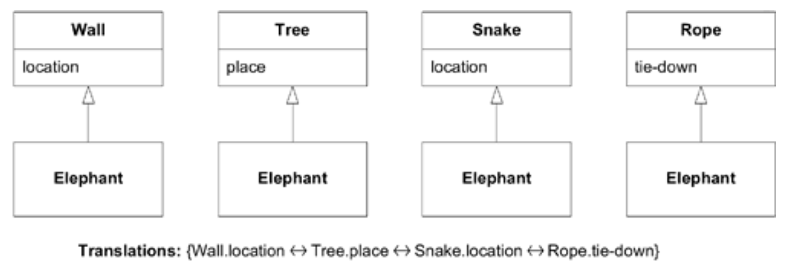
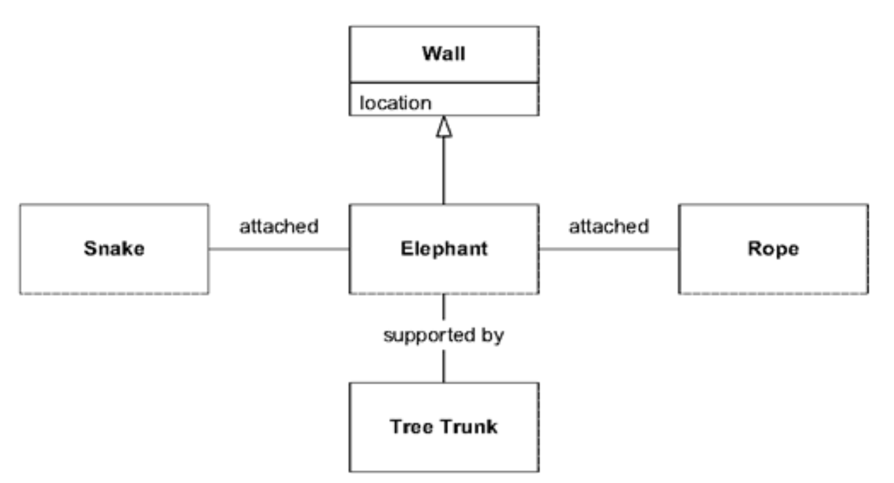
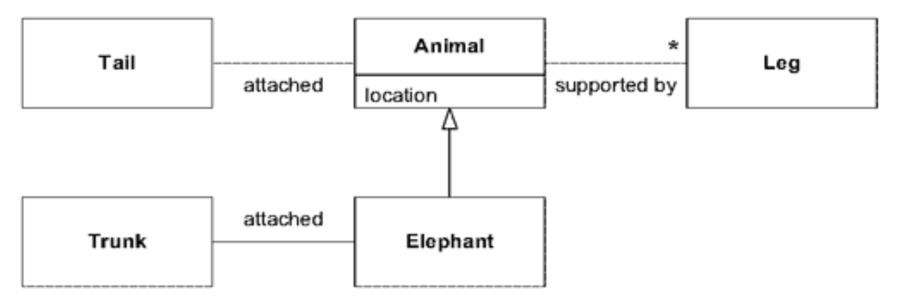

## 统一大象

#### ▶[上一节](11.md)

有六位印度斯坦的男子 
学识渊博， 
前去观象 
（虽皆盲人）， 
盼借观察之机 
各得心满意足。 

第一个孩子走到大象面前， 
不慎跌倒 
撞上它宽阔结实的侧身， 
当即嚷道： 
"天哪！这大象 
简直像座墙！" 

. . .

第三人走近那动物， 
恰巧将蠕动的躯干 
攥在掌心， 
便大胆地站起身说道： 
“我瞧见，”他说道，"大象 
实在酷似一条蛇。"

第四位伸出他渴望的手， 
摸索着膝盖的位置。 
"这神奇的野兽最像什么， 
再明显不过，"他说道； 
"大象分明像极了 
一棵参天古树！" 

. . .

第六人刚开始 
摸索那头野兽， 
便抓住摇摆的尾巴 
落入他触手可及之处， 
“我明白了，”他说道，"大象 
活像一根绳子！" 

于是这些印度斯坦人 
争论得又响又久， 
各执己见 
固执得不可动摇， 
虽各执部分真理， 
终究尽是谬误！ 

—— 节选自 John Godfrey Saxe（1816–1887）所著《The Blind Men and the Elephant》，该故事源自印度教经典《Udana》

根据与大象互动的目标不同，这些盲人即便对大象的本质没有完全共识，仍可能取得进展。若无需集成认知，模型不统一便无关紧要；若需要集成，他们未必需要就大象的定义达成一致，但仅通过承认分歧就能获得巨大价值。如此至少能避免他们不知不觉地各说各话。

[Figure 14.9](#figure-149) 中的图表是盲人对大象形成的模型的 UML 表示。在建立了独立的 [BOUNDED CONTEXTS](1.md) 之后，情况已经足够清楚，使他们能够找出一种方法，就他们共同关心的几个方面（比如大象的位置）相互交流。

#### Figure 14.9

*四个上下文：没有集成*

#### Figure 14.10

*四个上下文：最小集成*

当盲人们想要分享更多关于大象的信息时，分享单一 [BOUNDED CONTEXT](1.md) 的价值就提高了。但统一这些不同的模型是一个挑战。他们中没有人可能会放弃自己的模型去采用其他人的模型。毕竟，摸到尾巴的人知道大象并不像一棵树，而那个模型对他来说毫无意义也无用。统一多个模型几乎总是意味着需要创建一个新的模型。

通过一些想象和持续的讨论（可能会很激烈），盲人最终可能会意识到他们一直在描述和建模一个更大整体的不同部分。对于许多用途来说，部分与整体的统一可能并不需要太多额外工作。至少集成的第一阶段只需要弄清楚各部分之间的关系。对于某些需求来说，将大象视为一道由树干支撑、两端分别是绳子和蛇的墙可能已经足够。

#### Figure 14.11

*一个上下文：粗略集成*

将各种大象模型统一起来比大多数此类合并要容易。遗憾的是，当两个模型纯粹描述整体的不同部分时，这种情况反而成了例外，尽管这往往是差异的一个方面。当两个模型以不同方式观察同一部分时，问题就更复杂了。倘若两人触摸过象鼻，一人形容它像蛇，另一人形容它像消防水带，他们就会陷入更大困境。双方都无法接受对方的模型，因为它与自身经验相悖。实际上，他们需要一种新的抽象概念，既要包含蛇的 “生命力”，又要具备消防水带的喷水功能，同时摒弃原有模型的不当联想，例如预设可能存在毒牙，或能从身体分离后卷入消防车储物舱等不切实际的设想。

尽管我们将各个部分集成为整体，但最终模型仍显粗糙。它缺乏连贯性，未能遵循底层领域的轮廓特征。新见解可能推动模型在持续优化过程中走向深化，新的应用需求同样会迫使我们转向更深层的模型。若大象开始移动，“树木” 理论便不再成立，那些盲目的建模者或许能突破局限，领悟到 “腿部” 的概念。

#### Figure 14.12

*单一上下文：更深层模型*

第二次模型集成往往会剥离个体模型中偶然或错误的方面，并创造出新概念 —— 在此案例中，`animal` 由 `trunk`、`leg`、`body`和`tail`等部件构成，每个部件都具有自身属性，并与其他部件存在明确关联。成功的模型统一很大程度上取决于极简主义。象鼻既超越又逊于蛇身，但这种 “逊色” 可能比 “超越” 更为关键，与其附加错误的毒牙特征，不如舍弃喷水能力。

若目标仅是找到大象，那么在各模型间转换位置描述即可。当需要更深入的集成时，统一模型不必在初版就达到完全成熟。将大象视为由树干支撑的墙体，一端系着绳索，另一端盘踞着蛇，这样的表述或许已能满足某些需求。随着新需求涌现及理解与沟通的深化，模型可逐步深化与优化。

<ins>承认多个相互冲突的领域模型，本质上就是正视现实。</ins>通过明确定义每个模型的适用范围，既能保持各模型的完整性，又能清晰洞察在两个模型间创建特定接口的潜在影响。<ins>盲人无法看见整头大象，但只要他们意识到自身认知的不完整性，这个问题便可得到妥善处理。</ins>

#### ▶[下一节](13.md)
