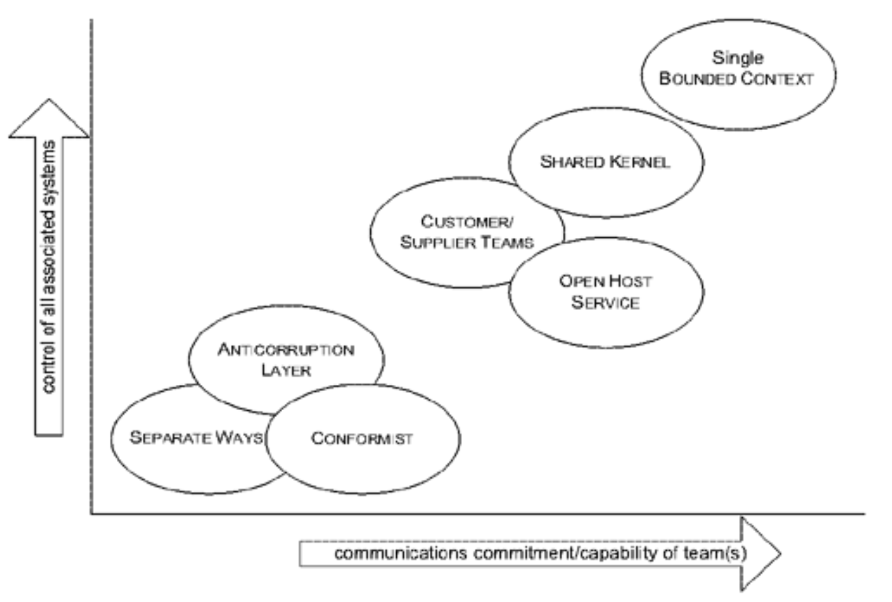

## 选择你的模型上下文策略

#### ▶[上一节](12.md)

始终绘制 [CONTEXT MAP](../ch14/3.md) 以反映任何给定时间的当前情况非常重要。然而，一旦完成，你可能会想要改变这种现状。现在，你可以开始有意识地选择 [CONTEXT](../glossary.md#context) 的边界和关系。以下是一些指导方针。

### 团队决策或更高层级决策

首先，团队必须决定在何处定义 [BOUNDED CONTEXTS](1.md) 以及它们之间应建立何种关系。这些决策必须由团队作出，或者至少必须传达给整个团队并获得所有成员的理解。事实上，此类决策往往涉及团队之外的协作。从本质上讲，是否扩展或划分 [BOUNDED CONTEXTS](1.md) 的决策，应基于独立团队行动价值与直接深度集成价值之间的成本效益权衡。实践中，团队间的政治关系常决定系统集成方式。技术上更优的统一方案可能因汇报结构受阻，管理层或许会强制推行笨拙的合并。你未必总能如愿以偿，但至少能评估并传达部分成本影响，采取措施加以缓解。从现实的 [CONTEXT MAP](../ch14/3.md) 出发，在选择转型方案时务必保持务实态度。

### 置身于上下文之中

]软件项目开发过程中，我们主要关注团队正在修改的系统部分（即“设计中的系统”），其次关注该系统将与之通信的其他系统。在典型场景中，设计中的系统会被划分为一到两个 [BOUNDED CONTEXTS](1.md) ，由主要开发团队负责，可能还有一两个辅助性质的 [CONTEXT](../glossary.md#context) 此外还需考虑这些`CONTEXTS`与外部系统之间的关联关系。这是个简化的典型视图，旨在让你对可能遇到的情况有个大致预期。

我们确实是所处核心 [CONTEXT](../glossary.md#context) 的一部分，这种关联必然体现在 [CONTEXT MAP](../ch14/3.md) 中。只要我们意识到这种偏向性，并在超出该`MAP`适用范围时保持警惕，这便不成问题。

### 边界的重塑

划定 [BOUNDED CONTEXTS](1.md) 的边界存在着无限多样的场景与无限多的选择。但通常面临的挑战在于平衡以下若干因素：

#### 倾向于更大的 [BOUNDED CONTEXTS](1.md)

- 当更多操作通过统一模型处理时，用户任务间的流程更顺畅。
- 理解一个连贯的模型比理解两个独立模型加映射更容易。
- 两个模型间的转换可能困难（有时甚至不可能）。
- 共享语言有助于促进团队清晰沟通。

#### 倾向于更小的 [BOUNDED CONTEXTS](1.md)

- 开发者之间的沟通开销减少。
- 小型团队和代码库更易实现 [CONTINUOUS INTEGRATION](2.md) 。
- 大型上下文可能需要更灵活的抽象模型，而此类技能往往供不应求。
- 不同模型可满足特殊需求，或涵盖特定用户群体的术语体系，以及 [UBIQUITOUS LANGUAGE ](../ch2/1.md) 的专属方言。不同 [BOUNDED CONTEXTS](1.md) 间的功能深度集成 

不同 [BOUNDED CONTEXTS](1.md) 之间功能的深度集成并不可行。集成仅限于那些能够通过另一模型严格定义的单一模型部分，而即使这种程度的集成也可能需要付出巨大努力。当两个系统之间存在小型接口时，这种做法是合理的。

### 接受无法改变之事：界定外部系统

最好从最简单的决策开始。某些子系统显然不属于正在开发的系统的任何 [BOUNDED CONTEXTS](1.md) 。例如那些无法立即替换的重大遗留系统，以及提供所需服务的外部系统。你可以立即识别这些系统，并准备将其从设计中分离出来。

在此我们必须谨慎对待自己的假设。虽然将每个系统视为独立的 [BOUNDED CONTEXT](1.md) 较为方便，但多数外部系统仅勉强符合该定义。首先，[BOUNDED CONTEXT](1.md) 的定义本质在于统一特定边界内的模型。你或许能掌控遗留系统的维护工作，此时可主动声明该意图；亦或遗留团队协作良好，正以非正式形式实践 [CONTINUOUS INTEGRATION](2.md) ，但切勿对此想当然。务必深入核查，若开发流程整合不佳则需格外谨慎。此类系统中不同模块存在语义矛盾的情况并不少见。

### 与外部系统的关系

此处可采用三种模式。首先考虑 [SEPARATE WAYS](../ch14/9.md) 。诚然，若无需集成，您本不会纳入这些系统。但请务必确认：仅为用户提供便捷访问两个系统的途径是否足够？集成成本高昂且易分散精力，因此请尽可能减轻项目负担。

若集成确实不可或缺，可选择两种极端方案：[CONFORMIST](../ch14/7.md) 或 [ANTICORRUPTION LAYER](../ch14/8.md) 。成为 [CONFORMIST](../ch14/7.md) 绝非乐事，你的创造力与新增功能的选择空间都将受限。在构建重大新系统时，遵循遗留系统或外部系统的模型往往缺乏实用性（毕竟，为何要开发新系统？）。但若作为大型核心系统的边缘扩展，延续遗留模型可能恰当，这类系统仍将主导整体架构。典型案例包括常以 Excel 等简易工具实现的轻量级决策支持工具。若您的应用实为现有系统的扩展，且与该系统的接口规模庞大，`CONTEXTS`之间的转换工作量极可能超过应用功能开发本身。即便置身于其他系统的 [BOUNDED CONTEXT](1.md) 中，仍存在优化设计的空间。若目标系统背后存在可辨识的领域模型，你可通过强化该模型在旧系统中的显性化程度来优化实现，前提是严格遵循原有模型。若选择为 [CONFORMIST](../ch14/7.md) 设计，必须贯彻到底：仅限于扩展操作，绝不修改现有模型。

当设计中的系统功能复杂度超过现有系统的扩展范围时，或者当与其他系统的接口较小，抑或其他系统设计极其糟糕时，你确实需要建立自己的 [BOUNDED CONTEXT](1.md) ，这意味着需要构建转换层，甚至 [ANTICORRUPTION LAYER](../ch14/8.md) 。

### 正在设计的系统

项目团队实际构建的软件即为正在设计的系统。你可以在该区域内声明同 [BOUNDED CONTEXTS](1.md) ，并在每个上下文中应用 [CONTINUOUS INTEGRATION](2.md) 以保持统一性。但究竟需要多少个边界上下文？它们之间应建立何种关系？相较于外部系统，这些问题的答案并不那么明确，因为我们拥有更大的自由度和控制权。

这可能相当简单：整个设计系统仅采用单一 [BOUNDED CONTEXT](1.md) 。例如，对于不足十人的团队开发高度关联的功能时，这通常是理想的选择。

随着团队规模扩大，[CONTINUOUS INTEGRATION](2.md) 可能变得困难（尽管我见过规模稍大的团队仍能维持）。可考虑采用 [SHARED KERNEL](../ch14/5.md) 模式，将相对独立的功能集拆分为各自独立的 [BOUNDED CONTEXTS](1.md) ，每个上下文团队规模控制在十人以内。若两个上下文间的依赖关系呈单向流动，则可组建 [CUSTOMER/SUPPLIER DEVELOPMENT TEAMS](../ch14/6.md) 。

你可能会发现，两个团队的思维模式差异巨大，导致他们的建模工作不断发生冲突。这可能是因为他们对模型有着截然不同的需求，也可能是背景知识的差异所致，或是项目所处管理结构造成的结果。若冲突根源无法改变或不愿改变，可选择让模型走向 [SEPARATE WAYS](../ch14/9.md) 。当需要集成时，可由两支团队共同开发并维护一个转换层，作为 [CONTINUOUS INTEGRATION](2.md) 的单一入口点。这与外部系统集成形成鲜明对比，后者中的 [ANTICORRUPTION LAYER](../ch14/8.md) 通常需原样接纳对方系统，且难以获得对方支持。

通常而言，每个 [BOUNDED CONTEXT](1.md) 对应一个团队。一个团队可以维护多个 [BOUNDED CONTEXTS](1.md) ，但多个团队共同处理一个 [BOUNDED CONTEXT](1.md) 则较为困难（尽管并非不可能）。

### 针对特殊需求采用差异化模型

同一企业内部的不同部门常会发展出各自专属的术语体系，这些术语可能相互独立且各具特色。这类内部行话往往精准契合其特定需求。若要改变这些术语（例如强制推行全企业统一术语），则需投入大量培训与分析工作来化解差异。即便如此，新术语体系仍可能不如他们现有的精细化版本实用。

您可能选择在独立的 [BOUNDED CONTEXTS](1.md) 中满足这些特殊需求，允许模型各自 [SEPARATE WAYS](../ch14/9.md) ，仅通过翻译层的 [CONTINUOUS INTEGRATION](2.md) 保持关联。围绕这些模型及其专属术语体系，[UBIQUITOUS LANGUAGE](../ch2/1.md) 的不同方言将逐步演化。若两种方言存在大量重叠，[SHARED KERNEL](../ch14/5.md) 可提供所需的专属功能，同时最大限度降低转换成本。

在无需集成或集成需求相对有限的情况下，这允许继续使用惯用术语，避免模型被篡改。但此举也存在成本与风险：

- 共享语言的缺失将削弱沟通效率
- 集成过程会产生额外开销
- 随着相同业务活动与实体的不同模型逐步演进，将出现部分工作重复

但也许最大的风险是，它可能变成反对变革的论据，并成为任何古怪、地方性模型的合理化理由。你需要在多大程度上调整系统的这一部分以满足特定需求？最重要的是， *这个用户群体的特定术语有多大价值？* 你必须权衡团队更独立行动的价值与翻译风险，同时注意不要为没有价值的术语差异寻找合理化的解释。

有时会出现一种深度模型，能够统一这些不同的语言并满足两组需求。但问题在于，深度模型往往在生命周期后期才出现，经过大量开发和知识处理之后，甚至可能永远不会出现。你无法预先规划深度模型；只能在机会出现时及时把握，调整策略并重构方案。

请记住，如果集成需求很广泛，翻译成本会大幅上升。通过对团队的某些协调，例如对某个复杂翻译对象的小范围修改，甚至扩展到 [SHARED KERNEL](../ch14/5.md) ，可以使翻译更容易，同时仍然不需要完全统一。

### 部署

协调复杂系统的打包与部署工作，是那些看似简单实则困难重重的枯燥任务之一。[BOUNDED CONTEXT](1.md) 策略的选择会影响部署过程。例如，当 [CUSTOMER/SUPPLIER DEVELOPMENT TEAMS](../ch14/6.md) 部署新版本时，必须相互协调以发布经过共同测试的版本。代码迁移和数据迁移都需在这些组合中正常运行。在分布式系统中，将不同`CONTEXTS`间的转换层集中于单一进程内运行可能有所助益，这样就能避免多个版本并存的情况。

即使是单个 [BOUNDED CONTEXT](1.md) 组件的部署也可能具有挑战性，当数据迁移需要时间或分布式系统无法即时更新时，就会导致代码和数据的两个版本并存。

根据部署环境和技术的不同，会涉及许多技术考量。但 [BOUNDED CONTEXT](1.md) 的关系可以指引你找到关键点。翻译接口已被标出。

部署计划的可行性应反馈到 [CONTEXT](../glossary.md#context) 边界的绘制中。当两个 `CONTEXTS` 通过翻译层连接时，可以仅更新一个 [CONTEXT](../glossary.md#context) ，以便新的翻译层为另一个 [CONTEXT](../glossary.md#context)  提供相同的接口。[SHARED KERNEL](../ch14/5.md) 会带来更大的协调负担，不仅在开发中如此，在部署中也一样。[SEPARATE WAYS](../ch14/9.md) 可以让事情变得简单得多。

### 权衡取舍

综上所述，这些指导原则提供了多种统一或集成模型的策略。总体而言，你需要权衡功能无缝集成的优势与协调沟通所需的额外投入。更独立的行动能力意味着更顺畅的沟通。更宏大的统一目标则需要对相关子系统设计进行控制。

#### Figure 14.13

*`CONTEXT`关系模式的相对需求*

### 当项目已启动时

你很可能并非在启动新项目，而是希望改进已开展的项目。此时第一步是 *根据现状* 定义 [BOUNDED CONTEXTS](1.md) 。这至关重要。要发挥效用，[CONTEXT MAP](../ch14/3.md) 必须反映团队的实际运作方式，而非依据前述指南所设定的理想组织架构。

一旦你划定了当前真实的 [BOUNDED CONTEXTS](1.md) 并描述了它们目前的关系，下一步就是加强团队在该组织结构下的实践。在这些`CONTEXTS`中改进你的 [CONTINUOUS INTEGRATION](2.md) 。将任何零散的转换代码重构到你的 [ANTICORRUPTION LAYER](../ch14/8.md) 中。为现有的 [BOUNDED CONTEXTS](1.md) 命名，并确保它们使用项目的 [UBIQUITOUS LANGUAGE](../ch2/1.md) 。

现在，您已准备好考虑边界和关系本身的变更。这些变更自然会遵循我之前为新项目阐述的相同原则，但必须分阶段推进，务实选择能以最小投入和干扰，实现最大价值的调整。

下一节将探讨如何在确定变更方向后，实际调整 [CONTEXT](../glossary.md#context) 边界。

#### ▶[下一节](14.md)
