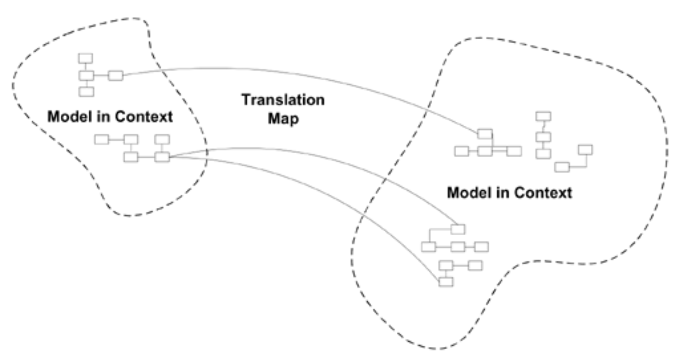
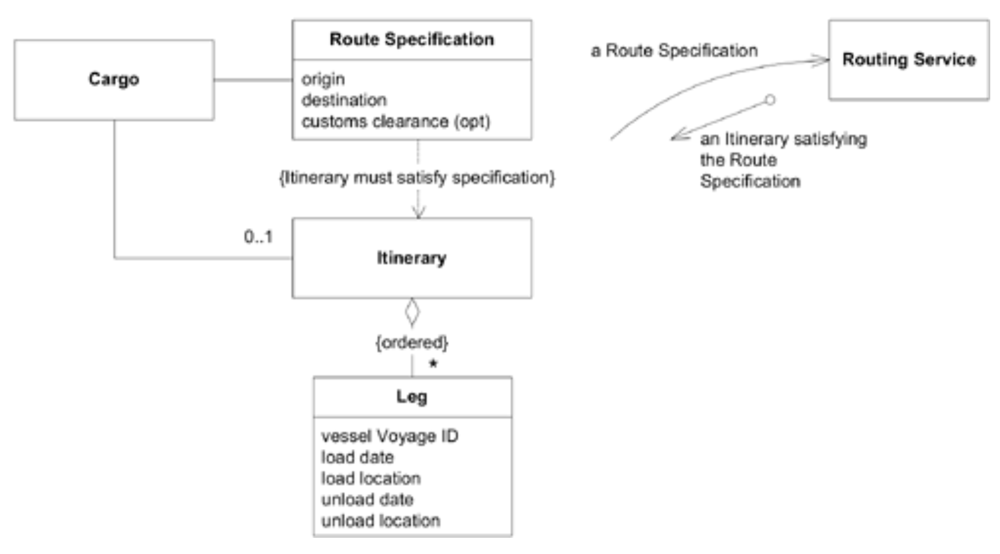
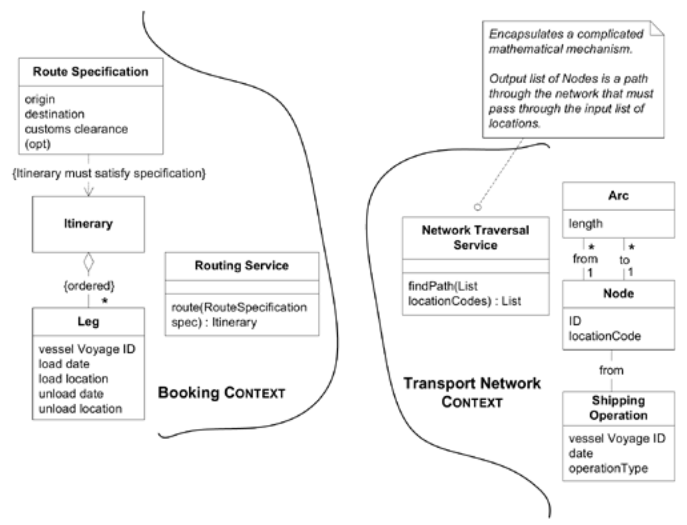
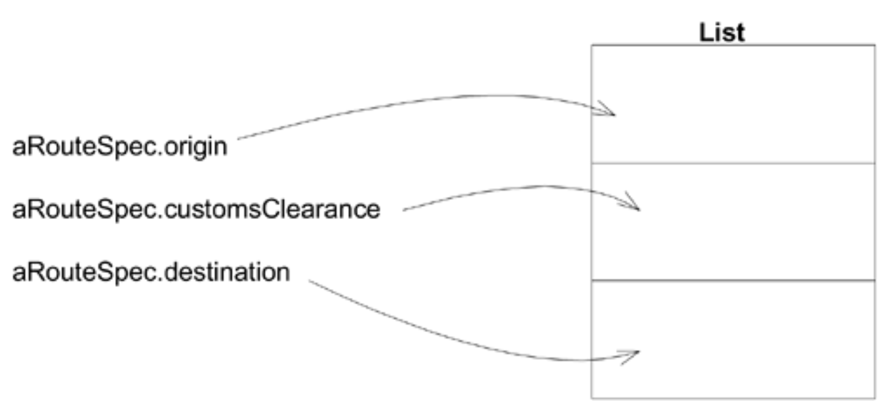
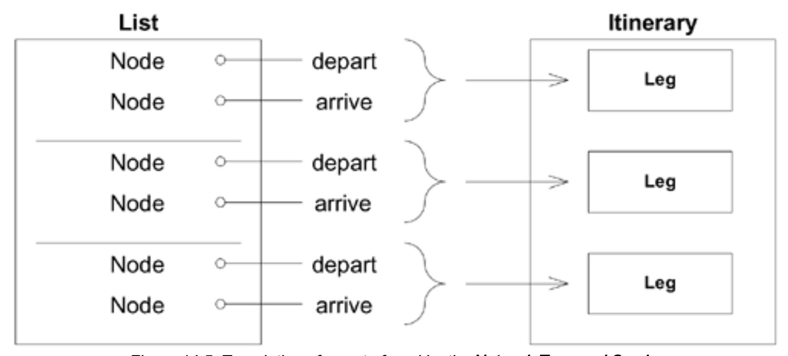
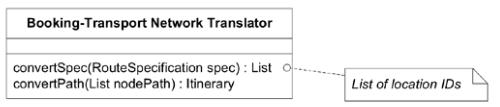
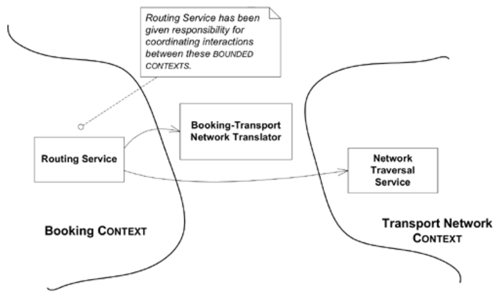

## 上下文地图：`CONTEXT MAP`

#### ▶[上一节](2.md)


单个 [BOUNDED CONTEXT](../glossary.md#bounded-context) 仍无法提供全局视图。其他模型的上下文可能仍然模糊且处于变化中。

🌼🌼🌼

<ins>**其他团队的人不会很清楚`CONTEXT`的界限，并且会无意中做出模糊边界或复杂化相互连接的更改。当必须在不同的上下文之间建立连接时，它们往往会相互渗透。**</ins>

在`BOUNDED CONTEXTS`之间复用代码是应避免的隐患。功能与数据的集成必须经过转换过程。通过定义不同上下文之间的关系，并创建项目中所有模型上下文的全局视图，可有效减少混淆。

[CONTEXT MAP](../glossary.md#context-map) 位于项目管理与软件设计的交叉区域。自然的情况是，边界会遵循团队组织的轮廓。紧密合作的人自然会共享一个模型上下文。不同团队的人，或者即使在同一团队但不交流的人，也会分成不同的上下文。物理办公空间也可能产生影响，因为位于建筑两端的团队成员——更不用说不同城市的成员——如果没有额外的整合努力，很可能会出现分歧。大多数项目经理直觉上会认识到这些因素，并大致围绕子系统组织团队。但团队组织与软件模型和设计之间的相互关系仍然不够突出。无论是管理者还是团队成员，都需要清楚地了解软件模型和设计在持续进行中的概念性细分。

因此：

<ins>**识别项目中涉及的每个模型，并定义其 [BOUNDED CONTEXT](../glossary.md#bounded-context) 。这包括非面向对象子系统中的隐式模型。为每个 [BOUNDED CONTEXT](../glossary.md#bounded-context) 命名，并将这些名称纳入 [UBIQUITOUS LANGUAGE](../ch2/1.md) 体系。**</ins>

<ins>**描述模型间的接触点，概述所有通信的明确转换，并突出显示任何共享内容。**</ins>

<ins>**绘制 *现有* 地形图 (terrain)。后续再处理转换问题。**</ins>

在每个 [BOUNDED CONTEXT](../glossary.md#bounded-context) 内，你将拥有 [UBIQUITOUS LANGUAGE](../ch2/1.md) 的一致方言。`BOUNDED CONTEXTS`的名称本身将融入该`LANGUAGE`，使你能够通过明确`CONTEXT`来清晰无误地描述设计中任何部分的模型。

`MAP`无需采用特定形式记录。我发现本章所示的图表有助于可视化呈现和传达该映射关系。其他人可能更倾向于文字描述或不同的图形表示方式。在某些情况下，团队成员间的讨论即可满足需求。细节程度可根据实际需要灵活调整。无论采用何种形式，`MAP`都必须在项目团队中共享并被所有人理解。它必须为每个 [BOUNDED CONTEXT](../glossary.md#bounded-context) 提供明确的名称，并清晰标注各接触点的性质与关联关系。

🌼🌼🌼

`BOUNDED CONTEXTS`之间的关系形式多样，既取决于设计考量，也受项目组织结构影响。本章后续将阐述`CONTEXTS`间在不同情境下行之有效的多种关系模式，这些模式可为描述您自身`MAP`中的关系提供术语。需谨记 [CONTEXT MAP](../glossary.md#context-map) 始终反映 *当前实际状况* ，您发现的关系可能最初并不符合这些模式。若关系模式高度契合，可直接采用模式名称，但切勿强行套用。只需如实描述发现的关系，后续再逐步迁移至更标准化的关系。

那么，如果你发现了一个碎片 —— 一个完全纠缠但存在不一致的模型，你该怎么办？在地图上放置一条龙 (dragon)，并完成对一切的描述。然后，凭借精确的全局视角，解决那些令人困惑的点。一个小的碎片是可以修复的，并且可以建立流程来加以支撑。如果某个关系模糊，你可以选择最接近的模式并朝它靠拢。你的首要任务是达成一个清晰的 [CONTEXT MAP](../glossary.md#context-map) ，这可能意味着修复你发现的真实问题。但不要让这种必要的修复导致整体重构。在你拥有一个明确的 [CONTEXT MAP](../glossary.md#context-map) 之前，能够将所有工作放入某个 [BOUNDED CONTEXT](../glossary.md#bounded-context) 中，并且所有相关模型之间的关系明确，只修改那些明显的矛盾。

当你拥有一个配套的 [CONTEXT MAP](../glossary.md#context-map) 后，便会发现需要调整之处。你可以对团队架构或设计方案进行深思熟虑的变更。切记：在现实中的变更完成之前，切勿修改地图。

### 示例：航运应用程序中的两个`CONTEXTS`

我们再次回到航运系统。该应用程序的一项主要功能是在预订时自动为货物安排运输路线。其模型大致如下：

#### Figure 14.2


`Routing Service`是一个 [SERVICE](../ch5/4.md) ，它封装了一个机制，该机制通过由 [SIDE-EFFECT-FREE FUNCTIONS](../glossary.md#side-effect-free-function) 组成的 [INTENTION-REVEALING INTERFACE](../glossary.md#intention-revealing-interface) 来实现。这些函数的结果以 `ASSERTIONS` 为特征。

1. 接口声明当传入 `Route Specification` 时，将返回一个 `Itinerary`。
2. [ASSERTION](../glossary.md#assertion) 表明返回的 `Itinerary` 将满足传入的 `Route Specification`。

关于这项极其艰巨的任务是 *如何* 完成的，没有任何说明。现在让我们揭开幕布，一探其背后的运作机制。

在最初基于此示例的项目中，我对`Routing Service`的内部实现过于教条。我原本希望通过扩展领域模型来实现实际路由操作，该模型将表示船舶航程，并将其直接关联到`Legs`中的`Itinerary`。但负责路由问题的团队指出，为确保性能优异并借鉴成熟算法，解决方案需以优化网络的形式实现——航程的每个航段都作为矩阵中的元素呈现。为此他们坚持采用独立的航运操作模型。

他们显然正确指出了当时设计的路线规划过程在计算上的需求，因此在缺乏更好方案的情况下，我选择了妥协。实际上，我们创建了两个独立的`BOUNDED CONTEXTS`，每个都拥有各自概念化的运输操作组织结构。（见图14.3）

#### Figure 14.3

*为应用高效路线规划算法而形成的两个`BOUNDED CONTEXTS`*

我们的需求是接收一个`Routing Service`请求，将其翻译成`Network Traversal Service`能理解的术语，然后将结果翻译成`Routing Service`预期的形式。

这意味着不需要在这两个模型中映射所有内容，只需要能够进行两种特定的转换即可：

- `Route Specification` -> 位置代码的 `List`
- `Node` ID 的`List` -> `Itinerary`

为此，我们必须考察一个模型的元素的含义，并弄清楚如何用另一个模型的术语来表达它。

从首次转换（`Route Specification` -> 位置代码的 `List`）开始，我们需要思考列表中位置序列的含义。列表中的首个位置即为路径起点，路径将依次强制经过每个位置直至抵达列表末尾。因此起点与终点分别位于列表首尾，清关地点（若存在）则居中。

#### Figure 14.4

*`Network Traversal Service`查询的转换*

（所幸两支队伍使用了相同的位置代码，因此我们不必处理那层级别的翻译。）

请注意，反向翻译会产生歧义，因为`Network Traversal`的输入允许任意数量的中间点，而不仅限于一个特定指定的清关点。所幸这不成问题，因为我们无需进行该方向的翻译，但由此可窥见某些翻译为何不可行。

现在，让我们将结果（`Node` ID 的`List` -> `Itinerary`）进行转换。我们假设可以使用 [REPOSITORY](../ch6/3.md) 根据接收到的节点 ID 查询`Node`和`Shipping Operation`对象。那么这些`Nodes`如何映射到`Legs`？根据`operationType-Code`，我们可以将`Nodes`列表拆分为出发地/目的地对。每对节点对应一个`Leg`。

#### Figure 14.5

*`Network Traversal Service`找到的路线的转换*

每个`Node`对的属性将按以下方式映射：
```java
departureNode.shippingOperation.vesselVoyageId → leg.vesselVoyageId
departureNode.shippingOperation.date → leg.loadDate
departureNode.locationCode → leg.loadLocationCode
arrivalNode.shippingOperation.date → leg.unloadDate
arrivalNode.locationCode → leg.unloadLocationCode
```
这是两个模型之间的概念化转换映射。现在我们需要实现一个能够执行转换的组件。在这种简单场景下，我通常会创建一个专用的对象，然后寻找或创建另一个对象来为子系统的其余部分提供服务。

#### Figure 14.6

*双向转换器*

*这是两支团队必须通力协作才能维护的唯一对象。* 其设计应极易进行单元测试，团队共同为其开发测试套件将尤为明智。除此之外，双方可各自开展工作。

#### Figure 14.7


`Routing Service`的实现现在变成了委托给`Translator`和`Network Traversal Service`的问题。它的单个操作大概如下所示：
```java
public Itinerary route(RouteSpecification spec) {
    Booking_TransportNetwork_Translator translator =
       new Booking_TransportNetwork_Translator();]
    List constraintLocations =
       translator.convertConstraints(spec);

    // Get access to the NetworkTraversalService
    List pathNodes =
       traversalService.findPath(constraintLocations);
    Itinerary result = translator.convert(pathNodes);
    return result;
}
```
不错。`BOUNDED CONTEXTS`的设计使得每个模型保持相对简洁，让团队能够基本独立工作，如果最初的假设是正确的，这种设计应该会效果良好。（我们将在本章后文再探讨这个问题。）

两个上下文之间的接口相对较小。`Routing Service` 的接口将 `Booking CONTEXT` 其余部分的设计，与路线查找世界的事件隔离开来。这个接口易于测试，因为它由 `SIDE-EFFECT-FREE FUNCTIONS` 组成。与其他 `CONTEXTS` 和谐共存的秘诀之一是，为接口制定有效的测试集。里根总统在谈判裁军时说过：“信任，但要核实。” <sup>[1](#1)</sup>

设计一套自动化测试应该很容易，这些测试会将 `Route Specifications` 输入到 `Routing Service` 中，并检查返回的 `Itinerary`。

模型上下文始终存在，但若缺乏有意识的关注，它们可能相互重叠并不断变化。通过明确定义`BOUNDED CONTEXTS`和 [CONTEXT MAPS](../glossary.md#context-map) ，团队便能开始引导模型统一与连接不同模型的过程。

### 在`CONTEXT`边界处进行测试

与其他`BOUNDED CONTEXTS`的接触点尤其需要重点测试。测试有助于弥补边界处常见的转换微妙性与较低级别的通信问题。它们可作为重要的早期预警系统，尤其在依赖于非自主控制的模型细节时更能提供保障。

### 组织与记录`CONTEXT MAPS`

此处仅有两点要诀：

1. `BOUNDED CONTEXTS`需命名以便讨论，这些名称应纳入团队的 [UBIQUITOUS LANGUAGE](../ch2/1.md) 体系。
2. 所有成员必须明确边界位置，并能识别任何代码片段或情境所属的 [CONTEXT](../glossary.md#context) 。

第二个要求可根据团队文化以多种方式实现。一旦定义了`BOUNDED CONTEXTS`，将不同`CONTEXTS`的代码分离到不同 [MODULES](../ch5/5.md) 中便顺理成章，此时需要解决的问题是如何追踪哪个 [MODULE](../ch5/5.md) 属于哪个 [CONTEXT](../glossary.md#context) 。可采用命名规范来标识这种关系，或采用任何其他简便且不易混淆的机制。

同样重要的是，要以一种让团队中每个人都能达成共识的方式传达概念边界。为此，我倾向于使用示例中这类非正式的示意图。当然也可以制作更严谨的图表或文本清单，列出每个 [CONTEXT](../glossary.md#context) 中的所有包，并标明接触点以及负责连接和转换的机制。有些团队更倾向这种方式，而另一些团队仅凭口头约定和充分讨论也能顺利推进。

无论如何，若要使术语进入 [UBIQUITOUS LANGUAGE](../ch2/1.md) ，在讨论中融入 [CONTEXT MAP](../glossary.md#context-map) 至关重要。切勿说 “乔治团队的东西在变，所以我们得修改与之交互的组件”，而应表述为 “ *运输网络* 模型正在变更，因此我们需要调整`Booking context`的`translator`”。

#### ▶[下一节](4.md)

---
### 1
里根引用了一句古老的俄语谚语来总结双方关注的核心问题——这是桥接上下文的另一种比喻。
