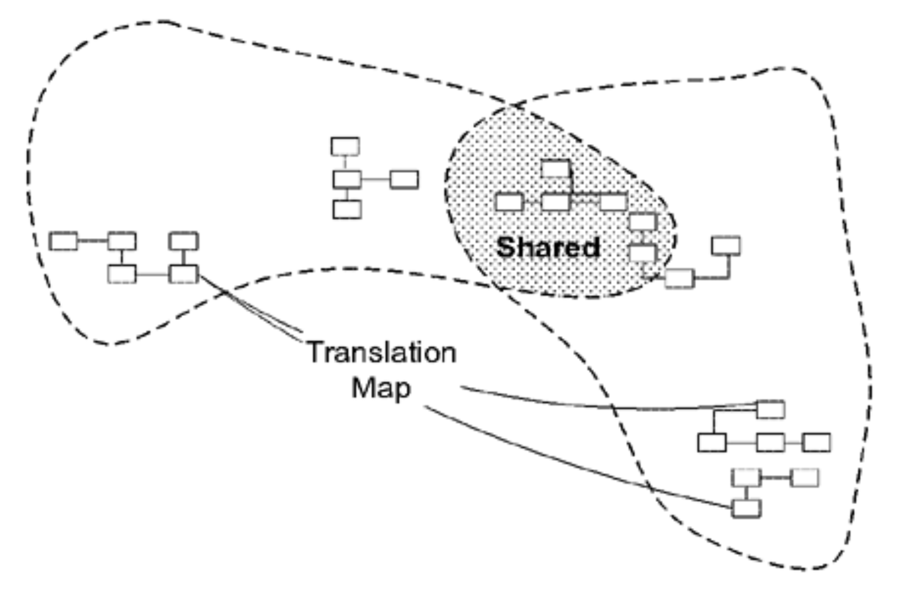

## 共享内核：`SHARED KERNEL`

#### ▶[上一节](4.md)

当功能集成受限时，[CONTINUOUS INTEGRATION](2.md) 的开销可能被认为过高。尤其当团队缺乏维持持续集成的技术能力或组织协调机制时，或是单个团队规模过大难以管理时，这种情况更为明显。因此可定义独立的 [BOUNDED CONTEXTS](1.md) 并组建多个团队。

🌼🌼🌼

<ins>**缺乏协调的团队在开发密切相关的应用时，可能短暂地快速推进，但最终产出的成果可能无法无缝衔接。他们最终可能在转换层和改造上的投入，反而超过了最初采用 [CONTINUOUS INTEGRATION](2.md) 所需的成本，同时还造成了重复劳动，并丧失了通用 [UBIQUITOUS LANGUAGE](../ch2/1.md) 带来的协同效益。**</ins>

在许多项目中，我观察到基础设施层被多个基本独立运作的团队共享。这种模式在领域内同样适用。虽然完全同步整个模型和代码库可能带来过多开销，但精心筛选的子集能在降低成本的同时实现大部分效益。

因此：

<ins>**指定领域模型中双方团队同意共享的部分子集。当然，这不仅包括该子集模型本身，还包含与该模型部分相关的代码子集或数据库设计子集。这些明确共享的内容具有特殊地位，未经对方团队协商不得擅自更改。**</ins>

<ins>**在团队内部，应频繁地集成功能系统，但频率略低于 [CONTINUOUS INTEGRATION](2.md) 的节奏。在每次集成时，需同时运行两个团队的测试。**</ins>

这是一个精妙的平衡。`SHARED KERNEL`无法像设计中的其他部分那样自由修改。决策需要与另一支团队协商。必须集成自动化测试套件，因为当进行变更时，双方团队的所有测试都必须通过。通常团队会在独立副本上修改`KERNEL`，并定期与另一团队进行集成。（例如在每日或更频繁 [CONTINUOUS INTEGRATION](2.md) 的团队中，`KERNEL`合并可能每周进行一次。）无论代码集成安排在何时，双方团队尽早沟通变更内容总是更理想的选择。

🌼🌼🌼

`SHARED KERNEL`通常是 [CORE DOMAIN](glossary.md#core-domain) 、若干`GENERIC SUBDOMAINS`，或两者兼有（参见 [第 15 章](../ch15/0.md) ），但它可以是模型中两个团队共同需要的任何部分。其目标在于减少重复（但并非完全消除，若仅存在单一 [BOUNDED CONTEXT](1.md) 则会如此），并使两个子系统间的集成相对简便。

#### ▶[下一节](6.md)
