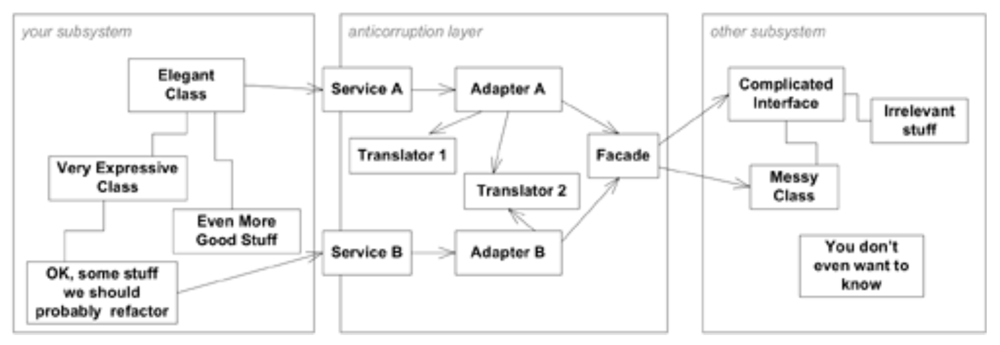

## 反腐层：`ANTICORRUPTION LAYER`

#### ▶[上一节](7.md)

新系统几乎总要与遗留系统或其他系统集成，而这些系统自有其模型体系。当连接设计精良的`BOUNDED CONTEXTS`与协作团队时，转换层可以简单甚至优雅。但当边界另一侧开始渗漏时，转换层可能转为防御性模式。

🌼🌼🌼

<ins>**当一个必须与另一个系统有大量接口的新系统正在构建时，关联这两个模型的难度最终可能会完全压倒新模型的本意，从而导致它被随意修改以类似于另一个系统的模型。遗留系统的模型通常比较薄弱，即使有一个例外的模型开发得很好，也可能不符合当前项目的需求。然而，集成可能具有很大的价值，有时它是绝对必要的。**</ins>

答案并非完全避免与其他系统的集成。我曾参与过一些项目，团队成员满怀热情地试图替换所有遗留系统，但这种做法一次承担的任务量实在太大。况且，与现有系统集成本身就是一种宝贵的复用形式。在大规模项目中，某个子系统往往需要与多个独立开发的子系统对接，而这些子系统对问题领域的映射方式各不相同。当基于不同模型的系统组合时，新系统为适应其他系统语义的需求，可能导致自身模型结构的扭曲。即便其他系统设计精良，其模型也与客户端模型存在差异。而现实中，其他系统往往设计欠佳。

与外部系统对接存在诸多障碍。例如，基础设施层必须提供与其他系统通信的途径，这些系统可能运行在不同平台或采用不同协议。其他系统的数据类型需要转换为本系统的数据类型。但人们常忽略的是：其他系统必然采用不同的概念域模型。

显然，若将某系统中的数据提取后在另一系统中误解，必然导致错误，甚至可能破坏数据库。然而即便如此，这个问题仍常悄然袭来，因为我们总以为在系统间传输的是原始数据，其含义明确无误且两端必然一致。这种假设通常是错误的。由于数据在各系统中的关联方式不同，往往会产生微妙却重要的含义差异。即便原始数据元素确实具有完全相同的含义，让系统间接口在如此低层级运作通常也是错误的。<ins>低层级接口剥夺了另一系统模型解释数据、约束其值与关系的能力，同时迫使新系统承担解释原始数据的负担，这些数据并非基于其自身模型定义的。</ins>

我们需要为遵循不同模型的各个部分提供转换机制，以确保模型不会因外来模型的未消化元素而遭到破坏。

因此：

<ins>**创建一个隔离层，为客户提供基于其自身领域模型的功能。该层通过现有接口与其他系统通信，几乎无需或完全无需修改其他系统。在内部，该层根据需要在两个模型之间进行双向转换。**</ins>

🌼🌼🌼

关于连接两个系统的机制讨论，可能会让人联想到数据在程序间或服务器间传输的问题。我稍后将探讨技术通信机制的整合方式。但这些细节不应与`ANTICORRUPTION LAYER`混淆——后者并非向其他系统发送消息的机制，而是将概念对象和操作从一种模型与协议转换为另一种的机制。

一个`ANTICORRUPTION LAYER`本身就可能成为复杂的软件组件。接下来我将概述创建该组件时需要考虑的一些设计要点。

### 设计`ANTICORRUPTION LAYER`的接口

`ANTICORRUPTION LAYER`的公共接口通常表现为一组 [SERVICES](../ch5/4.md) ，但偶尔也可采用 [ENTITY](../ch5/2.md) 形式。构建全新层级以负责两个系统语义间的转换，使我们得以重新抽象化另一系统的行为，并使其服务与信息能符合我们模型的规范。在我们的模型中，甚至可能没有必要将外部系统表示为单一组件。最佳方案是使用多个 [SERVICES](../ch5/4.md) （或偶尔使用 [ENTITIES](../ch5/2.md) ），每个组件在我们的模型中都承担着连贯的职责。

### 实现`ANTICORRUPTION LAYER`

组织`ANTICORRUPTION LAYER`设计的一种方式是将`FACADES`、`ADAPTERS`（均源自 [Gamma et al. 1995](../references.md#gamma-1995) 的研究）与转换器相结合，同时包含系统间通信通常所需的通信与传输机制。

我们经常需要与那些拥有庞大、复杂且混乱接口的系统进行集成。这属于实现层面的问题，而非导致采用`ANTICORRUPTION LAYER`的概念模型差异问题，但它确实是你在构建这些层时会遇到的难题。在不同模型之间进行转换（尤其当其中一个模型模糊不清时）本就够棘手了，若还要同时应对难以沟通的子系统接口，更是雪上加霜。所幸，这正是`FACADES`存在的意义。

`FACADE`是子系统的替代接口，它简化了客户端的访问方式，使子系统更易于使用。由于我们精确知晓需要调用其他系统的哪些功能，因此可以创建一个`FACADE`来促进并优化对这些功能的访问，同时隐藏其余部分。`FACADE`不改变底层系统的模型，必须严格遵循其他系统的模型进行编写。否则，轻则导致转换责任分散到多个对象，使`FACADE`超负荷运行；重则最终创建出不属于目标系统或自身 [BOUNDED CONTEXT](glossary.md#bounded-context) 的全新模型。<ins>`FACADE`应归属于目标系统的 [BOUNDED CONTEXT](glossary.md#bounded-context) ，它只是为你量身定制了更友好的界面。</ins>

`ADAPTER` 是一种封装器，允许客户端使用与行为实现者所理解的不同协议。当客户端向 `ADAPTER` 发送消息时，该消息会被转换为语义等效的消息并转发给 “被适配者”。响应同样经过转换后返回。我在此处对适配器的定义稍显宽松，因为自 [Gamma et al. 1995](../references.md#gamma-1995) 强调的是使被封装对象符合客户端预期的标准接口，而我们则可自主选择适配接口，且被适配对象甚至可能并非对象。我们的重点在于两种模型间的转换，但我认为这与`ADAPTER`的设计初衷并无冲突。

对于我们定义的每个 [SERVICE](../ch5/4.md) ，都需要一个支持 [SERVICES](../ch5/4.md) 接口的`ADAPTER`，该适配器需掌握如何向其他系统或其`FACADE`发起等效请求。

剩余的组件是转换器。`ADAPTER` 的职责在于掌握请求发起方式。概念对象或数据的实际转换则是独立且复杂的任务，可封装在专属对象中，从而使两者都更易于理解。翻译器可以是轻量级对象，按需实例化。它无需状态管理，也无需分布式部署，因为它始终隶属于其所服务的`ADAPTER(S)`。

这些是我构建`ANTICORRUPTION LAYER`的基本要素。此外还有几点需要考虑。

#### Figure 14.8

*`ANTICORRUPTION LAYER`的结构*

- 通常情况下，正在设计的系统（即您的子系统）将主动发起操作，如 [Figure 14.8](#figure-148) 所示。但某些情况下，其他子系统可能需要向您的子系统提出请求或通知其某些事件。`ANTICORRUPTION LAYER`可实现双向通信，在两个接口上定义各自配备`ADAPTERS`的持 [SERVICES](../ch5/4.md) ，可能采用相同的转换器进行对称转换。虽然实现`ANTICORRUPTION LAYER`通常无需修改其他子系统，但为使其他系统调用`ANTICORRUPTION LAYER`的 [SERVICES](../ch5/4.md) ，可能需要进行相应变更。

- 通常需要某种通信机制来连接两个子系统，它们很可能位于不同的服务器上。在这种情况下，您必须决定将这些通信链接放置在何处。若无法访问其他子系统，则需将通信链路置于`FACADE`与该子系统之间。但若`FACADE`可直接集成至其他子系统，则更优方案是将通信链路设置在`ADAPTER`与`FACADE`之间，因为`FACADE`的协议通常比其覆盖的协议更为简单。某些情况下，整个`ANTICORRUPTION LAYER`可与其他子系统共存，此时需在您的子系统与构成`ANTICORRUPTION LAYER`接口的 [SERVICES](../ch5/4.md) 之间设置通信链接或分发机制。这些属于需务实决策的实现与部署问题，
不影响`ANTICORRUPTION LAYER`的概念性角色。

- 如果你确实能够访问其他子系统，可能会发现对该子系统进行少量重构
能让你的工作更轻松。尤其要尝试为即将使用功能编写更明确的接口，
如有可能，请从自动化测试开始着手。

- 当集成需求庞杂时，转换成本将大幅攀升。此时可能需要在设计系统模型时作出取舍，使其更贴近外部系统，从而简化转换过程。操作时务必谨慎，切勿损害模型完整性。此类调整仅应在转换难度失控时择机实施。若此方案对问题核心部分最为自然，可考虑将子系统设计为`CONFORMIST`模式，从而消除转换需求。

- 若其他子系统结构简单或接口清晰，则无需使用`FACADE`。

- 若功能专属于两个子系统间的关联关系，可将其添加至`ANTICORRUPTION LAYER`。例如：为外部系统使用记录审计轨迹，或为调用其他接口提供调试追踪逻辑，这两项实用功能值得考虑。

请记住，`ANTICORRUPTION LAYER`是连接两个`BOUNDED CONTEXTS`的手段。通常情况下，我们面对的是他人创建的系统，我们对其理解不完整，也难以掌控。但这并非唯一需要在子系统间设置缓冲层的情境。当两个自主设计的子系统基于不同模型时，使用`ANTICORRUPTION LAYER`进行连接同样合理。此类场景下，开发者通常能完全掌控双方系统，并可采用简易转换层实现。即便两个边界上下文已走向分化，仍需功能集成时，`ANTICORRUPTION LAYER`亦能有效降低其间的交互阻力。

### 示例：遗留系统预订应用程序

为实现小型快速的首版发布，我们将编写一个基础应用程序，该程序可创建货运单据，并通过转换层将其传递至遗留系统进行预订和支持操作。由于我们专门构建了转换层以保护正在开发的模型免受遗留设计的影响，因此该转换层属于`ANTICORRUPTION LAYER`。

最初，`ANTICORRUPTION LAYER`将接收代表货运的对象，进行转换后传递至旧系统并发起预订请求，随后捕获确认信息并将其转换回新设计中的确认对象。这种隔离机制使我们能够基本独立于旧系统开发新应用程序，不过需要投入相当大的精力进行数据转换工作。

随着每次新版本的发布，新系统既可逐步接管旧系统的更多功能，也可在不替换现有能力的前提下单纯增添新价值，具体取决于后续决策。这种灵活性，以及在持续运行整合系统的同时实现渐进式转型的能力，或许足以证明构建`ANTICORRUPTION LAYER`的投入是值得的。

### 一个警示故事

为抵御邻近游牧部落的袭扰，古代中国人修筑了长城。这并非不可逾越的屏障，却在阻挡入侵与外来影响的同时，为邻国间提供了有序的贸易通道。两千年来，它划定的疆界使中国农业文明得以在外部动荡中保持相对稳定，逐步形成自身特色。

尽管没有长城，中国或许不会形成如此独特的文化，但修建长城的代价极其高昂，至少导致一个朝代破产，很可能促成了其覆灭。孤立策略的收益必须与代价相权衡。有时需要务实行事，对模式进行审慎调整，使其能更顺畅地与外部体系衔接。

任何集成都存在开销，从单一 [BOUNDED CONTEXT](../glossary.md#bounded-context) 中进行全面的`CONTINUOUS INTEGRATION`，到`SHARED KERNELS`或`CUSTOMER/SUPPLIER DEVELOPER TEAMS`的较低承诺，再到`CONFORMIST`的单向性与`ANTICORRUPTION LAYER`的防御姿态。集成虽价值非凡，却始终代价高昂。我们必须确保其确有必要……

#### ▶[下一节](9.md)
